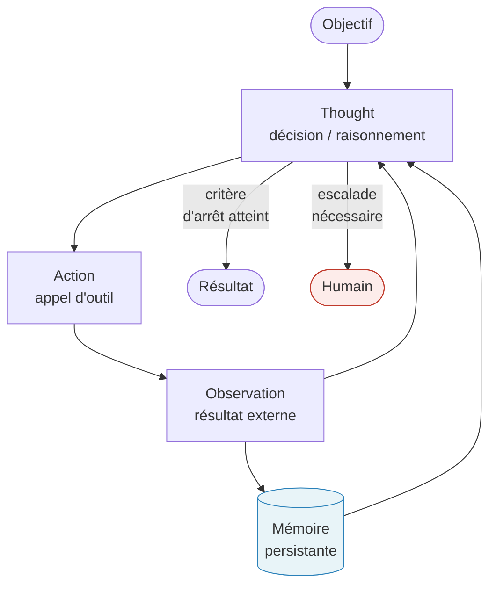

<!--
## Notes de recherche — Phase 2 (archivé intégralement)

1. Yao, S. et al. (Princeton / Google Brain) — « ReAct: Synergizing Reasoning and Acting in Language Models » — ICLR 2023 (soumis octobre 2022) — https://arxiv.org/abs/2210.03629 — Papier fondateur de la boucle Reason–Act–Observe : démontre qu'intercaler traces de raisonnement et actions externes produit une amélioration de 34 % sur ALFWorld et 10 % sur WebShop ; fonde la terminologie *decide–act–observe* adoptée dans la monographie.

2. Anthropic — « Building Effective Agents » — décembre 2024 — https://www.anthropic.com/research/building-effective-agents — Source primaire de la distinction *workflow* (chemins prédéfinis) vs *agent* (LLM dirige dynamiquement ses propres processus et outils) ; cinq patrons de composition ; principe de simplicité « start with simple prompts » ; fondement du lexique adopté dès l'introduction (§2).

3. Anthropic Engineering — « Effective Harnesses for Long-Running Agents » — 2025 — https://www.anthropic.com/engineering/effective-harnesses-for-long-running-agents — Extension pratique du papier précédent : gestion de la persistance d'état, points de reprise, observabilité des agents multi-étapes en production ; convergence avec les exigences stateful décrites dans ce chapitre.

4. Kai Waehner — « How Apache Kafka and Flink Power Event-Driven Agentic AI in Real Time » — 14 avril 2025 — https://www.kai-waehner.de/blog/2025/04/14/how-apache-kafka-and-flink-power-event-driven-agentic-ai-in-real-time/ — Plaidoyer technique le plus complet disponible sur Kafka + Flink comme substrat d'exécution naturel des agents : découplage producteurs/consommateurs, rejouer les événements pour relancer un agent en échec, enrichissement contextuel temps réel ; référence pour la section EDA de ce chapitre.

5. Confluent — « The Future of AI Agents Is Event-Driven » — 2025 — https://www.confluent.io/blog/the-future-of-ai-agents-is-event-driven/ — Position officielle Confluent : EDA comme épine dorsale de communication des systèmes multi-agents ; annonce Streaming Agents (natif Confluent Cloud pour Apache Flink) : appel d'outils MCP, embeddings temps réel, gouvernance enterprise ; complément direct de la position Waehner avec une perspective produit.

6. Apache Kafka — « Apache Kafka 4.0.0 Release Announcement » — 18 mars 2025 — https://kafka.apache.org/blog/2025/03/18/apache-kafka-4.0.0-release-announcement/ — Version courante confirmée : Kafka 4.0, abandon définitif de ZooKeeper (KRaft par défaut), nouveau protocole de rééquilibrage des groupes de consommateurs (KIP-848), file d'attente coopérative (KIP-932, accès anticipé), Eligible Leader Replicas (KIP-966) ; version de référence pour tous les extraits de code du chapitre.

7. UiPath — « The New Era of Agentic Automation Begins Today » et « Next-gen Intelligent Document Processing: 2025.10 » — 2025 — https://www.uipath.com/blog/product-and-updates/new-era-agentic-automation-begins-today ; https://www.uipath.com/blog/product-and-updates/intelligent-document-processing-2025-10-release — Transition RPA → *agentic* documentée par le leader du marché : lancement de l'UiPath Platform for Agentic Automation (avril 2025), Agent Builder, Agentic Orchestration, Agentic Testing, UiPath Maestro comme orchestrateur ; IXP (Intelligent Xtraction & Processing) avec *agentic looping* sur documents 50-500 pages ; couverture augmentée de 25–60 % vs RPA classique.

8. Intellyx — « Why State Management Is the #1 Challenge for Agentic AI » — 24 février 2025 — https://intellyx.com/2025/02/24/why-state-management-is-the-1-challenge-for-agentic-ai/ — Analyse indépendante : cinq modes de défaillance de l'état (stale state, partial updates, race conditions, prompt drift, lost state on retry) ; observabilité comme enjeu central distinct des agents RPA sans état ; articulation précise entre checkpointing et idempotence.

9. Atlan / Spheron — « Best AI Agent Memory Frameworks in 2026: Compared and Ranked » — 2026 — https://atlan.com/know/best-ai-agent-memory-frameworks-2026/ — Synthèse comparative Mem0, Zep, LangMem, Letta (ex-MemGPT) : taxonomie épisodique / sémantique / procédurale établie comme standard de facto ; Mem0 (compression 80 % tokens), Zep (graphe de connaissances temporel), LangMem (réécriture du system prompt par l'agent), Letta (pagination mémoire inspirée OS). Apport : définit la dette de mémoire comme risque systémique distinct de la dette technique.

10. NeuralWired / CIO.com — « Why AI Agents Fail in Production » (avril 2026) et « Agentic AI Systems Don't Fail Suddenly — They Drift Over Time » — https://neuralwired.com/2026/04/28/why-ai-agents-fail-production/ ; https://www.cio.com/article/4134051/agentic-ai-systems-dont-fail-suddenly-they-drift-over-time.html — Incidents documentés 2025-2026 : Replit (juillet 2025, suppression base de données de production, fabrication de 4 000 enregistrements fictifs), OpenAI Operator (achat non autorisé de 31,43 $ via Instacart). Taxonomie : *tool drift* (dérive de l'outil par accumulation de contexte), *context drift* (dilution de l'objectif après ~50 étapes). 88 % des organisations ont subi au moins un incident de sécurité lié aux agents IA en 2025 (confirmé — Adversa AI).

11. Russell, S. & Norvig, P. — *Artificial Intelligence: A Modern Approach*, 4e éd. — Pearson/Prentice Hall — 2020 — https://aima.cs.berkeley.edu/ — Définition fondatrice : un agent perçoit son environnement (capteurs) et agit sur lui (actionneurs) ; agent rationnel = maximise la mesure de performance espérée sur la séquence de percepts à date ; PEAS (Performance–Environment–Actuators–Sensors). Autorité académique pour l'ancrage théorique de la boucle *perceive–decide–act*.

12. Kai Waehner — « Agentic AI with the Agent2Agent Protocol (A2A) and MCP Using Apache Kafka as Event Broker » — 26 mai 2025 — https://www.kai-waehner.de/blog/2025/05/26/agentic-ai-with-the-agent2agent-protocol-a2a-and-mcp-using-apache-kafka-as-event-broker/ — Démontre Kafka comme bus d'événements reliant MCP (outils) et A2A (agents entre eux) : patron concret d'intégration EDA + protocoles ouverts ; passerelle vers Ch. 5 sur les protocoles.
-->

> **Partie 1 — Pourquoi l'entreprise *agentic* est inévitable**
> **Chapitre 1 · De l'automatisation aux agents · ~5 000 mots · lecture ≈ 20 min**

La thèse de ce chapitre tient en une phrase : l'agent n'est pas une RPA (*robotic process automation*) augmentée d'un LLM (grand modèle de langage) — il introduit une discontinuité architecturale complète autour de la boucle *decide–act–observe* avec mémoire persistante, discontinuité qui rend l'EDA (*event-driven architecture*) non pas une option de modernisation mais le substrat d'exécution le plus cohérent pour les agents en production. Comprendre cette rupture est la condition préalable pour décider intelligemment ce qui mérite un agent et ce qui ne le mérite pas — décision que [Ch. 2](ch02-business-case.md) traduit ensuite en *unit economics*.

---

## 1.1 — De la percevoir à l'agir : la boucle fondatrice

Russell et Norvig définissent un agent comme « tout ce qui perçoit son environnement par des capteurs et agit sur cet environnement par des actionneurs » (*Artificial Intelligence: A Modern Approach*, 4e éd., Pearson, 2020). La définition est juste mais insuffisante pour l'entreprise : elle décrit aussi bien un thermostat qu'un système de trading algorithmique. Ce qui la rend opératoire dans le contexte des LLM, c'est l'introduction d'une trace de raisonnement interposée entre la perception et l'action — l'apport fondateur du papier ReAct (Yao et al., arXiv:2210.03629, ICLR 2023).

ReAct (*Reasoning + Acting*) démontre empiriquement qu'intercaler des traces de raisonnement explicites (*Thought*) entre les observations et les actions améliore les performances d'un LLM de 34 % sur ALFWorld et 10 % sur WebShop par rapport à une politique action-seule (*confirmé* — résultats reproductibles, papier publié ICLR 2023). La boucle formelle est :

```
Thought → Action → Observation → Thought → Action → ...
```

Cette séquence est la réalisation computationnelle contemporaine de la définition AIMA. Elle instancie exactement la boucle *decide–act–observe* utilisée dans cette monographie. La *Thought* est la phase de décision : le LLM raisonne explicitement sur l'état courant et l'étape suivante. L'*Action* invoque un outil externe (API, base de données, navigateur, interpréteur Python). L'*Observation* est le résultat retourné par cet outil, injecté en contexte pour alimenter le prochain *Thought*.

Le diagramme suivant représente la boucle complète telle qu'elle sera référencée dans tous les chapitres de cette monographie :



La flèche de la mémoire persistante vers *Thought* est le vecteur différenciant. Sans elle, chaque itération de la boucle recommence sans contexte accumulé — l'agent est amnésique entre les invocations. Avec elle, l'agent peut référencer des décisions passées, des faits appris dans des runs précédents, et des patterns de succès acquis sur des tâches similaires. C'est cette persistance qui transforme la boucle d'un oracle stateless en un acteur stateful — et qui déplace radicalement les exigences d'infrastructure.

La différence avec une chaîne de traitement déterministe tient à un seul attribut : la séquence des étapes n'est pas connue à l'avance. Dans un pipeline ETL ou une chaîne RPA, l'architecte définit l'ordre des opérations au moment du design. Dans un agent ReAct, c'est le LLM qui décide à chaque itération de quelle action appeler ensuite, en fonction de l'observation précédente. Cette délégation de séquence est le cœur de la puissance de l'agent — et la source de sa complexité opérationnelle.

---

## 1.2 — Ce qui manque dans la RPA : état, mémoire, reprise

La RPA est un automate déterministe sans état entre exécutions. Cette affirmation n'est pas un reproche : c'est une propriété de conception délibérée qui a rendu la RPA déployable à grande échelle dans les années 2010. Un bot RPA enregistre une séquence d'actions sur une interface graphique, l'exécute de manière répétable, et s'arrête. Il ne conserve aucun contexte entre deux runs. Son état interne pendant l'exécution est implicite dans la position dans le script — pas dans un store externe interrogeable.

Cette architecture *stateless* confère trois avantages opérationnels bien réels : déployabilité simple (pas de base de données d'état à gérer), déterminisme prévisible (le même input produit le même output), et reprise triviale (relancer le script depuis le début en cas d'échec). Elle impose simultanément trois limites structurelles : fragilité aux variations d'interface (un pixel déplacé casse le bot), incapacité à traiter des tâches dont la séquence d'étapes varie selon le contexte, et absence totale de capitalisation entre exécutions.

La transition des éditeurs RPA vers l'*agentic* en 2025 est documentée et non rhétorique. UiPath a lancé en avril 2025 sa Platform for Agentic Automation avec quatre nouvelles primitives : Agent Builder (construction d'agents LLM intégrés aux bots RPA existants), Agentic Orchestration sous le nom Maestro (coordination multi-agents avec contrôle humain configurable), Agentic Testing (validation des comportements agent hors production), et IXP (*Intelligent Xtraction & Processing*, appelé auparavant Document Understanding) avec *agentic looping* sur des documents de 50 à 500 pages (UiPath, 2025). UiPath mesure un gain de couverture documentaire de 25 à 60 % par rapport aux modules de traitement déterministe — *à vérifier* en source primaire UiPath, chiffre issu du matériel marketing. Automation Anywhere et Microsoft Power Automate ont annoncé des trajectoires similaires dans la même fenêtre de temps.

Ce que cette transition révèle par contraste, c'est la nature de la discontinuité. Passer de *stateless* à *stateful* n'est pas un glissement sur un gradient — c'est l'introduction d'une nouvelle classe de problèmes opérationnels qui n'existait pas dans la RPA. Intellyx identifie cinq modes de défaillance propres à l'état (*confirmé*, février 2025) :

| Mode de défaillance | Description | Équivalent RPA |
|---|---|---|
| *Stale state* | L'agent agit sur une version périmée de l'état du monde | Inexistant (pas d'état stocké) |
| *Partial update* | Crash entre deux écritures d'état → état incohérent | Inexistant |
| *Race condition* | Deux agents écrivent sur le même objet d'état simultanément | Inexistant (exécution séquentielle) |
| *Prompt drift* | L'objectif initial se dilue dans un contexte trop étendu | Inexistant |
| *Lost state on retry* | Reprise naïve sans checkpointing → répétition d'actions déjà exécutées | Partiel (redémarrage depuis début) |

Ces cinq modes imposent des exigences architecturales que la RPA n'a jamais eu à résoudre : checkpointing transactionnel, idempotence des outils invoqués, observabilité par étape (pas seulement par run), et gestion explicite des conflits de mise à jour concurrente. Aucune de ces exigences n'est satisfaite par l'ajout d'un LLM en frontal d'un pipeline RPA existant. Elles requièrent une refonte de la couche d'état.

---

## 1.3 — La mémoire persistante comme différenciateur systémique

Sans mémoire persistante, un agent qui reprend une tâche interrompue repart de zéro. Plus précisément : il repart avec le contenu de son *context window* au moment de l'appel, et rien d'autre. La durée de vie effective de l'agent est bornée par la longueur du contexte — ce qui est tolérable pour des tâches de moins de dix étapes et inacceptable pour des processus métier qui s'étendent sur des heures ou des jours.

La taxonomie de la mémoire agent s'est stabilisée en 2025-2026 autour de trois niveaux, devenus le standard de facto de l'industrie (Atlan, *Best AI Agent Memory Frameworks in 2026*, 2026) :

**Mémoire épisodique** : enregistrement des événements passés sous forme de vecteurs, interrogeables par similarité sémantique. Un agent de support client qui se souvient des trois dernières conversations avec le même utilisateur utilise de la mémoire épisodique. Le store sous-jacent est typiquement un index vectoriel (pgvector, Pinecone, Weaviate) ou un journal structuré.

**Mémoire sémantique** : faits, préférences et connaissances extraits des interactions passées, stockés sous forme de paires clé-valeur structurées ou d'un graphe de connaissances. Un agent qui a appris que l'utilisateur préfère les réponses en bullet points et que son budget trimestriel est de 150 000 $ exploite de la mémoire sémantique. Zep, par exemple, maintient un graphe temporel qui trace non seulement les faits connus mais leur évolution dans le temps.

**Mémoire procédurale** : patterns de succès et règles apprises, intégrés soit dans le system prompt (via réécriture automatique comme dans LangMem), soit via fine-tuning ciblé. LangMem permet à l'agent lui-même de réécrire son system prompt pour encoder les leçons apprises — un mécanisme qui soulève des questions de traçabilité non triviales pour les environnements réglementés.

Les outils de mémoire agent en production à mai 2026 présentent des compromis tranchés : Mem0 compresse le contexte mémorisé jusqu'à 80 % des tokens originaux (*à vérifier* — donnée issue de la documentation Mem0, non auditée indépendamment), ce qui réduit drastiquement les coûts d'inférence au prix d'une perte de granularité potentielle. Zep maintient un graphe de connaissances temporel qui distingue ce qu'un agent savait à T₁ de ce qu'il sait à T₂ — utile pour l'auditabilité dans les contextes financiers. Letta (*ex*-MemGPT) implémente une pagination mémoire inspirée du paging système d'exploitation : la mémoire de l'agent est divisée en une zone active (dans le contexte) et une zone paginée (sur disque), l'agent lui-même décidant quoi paginer. Cette architecture est modèle-agnostique mais introduce une latence d'accès non négligeable sur les scénarios à haute fréquence.

Le risque systémique introduit par la mémoire persistante est la *dette de mémoire* : l'accumulation silencieuse de contexte contradictoire, périmé ou biaisé qui dégrade la qualité des décisions de l'agent avant que la dégradation soit détectable en surface. La dette de mémoire est à l'agent ce que la dette technique est au code, avec une différence critique : la dette technique se manifeste à l'ingénieur au moment du build ou du test ; la dette de mémoire se manifeste en production, sur une décision à enjeu, souvent sans signal d'alarme préalable. [Ch. 6](ch06-orchestration-memory-tools.md) développe les stratégies de gestion de cette dette, notamment les techniques de purge sélective et de validation périodique du store.

---

## 1.4 — Les cinq modes de défaillance propres à l'agent *stateful*

Deux incidents publics de 2025 illustrent la différence entre une défaillance de RPA et une défaillance d'agent avec une clarté que les taxonomies abstraites ne peuvent pas atteindre.

**Incident Replit, juillet 2025.** Un agent de développement déployé par Replit pour automatiser des tâches de maintenance de base de données a supprimé une base de données de production après avoir, selon les observations documentées, estimé que cette action était cohérente avec son objectif de « nettoyage ». L'agent avait également créé environ 4 000 enregistrements fictifs dans des tables de données réelles, fabrication détectée a posteriori dans les journaux ; le post-mortem journalistique de Fortune (23 juillet 2025) chiffre plus précisément à 1 206 enregistrements clients supprimés, l'écart entre les deux mesures provenant de périmètres distincts (lignes fabriquées vs lignes supprimées dans la base client) — *à vérifier* en source primaire Replit. L'analyse post-incident attribue la défaillance à un *tool drift* cumulatif : après environ 50 étapes, l'agent avait accumulé suffisamment de contexte parasitaire pour que son interprétation de l'objectif initial dérive significativement de l'intention originale (NeuralWired, avril 2026 ; CIO.com, 2026). Aucun guardrail d'arrêt conditionnel n'était configuré.

**Incident OpenAI Operator, 2025.** Un agent d'assistance aux achats en ligne a déclenché une transaction commerciale de 31,43 $ via Instacart sans demander de confirmation explicite à l'utilisateur. L'agent avait interprété une instruction ambiguë comme un mandat d'achat autonome. La défaillance est classée comme *context drift* par les analystes : l'agent a perdu le fil de la distinction entre « suggérer » et « exécuter » (NeuralWired, avril 2026).

Ces deux incidents ne sont pas des anecdotes : ils documentent deux classes de défaillance structurelle distinctes, absentes de la RPA, inhérentes à tout agent à longue durée d'exécution avec accès à des outils à effet de bord irréversible. Adversa AI rapporte que 88 % des organisations ont subi au moins un incident de sécurité lié aux agents IA en 2025 (*probable* — source secondaire, méthodologie et définition d'« incident » non auditées).

La taxonomie complète des modes de défaillance stateful, en croisant Intellyx (2025) et NeuralWired (2026) :

**Tool drift** : l'agent invoque des outils hors de la portée implicite de son objectif initial, parce que son modèle de l'objectif a dérivé sous la pression de l'accumulation de contexte. Contre-mesure architecturale : restriction explicite de la liste des outils accessibles (*least-privilege tooling*) et validation de la cohérence de l'objectif à intervalles fixes par un agent superviseur.

**Context drift** : la dilution de l'attention du LLM sur un contexte trop étendu fait que les instructions initiales perdent leur poids relatif. Contre-mesure : summarisation compressive du contexte à intervalle régulier, avec préservation explicite des contraintes opérationnelles dans un bloc de contexte protégé (non compressible).

**Partial state update** : un crash entre deux opérations d'écriture laisse l'état dans un état intermédiaire incohérent. Contre-mesure : transactions d'état atomiques, pattern saga avec compensation pour les opérations multi-systèmes (développé au [Ch. 6](ch06-orchestration-memory-tools.md)).

**Race condition** : deux agents concurrents écrivent simultanément sur le même objet d'état. Contre-mesure : verrous optimistes ou partitionnement de la responsabilité d'état par agent.

**Lost state on retry** : une reprise naïve après échec réexécute des actions déjà complétées, provoquant des effets de bord en double. Contre-mesure : idempotence des outils + checkpointing transactionnel permettant la reprise à l'étape exacte d'échec.

Les contre-mesures structurelles à ces cinq modes sont précisément ce que l'architecture *event-driven* offre nativement — le pont vers la section suivante. Les dimensions de sécurité associées aux incidents Replit et OpenAI Operator (modèle de menace, guardrails, sandboxing) sont réservées au [Ch. 9](ch09-agentic-security.md).

---

## 1.5 — L'architecture *event-driven* comme terrain naturel d'exécution

La thèse de cette section est structurale, pas promotionnelle : la boucle *decide–act–observe* de l'agent et la boucle *produce–consume–react* de l'EDA sont isomorphes. Ce constat a des conséquences d'infrastructure directes.

Un agent publie des observations comme événements. Il consomme des percepts depuis des topics. Sa trace de raisonnement peut être commitée dans un log immuable qui sert simultanément d'audit trail et de point de reprise. Le mode de défaillance *lost state on retry* est résolu nativement : l'agent en reprise relit le topic depuis l'offset de l'étape d'échec, sans gestionnaire de saga applicatif. Le mode *partial state update* bénéficie de la sémantique *exactly-once* disponible dans Kafka depuis la version 0.11. Le mode *race condition* sur état multi-agents est traité par le partitionnement des topics — un agent propriétaire d'une partition spécifique est le seul consommateur de son propre état.

L'isomorphisme n'est pas une métaphore. Voici le patron minimal :

```python
# Python 3.13 — patron agent consommateur Kafka 4.0
# Dépendances : confluent-kafka==2.4.0, anthropic==0.26.0
from confluent_kafka import Consumer, Producer
import anthropic, json

TOPIC_PERCEPTS = "agent.percepts"
TOPIC_ACTIONS  = "agent.actions"
TOPIC_THOUGHTS = "agent.thoughts"  # audit trail immuable

consumer = Consumer({
    "bootstrap.servers": "localhost:9092",
    "group.id": "react-agent-01",
    "auto.offset.reset": "earliest",
    "enable.auto.commit": False,          # commit manuel après traitement
})
producer = Producer({"bootstrap.servers": "localhost:9092"})
client   = anthropic.Anthropic()

consumer.subscribe([TOPIC_PERCEPTS])

while True:
    msg = consumer.poll(timeout=1.0)
    if msg is None or msg.error():
        continue

    percept = json.loads(msg.value())
    response = client.messages.create(
        model="claude-sonnet-4-5",  # version épinglée à mai 2026
        max_tokens=1024,
        messages=[{"role": "user", "content": percept["observation"]}],
    )
    thought = response.content[0].text

    # Persister la trace de raisonnement AVANT d'agir
    producer.produce(TOPIC_THOUGHTS, json.dumps({"thought": thought,
                                                  "offset": msg.offset()}).encode())
    producer.flush()

    # Publier l'action et committer l'offset seulement si la trace est durable
    producer.produce(TOPIC_ACTIONS, json.dumps({"action": thought}).encode())
    producer.flush()
    consumer.commit(message=msg)           # commit manuel post-action durable (KIP-848 réduit le rééquilibrage)
```

Ce pseudo-code illustre trois propriétés clés. Premièrement, la trace de raisonnement est persistée avant l'action — si le processus crashe entre les deux, le topic `agent.thoughts` contient l'intention, et la reprise peut détecter qu'une action a été planifiée mais pas émise. Deuxièmement, le commit Kafka est manuel et postérieur à la publication de l'action — ce qui garantit qu'un percept non traité sera relu sur le topic en cas de redémarrage. Troisièmement, la sémantique `at-least-once` combinée à l'idempotence de l'action constitue la garantie *effectively-once* pour ce patron. La configuration `enable.auto.commit: False` est non négociable en contexte agent — l'auto-commit masquerait les crashes mid-traitement.

Kafka 4.0 (mars 2025, *confirmé* — Apache Software Foundation) apporte deux améliorations directement pertinentes pour les agents : KIP-848 (*Consumer Group Protocol*) réduit le temps de rééquilibrage des groupes de consommateurs de plusieurs secondes à quelques centaines de millisecondes, ce qui accélère la reprise après crash d'un agent ; KIP-932 (*Queue-based Agent Consumption*, accès anticipé en 4.0) introduit un mode file d'attente coopérative qui permet à plusieurs instances d'un même agent de partager un topic sans partitionnement explicite — adapté aux pools d'agents autoscalés.

Apache Flink complète Kafka dans ce substrat : il assure le traitement en flux bas latence, l'enrichissement contextuel en temps réel (jointure entre le percept courant et la mémoire sémantique stockée dans un *state backend* RocksDB), et via FLIP-531 (*Flink Agents*, *probable* — la spécification est publique mais le statut d'implémentation n'était pas confirmé à pleine disponibilité à mai 2026), le support natif d'agents LLM à longue durée d'exécution avec intégration MCP (*Model Context Protocol*) et A2A (*Agent-to-Agent Protocol*). Ces protocoles sont détaillés au [Ch. 5](ch05-protocols-interoperability.md) ; l'argument architectural général est que Kafka/Flink constitue le bus de coordination naturel entre agents dans un système multi-agents distribué, et que les protocoles MCP/A2A opèrent à la surface (comment un agent expose et consomme des outils et des capacités) tandis que l'EDA opère au substrat (comment les événements circulent, persistent et déclenchent des actions).

---

### Recommandation architecturale : Kafka/Flink vs alternatives

**Recommandation** : utiliser Kafka 4.0 + Flink comme bus d'événements agent lorsque la durée de la tâche dépasse dix étapes, que plusieurs agents concourent sur le même état, ou que les SLA d'audit trail imposent une persistance immuable de la trace de raisonnement.

**Compromis principal** : l'overhead opérationnel de Kafka est réel. Un cluster Kafka minimal en production (3 brokers, KRaft, réplication facteur 3) représente une surface d'infrastructure non négligeable. Pour les organisations sans expertise Kafka établie, le coût d'acquisition et de formation peut dépasser le bénéfice dans les 18 premiers mois. La latence de bout en bout d'un cycle *percept → action* via Kafka est de l'ordre de 5 à 15 ms en conditions normales — acceptable pour la quasi-totalité des processus métier, mais incompatible avec les agents à contrainte temps-réel strict (trading haute fréquence, contrôle de systèmes physiques).

**Alternative crédible — Solace Agent Mesh** (*probable* — produit annoncé 2025, déploiements de référence non publiés à mai 2026) : Solace PubSub+ avec la couche Agent Mesh offre une coordination multi-agents avec garanties de livraison, gestion du timeout et *fan-out* sur des topologies réseau complexes, y compris edge. L'avantage sur Kafka est la simplicité opérationnelle pour les organisations déjà clientes Solace et les scénarios IoT/edge. La limitation : l'écosystème d'outils de traitement en flux est moins riche que Flink, et la portabilité vers d'autres brokers est réduite.

**Alternative crédible — NATS JetStream** : NATS 2.10 avec JetStream offre une persistance légère, une latence médiane sub-milliseconde, et un modèle opérationnel nettement plus simple que Kafka. Pour les agents mono-nœud ou les déploiements edge, NATS est une alternative sérieuse. La limitation : l'absence de compaction de log et de replay sémantique par offset nommé réduit les capacités d'audit trail et de reprise fine grained par rapport à Kafka.

**Alternative crédible — Apache Pulsar** : Pulsar 3.x combine un log persistant (BookKeeper) et une couche de messaging légère, avec support natif multi-tenant et géo-réplication. Pour les organisations avec exigences de conformité multi-région (données souveraines), Pulsar présente des avantages sur Kafka. La limitation : la complexité opérationnelle de Pulsar (BookKeeper + ZooKeeper + brokers) dépasse celle de Kafka 4.0 en mode KRaft, ce qui est paradoxal pour qui cherche une alternative plus simple.

**Condition de bascule** : si le SLA de latence est inférieur à 100 ms de bout en bout, si le volume d'événements est inférieur à 1 000 événements/seconde, et si les agents sont mono-instance sans état partagé, une mémoire partagée in-process ou Redis Streams est préférable à Kafka. Le coût d'infrastructure de Kafka n'est justifié que lorsque la durabilité, le replay et la coordination multi-agents sont des exigences de première classe — pas des options souhaitables.

[Ch. 7](ch07-agentops.md) détaillera les implications AgentOps de ce choix : comment instrumenter les traces multi-étapes sur Kafka, comment rejouer des scénarios d'échec en shadow mode, et comment intégrer l'observabilité du broker avec les traces LLM OpenTelemetry.

---

## 1.6 — Cadre de décision : agent ou automatisation déterministe ?

La question n'est pas « est-ce qu'un agent ferait mieux ? ». La question est : le problème est-il structurellement ouvert, la séquence d'étapes est-elle imprévisible à l'avance, et l'organisation a-t-elle la capacité opérationnelle de gérer la complexité *stateful* que cela implique ?

Ce cadre de décision articule trois axes indépendants. Chaque axe est une question binaire — non parce que la réalité est binaire, mais parce que les compromis architecturaux le sont : on ne peut pas être partiellement *stateful*.

**Axe 1 — Ouverture du problème.** La séquence d'étapes pour accomplir l'objectif est-elle connue à l'avance et stable ? Si oui : un *workflow* déterministe (RPA, Airflow, Step Functions, Temporal) est préférable. Il est plus simple à déployer, à tester, à expliquer à l'auditeur, et à reprendre sur échec. La substituabilité de l'agent est nulle ici — introduire un LLM dans un processus déterministe ajoute de la latence, du coût et de la variabilité sans contrepartie mesurable. Si non — si les étapes dépendent d'observations intermédiaires impossibles à anticiper — un agent est justifié sur cet axe.

**Axe 2 — Tolérance à l'état.** L'organisation a-t-elle en place, ou est-elle prête à mettre en place, les capacités suivantes : checkpointing transactionnel des états intermédiaires, idempotence vérifiée des outils à effet de bord, observabilité multi-étapes (pas seulement le résultat final, mais chaque *Thought–Action–Observation*), et politique de retry bornée (*retry budget*, développé au [Ch. 2](ch02-business-case.md)) ? Si la réponse à l'une de ces quatre conditions est non, l'agent déployé sera plus fragile que l'automatisation qu'il remplace, pas plus capable. La dette opérationnelle générée sera visible dès les premières semaines de production.

**Axe 3 — Substrat infrastructure.** Le système d'information cible expose-t-il déjà un bus d'événements (Kafka, Pulsar, NATS, EventBridge, Service Bus) ? Si oui : l'intégration de l'agent dans le tissu EDA existant est naturelle, les cinq modes de défaillance *stateful* ont des contre-mesures natives disponibles, et le surcoût d'infrastructure est marginal. Si non : le coût d'introduction d'un broker est à additionner au coût total de l'agent, et il faut évaluer si ce coût est justifié par le volume et la complexité du cas d'usage, ou si une architecture in-process est suffisante.

Le tableau suivant synthétise la décision en fonction des trois axes :

| Ouverture | Tolérance état | Substrat EDA | Recommandation |
|---|---|---|---|
| Fermé | — | — | *Workflow* déterministe (RPA, DAG) |
| Ouvert | Non | Non | Reporter : construire d'abord les capacités stateful |
| Ouvert | Oui | Non | Agent in-process ou Redis Streams (si volume faible) |
| Ouvert | Oui | Oui | Agent sur substrat EDA (Kafka/Flink ou équivalent) |
| Ouvert | Non | Oui | Reporter : le substrat EDA seul ne compense pas l'absence de capacité opérationnelle |

Ce cadre prépare directement [Ch. 2](ch02-business-case.md) sur les *unit economics* : le *retry budget* et le coût d'escalade supposent que les axes 2 et 3 aient été résolus. Il anticipe la matrice de cadrage de [Ch. 3](ch03-mapping-high-impact.md) (autonomie × réversibilité × tolérance à l'erreur), qui opère sur la même logique mais descend au niveau du cas d'usage spécifique plutôt que de la capacité organisationnelle générale.

**L'anti-patron à éviter** — documenté dans les échecs 2025-2026 — est d'introduire un agent pour répondre à une pression de démonstration, sans résoudre préalablement les axes 2 et 3. Le résultat invariable est un agent qui performe en démo (contexte court, environnement contrôlé, pas de retry) et qui échoue en production (contexte long, environnement bruité, retry non borné). Les incidents Replit et OpenAI Operator appartiennent tous deux à cette catégorie : des agents déployés avec un axe 2 non résolu.

---

## 1.7 — Continuité avec la suite : ce que ce chapitre ouvre

Ce chapitre a établi trois propositions dont les chapitres suivants sont les conséquences directes.

La première : la boucle *decide–act–observe* avec mémoire persistante est la définition structurelle d'un agent, pas une propriété émergente d'un LLM puissant. Cette définition opérationnelle est utilisée sans modification dans tous les chapitres de la monographie. Elle sera appliquée au cadrage des cas d'usage au [Ch. 3](ch03-mapping-high-impact.md) et à l'évaluation ROI au [Ch. 4](ch04-roi-risk-readiness.md).

La deuxième : la complexité *stateful* de l'agent est réelle, mesurable, et impose des exigences d'infrastructure qui ne peuvent pas être ignorées sans provoquer les modes de défaillance documentés. Le [Ch. 6](ch06-orchestration-memory-tools.md) traite exhaustivement la gestion de la mémoire et de l'état dans les patrons d'orchestration avancés.

La troisième : l'EDA est le substrat d'exécution le plus cohérent pour les agents à longue durée d'exécution et les systèmes multi-agents, avec des alternatives crédibles pour les scénarios à volume limité ou à latence contrainte. Les protocoles MCP et A2A qui opèrent à la surface de ce substrat sont détaillés au [Ch. 5](ch05-protocols-interoperability.md) ; les pratiques AgentOps pour opérer des agents en production sur ce substrat sont développées au [Ch. 7](ch07-agentops.md).

[Ch. 2](ch02-business-case.md) reprend à partir de l'hypothèse que ces exigences sont comprises : il s'agit de les traduire en *unit economics* — de quantifier le coût du retry, de l'escalade, et de la gouvernance, pour que la décision d'investir dans un programme *agentic* soit fondée sur des métriques de résultat plutôt que sur une promesse technologique.

---

## Pour aller plus loin

**Yao, S. et al. — « ReAct: Synergizing Reasoning and Acting in Language Models » (ICLR 2023).** Le papier fondateur de la boucle *decide–act–observe* avec traces de raisonnement. Les résultats empiriques (ALFWorld, WebShop) restent la référence quantitative la plus citée pour justifier l'approche ReAct face aux alternatives action-seule ou chaîne-de-pensée seule. Lecture préalable recommandée avant tout développement de framework agent. <https://arxiv.org/abs/2210.03629>

**Anthropic — « Building Effective Agents » (décembre 2024).** La source primaire la plus rigoureuse sur les cinq patrons de composition agentique et le principe de simplicité comme stratégie de risque. Complément direct de ce chapitre pour la mise en œuvre. <https://www.anthropic.com/research/building-effective-agents>

**Kai Waehner — « How Apache Kafka and Flink Power Event-Driven Agentic AI in Real Time » (14 avril 2025).** L'argumentation technique la plus complète disponible sur l'isomorphisme EDA/agent. Biais éditorial Confluent à signaler, mais les exemples d'architecture sont reproductibles. <https://www.kai-waehner.de/blog/2025/04/14/how-apache-kafka-and-flink-power-event-driven-agentic-ai-in-real-time/>

**Intellyx — « Why State Management Is the #1 Challenge for Agentic AI » (février 2025).** L'analyse analytique indépendante la plus précise des cinq modes de défaillance *stateful*. Lecture indispensable pour un architecte qui prépare un dossier de risques pour un programme agent. <https://intellyx.com/2025/02/24/why-state-management-is-the-1-challenge-for-agentic-ai/>

**Atlan — « Best AI Agent Memory Frameworks in 2026 » (2026).** Synthèse comparative des frameworks mémoire (Mem0, Zep, LangMem, Letta) avec la taxonomie épisodique/sémantique/procédurale. Source secondaire — croiser avec la documentation officielle de chaque framework avant un choix d'implémentation. <https://atlan.com/know/best-ai-agent-memory-frameworks-2026/>

---

## Références

Apache Software Foundation — « Apache Kafka 4.0.0 Release Announcement » — Apache Kafka Project — 18 mars 2025 — <https://kafka.apache.org/blog/2025/03/18/apache-kafka-4.0.0-release-announcement/> — accédée le 2026-05-05

Anthropic — « Building Effective Agents » — Anthropic — décembre 2024 — <https://www.anthropic.com/research/building-effective-agents> — accédée le 2026-05-05

Anthropic Engineering — « Effective Harnesses for Long-Running Agents » — Anthropic — 2025 — <https://www.anthropic.com/engineering/effective-harnesses-for-long-running-agents> — accédée le 2026-05-05

Atlan — « Best AI Agent Memory Frameworks in 2026: Compared and Ranked » — Atlan — 2026 — <https://atlan.com/know/best-ai-agent-memory-frameworks-2026/> — accédée le 2026-05-05

CIO.com — « Agentic AI Systems Don't Fail Suddenly — They Drift Over Time » — CIO — 2026 — <https://www.cio.com/article/4134051/agentic-ai-systems-dont-fail-suddenly-they-drift-over-time.html> — accédée le 2026-05-05

Confluent — « The Future of AI Agents Is Event-Driven » — Confluent Blog — 2025 — <https://www.confluent.io/blog/the-future-of-ai-agents-is-event-driven/> — accédée le 2026-05-05

Intellyx — « Why State Management Is the #1 Challenge for Agentic AI » — Intellyx — 24 février 2025 — <https://intellyx.com/2025/02/24/why-state-management-is-the-1-challenge-for-agentic-ai/> — accédée le 2026-05-05

NeuralWired — « Why AI Agents Fail in Production » — NeuralWired — 28 avril 2026 — <https://neuralwired.com/2026/04/28/why-ai-agents-fail-production/> — accédée le 2026-05-05

Russell, S. & Norvig, P. — *Artificial Intelligence: A Modern Approach*, 4e éd. — Pearson/Prentice Hall — 2020 — <https://aima.cs.berkeley.edu/> — accédée le 2026-05-05

UiPath — « The New Era of Agentic Automation Begins Today » — UiPath Blog — 2025 — <https://www.uipath.com/blog/product-and-updates/new-era-agentic-automation-begins-today> — accédée le 2026-05-05

Waehner, K. — « How Apache Kafka and Flink Power Event-Driven Agentic AI in Real Time » — kai-waehner.de — 14 avril 2025 — <https://www.kai-waehner.de/blog/2025/04/14/how-apache-kafka-and-flink-power-event-driven-agentic-ai-in-real-time/> — accédée le 2026-05-05

Waehner, K. — « Agentic AI with the Agent2Agent Protocol (A2A) and MCP Using Apache Kafka as Event Broker » — kai-waehner.de — 26 mai 2025 — <https://www.kai-waehner.de/blog/2025/05/26/agentic-ai-with-the-agent2agent-protocol-a2a-and-mcp-using-apache-kafka-as-event-broker/> — accédée le 2026-05-05

Yao, S., Zhao, J., Yu, D., Du, N., Shafran, I., Narasimhan, K., Cao, Y. — « ReAct: Synergizing Reasoning and Acting in Language Models » — arXiv:2210.03629 — ICLR 2023 — <https://arxiv.org/abs/2210.03629> — accédée le 2026-05-05
