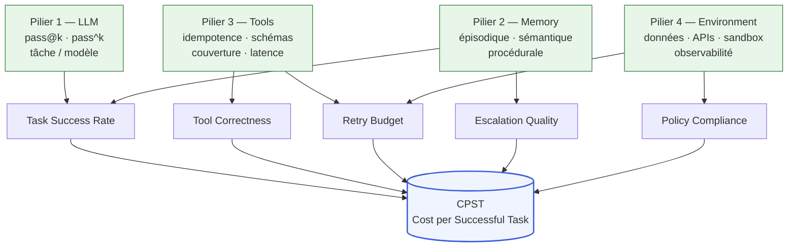
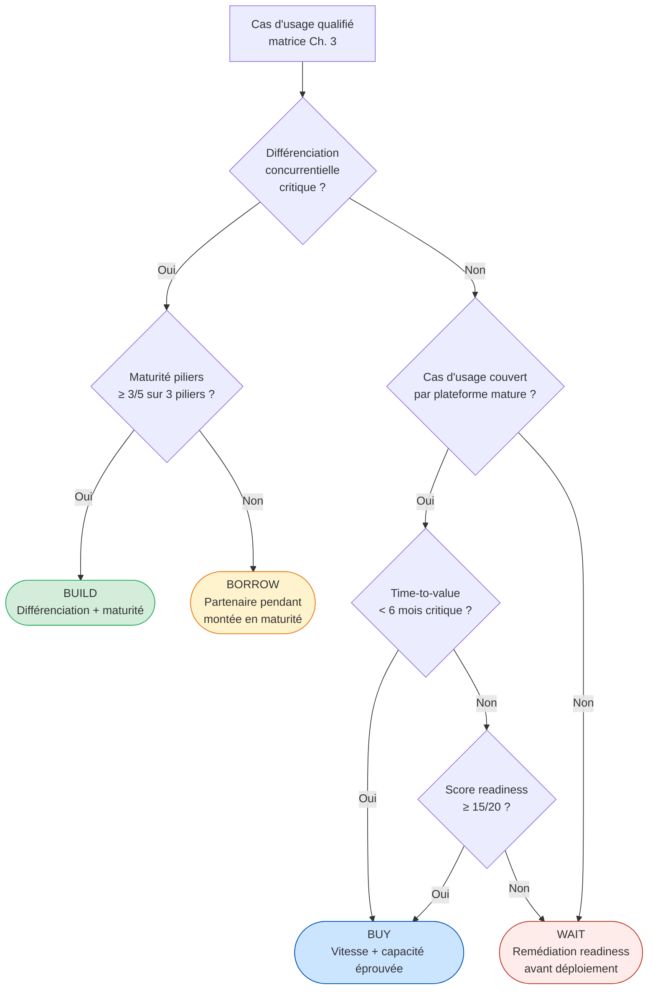

<!--
## Notes de recherche — Phase 2 (archivé intégralement)

1. Akshathala, S., Adnan, B., Ramesh, M., Vaidhyanathan, K., Muhammed, B., Parthasarathy, K. (SERC IIIT-Hyderabad / MontyCloud Inc.) — « Beyond Task Completion: An Assessment Framework for Evaluating Agentic AI Systems » — arXiv:2512.12791 — décembre 2025 (soumis 14 déc., révisé 16 déc. 2025) — https://arxiv.org/abs/2512.12791 — Cadre à quatre piliers d'évaluation LLM / Memory / Tools / Environment ; intègre modes d'évaluation statique, dynamique et par juge (LLM-as-judge) ; validé sur cas CloudOps autonome ; montre que les métriques de complétion binaires manquent les déviations comportementales liées au non-déterminisme ; PATERNITÉ CONFIRMÉE : SERC IIIT-Hyderabad + MontyCloud Inc., pas Microsoft ni Google. Cadre le plus proche du « four-pillar assessment » cité dans TOC.md.

2. Anthropic Engineering — « Demystifying Evals for AI Agents » — Anthropic — 2025-2026 — https://www.anthropic.com/engineering/demystifying-evals-for-ai-agents — Taxonomie Anthropic des evals : grade outcomes, transcripts, tool calls, cost, latency comme dimensions séparées ; distinction pass@k (succès au moins une fois) vs pass^k (succès systématiquement sur k essais) ; recommandation de graders code-based pour validation d'appels d'outils (rapides, reproductibles, bon marché) ; identification de la rigidité du test de séquence d'appels comme faux négatif fréquent. Source primaire Anthropic.

3. iMerit — « Agent Evaluation in Production: Behavior Metrics — Task Success, Tool Use Correctness, and Escalation Quality » — iMerit — 2026 — https://imerit.net/resources/blog/agent-evaluation-in-production-metrics-for-task-success-tool-use-correctness-and-escalation-quality/ — Définitions opérationnelles précises des métriques de comportement en production : task success rate (taux de complétion des objectifs), tool correctness (tool selection accuracy + tool parameter accuracy), escalation quality (triggers, type, timing, context quality), policy compliance (topic adherence). Structuration en 8-12 métriques pour systèmes de production. Apport : vocabulaire canonique adopté dans ce chapitre.

4. Akshathala et al. (arXiv:2604.19818) — « Beyond Task Success: An Evidence-Synthesis Framework for Evaluating, Governing, and Orchestrating Agentic AI » — arXiv — avril 2026 — https://arxiv.org/abs/2604.19818 — Article complémentaire (post-2512.12791) du même groupe ; élargit à la gouvernance et à l'orchestration ; distingue *evidence synthesis* des évaluations ponctuelles. Apport : continuité de la recherche sur l'évaluation holistique, fournit un ancrage académique pour la gouvernance.

5. KPMG — « Agentic AI Untangled: Navigating the Build, Buy, or Borrow Decision » — KPMG US — 2026 — https://kpmg.com/us/en/articles/2026/agentic-ai-untangled.html — Cadre décisionnel KPMG : Build (différenciation, contrôle, souveraineté des données) / Buy (vitesse, capacité éprouvée, certitude opérationnelle) / Borrow (flexibilité, co-création, partage du risque) ; 57 % des organisations optent pour une approche hybride (up from 51 % le trimestre précédent) ; succès conditionné à l'alignement sur valeur métier, maturité organisationnelle et fondations de données. Cadre de référence le plus actionnable disponible pour §4.4.

6. MIT CISR — « Update on the Enterprise AI Maturity Model » / « Grow Enterprise AI Maturity for Bottom-Line Impact » — MIT CISR — 2025 — https://cisr.mit.edu/publication/2025_0801_EnterpriseAIMaturityUpdate_WoernerSebastianWeillKaganer — Modèle à quatre stades de maturité IA d'entreprise (MIT CISR 2025 Real-Time Business Survey, N=152) ; progression stade 2→3 (pilotes → façons de travailler à l'échelle) identifiée comme le seuil de performance financière au-dessus de la moyenne du secteur ; dimensions évaluées : processus, technologie, culture organisationnelle. Source académique primaire pour le readiness assessment.

7. Fivetran — « 2026 Agentic AI Readiness Index » — Fivetran / Redpoint Ventures — 5 mai 2026 — https://www.fivetran.com/blog/85-of-enterprises-are-running-agentic-ai-on-a-data-foundation-that-isnt-ready — Enquête de 400 professionnels de la donnée (Redpoint Ventures) ; 85 % des entreprises déploient de l'*agentic AI* sur des fondations de données non prêtes ; 41 % utilisent déjà de l'*agentic AI* en production ; barrières : qualité et lignage des données (42 %), conformité réglementaire et souveraineté (39 %), risque sécurité et vie privée (39 %) ; 86 % des leaders données jugent la portabilité et l'interopérabilité « importantes ou critiques ». Source primaire publiée le 2026-05-05.

8. Gartner — « Lack of AI-Ready Data Puts AI Projects at Risk » — Gartner Newsroom — 26 février 2025 — https://www.gartner.com/en/newsroom/press-releases/2025-02-26-lack-of-ai-ready-data-puts-ai-projects-at-risk — 63 % des organisations n'ont pas ou ne savent pas si elles ont les bonnes pratiques de gestion des données pour l'IA ; prédiction : 60 % des projets IA abandonnés d'ici 2026 par manque de données IA-prêtes. Apport : calibration de l'ampleur du risque données dans le *readiness assessment*.

9. Galileo — « Agent Evaluation Framework 2026: Metrics, Rubrics & Benchmarks » — Galileo AI — 2026 — https://galileo.ai/blog/agent-evaluation-framework-metrics-rubrics-benchmarks — Vue d'ensemble du marché des plateformes d'évaluation agentique en 2026 : LangSmith (LangChain-natif, profondes intégrations framework), Braintrust (SOC 2 / GDPR / HIPAA, architecture span imbriquée), Arize Phoenix (OTel-based, six modalités d'éval, autohébergeable), Galileo (détection hallucination, ChainPoll), Langfuse (open-source). Apport : panorama outils pour §4.3.

10. OpenTelemetry — « Semantic Conventions for Generative AI Agent Spans » — OpenTelemetry — 2025-2026 — https://opentelemetry.io/docs/specs/semconv/gen-ai/gen-ai-agent-spans/ — Conventions sémantiques OTel pour les spans d'agents GenAI : statut *experimental* à mars 2026 (API non encore stabilisée) ; adoption précoce par Datadog (support natif OTel v1.37), Grafana, Elastic. Apport : standard d'instrumentation de référence pour l'observabilité agentique — lien direct avec la mesure du *tool correctness* et du *retry budget* via tracing.

11. Salesforce / Wiley — « Wiley sees 213% return on investment with Salesforce » — Salesforce Customer Stories — 2024-2025 — https://www.salesforce.com/customer-stories/wiley/ — Cas Wiley : 213 % ROI sur Service Cloud, >40 % amélioration de l'efficacité, onboarding agents saisonniers 50 % plus rapide, $230 000 d'économies documentées ; déploiement Agentforce sur pic de rentrée académique 2024. Source primaire Salesforce confirmée.

12. Bank of America Newsroom — « BofA AI and Digital Innovations Fuel 30 Billion Client Interactions » — Bank of America — mars 2026 — https://newsroom.bankofamerica.com/content/newsroom/press-releases/2026/03/bofa-ai-and-digital-innovations-fuel-30-billion-client-interacti.html — Erica : 21,3 M utilisateurs Q1 2026 (+7 %), 2 M interactions quotidiennes (équivalent 11 000 employés), +19 % revenus via suggestions proactives ; interne : 90 % adoption employés, -50 % requêtes IT service desk. Source primaire (communiqué officiel). Apport Ch. 4 : ROI mesurable sur grand déploiement *agentic* multi-dimension (coût, revenu, adoption).
-->

> **Partie 2 — Trouver les bons cas d'usage**
> **Chapitre 4 · Évaluer le ROI, le risque et la maturité · ~5 500 mots · lecture ≈ 22 min**

La qualification d'un cas d'usage *agentic* selon la matrice du [Ch. 3](ch03-mapping-high-impact.md) produit un verdict sur le risque intrinsèque de la tâche — mais ce verdict ne dit rien sur la capacité de l'organisation à opérer l'agent en production sans générer des coûts d'incident supérieurs à la valeur capturée. Ces deux filtres sont orthogonaux. Une tâche en zone verte de la matrice peut néanmoins échouer si le *Cost per Successful Task* (CPST) réel dépasse le seuil de rentabilité parce que le modèle est sous-dimensionné, la mémoire défaillante, les outils mal spécifiés, ou l'environnement de données non conforme. Ce chapitre fournit le second filtre : évaluer simultanément la viabilité économique et la maturité organisationnelle avant d'engager des ressources de développement.

La thèse opérationnelle est que les quatre piliers d'un système *agentic* — LLM (grand modèle de langage), Memory, Tools, Environment — sont les quatre déterminants mesurables du CPST potentiel, que les cinq métriques canoniques de production sont les variables de contrôle qui permettent de piloter ce CPST en temps réel, et que la décision Build/Buy/Borrow/Wait est la résultante structurée de l'évaluation de ces piliers et du score de maturité (*readiness*) sur quatre dimensions. L'organisation qui exécute ce cadre avant de déployer fait partie des 60 % de projets qui survivront à 2027.

---

## 4.1 — Le cadre à quatre piliers : LLM, Memory, Tools, Environment

Le cadre d'évaluation à quatre piliers présenté ici est attribué explicitement à Akshathala et al. (SERC IIIT-Hyderabad / MontyCloud Inc., arXiv:2512.12791, décembre 2025) — la seule source académique disponible à mai 2026 qui structure l'évaluation des systèmes *agentic* autour de ces quatre composantes avec validation empirique sur un cas de déploiement autonome réel (CloudOps). La portabilité de ce cadre à des domaines autres que les opérations cloud est *à vérifier* : les auteurs ne formulent pas de claim de généralisation au-delà du cas étudié. Les sections qui suivent en proposent une extension opérationnelle pour l'entreprise, dont la validité reste de l'ordre de l'*hypothèse de travail* jusqu'à réplication dans d'autres domaines.

La contribution centrale d'Akshathala et al. (2512.12791) est de montrer que les métriques de complétion binaires — la tâche est-elle terminée ou non — manquent systématiquement les déviations comportementales liées au non-déterminisme des LLM : un agent peut déclarer une tâche complétée tout en ayant produit un résultat incorrect, ayant consommé un multiple du budget de retry prévu, ou ayant invoqué des outils dans un ordre cohérent mais non optimal. Ces déviations ne sont détectables que si les quatre piliers sont évalués séparément, puis mis en relation.

### Pilier 1 — LLM

La capacité du modèle à accomplir la tâche cible avec le taux de succès et la fiabilité requis, sur la distribution réelle des inputs de production — pas sur la distribution de validation du PoC (preuve de concept). L'écart entre ces deux distributions est la cause racine du phénomène « l'agent marche en démo, échoue en production » documenté par SoftwareSeni (2026) : le PoC est calibré sur des inputs nominaux ; la production expose des cas de bord, des inputs malformés et des contextes composites.

La distinction *pass@k* vs *pass^k* introduite par Anthropic Engineering (*Demystifying Evals for AI Agents*, 2025-2026) est l'outil de calibrage : *pass@k* mesure si l'agent réussit au moins une fois sur k essais — pertinent pour les tâches créatives ou exploratoires où une réponse correcte suffit ; *pass^k* mesure si l'agent réussit systématiquement sur k essais — exigible pour toute tâche opérationnelle répétée sur un volume de production. Une tâche médicale ou financière n'est pas évaluable en *pass@k* ; une génération de contenu marketing peut l'être. Confondre les deux produit soit un sous-déploiement (exiger *pass^k* là où *pass@k* suffit) soit une catastrophe opérationnelle (déployer avec *pass@k* là où *pass^k* est requis).

Impact CPST : un LLM sous-dimensionné pour la complexité réelle de la tâche dégrade le taux de succès et multiplie les retries — chaque retry supplémentaire consomme des tokens d'inférence, du temps d'orchestration, et augmente la probabilité d'escalade humaine. Le coût marginal du retry n'est jamais nul.

### Pilier 2 — Memory

La capacité du système à maintenir le contexte nécessaire à l'exécution correcte sur toute la durée de la tâche. La taxonomie mémoire épisodique / sémantique / procédurale (développée au [Ch. 1 §1.3](ch01-from-automation-to-agents.md)) est le point de départ ; l'évaluation dans ce pilier porte sur trois questions opérationnelles : quel type de mémoire la tâche requiert-elle réellement, quel est le risque de *context drift* sur les tâches longues, et quel est le coût d'infrastructure de la solution mémoire choisie (index vectoriel, graphe de connaissances, compression).

L'anti-patron critique : une mémoire non purgée sur des tâches répétitives accumule des biais dans les décisions suivantes — l'agent « se souvient » d'états antérieurs qui ne sont plus valides, et ses actions dérivent sans signal d'alarme explicite. Intellyx documente ce mode de défaillance sous le terme *stale state* (*confirmé* — Intellyx, février 2025) : c'est l'un des cinq modes de défaillance stateful identifiés dans ce chapitre et au [Ch. 1 §1.4](ch01-from-automation-to-agents.md). Impact CPST direct : un contexte perdu ou corrompu force le retry depuis zéro, au coût d'une tâche complète, et augmente le taux d'escalade pour les cas où l'agent ne peut pas reconstruire le contexte nécessaire.

### Pilier 3 — Tools

La qualité et la fiabilité des outils auxquels l'agent a accès. L'évaluation couvre quatre dimensions : l'idempotence des outils à effet de bord (peut-on appeler deux fois sans conséquence double — exigence non négociable pour les workflows avec retry), la richesse et la précision des schémas d'outil (un schéma ambigu augmente mécaniquement le taux d'erreur *tool correctness*), la couverture des outils disponibles par rapport aux besoins réels de la tâche (un outil manquant force l'improvisation, source d'hallucinations outillées), et la latence des appels d'outil (impact direct sur le CPST via la latence totale de la tâche).

La métrique clé de ce pilier est le *tool correctness*, qui se décompose en deux composantes distinctes : *tool selection accuracy* (l'agent invoque le bon outil pour la situation) et *tool parameter accuracy* (l'agent remplit les paramètres correctement selon le contexte). Ces deux composantes doivent être mesurées séparément. Un agent qui sélectionne le bon outil avec les mauvais paramètres génère un échec différent — et plus difficile à diagnostiquer — que l'agent qui sélectionne le mauvais outil. Anthropic recommande des graders code-based pour valider les appels d'outil : tester *ce que* l'agent a produit, pas *comment* il l'a produit, pour ne pas pénaliser les chemins valides non anticipés (*confirmé* — Anthropic Engineering, *Demystifying Evals*, 2025-2026).

### Pilier 4 — Environment

La qualité et la fiabilité de l'environnement dans lequel l'agent opère : qualité et fraîcheur des données sources, stabilité des APIs invoquées, sécurité du bac à sable d'exécution, observabilité instrumentée et disponible. Ce pilier est le plus difficile à évaluer parce qu'il dépend de facteurs hors du contrôle direct de l'équipe de développement de l'agent.

Le chiffre Gartner est la calibration de référence : 63 % des organisations n'ont pas — ou ne savent pas si elles ont — les bonnes pratiques de gestion des données pour l'IA (*confirmé* — Gartner Newsroom, 26 février 2025). Fivetran confirme la dimension concrète : 85 % des entreprises déploient de l'*agentic AI* sur des fondations de données qui ne sont pas prêtes (*confirmé* — Fivetran, 2026 Agentic AI Readiness Index, 5 mai 2026). Ces deux chiffres définissent l'ampleur du problème : l'Environment est le pilier le plus souvent défaillant, et sa défaillance est invisible jusqu'à la production. Un environnement instable multiplie les timeouts et les retries — coût directement mesurable sur le CPST.

Pour les institutions financières canadiennes, OSFI E-23 (*Model Risk Management*, en vigueur 1er mai 2027) impose des exigences de gouvernance des modèles IA qui contraignent directement ce pilier : qualité des données d'entraînement, traçabilité des décisions, documentation des limites du modèle. Un agent déployé avant la mise en conformité complète de l'environnement avec OSFI E-23 crée une dette réglementaire dont le coût de remédiation rétroactive dépasse généralement le coût d'une préparation préalable.

Le tableau suivant synthétise l'évaluation des quatre piliers en termes opérationnels :

| Pilier | Métrique primaire | Impact CPST si défaillant | Contre-mesure | Outil d'instrumentation |
|---|---|---|---|---|
| LLM | pass^k sur distribution réelle | Retries multipliés, taux de succès dégradé | Réévaluation modèle sur corpus production | Eval suite automatisée (offline + online) |
| Memory | Taux de *stale state*, taux d'escalade lié au contexte | Retries depuis zéro, escalades non prévues | Politique de purge, compression avec validation | Traces OTel GenAI (span memory operations) |
| Tools | *Tool selection accuracy*, *tool parameter accuracy* | Échecs silencieux, résultats incorrects non détectés | Schémas stricts, idempotence, tests de contrat | Graders code-based, OTel tool spans |
| Environment | Disponibilité APIs, fraîcheur données, taux timeout | Retries contraints, timeouts non bornés | SLAs APIs, pipelines données toujours actifs | Monitoring APM + OTel traces |

---

## 4.2 — Métriques opérationnelles : les cinq signaux de production

Les cinq métriques canoniques définies ici — *task success*, *tool correctness*, *retry budget*, *escalation quality*, *policy compliance* — ne sont pas des *KPI* (indicateurs de performance clés) de tableau de bord managérial. Ce sont les variables de contrôle en temps réel d'un système *agentic* en production : leur absence transforme tout incident en surprise non diagnostiquable. Les définitions qui suivent s'appuient sur le vocabulaire opérationnel de iMerit (2026) et sur les pratiques Anthropic Engineering.

### Task success rate

Taux de complétion correcte des objectifs de l'agent sur la distribution réelle des inputs. La distinction critique : succès *nominal* (la tâche est déclarée terminée par l'agent) vs succès *qualitatif* (la tâche est terminée avec un résultat conforme au critère de *successful outcome* défini en [Ch. 2 §2.5](ch02-business-case.md)). Un agent qui produit une réponse plausible mais incorrecte contribue au succès nominal mais pas au succès qualitatif. Cette distinction détermine le dénominateur réel du CPST et est la source la plus fréquente de désaccord entre les équipes techniques (qui mesurent le succès nominal) et les directions métier (qui évaluent le succès qualitatif).

Seuil minimal acceptable pour déploiement en production *zone verte* : success rate qualitatif ≥ 85 % sur la distribution réelle des inputs (*hypothèse de seuil maison — pas de standard publié à mai 2026*). En dessous, le CPST dépasse généralement le coût d'un opérateur humain pour les tâches comparables.

### Tool correctness

Deux composantes à mesurer séparément : (1) *tool selection accuracy* — l'agent invoque le bon outil pour la situation donnée ; (2) *tool parameter accuracy* — l'agent remplit les paramètres correctement selon le contexte de la tâche. La combinaison produit un score composite, mais les composantes diagnostiquent des défauts différents : une sélection incorrecte révèle un problème de compréhension de la tâche ou de description de l'outil ; des paramètres incorrects révèlent un problème de résolution du contexte ou de précision du schéma.

Les graders code-based recommandés par Anthropic sont la solution à privilégier pour instrumenter cette métrique en production : ils testent le résultat produit (l'appel d'outil a-t-il abouti au résultat attendu ?) plutôt que la séquence exacte d'appels (l'agent a-t-il invoqué précisément ce chemin ?). Cette distinction évite de pénaliser les chemins d'exécution valides mais non anticipés lors de l'écriture des evals.

### Retry budget

Mesure de la consommation du budget de retry par tâche. En production, les métriques opérationnelles à instrumenter sont : le ratio (retries consommés / budget alloué par tâche), le taux de tâches qui épuisent le budget complet sans atteindre le succès (indicateur de sous-dimensionnement du modèle ou de mauvaise qualité des outils), et le coût moyen par retry (enrichit le calcul du CPST réel vs projeté).

**Seuil d'alerte** : si plus de 20 % des tâches consomment plus de 50 % du retry budget alloué, le cas d'usage est probablement mal dimensionné — réévaluer le Pilier 1 (LLM) ou le Pilier 3 (Tools) avant toute initiative d'optimisation de coût. Ce seuil est un cadre maison de cette monographie, non une norme publiée. La définition du retry budget en [Ch. 2 §2.3](ch02-business-case.md) fournit le cadre financier ; cette métrique en est la mesure opérationnelle en production.

### Escalation quality

Quatre sous-dimensions, chacune mesurable indépendamment : (1) *trigger accuracy* — l'escalade est déclenchée aux bonnes conditions (ni trop tôt, ni trop tard) ; (2) *escalation type* — l'escalade est correctement routée (humain généraliste, humain expert, agent spécialisé) ; (3) *timing* — à quel point du cycle de vie de la tâche l'escalade survient (une escalade précoce coûte moins en contexte accumulé ; une escalade tardive signifie que l'agent a consommé des ressources sans succès) ; (4) *context quality* — complétude et clarté du contexte transmis à l'opérateur humain ou à l'agent cible.

Cette dernière sous-dimension est la plus négligée dans les implémentations initiales et la plus coûteuse en production : une escalade avec contexte incomplet allonge le temps de traitement humain, augmente le taux de re-escalade, et dégrade la satisfaction de l'opérateur. Le [Ch. 7](ch07-agentops.md) traite l'observabilité des escalades comme dimension distincte de l'AgentOps.

### Policy compliance

Mesure l'adhérence de l'agent aux politiques définies : périmètre topical (refus des requêtes hors domaine), contraintes de données (ne pas exposer de données à caractère personnel non autorisées), exigences réglementaires sectorielles. Cette métrique est le lien direct entre l'évaluation technique de l'agent et les exigences de conformité de l'environnement (Pilier 4).

Le standard OTel GenAI Agent Spans (*experimental* à mars 2026 — *probable* que le statut sera stabilisé d'ici fin 2027, 12-18 mois de piste, mais pas garanti) permet d'instrumenter la policy compliance comme attribut de span : traçable par tâche, par tenant, par run. L'adoption précoce par Datadog (support natif OTel v1.37), Grafana et Elastic (*confirmé* — documentation OpenTelemetry, 2026) rend cette instrumentation opérationnelle aujourd'hui, même si l'API n'est pas encore stabilisée.

---

## 4.3 — Plateformes d'évaluation : tableau comparatif

Le marché des plateformes d'évaluation agentique a convergé en 2025-2026 autour de quatre acteurs principaux et d'un standard d'instrumentation émergent (OTel GenAI). Le tableau suivant est un positionnement neutre sur des critères objectifs — aucune recommandation fournisseur n'est formulée, parce que le choix dépend du profil organisationnel et des contraintes de conformité propres à chaque déploiement.

| Plateforme | Modèle de déploiement | OTel-native | Conformité | Forces différenciantes | Limite principale |
|---|---|---|---|---|---|
| **LangSmith** (LangChain) | SaaS + self-hosted | Partielle (via LangChain callbacks) | SOC 2 | Intégration native LangChain/LangGraph, debugging de traces multi-étapes | Friction hors écosystème LangChain |
| **Arize Phoenix** | Open-source + SaaS | Oui (OTel natif, priorité design) | SOC 2 — autohébergeable pour conformité renforcée | Six modalités d'éval (LLM, code, humain, embedding, règles, retrieval) ; autohébergeable | Maturité UI inférieure aux solutions propriétaires |
| **Galileo** | SaaS | Partielle | SOC 2, GDPR | ChainPoll (détection hallucination), Luna (auto-évaluation), détection *groundedness* | Pricing opaque, modèle propriétaire non auditable |
| **Braintrust** | SaaS | Partielle (architecture span imbriquée) | SOC 2, GDPR, HIPAA | Architecture de scoring imbriquée, adapté aux contextes santé/réglementé | Coût élevé à l'échelle, dépendance vendor |
| **OTel GenAI Agent Spans** | Standard ouvert | Oui (c'est le standard) | N/A (standard, pas outil) | Interopérabilité, portabilité, base pour tous les outils ci-dessus | Statut *experimental* à mai 2026 ; API non stabilisée |

**Critères de choix** — trois questions pour trancher sans fabrication de scoring :

1. *Êtes-vous dans l'écosystème LangChain/LangGraph ?* Si oui, LangSmith offre l'intégration la plus directe avec le moins de friction. Si non, Arize Phoenix est la seule option open-source avec un OTel natif prioritaire, ce qui garantit la portabilité.

2. *Avez-vous des exigences HIPAA ou de conformité financière stricte ?* Braintrust est la seule plateforme SaaS avec une certification HIPAA confirmée à mai 2026. Pour les institutions financières canadiennes, l'autohébergement d'Arize Phoenix permet de maintenir la souveraineté des données sans les limites de la customisation SaaS.

3. *Visez-vous la durabilité sur 3-5 ans ?* Instrumenter l'OTel GenAI Agent Spans dès maintenant — même en statut *experimental* — garantit la portabilité vers n'importe quelle plateforme future. C'est la seule décision d'infrastructure d'évaluation qui n'implique pas de lock-in fournisseur.

**Recommandation avec compromis et alternative** : instrumenter OTel GenAI Agent Spans comme couche de base universelle, puis brancher la plateforme d'évaluation choisie par-dessus. Compromis : l'API OTel en statut *experimental* peut changer avant stabilisation (probable d'ici Q4 2027 — *à vérifier*), ce qui impose une migration légère de l'instrumentation. Alternative : ne pas utiliser OTel et s'appuyer exclusivement sur le SDK natif de la plateforme choisie — plus simple à court terme, mais crée une dépendance vendor sur la visibilité de production. Condition de bascule : si la plateforme choisie est acquise ou abandonne sa feuille de route, l'absence d'OTel impose une migration complète de l'instrumentation, pas seulement un changement de plateforme.

---

## 4.4 — Décision Build / Buy / Borrow / Wait : critères et seuils

La décision Build/Buy/Wait formalisée dans le TOC.md est enrichie ici d'une quatrième voie — *Borrow* — introduite par KPMG (2026) comme variante hybride entre *Wait* et *Buy* : accéder aux capacités *agentic* d'un partenaire ou d'un fournisseur sans en prendre la possession ni la responsabilité de maintenance, pendant la période de transition organisationnelle. Selon KPMG, 57 % des organisations optent pour une approche hybride mêlant ces voies (*confirmé* — KPMG, *Agentic AI Untangled*, 2026), en hausse par rapport à 51 % le trimestre précédent.

Le tableau suivant détaille les critères et seuils pour chaque voie :

| Critère | BUILD | BUY | BORROW | WAIT |
|---|---|---|---|---|
| **Différenciation concurrentielle** | Élevée : l'avantage réside dans la logique métier, pas dans les capacités LLM génériques | Faible à modérée : patron supporté par plateformes matures | Modérée : capacité souhaitée mais pas encore maîtrisable en interne | Non requise |
| **Maturité piliers (LLM, Memory, Tools)** | ≥ 3/5 sur au moins 3 piliers | ≥ 2/5 suffisant — la plateforme comble les lacunes | 1-2/5 admissible — le partenaire apporte les capacités | < 2/5 sur deux piliers ou plus → rembourser d'abord la dette |
| **Score readiness 4D** | ≥ 15/20 | ≥ 12/20 (avec plan de remédiation parallèle) | 8-14/20 — readiness partielle acceptable si partenaire compense | < 8/20 → remédiation requise avant tout engagement |
| **Time-to-value** | > 6 mois acceptable si différenciation justifie | < 6 mois critique | 3-9 mois : accès rapide aux capacités pendant que la maturité interne se construit | Indéfini → doit avoir une date d'expiration explicite avec critères de réévaluation |
| **Souveraineté des données / conformité** | Requise si traitement tiers interdit (Loi 25, OSFI E-23) | Acceptable si SaaS conforme disponible | Vérifier contrats de partage de données avec le partenaire | N/A |
| **Latence stratégique** | Tolérable — la différenciation justifie le délai | Risque si fenêtre compétitive < 6 mois | Faible — accès immédiat aux capacités | Risque si le marché consolide rapidement |

**La voie *Borrow* opérationnellement.** KPMG la décrit comme co-création, partage du risque, et flexibilité (*confirmé* — KPMG, 2026). En pratique : accéder à un modèle *agentic* déployé par un intégrateur ou un éditeur, l'utiliser en production pour le cas d'usage cible, et simultanément construire la maturité interne pour internaliser ou remplacer la capacité dans 12-24 mois. Le risque principal est la dépendance commerciale pendant la période de *borrow* : si le partenaire modifie ses conditions, l'organisation n'a ni la capacité interne de substituer ni le temps de trouver une alternative. La condition de cette voie est donc un contrat avec des clauses de portabilité des données et des agents, et un plan de sortie documenté dès l'entrée.

**Recommandation principale : ROI agentique strict vs optionalité de capacité.**

Compromis : évaluer un cas d'usage *agentic* sur le seul ROI direct (CPST vs coût humain) est une exigence valide mais insuffisante — elle ignore la valeur de l'*optionalité de capacité* que le déploiement crée : données de production réelles sur le comportement de l'agent, apprentissage opérationnel de l'équipe, infrastructure d'évaluation construite, et capital politique interne pour les déploiements suivants. Un cas d'usage avec ROI direct modeste mais très instructif peut valoir l'investissement si l'organisation est en début de courbe d'apprentissage *agentic*. La condition de bascule : si le ROI direct est négatif et l'apprentissage organisationnel n'est pas un objectif explicitement budgété, la décision est *Wait*.

Alternative : formaliser l'optionalité de capacité comme ligne du business case, avec un horizon de valeur de 24-36 mois (délai pour que les agents zone orange deviennent rentables grâce aux capacités construites par les pilotes zone verte). Cette formalisation résiste mieux aux revues budgétaires trimestrielles que l'argument qualitatif de l'apprentissage.

---

## 4.5 — Readiness assessment 4D : données, processus, talents, gouvernance

Le *readiness assessment* agentique présenté ici est un cadre maison de cette monographie — les quatre dimensions et le système de scoring proposé ne sont pas attribués à une source externe unique. La structure s'appuie sur le modèle MIT CISR à quatre stades (*confirmé* — MIT CISR, 2025, N=152), sur le Fivetran 2026 Agentic AI Readiness Index (*confirmé* — N=400), et sur les critères de gouvernance Databricks (*confirmé* — *State of AI Agents 2026*, 20 000+ organisations), mais leur combinaison en un scoring intégré est une synthèse de cette monographie. Les seuils numériques proposés sont des *hypothèses de travail*, pas des normes validées empiriquement.

### Dimension 1 — Données (D1)

L'agent peut-il accéder aux données dont il a besoin, avec la qualité, la fraîcheur et la traçabilité requises pour la tâche ? Les barrières documentées par Fivetran (2026) sont : qualité et lignage des données (42 % des organisations les citent comme première barrière), conformité réglementaire et souveraineté (39 %), risque sécurité et vie privée (39 %). Ces chiffres définissent le profil de risque type de cette dimension.

Critères de scoring D1 (1-5) :

| Score | Critère |
|---|---|
| 1 | Données sources sans lignage documenté, sans SLA de fraîcheur défini |
| 2 | Lignage partiel, fraîcheur non contractualisée, pas de pipeline toujours actif |
| 3 | Lignage documenté sur les sources primaires, fraîcheur contractualisée mais non monitorée |
| 4 | Pipelines toujours actifs, lignage end-to-end, conformité Loi 25 / OSFI E-23 vérifiée |
| 5 | Pipelines toujours actifs, lignage certifié, portabilité et interopérabilité confirmées (*probable* que ce niveau exige une architecture Data Mesh ou équivalente) |

### Dimension 2 — Processus (D2)

Le processus que l'agent automatise est-il suffisamment bien compris et documenté pour que ses exceptions soient prévisibles ? La règle d'or : un processus non documenté avant déploiement *agentic* génère invariablement des surprises en production, parce que les cas de bord non documentés sont précisément ceux qui déclenchent les comportements non bornés. ThoughtWorks formule le principe avec précision (*confirmé* — ThoughtWorks Technology Radar 2025) : un agent qui reproduit les 14 étapes d'un processus humain non optimisé n'est pas un agent *agentic* — c'est une RPA plus coûteuse.

La documentation du processus cible (pas du processus actuel) est le prérequis minimal de cette dimension. Si le processus cible n'est pas connu, le cas d'usage n'est pas évaluable — la décision est *Wait*.

### Dimension 3 — Talents (D3)

L'organisation a-t-elle les compétences pour développer, évaluer, déployer et opérer un agent *agentic* en production ? La compétence la plus rare et la plus déterminante n'est pas le prompt engineering — c'est la capacité à écrire des *eval suites* qui couvrent la distribution réelle des inputs, y compris les cas de bord. MIT CISR identifie la présence de compétences spécialisées en IA comme le facteur différenciateur de la progression stade 2→3 (pilotes → façons de travailler à l'échelle), qui est le seuil de performance financière au-dessus de la moyenne du secteur (*confirmé* — MIT CISR, 2025).

Les compétences à évaluer : ingénieurs capables d'écrire des eval suites sur corpus de production, capacité à instrumenter l'observabilité OTel GenAI, compétence *on-call* pour diagnostiquer les modes de défaillance *stateful* (*stale state*, *context drift* — [Ch. 1 §1.4](ch01-from-automation-to-agents.md)), et au moins un responsable AgentOps capable de piloter le cycle de vie *promote / deprecate / rollback* d'un agent ([Ch. 7](ch07-agentops.md)).

### Dimension 4 — Gouvernance (D4)

L'organisation a-t-elle les artefacts de gouvernance minimaux pour contrôler l'agent en production ? Les trois artefacts Databricks (*confirmé* — *State of AI Agents 2026*) : définition opérationnelle du *successful outcome*, *eval suite* automatisée, et *escalation policy* documentée. À ces trois artefacts s'ajoutent : une politique de *retry budget* avec *kill switch* financier ([Ch. 2 §2.3](ch02-business-case.md)), et une structure RACI pour les décisions humaines de supervision. L'[Annexe D](annexe-D-governance-raci.md) propose une matrice RACI agentique standard.

La donnée de référence sur cette dimension : selon Gartner, seulement 21 % des entreprises ont une infrastructure de gouvernance mature pour gérer l'*agentic AI* à l'échelle en toute sécurité en 2026 (*probable* — issu d'une synthèse d'analystes, citation indirecte ; la publication primaire Gartner n'a pas été tracée en source directe à mai 2026 — *à vérifier*).

### Scoring intégré et seuils décisionnels

Chaque dimension est notée de 1 à 5 sur les cinq critères ci-dessus. Le score global est la somme des quatre scores dimensionnels (maximum 20).

| Score global | Interprétation | Décision recommandée |
|---|---|---|
| ≥ 15/20 | Maturité suffisante pour déploiement | Engager le déploiement avec les garde-fous standard |
| 10-14/20 | Lacunes ciblées identifiables | Plan de remédiation sur les dimensions < 3/5 avant déploiement |
| < 10/20 | Lacunes structurelles multiples | *Wait* avec feuille de route de développement des capacités (horizon 6-18 mois) |

Ces seuils sont des *hypothèses de travail* de cette monographie. L'[Annexe C](annexe-C-agentops-maturity.md) propose le modèle de maturité AgentOps à cinq niveaux, qui complète ce scoring par une évaluation de la maturité opérationnelle post-déploiement.

---

## 4.6 — Cas Klarna : la dimension gouvernance absente

Klarna est le cas de référence le plus documenté d'un déploiement *agentic* front-office à grande échelle qui a produit un ROI initial apparent avant de générer des coûts d'incident supérieurs à la valeur capturée. Le [Ch. 2 §2.4](ch02-business-case.md) l'a analysé sous l'angle économique (CPST initialement favorable en coût d'inférence pur, sans intégrer la dégradation de la satisfaction client). Le [Ch. 3 §3.4](ch03-mapping-high-impact.md) l'a analysé sous l'angle de la réversibilité organisationnelle (irréversibilité non modélisée de la suppression de 700 postes). L'angle de ce chapitre est différent et complémentaire : la dimension gouvernance du *readiness assessment*.

Appliqué rétrospectivement au déploiement Klarna (2024), le scoring de la Dimension 4 révèle l'absence des artefacts minimaux. La définition opérationnelle du *successful outcome* n'intégrait pas la satisfaction client comme critère de succès — la métrique retenue était la résolution du ticket, pas la qualité perçue de la résolution. L'*eval suite* n'était pas calibrée sur la distribution réelle des cas complexes — ceux qui avaient précédemment nécessité une intervention humaine experte. La politique d'escalade n'avait pas de critères de déclenchement basés sur la satisfaction client, seulement sur l'échec de résolution technique. Ces trois lacunes sont précisément les trois artefacts Databricks.

La conséquence : l'agent résolvait les tickets (succès nominal) sans résoudre correctement les cas complexes (échec qualitatif). La dégradation s'est accumulée silencieusement pendant plusieurs mois avant que les métriques de satisfaction client ne déclenchent l'alarme — exactement le scénario que la métrique *task success rate* qualitatif aurait détecté en temps réel si elle avait été instrumentée. Le CEO de Klarna a reconnu publiquement : « We went too far » (*confirmé* — Fortune, 9 mai 2025). La réembauche d'agents humains en modèle hybride est la compensation d'une lacune de gouvernance, pas d'une limite technologique.

Score D4 retrospectif estimé : 1-2/5. Score global estimé pour l'ensemble du *readiness assessment* Klarna au moment du déploiement de 2024 : *hypothèse* 10-12/20 — une organisation technologiquement avancée (D1 élevé, D3 élevé) mais avec des processus non documentés pour les cas complexes (D2 faible) et une gouvernance inexistante pour la qualité de la résolution (D4 très faible). La décision correcte selon le cadre de ce chapitre aurait été : déployer avec un plan de remédiation ciblé sur D4, en maintenant les opérateurs humains comme capacité de repli jusqu'à validation du taux de succès qualitatif sur les cas complexes.

La leçon n'est pas que l'IA conversationnelle ne peut pas remplacer des agents humains dans le service client — Bank of America a démontré le contraire à 21,3 millions d'utilisateurs (*confirmé* — BofA Newsroom, mars 2026). La leçon est que la gouvernance (D4) n'est pas une formalité qui peut être résolue en post-déploiement : elle doit être instrumentée avant la première journée de production, parce que les données nécessaires pour la calibrer — la distribution réelle des cas, les seuils de satisfaction, les critères de qualité — n'existent pas avant que l'agent n'opère en production avec une gouvernance suffisante pour les capturer.

---

## 4.7 — Du *readiness assessment* au dossier d'investissement actionnable

Le dossier d'investissement *agentic* qui résiste à la première revue budgétaire répond à trois questions en une page : quel est le CPST projeté à quel taux de succès qualitatif, quel est le score de *readiness* et quel est le plan de remédiation des lacunes, et quelle est la décision Build/Buy/Borrow/Wait motivée avec ses conditions de bascule explicites.

Le format minimal d'un dossier d'investissement *agentic* :

1. **Fiche cas d'usage** : classification selon la matrice de [Ch. 3](ch03-mapping-high-impact.md) (zone, scores des trois dimensions), définition opérationnelle du *successful outcome*, CPST cible et CPST humain de référence.

2. **Évaluation quatre piliers** : scores 1-5 par pilier (LLM, Memory, Tools, Environment), lacunes identifiées, contre-mesures planifiées avec dates.

3. **Score readiness 4D** : scores par dimension (D1-D4), score total, plan de remédiation des dimensions < 3/5, délai de remédiation estimé.

4. **Décision Build/Buy/Borrow/Wait** : voie retenue, critères qui la justifient, condition de bascule explicite (quel événement ou résultat ferait choisir une autre voie).

5. **Métriques de production** : définition des cinq métriques canoniques calibrées pour ce cas d'usage (seuils acceptables, fréquence de mesure, responsable de l'instrumentation).

Ce format est délibérément minimal. Un dossier plus long ne sera pas plus décidable — il sera plus difficile à réviser trimestriellement. La revue trimestrielle est l'engagement de gouvernance requis : les seuils de métriques doivent être revisités à chaque changement de volume, de distribution des inputs, ou de version du modèle.

Les chapitres suivants complètent le cadre : [Ch. 5](ch05-protocols-interoperability.md) détaille le choix de protocoles selon la décision Build/Buy (MCP pour les outils, A2A pour l'orchestration multi-agents) ; [Ch. 7](ch07-agentops.md) opérationnalise les métriques définies ici en discipline AgentOps ; [Ch. 8](ch08-trustworthy-systems.md) aligne les seuils de readiness avec la hiérarchie d'autonomie et les exigences de l'EU AI Act et d'ISO 42001. L'[Annexe B](annexe-B-use-case-canvas.md) propose le canvas opérationnel qui instancie ce cadre pour chaque cas d'usage ; l'[Annexe C](annexe-C-agentops-maturity.md) offre la jauge de maturité AgentOps à cinq niveaux qui prolonge le score readiness 4D après le déploiement.

---

## Pour aller plus loin

**Akshathala et al. — « Beyond Task Completion: An Assessment Framework for Evaluating Agentic AI Systems » (arXiv:2512.12791, décembre 2025).** La source académique la plus rigoureuse disponible pour l'évaluation structurée des systèmes *agentic*. Le cadre à quatre piliers y est validé empiriquement sur un cas CloudOps autonome ; les modes d'évaluation statique, dynamique et par juge (LLM-as-judge) y sont comparés avec des résultats quantitatifs. Lecture indispensable avant de concevoir une *eval suite* pour un déploiement en zone orange ou rouge. <https://arxiv.org/abs/2512.12791>

**Anthropic Engineering — « Demystifying Evals for AI Agents » (2025-2026).** La référence pratique la plus dense sur la conception d'evals pour agents en production. La distinction *pass@k* vs *pass^k*, la recommandation des graders code-based, et la décomposition en dimensions (outcome, transcript, tool call, cost, latency) sont directement applicables à la construction des métriques canoniques décrites dans ce chapitre. <https://www.anthropic.com/engineering/demystifying-evals-for-ai-agents>

**KPMG — « Agentic AI Untangled: Navigating the Build, Buy, or Borrow Decision » (2026).** Le cadre décisionnel Build/Buy/Borrow le plus actionnable disponible à mai 2026, avec des données de marché sur l'adoption de chaque voie. Utile pour calibrer le dialogue avec une direction financière qui attend une comparaison de marché, pas seulement une analyse interne. <https://kpmg.com/us/en/articles/2026/agentic-ai-untangled.html>

**Fivetran — « 2026 Agentic AI Readiness Index » (5 mai 2026).** L'enquête la plus récente et la plus précise sur l'état réel de la maturité des données dans les programmes *agentic* d'entreprise (N=400, Redpoint Ventures). Les chiffres sur les barrières données sont une ressource directe pour justifier l'investissement dans la Dimension 1 du *readiness assessment* devant un comité de gouvernance. <https://www.fivetran.com/blog/85-of-enterprises-are-running-agentic-ai-on-a-data-foundation-that-isnt-ready>

**MIT CISR — « Update on the Enterprise AI Maturity Model » (2025).** Le modèle académique de maturité IA d'entreprise le plus robuste disponible (N=152, MIT CISR Real-Time Business Survey). La corrélation documentée entre la progression stade 2→3 et la performance financière sectorielle est le seul point de données académique confirmé disponible à mai 2026 pour justifier l'investissement dans la maturité organisationnelle plutôt que dans la technologie seule. <https://cisr.mit.edu/publication/2025_0801_EnterpriseAIMaturityUpdate_WoernerSebastianWeillKaganer>

---

## Références

Akshathala, S., Adnan, B., Ramesh, M., Vaidhyanathan, K., Muhammed, B., Parthasarathy, K. — « Beyond Task Completion: An Assessment Framework for Evaluating Agentic AI Systems » — SERC IIIT-Hyderabad / MontyCloud Inc. — arXiv:2512.12791 — décembre 2025 — <https://arxiv.org/abs/2512.12791> — accédée le 2026-05-05

Akshathala, S. et al. — « Beyond Task Success: An Evidence-Synthesis Framework for Evaluating, Governing, and Orchestrating Agentic AI » — arXiv:2604.19818 — avril 2026 — <https://arxiv.org/abs/2604.19818> — accédée le 2026-05-05

Anthropic Engineering — « Demystifying Evals for AI Agents » — Anthropic — 2025-2026 — <https://www.anthropic.com/engineering/demystifying-evals-for-ai-agents> — accédée le 2026-05-05

Bank of America — « BofA AI and Digital Innovations Fuel 30 Billion Client Interactions » — Bank of America Newsroom — mars 2026 — <https://newsroom.bankofamerica.com/content/newsroom/press-releases/2026/03/bofa-ai-and-digital-innovations-fuel-30-billion-client-interacti.html> — accédée le 2026-05-05

Fivetran / Redpoint Ventures — « 2026 Agentic AI Readiness Index: 85% of Enterprises Are Running Agentic AI on a Data Foundation That Isn't Ready » — Fivetran Blog — 5 mai 2026 — <https://www.fivetran.com/blog/85-of-enterprises-are-running-agentic-ai-on-a-data-foundation-that-isnt-ready> — accédée le 2026-05-05

Fortune — « Klarna Reverses AI Customer Service Replacement » — Fortune — 9 mai 2025 — <https://fortune.com/2025/05/09/klarna-ai-humans-return-on-investment/> — accédée le 2026-05-05

Galileo AI — « Agent Evaluation Framework 2026: Metrics, Rubrics & Benchmarks » — Galileo AI Blog — 2026 — <https://galileo.ai/blog/agent-evaluation-framework-metrics-rubrics-benchmarks> — accédée le 2026-05-05

Gartner — « Lack of AI-Ready Data Puts AI Projects at Risk » — Gartner Newsroom — 26 février 2025 — <https://www.gartner.com/en/newsroom/press-releases/2025-02-26-lack-of-ai-ready-data-puts-ai-projects-at-risk> — accédée le 2026-05-05

iMerit — « Agent Evaluation in Production: Behavior Metrics — Task Success, Tool Use Correctness, and Escalation Quality » — iMerit Blog — 2026 — <https://imerit.net/resources/blog/agent-evaluation-in-production-metrics-for-task-success-tool-use-correctness-and-escalation-quality/> — accédée le 2026-05-05

KPMG — « Agentic AI Untangled: Navigating the Build, Buy, or Borrow Decision » — KPMG US — 2026 — <https://kpmg.com/us/en/articles/2026/agentic-ai-untangled.html> — accédée le 2026-05-05

MIT CISR — « Update on the Enterprise AI Maturity Model » — MIT Sloan Center for Information Systems Research — 2025 — <https://cisr.mit.edu/publication/2025_0801_EnterpriseAIMaturityUpdate_WoernerSebastianWeillKaganer> — accédée le 2026-05-05

OpenTelemetry — « Semantic Conventions for Generative AI Agent Spans » — OpenTelemetry — 2025-2026 — <https://opentelemetry.io/docs/specs/semconv/gen-ai/gen-ai-agent-spans/> — accédée le 2026-05-05

Salesforce — « Wiley sees 213% return on investment with Salesforce » — Salesforce Customer Stories — 2024-2025 — <https://www.salesforce.com/customer-stories/wiley/> — accédée le 2026-05-05

ThoughtWorks — « The dangers of AI agentwashing » — ThoughtWorks Insights — 2025 — <https://www.thoughtworks.com/en-us/insights/blog/generative-ai/Agentwashing-and-how-AI-agents-fail-us> — accédée le 2026-05-05
