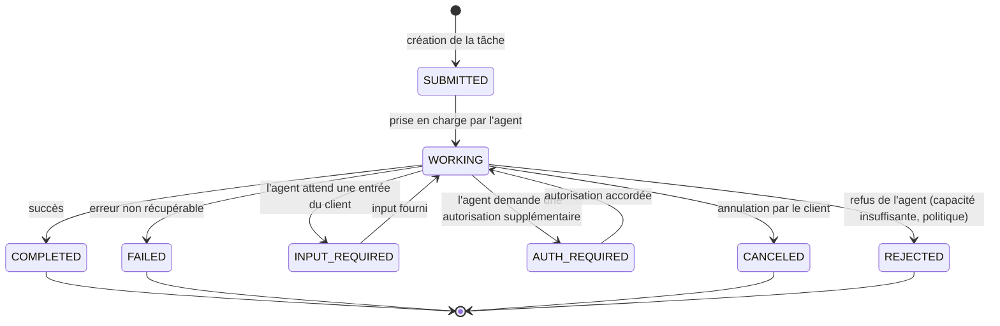
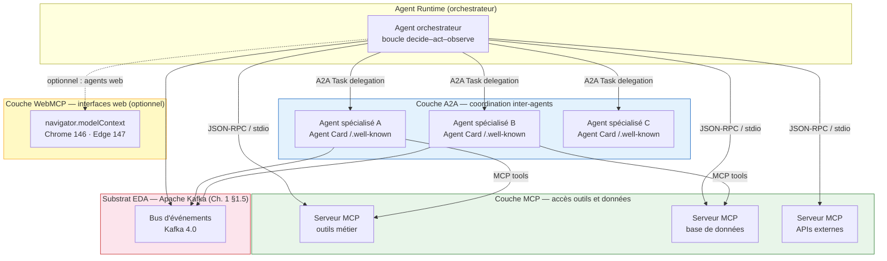

<!--
## Notes de recherche — Phase 2 (archivé intégralement)

1. Linux Foundation / AAIF — « Linux Foundation Announces the Formation of the Agentic AI Foundation (AAIF) » — 9 décembre 2025 — https://www.linuxfoundation.org/press/linux-foundation-announces-the-formation-of-the-agentic-ai-foundation — Annonce officielle de la création de l'AAIF comme *directed fund* sous la Linux Foundation. Membres Platinum fondateurs : AWS, Anthropic, Block, Bloomberg, Cloudflare, Google, Microsoft, OpenAI. Trois projets fondateurs : MCP (Anthropic), goose (Block), AGENTS.md (OpenAI). Gouvernance : *AAIF Governing Board* pour les investissements stratégiques et l'approbation de nouveaux projets ; les projets maintiennent leur autonomie technique. Apport : clarification que « donation à la Linux Foundation » est une simplification — c'est la création d'une nouvelle fondation AAIF sous l'égide de la Linux Foundation, avec MCP comme projet fondateur.

2. AAIF — « MCP Is Now Enterprise Infrastructure: Everything That Happened at MCP Dev Summit North America 2026 » — AAIF Blog — avril 2026 — https://aaif.io/blog/mcp-is-now-enterprise-infrastructure-everything-that-happened-at-mcp-dev-summit-north-america-2026/ — Résultats du MCP Dev Summit NYC (2-3 avril 2026) : 110+ millions de téléchargements SDK par mois, AAIF atteint 170 organisations en moins de quatre mois (dépasse le rythme d'adoption de la CNCF à étape équivalente). Cas Uber : 5 000+ ingénieurs, 10 000+ services internes, 1 500+ agents actifs mensuels, 60 000+ exécutions hebdomadaires via MCP. Modèle de confiance à deux niveaux (serveurs internes vs tiers). Politique de cycle de vie des projets AAIF : trois stades (Growth, Impact, Emeritus). Apport : validation de la maturité opérationnelle de MCP à grande échelle en production enterprise.

3. modelcontextprotocol.io — « SDKs — Model Context Protocol » — documentation officielle — mai 2026 — https://modelcontextprotocol.io/docs/sdk — SDKs officiels classifiés en trois tiers : Tier 1 (TypeScript, Python, C#, Go — fonctionnalité complète + engagement de maintenance), Tier 2 (Java, Rust), Tier 3 (Swift, Ruby, PHP), TBD (Kotlin). Primitives exposées par un serveur MCP : resources (données accessibles en lecture), tools (fonctions invocables), prompts (modèles réutilisables), sampling (demande au client d'effectuer une complétion LLM). Transport : stdio (local) et SSE / HTTP (réseau). Apport : inventaire exact des primitives et de la hiérarchie des SDKs officiels.

4. Google Cloud Blog — « Agent2Agent protocol (A2A) is getting an upgrade » — 31 juillet 2025 — https://cloud.google.com/blog/products/ai-machine-learning/agent2agent-protocol-is-getting-an-upgrade — Version v0.3 livrée le 31 juillet 2025 : support gRPC, signature des Agent Cards, SDK Python étendu. Donation de A2A à la Linux Foundation en juin 2025. 150+ organisations au total. Cas production : Tyson Foods + Gordon Food Service (synchronisation d'agents de vente et d'approvisionnement inter-entreprises). Apport : chronologie confirmée — A2A lancé avril 2025, donné à la LF juin 2025, v0.3 juillet 2025.

5. a2a-protocol.org — « Agent2Agent (A2A) Protocol Specification » — version 1.0.0 — https://a2a-protocol.org/latest/specification/ — Spec officielle v1.0.0 (la plus récente au 2026-05-05). Quatre primitives : Agent Card (JSON décrivant identité, capacités, endpoint), Task (unité de travail avec cycle de vie : SUBMITTED → WORKING → COMPLETED / FAILED / CANCELED / REJECTED / INPUT_REQUIRED / AUTH_REQUIRED), Message (unités de communication multi-parts), Artifact (sorties de tâche). Transports : JSON-RPC 2.0 / HTTP, gRPC, HTTP+JSON/REST. Sécurité : API key, HTTP auth, OAuth 2.0, OpenID Connect, mTLS. Apport : référence normative unique pour les primitives A2A. Note : la désignation « v1.0.0 » est le numéro courant de la spec affichée sur a2a-protocol.org ; la date de release officielle de cette version n'est pas explicitement indiquée dans le document de spec — *à vérifier*.

6. Patrick Brosset (Microsoft Edge) — « WebMCP updates, clarifications, and next steps » — 23 février 2026 — https://patrickbrosset.com/articles/2026-02-23-webmcp-updates-clarifications-and-next-steps/ — Auteur : équipe Microsoft Edge, co-auteur avec Google. Spec développée via le Web Machine Learning Working Group du W3C. API : navigator.modelContext — provideContext(), registerTool(), unregisterTool(), agent.requestUserInteraction(). Relation à MCP : WebMCP adresse uniquement la couche primitives (tools) ; le navigateur traduit vers le format MCP en gérant les couches data et transport. Statut en date : Google Chrome a lancé une préversion anticipée (Chrome 146) ; Microsoft Edge a annoncé une prochaine intégration sans date précise. Apport : source primaire de l'auteur, clarification que WebMCP n'est PAS un protocole séparé de MCP mais une couche navigateur qui implémente les primitives MCP.

7. DEV Community / AI Agent Economy — « WebMCP in 2026: Which Browsers Support navigator.modelContext? » — 2026 — https://dev.to/ai-agent-economy/webmcp-in-2026-which-browsers-support-navigatormodelcontext-complete-compatibility-status-1oe4 — Statut navigateurs mai 2026 : Chrome 146 (stable), Edge 147 (support ajouté mars 2026), Firefox (en développement, estimation 8-12 semaines — *à vérifier*), Safari/WebKit (participation W3C mais aucun engagement public). Spec W3C au stade « Candidate Recommendation » — non ratifiée formellement ; recommandation finale prévue Q3 2026. Apport : tableau de compatibilité navigateurs.

8. NIST / CAISI — « Announcing the AI Agent Standards Initiative for Interoperable and Secure Innovation » — 17 février 2026 — https://www.nist.gov/news-events/news/2026/02/announcing-ai-agent-standards-initiative-interoperable-and-secure — Lancement officiel le 17 février 2026. Trois piliers : (1) leadership sectoriel dans les organismes de normalisation internationaux (ISO/IEC JTC 1) ; (2) développement de protocoles open-source co-investi avec la NSF ; (3) recherche fondamentale en sécurité, identité et méthodologies d'évaluation de l'interopérabilité. Profil d'interopérabilité AI Agent prévu Q4 2026 (*probable* — confirmé dans sources secondaires, non explicité dans le texte primaire NIST). Apport : seule source primaire NIST disponible.

9. IBM Research — Agent Communication Protocol (ACP) — https://research.ibm.com/projects/agent-communication-protocol — ACP absorbé dans A2A sous gouvernance Linux Foundation. IBM maintient le BeeAI Framework et Platform comme implémentations primaires. Architecture : REST/HTTP, SSE pour streaming, multimodal. Apport : ACP n'est plus un protocole concurrent de A2A.

10. DigitalApplied — « AI Agent Protocol Ecosystem Map 2026 » — mars 2026 — https://www.digitalapplied.com/blog/ai-agent-protocol-ecosystem-map-2026-mcp-a2a-acp-ucp — Carte à quatre protocoles complémentaires : MCP (accès outils/données), A2A (coordination agents), ACP (transactions open agent-to-agent), UCP (Universal Commerce Protocol, Google). Architecture en couches. MCP : 97M téléchargements mensuels (mars 2026). Apport : cartographie complète multi-protocoles.

11. Palo Alto Networks Unit 42 — « New Prompt Injection Attack Vectors Through MCP Sampling » — 2025-2026 — https://unit42.paloaltonetworks.com/model-context-protocol-attack-vectors/ — Deux vecteurs d'attaque principaux via MCP : (1) tool poisoning — instructions malveillantes embedées dans les descriptions d'outils ; (2) injection via sampling — le serveur MCP contrôle à la fois le prompt et le traitement de la réponse LLM. Aucune protection par le protocole. Apport : documentation primaire des deux vecteurs d'attaque protocolaires les plus documentés.

12. OX Security — « The Mother of All AI Supply Chains: Critical, Systemic Vulnerability at the Core of Anthropic's MCP » — avril 2026 — https://www.ox.security/blog/the-mother-of-all-ai-supply-chains-critical-systemic-vulnerability-at-the-core-of-the-mcp/ — Vulnérabilité architecturale RCE (*remote code execution*) affectant 150M+ téléchargements : décision de design dans les SDKs officiels MCP. 9 registres MCP sur 11 testés compromis lors d'une injection d'essai. Anthropic a confirmé que le comportement est « by design » et a décliné de modifier le protocole. Apport : vulnérabilité la plus grave documentée à mai 2026 sur MCP, avec réponse officielle Anthropic.

13. PRNewswire / A2A Project — « A2A Protocol Surpasses 150 Organizations, Lands in Major Cloud Platforms, and Sees Enterprise Production Use in First Year » — 2026 — https://www.prnewswire.com/news-releases/a2a-protocol-surpasses-150-organizations-lands-in-major-cloud-platforms-and-sees-enterprise-production-use-in-first-year-302737641.html — 150+ organisations, intégration native Azure AI Foundry, Copilot Studio (Microsoft), Amazon Bedrock AgentCore Runtime (AWS). Production confirmée : Salesforce, SAP, ServiceNow. Divergence non résolue : la désignation « v1.0.0 » n'est pas reliée à une date de release officielle dans cette source non plus — *à vérifier*.
-->

> **Partie 3 — La pile *agentic***
> **Chapitre 5 · Protocoles et interopérabilité · ~6 500 mots · lecture ≈ 26 min**

La conclusion actionnable de ce chapitre peut être formulée dès le départ : tout système multi-agents d'entreprise déployé en 2026 doit reposer sur un empilement MCP (*Model Context Protocol*) + A2A (*Agent-to-Agent Protocol*) comme couches d'interopérabilité standard, avec WebMCP en extension optionnelle pour les agents qui interagissent avec des interfaces web. Ce choix détermine la portabilité à 3-5 ans, la surface d'attaque protocolaire exposée, et le coût de migration entre fournisseurs de modèles. La décision de s'en écarter — vers un *framework* propriétaire ou une abstraction intermédiaire — est légitime dans des cas précis, mais elle doit être motivée par des exigences mesurables, pas par une familiarité avec l'écosystème d'un hyperscaleur.

Le [Ch. 4 §4.7](ch04-roi-risk-readiness.md) a identifié le choix de protocoles comme composante de la décision Build/Buy dans le dossier d'investissement *agentic*. Ce chapitre fournit la justification architecturale de ce choix, structure la comparaison entre protocoles, et documente les surfaces d'attaque que ces protocoles introduisent — surfaces que le [Ch. 9](ch09-agentic-security.md) traitera en défense en profondeur.

---

## 5.1 — Le besoin de standardisation : pourquoi 2025-2026 marque le tournant

Avant novembre 2024, chaque éditeur d'agent définissait son propre format d'accès aux outils externes. L'intégration d'un service tiers dans un agent imposait un adaptateur custom pour chaque paire (agent, outil) : N agents × M outils = N×M adaptateurs, chacun à maintenir lors de chaque évolution d'API. Ce modèle n'est pas viable à l'échelle enterprise. C'est le problème N×M → N+M que MCP a résolu en novembre 2024 en définissant un contrat standard unique : le serveur MCP expose l'outil, le client MCP le consomme, l'agent n'a plus besoin de connaître l'implémentation interne.

Le besoin d'un second niveau de standardisation — la coordination *entre* agents — est apparu dès que les premiers systèmes multi-agents ont quitté les PoC (*proof of concept*) pour la production. Une API REST (*Representational State Transfer*) entre agents souffre de trois lacunes structurelles pour ce cas d'usage : l'absence de découverte de capacités (l'appelant doit connaître a priori ce que l'agent distant peut faire), l'absence de cycle de vie de tâche avec états intermédiaires (une tâche longue se traduit par un poll ou un *callback* ad hoc, sans sémantique commune pour les échecs ou les interruptions), et un modèle de sécurité conçu pour des humains authentifiés, non pour des agents *machine-to-machine*. A2A, lancé en avril 2025, comble ces lacunes.

La boucle *decide–act–observe* décrite au [Ch. 1 §1.1](ch01-from-automation-to-agents.md) impose des contrats d'interface plus riches qu'une API REST : l'agent doit pouvoir découvrir ce qu'un outil *fait* sémantiquement (pas seulement *comment* l'appeler syntaxiquement), recevoir des résultats partiels sur des tâches longues, et déléguer à d'autres agents sans connaître leur implémentation. La convergence entre décembre 2025 et mai 2026 — MCP rejoint l'AAIF (*Agentic AI Foundation*) sous la Linux Foundation, A2A atteint 150+ organisations en production, les trois hyperscaleurs (AWS, Azure, GCP) adoptent formellement les deux protocoles — transforme ce qui était un choix technique en une décision de gouvernance : l'empilement MCP + A2A est devenu l'infrastructure de fait de l'interopérabilité agentique d'entreprise.

---

## 5.2 — MCP : primitives, architecture et gouvernance

### Architecture client-hôte-serveur

MCP (*Model Context Protocol*) est un standard *JSON-RPC* (*JavaScript Object Notation Remote Procedure Call*) 2.0 qui définit comment un modèle de langage accède aux outils, données et contextes externes. L'architecture distingue trois rôles : le *host* (hôte — ex. Claude Desktop, VS Code, un pipeline d'orchestration) qui héberge le *client* MCP ; le *client* qui maintient une connexion 1:1 avec chaque serveur et transmet les requêtes du modèle ; le *serveur* qui expose les primitives. Les serveurs n'appellent jamais directement l'agent — ils répondent aux requêtes du client. Cette séparation est le choix de design qui garantit qu'un serveur MCP malveillant ne peut pas initier d'action arbitraire sur l'agent sans passer par le modèle de permission du client.

Le transport supporte deux modes : *stdio* pour l'exécution locale (le client et le serveur tournent sur la même machine, communication via stdin/stdout) et HTTP+SSE (*Server-Sent Events*) pour l'accès réseau. L'authentification pour HTTP utilise OAuth 2.1 + PKCE (*Proof Key for Code Exchange*) pour les scénarios navigateur, et *Client Credentials* pour les flux *machine-to-machine* — cette dernière modalité a été réintroduite dans la spec après une période de retrait temporaire (*confirmé* — documentation officielle modelcontextprotocol.io, mai 2026).

### Les quatre primitives

Un serveur MCP peut exposer jusqu'à quatre types de primitives :

**Resources** (ressources) : données accessibles en lecture — fichiers, résultats de requêtes, flux temps réel — identifiées par un URI et un type MIME. Accessibles via `resources/read` et `resources/list`. Primitive la plus pertinente pour les agents RAG (*Retrieval-Augmented Generation*) qui ont besoin de contexte documentaire, mais sous-exploitée dans la majorité des déploiements en production à mai 2026 (*probable* — observation issue de l'écosystème communautaire, non confirmée par étude formelle).

**Tools** (outils) : fonctions invocables avec un schéma JSON (*JavaScript Object Notation*) décrivant les paramètres d'entrée et le format de sortie. La primitive la plus adoptée : quasi 100 % des serveurs MCP publiés exposent des outils. C'est sur cette primitive que les deux vecteurs d'attaque principaux documentés par Palo Alto Networks Unit 42 opèrent (§5.8).

**Prompts** (invites) : modèles de prompt réutilisables paramétrés, exposés par le serveur. Primitive systématiquement sous-exploitée à mai 2026 — les équipes tendent à gérer les templates de prompt dans leur code d'orchestration plutôt que dans les serveurs MCP.

**Sampling** (échantillonnage) : le serveur demande au *client* d'effectuer une complétion LLM (grand modèle de langage) et retourne le résultat. Primitive la plus récente dans les implémentations de SDKs (*Software Development Kits*), et la plus sensible sur le plan sécurité — elle inverse le sens normal du contrôle en donnant au serveur la capacité d'influencer directement le comportement du modèle.

### SDKs officiels : hiérarchie Tier 1/2/3

La documentation officielle modelcontextprotocol.io (mai 2026) classe les SDKs en quatre catégories selon la complétude fonctionnelle et l'engagement de maintenance :

| Tier | Langages | Statut |
|---|---|---|
| **Tier 1** | TypeScript, Python, C#, Go | Fonctionnalité complète + engagement de maintenance long terme |
| **Tier 2** | Java, Rust | Support partiel ou maintenance communautaire |
| **Tier 3** | Swift, Ruby, PHP | Couverture fonctionnelle réduite |
| **TBD** | Kotlin | Statut non défini à mai 2026 |

Pour un déploiement enterprise, le choix d'un SDK Tier 1 est non négociable si l'on souhaite des garanties sur les évolutions de la spec. Un SDK Tier 2 ou 3 implique une dette de maintenance si la spec évolue rapidement — ce qui est le cas depuis la donation à l'AAIF.

### Gouvernance AAIF : distinction essentielle

La formule « MCP a été donné à la Linux Foundation » est une simplification courante mais inexacte. Ce qui s'est produit le 9 décembre 2025 est la création d'une nouvelle entité — l'**AAIF** (*Agentic AI Foundation*), *directed fund* sous l'égide de la Linux Foundation — dont MCP est l'un des trois projets fondateurs, avec goose (Block) et AGENTS.md (OpenAI). Les membres Platinum fondateurs sont : AWS, Anthropic, Block, Bloomberg, Cloudflare, Google, Microsoft, OpenAI.

La distinction de gouvernance est critique pour les architectes : l'AAIF Governing Board contrôle les investissements stratégiques et l'approbation de nouveaux projets, mais Anthropic conserve l'autonomie technique des mainteneurs — les décisions sur la spec MCP (priorités, calendrier, breaking changes) restent sous la direction de l'équipe Anthropic. Le processus SEP (*Specification Enhancement Proposal*) permet des contributions communautaires, mais la gouvernance technique n'est pas démocratisée au sens CNCF du terme. En moins de quatre mois post-création, l'AAIF a atteint 170 organisations membres (*confirmé* — AAIF Blog, avril 2026), dépassant le rythme d'adoption de la CNCF (*Cloud Native Computing Foundation*) à étape équivalente.

La politique de cycle de vie des projets AAIF définit trois stades : **Growth** (projet en développement actif, adopté par une communauté croissante), **Impact** (maturité enterprise, adoption large), **Emeritus** (maintenance uniquement). MCP est en stade Impact. Ce cadre de cycle de vie est la garantie institutionnelle que les projets AAIF ne peuvent pas être abandonnés unilatéralement par leur donateur d'origine.

---

## 5.3 — A2A : cycle de vie des tâches et orchestration pair-à-pair

### Chronologie et maturité

A2A (*Agent-to-Agent Protocol*) a été lancé par Google Cloud en avril 2025 avec 50+ partenaires fondateurs (Salesforce, Accenture, SAP, Deloitte). La donation à la Linux Foundation est intervenue en juin 2025. La version v0.3 a été publiée le 31 juillet 2025 avec trois ajouts majeurs : support *gRPC* (*Google Remote Procedure Call*), signature cryptographique des Agent Cards, et SDK Python étendu (*confirmé* — Google Cloud Blog, 31 juillet 2025). La spec affiche v1.0.0 comme version courante à mai 2026 sur a2a-protocol.org — la date de release officielle de cette version n'est pas explicitement indiquée dans les documents primaires consultés, *à vérifier*.

En un an, A2A a été adopté par 150+ organisations et intégré nativement dans Azure AI Foundry et Copilot Studio (Microsoft), Amazon Bedrock AgentCore Runtime (AWS), Salesforce, SAP, ServiceNow (*confirmé* — PRNewswire/A2A Project, 2026). Le cas production inter-entreprises Tyson Foods + Gordon Food Service (synchronisation d'agents de vente et d'approvisionnement entre deux organisations distinctes) est le premier cas publiquement documenté de délégation A2A franchissant les frontières organisationnelles (*confirmé* — Google Cloud Blog, juillet 2025).

### Les quatre primitives A2A

**Agent Card** : document JSON servi à l'adresse `/.well-known/agent.json` de chaque agent, décrivant son identité, ses capacités (*skills*), son endpoint, et les schémas d'authentification requis. C'est le mécanisme de découverte de capacités — la réponse structurelle au premier défaut des API REST. Un agent client interroge l'Agent Card d'un agent distant avant de lui déléguer une tâche, ce qui lui permet de vérifier que l'agent cible supporte le type de tâche requis sans appel de test.

**Task** (tâche) : unité de travail avec identifiant unique et cycle de vie formel. Le diagramme suivant représente les transitions d'états :



Les états terminaux sont COMPLETED, FAILED, CANCELED et REJECTED. La distinction entre FAILED (erreur interne) et REJECTED (refus délibéré de l'agent) est opérationnellement significative : un REJECTED déclenche une recherche d'agent alternatif, un FAILED déclenche un retry ou une escalade. Les états INPUT_REQUIRED et AUTH_REQUIRED introduisent des points d'intervention humaine dans le cycle de vie — ce qui connecte A2A directement au modèle HITL (*Human-in-the-Loop*) de [Ch. 8](ch08-trustworthy-systems.md).

**Message** : unité de communication multi-parts entre client et agent, supportant texte, fichiers et données structurées. Les messages permettent des échanges interactifs au sein du cycle de vie d'une tâche — par exemple, demander des clarifications avant de produire un résultat.

**Artifact** (artefact) : sorties de la tâche, composées de *Parts*. Un artefact peut être un document, un résultat structuré, une image ou tout autre type de livrable de l'agent cible.

### Transports et sécurité

A2A supporte trois *bindings* de transport : JSON-RPC 2.0 / HTTP (binding principal, recommandé pour la compatibilité maximale), *gRPC* (ajouté en v0.3, recommandé pour la performance dans les scénarios haute fréquence), et HTTP+JSON/*REST* pour la compatibilité avec les infrastructures qui ne supportent pas JSON-RPC. Le *streaming* de mises à jour de progression s'appuie sur les *Server-Sent Events* (SSE).

Sur la sécurité, la spec définit plusieurs mécanismes : OAuth 2.0, OpenID Connect, API key, HTTP auth, *mTLS* (*mutual Transport Layer Security*). La spec ne les impose pas — elle définit les modalités supportées mais laisse le choix à l'implémenteur. Cette flexibilité est une limite de gouvernance : un déploiement A2A qui n'impose pas OAuth 2.0 ou *mTLS* entre agents n'est pas protégé par le protocole lui-même.

---

## 5.4 — WebMCP : la couche navigateur (statut expérimental, mai 2026)

WebMCP n'est pas un protocole indépendant de MCP. C'est une couche d'exposition des primitives MCP (tools uniquement, dans la version actuelle) via l'API navigateur `navigator.modelContext`, développée conjointement par Microsoft Edge (Patrick Brosset, auteur principal) et Google Chrome, au sein du Web Machine Learning Working Group du W3C. La distinction est architecturalement critique : un serveur MCP existant ne devient pas automatiquement accessible via WebMCP — il faut une implémentation explicite de `navigator.modelContext` côté page web.

L'API côté développeur web comprend quatre méthodes : `navigator.modelContext.provideContext()` pour enregistrer un ensemble de contextes en masse, `registerTool()` / `unregisterTool()` pour la gestion individuelle des outils exposés, et `agent.requestUserInteraction()` pour déclencher une confirmation humaine avant qu'un agent exécute une action sur la page. Ce dernier appel est le mécanisme principal de maintien du contrôle humain dans la boucle pour les interactions web — il traduit architecturalement la principes de [Ch. 8](ch08-trustworthy-systems.md) dans la couche navigateur.

Le statut de support par navigateur à mai 2026 :

| Navigateur | Version | Statut |
|---|---|---|
| Chrome | 146 | Stable, implémentation complète |
| Edge | 147 | Support ajouté mars 2026 |
| Firefox | — | En développement (estimation 8-12 semaines pour stable — *à vérifier*) |
| Safari / WebKit | — | Participation au W3C, aucun engagement public de *timeline* |

La spec W3C est au stade *Candidate Recommendation* — stable pour implémentation mais non ratifiée formellement. La recommandation finale est prévue Q3 2026. L'absence d'engagement public d'Apple sur WebKit est documentée mais ne préjuge pas d'une adoption future.

**Recommandation avec compromis :** WebMCP est pertinent uniquement pour les agents qui interagissent structurellement avec des interfaces web (automatisation de SaaS sans API, *web scraping* structuré, actions sur formulaires). Pour les systèmes multi-agents d'entreprise *back-end*, WebMCP ne s'applique pas. Compromis : le périmètre limité aux *tools* (pas de *resources* ni *prompts* dans la version actuelle) réduit l'utilité pour des agents RAG ou des agents d'orchestration complexes. Alternative : un *framework* d'automatisation web (Playwright, Puppeteer) avec un serveur MCP *tools* wrappant les actions navigateur — approche plus mature à mai 2026 que WebMCP, mais qui ne bénéficie pas du modèle de permission navigateur natif. Condition de bascule : si les *resources* et *prompts* sont ajoutés à la spec WebMCP et que Safari implémente le standard, le rapport coût/bénéfice en faveur de WebMCP bascule significativement.

---

## 5.5 — La pile complète : MCP + A2A + WebMCP

L'architecture d'un système multi-agents d'entreprise complet s'organise en couches complémentaires et non concurrentes. Le diagramme suivant représente la pile de référence :



La règle de composition est simple : MCP gère l'accès aux outils et aux données pour chaque agent individuellement ; A2A gère la délégation de tâches entre agents ; WebMCP étend MCP vers les interfaces web. Un agent peut être à la fois *client* A2A (il délègue des tâches à d'autres agents) et *serveur* A2A (il accepte des délégations d'un orchestrateur), tout en utilisant MCP pour accéder à ses propres outils. Le substrat EDA (*event-driven architecture*) décrit au [Ch. 1 §1.5](ch01-from-automation-to-agents.md) — Apache Kafka 4.0 comme bus d'événements — constitue la couche de transport asynchrone *sous* les protocoles applicatifs, et ne duplique pas leur rôle.

---

## 5.6 — Tableau comparatif : MCP, A2A, ACP, UCP

Les quatre protocoles de l'écosystème agentique 2026 occupent des couches distinctes et ne sont pas concurrents. La question « MCP ou A2A ? » est mal posée — la bonne question est « quelle couche dois-je instrumenter pour ce besoin précis ? »

| Critère | MCP | A2A | ACP (historique) | UCP |
|---|---|---|---|---|
| **Couche** | Accès outils et données (agent → ressource) | Coordination inter-agents (agent → agent) | Communication inter-agents open (absorbé) | Commerce IA (transactions Google) |
| **Transport principal** | JSON-RPC 2.0 / stdio / HTTP+SSE | JSON-RPC 2.0 / HTTP, gRPC, REST | REST/HTTP + SSE | Non public |
| **Primitives clés** | Resources, Tools, Prompts, Sampling | Agent Card, Task, Message, Artifact | REST endpoints, SSE streaming | Offres, négociation prix, paiement |
| **Gouvernance** | AAIF (projet fondateur), Anthropic maintient l'autonomie technique | Linux Foundation (depuis juin 2025) | Absorbé dans A2A sous LF | Google (propriétaire) |
| **Maturité production** | Élevée : 110M+ téléchargements/mois, Uber 60 000+ exécutions/semaine | Moyenne–élevée : 150+ organisations, 3 hyperscaleurs | N/A — absorbed | Faible : spécialisé commerce Google |
| **Surface d'attaque connue** | Élevée : tool poisoning (Unit 42), RCE by design (OX Security) | Modérée : usurpation Agent Card sans signature | N/A | Non documentée publiquement |
| **Cas d'usage enterprise généraliste** | Universel — tout accès outil | Tout scénario multi-agents | N/A (use A2A) | Hors périmètre sauf e-commerce Google |

**ACP** (*Agent Communication Protocol*, IBM Research) : développé par IBM pour la communication inter-agents HTTP-natif REST, multi-frameworks, multimodal. Absorbé dans le projet A2A sous gouvernance Linux Foundation à mai 2026 (*confirmé* — IBM Research). IBM maintient le BeeAI Framework et Platform comme implémentations primaires s'appuyant sur la spec A2A. ACP n'est plus un protocole concurrent — le distinguer dans une comparaison est historiquement pertinent (il a existé comme initiative indépendante en 2024-2025) mais architecturalement dépassé.

**UCP** (*Universal Commerce Protocol*, Google) : protocole de transactions IA à vocation commerce, conçu pour les agents opérant dans l'écosystème Google (Shopping graph, marchands intégrés). Couvre la négociation de prix, les offres et la confirmation de paiement entre agents. Périmètre très spécifique — hors périmètre pour les architectures enterprise généralistes à l'exception des acteurs de l'e-commerce fortement intégrés dans l'écosystème Google.

---

## 5.7 — Gouvernance et maturité : AAIF, Linux Foundation, NIST

### Tableau de maturité différenciée

| Critère | MCP | A2A | WebMCP |
|---|---|---|---|
| **Volume téléchargements / mois** | 110M+ (AAIF Blog, avril 2026) | Non publié | N/A (API navigateur) |
| **Déploiement production enterprise** | Confirmé (Uber, banques, éditeurs SaaS) | Confirmé (Azure AI Foundry, Bedrock AgentCore, Salesforce, SAP) | Expérimental |
| **Surface d'attaque connue** | Documentée, non corrigée par le protocole | Partielle (Agent Card sans signature dans v < 0.3) | Non documentée (trop récent) |
| **Statut spec** | Stabilisée, processus SEP actif | v1.0.0 affichée, date officielle *à vérifier* | W3C *Candidate Recommendation*, non ratifiée |
| **Gouvernance** | AAIF / LF, Anthropic conserve autonomie technique | Linux Foundation | W3C (WG Machine Learning) |
| **Horizon de stabilité** | 3-5 ans (confirmé institutionnellement) | 2-4 ans (*probable*) | 1-2 ans (ratification W3C attendue Q3 2026) |

### AAIF : gouvernance du cycle de vie

Le modèle de gouvernance AAIF distingue l'AAIF Governing Board (stratégie, budget, approbation de nouveaux projets, membres fondateurs Platinum) du Technical Steering Committee (cycle de vie des projets selon les trois stades Growth / Impact / Emeritus). Cette séparation de gouvernance est empruntée à la CNCF et a pour effet qu'une organisation peut entrer dans le Governing Board sans obtenir de droit de veto sur les décisions techniques. Pour les architectes, cette nuance est importante : rejoindre l'AAIF comme membre garantit une voix dans les décisions stratégiques, pas un contrôle sur la direction de la spec.

Les événements structurants du calendrier AAIF 2026 : MCP Dev Summit NYC (2-3 avril 2026, 110M téléchargements annoncés) ; AGNTCon + MCPCon Europe (Amsterdam, 17-18 septembre 2026) ; AGNTCon + MCPCon North America (San Jose, 22-23 octobre 2026). Ces événements constituent les points de publication des évolutions majeures de la spec.

### NIST AI Agent Standards Initiative

L'initiative NIST (*National Institute of Standards and Technology*) AI Agent Standards a été annoncée officiellement le 17 février 2026 (*confirmé* — NIST/CAISI). Elle s'articule en trois piliers : (1) leadership américain dans les organismes internationaux de normalisation — ISO/IEC JTC 1 — pour prévenir la fragmentation géopolitique des standards (UE, Chine ont leurs propres initiatives) ; (2) développement de protocoles *open-source* co-investi avec la NSF (*National Science Foundation*) ; (3) recherche fondamentale en sécurité, identité et méthodologies d'évaluation de l'interopérabilité.

Les livrables à court terme confirmés dans le texte primaire NIST : RFI sécurité agent (échéance 9 mars 2026), concept paper Identity and Authorization (échéance 2 avril 2026), sessions d'écoute sectorielles. Un profil d'interopérabilité AI Agent est prévu Q4 2026 (*probable* — confirmé dans des sources secondaires, non explicité dans le texte primaire NIST). Ce profil sera la première spécification normative externe aux éditeurs sur laquelle les architectures enterprise seront évaluées. La **recommandation opérationnelle** est d'instrumenter les systèmes pour ce profil dès aujourd'hui — pas d'attendre sa publication pour concevoir l'architecture. Le *readiness assessment* de [Ch. 4 §4.5](ch04-roi-risk-readiness.md), Dimension 4 (Gouvernance), doit intégrer la conformité protocolaire comme critère de scoring d'ici Q4 2026.

---

## 5.8 — Surface d'attaque protocolaire : ce que MCP n'impose pas

Les vulnérabilités les plus graves de MCP à mai 2026 ne sont pas des bugs d'implémentation dans un SDK spécifique. Ce sont des conséquences de décisions de design dans la spec elle-même, confirmées comme telles par Anthropic. Ce chapitre présente les vecteurs ; le modèle de défense complet est au [Ch. 9](ch09-agentic-security.md).

### Tool poisoning

Le vecteur *tool poisoning* repose sur la capacité d'un serveur MCP malveillant (ou compromis) d'injecter des instructions dans la description textuelle d'un outil (*tool description*, champ texte libre dans le schéma MCP). Ces instructions sont invisibles à l'utilisateur qui voit l'interface graphique du *host*, mais visibles au modèle de langage qui traite la description complète. Un serveur météo peut ainsi embarquer dans sa description la commande d'exfiltrer les données d'un autre serveur MCP légitime simultanément connecté — avec rien de plus qu'un webhook gratuit comme destination (*confirmé* — Palo Alto Networks Unit 42, 2025-2026). La spec MCP ne définit aucun contrôle obligatoire sur le contenu des descriptions d'outils.

### Injection via sampling

La primitive *sampling* inverse la direction du contrôle : le serveur demande au *client* d'effectuer une complétion LLM et reçoit le résultat. Un serveur qui contrôle à la fois le prompt soumis au modèle via *sampling* et le traitement de la réponse peut injecter des instructions persistantes qui modifient le comportement de l'agent sur des requêtes ultérieures — un vecteur distinct des injections classiques de *prompt injection* (*confirmé* — Palo Alto Networks Unit 42). Ce vecteur est nul si la primitive *sampling* n'est pas implémentée, critique s'il l'est.

### Vulnérabilité architecturale RCE dans les SDKs

En avril 2026, OX Security a publié la documentation d'une vulnérabilité *RCE* (*Remote Code Execution*) affectant les SDKs officiels MCP — TypeScript, Python, Java, Rust. Ce n'est pas un bug de code corrigeable par un patch : c'est une décision de design dans la gestion des appels inter-SDKs. Les tests OX ont compromis 9 registres MCP sur 11 testés lors d'une injection d'essai. Anthropic a confirmé que le comportement est « *by design* » et a décliné de modifier le protocole (*confirmé* — OX Security, avril 2026). La mitigation DNS rebinding annoncée au MCP Dev Summit d'avril 2026 (Jonathan Leitschuh) est une correction au niveau SDK, pas une correction protocolaire — elle réduit la surface d'attaque dans les SDKs Tier 1 mais ne résout pas le problème architectural.

### Supply chain des registres MCP

Le modèle de distribution des serveurs MCP via des registres tiers (Smithery, mcp.so, et neuf autres) introduit un vecteur de supply chain documenté. Deux incidents confirmés : Postmark (septembre 2025, injection dans le serveur MCP Postmark permettant de mettre en copie tous les e-mails envoyés via l'agent) et Smithery supply chain attack (octobre 2025, 3 000+ applications et tokens API exposés via un serveur MCP compromis dans le registre Smithery).

### Surface d'attaque A2A

A2A présente une surface d'attaque différente et plus limitée. La principale menace est l'usurpation d'Agent Card : un agent malveillant peut se déclarer capable d'exécuter des tâches qu'il ne peut pas exécuter, ou usurper l'identité d'un agent légitime, si les Agent Cards ne sont pas signées cryptographiquement. La version v0.3+ d'A2A introduit la signature des Agent Cards — mais la spec ne l'impose pas. La recommandation est de configurer la validation de signature comme exigence de politique interne dès le déploiement.

**Implication pour l'architecte :** les décisions de sécurité protocolaire pour MCP et A2A ne peuvent pas être déléguées au protocole lui-même. Elles doivent être prises au niveau de l'architecture : isolation des serveurs MCP tiers dans un périmètre de confiance séparé des serveurs internes, vérification des Agent Cards avec signature obligatoire, politique d'autorisation *per-task* pour les appels inter-agents. Le modèle de confiance à deux niveaux (serveurs internes vs tiers) adopté par Uber pour ses 10 000+ services internes via MCP est le patron de référence documenté à mai 2026 (*confirmé* — AAIF Blog, avril 2026).

---

## 5.9 — Recommandation architecturale : construire sur l'empilement ouvert

### Extrait de code : appel MCP tool en TypeScript

L'extrait suivant illustre un appel MCP *tool* minimal depuis un client TypeScript 5.6, SDK MCP Tier 1 épinglé à `@modelcontextprotocol/sdk@1.x` :

```typescript
// TypeScript 5.6 · @modelcontextprotocol/sdk@1.x (Tier 1)
import { Client } from "@modelcontextprotocol/sdk/client/index.js";
import { StdioClientTransport } from "@modelcontextprotocol/sdk/client/stdio.js";

const transport = new StdioClientTransport({
  command: "npx",
  args: ["-y", "@internal/crm-mcp-server"],
});

const client = new Client({ name: "orchestrator", version: "1.0.0" });
await client.connect(transport);

// Découverte des outils disponibles
const { tools } = await client.listTools();

// Invocation d'un outil
const result = await client.callTool({
  name: "get_customer_profile",
  arguments: { customer_id: "C-84921" },
});

console.log(result.content);
await client.close();
```

L'empilement en 23 lignes : transport stdio pour un serveur local, découverte des outils disponibles avant invocation, appel structuré avec arguments typés. La primitive *sampling* n'est pas exposée dans cet extrait — décision délibérée pour minimiser la surface d'attaque (§5.8). La version SDK est épinglée explicitement : toute mise à jour vers un SDK Tier 2 ou 3 doit faire l'objet d'une révision de sécurité explicite.

### Recommandation principale avec compromis, alternative et condition de bascule

**Recommandation :** adopter MCP + A2A comme couches d'interopérabilité standard de tout système multi-agents d'entreprise déployé en 2026. MCP pour l'accès aux outils et données de chaque agent, A2A pour la délégation de tâches entre agents. Ne pas choisir : la question « MCP ou A2A » est structurellement mal posée — ils répondent à des besoins orthogonaux.

**Compromis :** standardisation ne garantit pas sécurité. MCP présente une surface d'attaque documentée et non entièrement résolue au niveau du protocole (tool poisoning, RCE by design). A2A impose une complexité opérationnelle (gestion des Agent Cards, cycle de vie des tâches, authentification inter-agents) absente des RPC simples. Le coût de démarrage est plus élevé que pour une solution propriétaire.

**Alternative crédible :** déploiement sur un *framework* propriétaire d'orchestration — AWS Bedrock Agents, Azure AI Foundry agents natifs, Google Vertex AI Agent Builder. Ces plateformes sont plus simples à déployer, disposent d'intégrations IAM (*Identity and Access Management*) natives, et exposent moins de configuration de sécurité protocolaire à l'architecte. L'alternative hybride MCP-natif vs *gateway abstraction layer* (LiteLLM, OpenRouter) permet d'accéder aux outils MCP sans exposer directement les primitives au modèle — couche de médiation qui absorbe une partie de la surface d'attaque au prix d'un *hop* supplémentaire.

**Condition de bascule vers le propriétaire :** (1) le SLA de latence inter-agents est < 50 ms et les SDKs MCP Tier 1 ne peuvent pas l'atteindre dans le contexte d'exécution cible ; (2) les exigences de conformité imposent un contrôle total de la couche transport non compatible avec la spec MCP actuelle (ex. résidence des données en territoire strictement contrôlé avec chiffrement de bout en bout non délégable à un serveur tiers) ; (3) l'équipe ne dispose pas des compétences de sécurité pour gérer correctement la surface d'attaque MCP — dans ce cas, l'alternative propriétaire est moins risquée que l'empilement ouvert mal sécurisé.

**Condition de bascule vers la *gateway* abstraction :** si l'organisation opère des agents multi-fournisseurs (Anthropic + OpenAI + Mistral dans le même système) et souhaite router dynamiquement par coût, capacité ou conformité géographique, une couche LiteLLM/OpenRouter *devant* les serveurs MCP est le bon choix — elle permet de changer de fournisseur de modèle sans modifier les serveurs MCP ni la logique d'agent, ce qui est la promesse centrale de portabilité de [Ch. 10](ch10-scaling-without-lockin.md).

### Transition vers Ch. 6

Les protocoles MCP et A2A définissent les contrats d'interface. Ils ne prescrivent pas comment orchestrer plusieurs agents en séquence, en parallèle, ou en graphe ; comment structurer la mémoire persistante entre les appels ; comment concevoir les outils pour l'idempotence et les contrats d'effet de bord. Ce sont les questions que [Ch. 6](ch06-orchestration-memory-tools.md) traite comme discipline distincte : les protocoles sont l'infrastructure, les patrons d'orchestration sont l'architecture.

Pour les équipes de sécurité, le modèle de menace complet des protocoles — avec les patterns de défense en profondeur pour tool poisoning, sampling injection, et supply chain — est au [Ch. 9](ch09-agentic-security.md). L'[Annexe A](annexe-A-architecture-review.md) propose la checklist de révision d'architecture protocolaire pour les déploiements en zone orange et rouge de la matrice de [Ch. 3](ch03-mapping-high-impact.md).

---

## Pour aller plus loin

**Linux Foundation / AAIF — « Linux Foundation Announces the Formation of the Agentic AI Foundation » (9 décembre 2025).** La source primaire de référence sur la structure de gouvernance AAIF, la liste des membres Platinum fondateurs et les trois projets fondateurs. Lecture obligatoire avant tout dialogue avec un juriste ou un responsable de conformité sur les implications de la donation MCP. <https://www.linuxfoundation.org/press/linux-foundation-announces-the-formation-of-the-agentic-ai-foundation>

**a2a-protocol.org — « Agent2Agent (A2A) Protocol Specification v1.0.0 ».** La référence normative pour implémenter A2A : définition complète des primitives, cycle de vie des tâches, transports et schémas d'authentification. À lire avant de choisir un SDK ou de définir les politiques de signature des Agent Cards. <https://a2a-protocol.org/latest/specification/>

**OX Security — « The Mother of All AI Supply Chains » (avril 2026).** La documentation technique la plus rigoureuse disponible sur la vulnérabilité architecturale RCE des SDKs MCP et la réponse d'Anthropic. Lecture obligatoire pour les équipes de sécurité avant tout déploiement de serveurs MCP exposés à des sources tierces. <https://www.ox.security/blog/the-mother-of-all-ai-supply-chains-critical-systemic-vulnerability-at-the-core-of-the-mcp/>

**NIST / CAISI — « Announcing the AI Agent Standards Initiative » (17 février 2026).** La source primaire pour les trois piliers de l'initiative et les livrables à court terme. À surveiller pour Q4 2026 et le profil d'interopérabilité AI Agent. <https://www.nist.gov/news-events/news/2026/02/announcing-ai-agent-standards-initiative-interoperable-and-secure>

**Patrick Brosset (Microsoft Edge) — « WebMCP updates, clarifications, and next steps » (23 février 2026).** La seule source primaire de l'auteur de la spec WebMCP expliquant la relation architecturale entre WebMCP et MCP, le périmètre *tools-only* actuel, et le statut du processus W3C. <https://patrickbrosset.com/articles/2026-02-23-webmcp-updates-clarifications-and-next-steps/>

---

## Références

AAIF — « MCP Is Now Enterprise Infrastructure: Everything That Happened at MCP Dev Summit North America 2026 » — Agentic AI Foundation Blog — avril 2026 — <https://aaif.io/blog/mcp-is-now-enterprise-infrastructure-everything-that-happened-at-mcp-dev-summit-north-america-2026/> — accédée le 2026-05-05

Brosset, P. (Microsoft Edge) — « WebMCP updates, clarifications, and next steps » — patrickbrosset.com — 23 février 2026 — <https://patrickbrosset.com/articles/2026-02-23-webmcp-updates-clarifications-and-next-steps/> — accédée le 2026-05-05

DEV Community / AI Agent Economy — « WebMCP in 2026: Which Browsers Support navigator.modelContext? » — DEV Community — 2026 — <https://dev.to/ai-agent-economy/webmcp-in-2026-which-browsers-support-navigatormodelcontext-complete-compatibility-status-1oe4> — accédée le 2026-05-05

DigitalApplied — « AI Agent Protocol Ecosystem Map 2026 » — DigitalApplied Blog — mars 2026 — <https://www.digitalapplied.com/blog/ai-agent-protocol-ecosystem-map-2026-mcp-a2a-acp-ucp> — accédée le 2026-05-05

Google Cloud — « Agent2Agent protocol (A2A) is getting an upgrade » — Google Cloud Blog — 31 juillet 2025 — <https://cloud.google.com/blog/products/ai-machine-learning/agent2agent-protocol-is-getting-an-upgrade> — accédée le 2026-05-05

IBM Research — « Agent Communication Protocol (ACP) » — IBM Research — 2025-2026 — <https://research.ibm.com/projects/agent-communication-protocol> — accédée le 2026-05-05

Linux Foundation — « Linux Foundation Announces the Formation of the Agentic AI Foundation (AAIF) » — Linux Foundation Press — 9 décembre 2025 — <https://www.linuxfoundation.org/press/linux-foundation-announces-the-formation-of-the-agentic-ai-foundation> — accédée le 2026-05-05

modelcontextprotocol.io — « SDKs — Model Context Protocol » — documentation officielle — mai 2026 — <https://modelcontextprotocol.io/docs/sdk> — accédée le 2026-05-05

NIST / CAISI — « Announcing the AI Agent Standards Initiative for Interoperable and Secure Innovation » — NIST — 17 février 2026 — <https://www.nist.gov/news-events/news/2026/02/announcing-ai-agent-standards-initiative-interoperable-and-secure> — accédée le 2026-05-05

OX Security — « The Mother of All AI Supply Chains: Critical, Systemic Vulnerability at the Core of Anthropic's MCP » — OX Security Blog — avril 2026 — <https://www.ox.security/blog/the-mother-of-all-ai-supply-chains-critical-systemic-vulnerability-at-the-core-of-the-mcp/> — accédée le 2026-05-05

Palo Alto Networks Unit 42 — « New Prompt Injection Attack Vectors Through MCP Sampling » — Unit 42 Blog — 2025-2026 — <https://unit42.paloaltonetworks.com/model-context-protocol-attack-vectors/> — accédée le 2026-05-05

PRNewswire / A2A Project — « A2A Protocol Surpasses 150 Organizations, Lands in Major Cloud Platforms, and Sees Enterprise Production Use in First Year » — PRNewswire — 2026 — <https://www.prnewswire.com/news-releases/a2a-protocol-surpasses-150-organizations-lands-in-major-cloud-platforms-and-sees-enterprise-production-use-in-first-year-302737641.html> — accédée le 2026-05-05

A2A Protocol — « Agent2Agent (A2A) Protocol Specification v1.0.0 » — a2a-protocol.org — mai 2026 — <https://a2a-protocol.org/latest/specification/> — accédée le 2026-05-05
