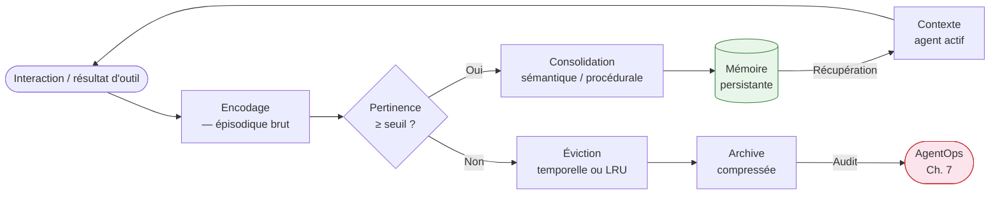

<!--
## Notes de recherche — Phase 2 (archivé intégralement)

1. LangChain / LangGraph — « Multi-Agent Orchestration in LangGraph: Supervisor vs Swarm » — DEV Community / focused.io — 2025-2026 — https://dev.to/focused_dot_io/multi-agent-orchestration-in-langgraph-supervisor-vs-swarm-tradeoffs-and-architecture-1b7e — Définition opérationnelle des deux patrons natifs de LangGraph : *supervisor* (routage centralisé, LLM dédié à la décision de délégation) et *swarm* (transfert de contrôle décentralisé, chaque agent décide de passer la main). Cinq patrons complets décrits : Orchestrator-Worker, Swarm, Mesh, Hierarchical, Pipeline. Recommandation de démarrage : supervisor pour clarté du débogage ; swarm pour les tâches exploratoires où la prochaine étape dépend du résultat intermédiaire. Apport : terminologie canonique LangGraph, critères de sélection par patron, distinction latence vs précision de routage.

2. Microsoft Foundry Blog — « Introducing Microsoft Agent Framework: The Open-Source Engine for Agentic AI Apps » — Microsoft — avril 2026 — https://devblogs.microsoft.com/foundry/introducing-microsoft-agent-framework-the-open-source-engine-for-agentic-ai-apps/ — Annonce de Microsoft Agent Framework (MAF) 1.0, successeur de convergence entre AutoGen et Semantic Kernel (annonce octobre 2025, GA avril 2026). APIs stables, LTS confirmé. Cinq patrons d'orchestration : Sequential, Concurrent, Group Chat, Handoff, Magentic (manager avec task ledger dynamique). Graph-based Workflow typé routant données sur des arêtes ; exécuteurs activés quand les inputs sont prêts. AutoGen en maintenance seule depuis la transition vers MAF. Apport : version courante MAF 1.0 (avril 2026), terminologie Magentic Pattern (distinct de swarm), interopérabilité native A2A + MCP.

3. OpenAI — « New tools for building agents » + Agents SDK — OpenAI — mars 2025 — https://openai.com/index/new-tools-for-building-agents/ — Transition Swarm (octobre 2024, éducatif/expérimental) → Agents SDK (mars 2025, production). Primitives maintenues : *Handoffs* (transfert de contrôle entre agents = retour d'un Agent depuis un outil), *Guardrails* (validation entrées/sorties), *Tracing* (observabilité). En 2026, Swarm = référence de design pédagogique ; Agents SDK = chemin supporté. Assistants API en *sunset* le 26 août 2026 (*confirmé* — OpenAI). Apport : chronologie confirmée Swarm → Agents SDK, statut Assistants API.

4. CrewAI — Documentation v1.12 + gurusup.com « Best Multi-Agent Frameworks in 2026 » — 2026 — https://gurusup.com/blog/best-multi-agent-frameworks-2026 — CrewAI v1.12 : processus hiérarchique natif (manager automatique, délégation + validation des résultats), processus séquentiel, *Flows* (contrôle conditionnel Python). Ajouts v1.12 : *agent skills*, support providers OpenAI-compatible (OpenRouter, DeepSeek, Ollama, vLLM, Cerebras, Dashscope), backend mémoire Qdrant Edge, isolation mémoire hiérarchique. Google ADK (avril 2025) : arbre hiérarchique d'agents avec support natif A2A ; intégration Vertex AI / Gemini / GCP. Pydantic AI : framework léger centré validation typée et outputs structurés, pas un framework d'orchestration complet. Apport : versions courantes mai 2026, matrice comparative frameworks.

5. Hu, Y. et al. (47 auteurs) — « Memory in the Age of AI Agents: A Survey » — arXiv:2512.13564 — décembre 2025 — https://arxiv.org/abs/2512.13564 — Taxonomie unifiée de la mémoire agentique : trois formes dominantes (token-level, paramétrique, latente) ; taxonomie fonctionnelle affinée distinguant *factual*, *experiential*, *working memory*. Critique des taxonomies long-terme / court-terme comme insuffisantes pour capturer la diversité des systèmes contemporains. Couverture : formation, évolution, récupération de la mémoire ; benchmarks consolidés ; fronts de recherche (automatisation de la mémoire, intégration RL, mémoire multi-agents, trustworthiness). Apport : référence académique de taxonomie la plus récente et exhaustive à mai 2026 ; 47 auteurs = couverture communautaire large.

6. Mem0 — « State of AI Agent Memory 2026 » — mem0.ai — 2026 — https://mem0.ai/blog/state-of-ai-agent-memory-2026 — État du marché mémoire agentique : marché à 6,27 G$ en 2026, projection 28,45 G$ en 2030 (TCAC 35 %). 50 000+ développeurs actifs sur Mem0. Comparatif Mem0 (compression 80 % tokens, extraction de faits en graphe) vs Zep (graphe de connaissances temporel, raisonnement sur l'évolution des faits) vs LangMem (réécriture du system prompt par l'agent — mémoire procédurale directe) vs Letta (blocs mémoire éditables, runtime stateful, pagination inspirée OS). Apport : chiffres de marché, différenciation produit 2026, validation des quatre outils prioritaires.

7. Mem0 — « Graph-Based Memory Solutions for AI Context: Top 5 Compared » — mem0.ai — janvier 2026 — https://mem0.ai/blog/graph-memory-solutions-ai-agents — Comparatif des solutions graphe pour la mémoire agentique. Zep : graphe temporel de connaissances, tracking des faits qui changent dans le temps, combinaison graphe + recherche vectorielle. Mem0 graphe : mémorisation relationnelle multi-sessions. Apport : différenciation technique entre Zep et Mem0 sur la dimension temporelle, cas d'usage production.

8. Anthropic Engineering — « Writing effective tools for AI agents » — Anthropic — 2025 — https://www.anthropic.com/engineering/writing-tools-for-agents — Pratiques de design d'outils pour agents : (1) les descriptions d'outils en texte libre guident le comportement de l'agent plus efficacement que le schéma JSON seul — ingénierie de prompt dans les descriptions ; (2) analyse des métriques d'appels d'outils (appels redondants, erreurs de paramètres) comme signal d'amélioration ; (3) réponses d'erreur structurées avec corrections actionnables, pas des codes opaques ; (4) découverte à la demande (*on-demand tool loading*) : charger seulement les outils pertinents pour la tâche courante ; (5) exemples d'utilisation des outils à inclure dans les définitions. Apport : source primaire Anthropic sur le design d'outils, complémentaire à « Building Effective Agents ».

9. Anthropic Engineering — « Effective context engineering for AI agents » — Anthropic — 2025 — https://www.anthropic.com/engineering/effective-context-engineering-for-ai-agents — Ingénierie du contexte pour les agents longue durée : gestion de la fenêtre de contexte comme ressource limitée ; stratégies de compression et de sélection ; relation entre contexte et qualité des décisions de l'agent. Apport : doctrine Anthropic sur la gestion du contexte, complément direct à la section mémoire.

10. NeurIPS 2025 — « Multi-Agent Collaboration via Evolving Orchestration » — arXiv:2505.19591 — 2025 — https://arxiv.org/html/2505.19591v1 — Paradigme *puppeteer* : orchestrateur centralisé entraîné par renforcement (RL) qui dirige dynamiquement les agents en réponse à l'évolution de l'état de la tâche. Performance supérieure avec coûts computationnels réduits vs orchestration statique. Apport : validation académique NeurIPS 2025 que l'orchestration dynamique RL-based surpasse les patrons statiques ; terminologie *puppeteer paradigm* distincte du supervisor classique.

11. IBM / Solving Context Window Overflow — recherche IBM 2025 — référencé dans sparkco.ai / mem0.ai — 2025 — Quantification de l'overflow : dans un flux Materials Science, les sorties d'outils atteignent 2M+ éléments ; approche directe = 20 822 181 tokens (échec) ; *Memory Pointer Pattern* = 1 234 tokens (succès). Réduction 16 800×. Apport : seule quantification publiée de l'ampleur du débordement de fenêtre de contexte en production ; valide la *memory debt* comme risque opérationnel mesurable.

12. OpenAPI Initiative — Spécification OpenAPI 3.2.0 — septembre 2025 — https://spec.openapis.org/oas/v3.2.0.html — OAS 3.2 (septembre 2025) : support natif SSE et JSON Lines pour le streaming, navigation par tags structurés pour les grands catalogues d'API, compatibilité JSON Schema complète (héritée de 3.1). Positionnement MCP : MCP représente un glissement vers des contrats AI-natifs standardisant comment les agents découvrent et invoquent les APIs. Apport : version courante OAS confirmée, lien MCP ↔ OpenAPI explicité.
-->

> **Partie 3 — La pile *agentic***
> **Chapitre 6 · Orchestration, mémoire et outils · ~6 200 mots · lecture ≈ 24 min**

La conclusion de ce chapitre tient en une contrainte de conception : orchestration, mémoire et outils doivent être conçus ensemble, pas séquentiellement. Le choix d'un patron d'orchestration contraint le modèle de mémoire requis — un *swarm* décentralisé a besoin d'une mémoire partagée cohérente que n'exige pas un *supervisor* centralisé. Le modèle de mémoire contraint à son tour le design des outils — un outil qui modifie un état partagé entre agents doit garantir l'idempotence ou documenter explicitement ses effets de bord, faute de quoi la tolérance aux pannes de l'orchestrateur devient un vecteur de corruption des données. La majorité des défaillances *agentic* en production ne proviennent pas d'une mauvaise sélection de modèle : elles proviennent de la méconnaissance de ces dépendances mutuelles.

Le [Ch. 5](ch05-protocols-interoperability.md) a établi que MCP (*Model Context Protocol*) et A2A (*Agent-to-Agent Protocol*) définissent les contrats d'interface de la pile *agentic*. Ces protocoles ne prescrivent pas comment orchestrer plusieurs agents en séquence, en parallèle ou en graphe, ni comment structurer la mémoire persistante entre les appels, ni comment concevoir les outils pour qu'ils puissent être réessayés sans risque. Ces trois questions sont l'objet de ce chapitre.

---

## 6.1 — De la boucle à l'orchestration : ce que les protocoles ne prescrivent pas

La boucle *decide–act–observe* décrite au [Ch. 1 §1.1](ch01-from-automation-to-agents.md) est l'atome de comportement agentique. L'orchestration est la molécule : elle définit comment plusieurs atomes interagissent, dans quel ordre, avec quelle logique de branchement et de reprise. MCP définit comment chaque atome accède à ses outils. A2A définit comment un agent en délègue à un autre. Ni l'un ni l'autre ne prescrit la topologie de composition — séquentielle, parallèle, conditionnelle, cyclique, hiérarchique — ni la logique de reprise sur erreur : après quel délai, avec quel contexte restauré, avec quelle limite de tentatives.

Cette lacune n'est pas un défaut protocolaire : c'est un choix de séparation des préoccupations. MCP et A2A sont des standards d'interface, pas des *frameworks* d'orchestration. Le bon niveau pour décider de la topologie reste l'architecte, qui doit choisir parmi une taxonomie de patrons selon les contraintes de son système — contraintes de latence, de criticité des effets de bord, de nombre d'agents, de dynamicité de la tâche. Cette décision précède et contraint le choix du *framework* d'implémentation.

Une précision terminologique s'impose. Les éditeurs de *frameworks* et la littérature académique utilisent des taxonomies différentes pour les mêmes patrons : MAF 1.0 (*Microsoft Agent Framework*) distingue cinq patrons natifs (*Sequential*, *Concurrent*, *Group Chat*, *Handoff*, *Magentic*), où *Magentic* étend le supervisor classique d'un *task ledger* dynamique ; ce qu'OpenAI Swarm appelait *handoff* est identique au mécanisme de transfert de contrôle d'un *swarm* LangGraph. Ce chapitre adopte une taxonomie composite à cinq patrons qui transcende ces dénominations de *frameworks* et permet de choisir un patron avant de choisir un *framework*.

---

## 6.2 — Taxonomie des cinq patrons d'orchestration

### Les cinq patrons

**Supervisor** : un agent orchestrateur central reçoit la tâche et délègue à des agents *workers* spécialisés via des appels explicites. L'orchestrateur décide à chaque étape quel *worker* invoquer, avec quel sous-objectif, et intègre les résultats. Le routage est entièrement centralisé dans le LLM de supervision. Les avantages sont la lisibilité du flux de décision et la simplicité du débogage — toute décision de délégation passe par un point unique d'observation. Le goulot d'étranglement est symétrique à cet avantage : sur des tâches longues à haute fréquence, l'orchestrateur devient le facteur limitant de la latence. LangGraph expose ce patron via la bibliothèque `langgraph-supervisor-py` ; MAF 1.0 fournit une variante enrichie sous le nom *Magentic Pattern*, qui ajoute un *task ledger* dynamique au supervisor classique (*confirmé* — Microsoft Foundry Blog, avril 2026).

**Swarm** : chaque agent décide lui-même de passer le contrôle à un autre agent (*handoff*) en fonction de son propre état d'exécution — l'observation d'une condition, la détection d'une capacité manquante, l'atteinte d'un résultat partiel. Il n'y a pas d'orchestrateur permanent : le contrôle circule entre agents selon les transferts. Ce patron est adapté aux tâches exploratoires dont la prochaine étape ne peut pas être connue avant que l'étape courante ait produit un résultat. Son risque principal est la formation de cycles si les conditions de transfert ne sont pas bornées. OpenAI Swarm (octobre 2024, éducatif) puis Agents SDK (mars 2025, production) ont popularisé ce patron avec les primitives *Handoffs* ; LangGraph 0.3.x le propose nativement (*à vérifier* — version exacte sur PyPI langgraph-checkpoint à mai 2026).

**Hierarchical** : un arbre de superviseurs, chaque superviseur gérant une équipe de *workers*. Les *workers* d'un niveau peuvent eux-mêmes être des superviseurs du niveau inférieur. Ce patron est la seule option viable au-delà de 20-30 agents dans des domaines multiples — l'alternative du *supervisor* unique devient une limitation de fenêtre de contexte dès que le nombre d'agents et d'outils dépasse la capacité de représentation en mémoire de travail du LLM orchestrateur. Google ADK (*Agent Development Kit*, avril 2025) expose un arbre hiérarchique natif avec support A2A ; CrewAI v1.12 propose un processus hiérarchique avec manager automatique, délégation et validation des résultats (*confirmé* — gurusup.com, 2026).

**Graph-based** : les agents et fonctions sont des nœuds dans un graphe orienté ; les arêtes représentent des flux de données avec conditions de déclenchement. Un exécuteur n'est activé que lorsque ses *inputs* sont prêts — ce qui permet l'exécution parallèle de branches indépendantes naturellement. Le *pipeline* est un graphe dégénéré sans cycle ni branchement conditionnel. MAF 1.0 propose un *Workflow* typé à arêtes explicites (*confirmé* — Microsoft Foundry Blog, avril 2026) ; LangGraph est fondé sur le concept de *StateGraph* avec *reducers* pour la résolution de conflits d'état.

**Mesh** : chaque agent peut communiquer directement avec chaque autre agent sans passer par un orchestrateur centralisé ni un transfert de contrôle formel. La coordination émerge des interactions locales. Ce patron correspond au paradigme *puppeteer* décrit dans le papier NeurIPS 2025 « Multi-Agent Collaboration via Evolving Orchestration » (arXiv:2505.19591) : un orchestrateur entraîné par renforcement (*RL*) dirige dynamiquement les agents en réponse à l'état courant de la tâche, surpassant l'orchestration statique avec des coûts computationnels réduits (*confirmé* — NeurIPS 2025). En pratique, le patron *mesh* sans mécanisme de coordination explicite produit des systèmes difficiles à déboguer et à auditer — il est pertinent dans les contextes de recherche ou pour des systèmes à agents très homogènes avec des interfaces strictement définies.

### Tableau comparatif

| Patron | Latence de routage | Précision du routage | Débogage | Tolérance aux pannes | Cas d'usage enterprise typique | Framework représentatif |
|---|---|---|---|---|---|---|
| **Supervisor** | Haute (chaque délégation = appel LLM) | Élevée (LLM décide) | Excellent | Moyen (SPOF orchestrateur) | Workflows définis, < 10 agents | LangGraph supervisor, MAF *Magentic Pattern* |
| **Swarm** | Faible (transfert direct) | Variable (selon agent source) | Difficile (flux non déterministe) | Bon (pas de SPOF central) | Tâches exploratoires, agents homogènes | OpenAI Agents SDK, LangGraph swarm |
| **Hierarchical** | Modérée | Élevée | Bon (par niveau) | Bon (isolation par équipe) | Systèmes > 20 agents, multi-domaines | Google ADK, CrewAI v1.12, MAF |
| **Graph-based** | Faible (parallélisme natif) | Élevée (arêtes typées) | Très bon (graphe visible) | Excellent (isolation de branche) | ETL agentique, pipelines de traitement | LangGraph StateGraph, MAF Workflow |
| **Mesh / puppeteer** | Très faible | Variable | Très difficile | Variable | R&D, agents homogènes à haute fréquence | arXiv:2505.19591 (recherche) |

### Recommandation avec compromis, alternative et condition de bascule

**Recommandation :** démarrer avec le patron *supervisor* pour tout nouveau système multi-agents en production, quelle que soit la cible à terme. Le *supervisor* offre le meilleur rapport complexité opérationnelle / visibilité du flux de décision lors de la phase d'exploration. Lorsque les tests révèlent que la latence de l'orchestrateur est le facteur limitant, migrer vers *graph-based* pour les workflows structurés ou *swarm* pour les tâches exploratoires.

**Compromis :** le *supervisor* crée un point de défaillance unique (*SPOF — single point of failure*) et sa latence de routage est proportionnelle au nombre d'étapes. À 50+ agents ou en scénario haute fréquence, il est intenable.

**Alternative crédible :** le patron *hierarchical* est l'alternative naturelle au *supervisor* monolithique pour les systèmes à grande échelle. Il distribue la charge de décision sans sacrifier la traçabilité des délégations.

**Condition de bascule :** si la topologie de la tâche n'est pas connue à l'avance (les prochaines étapes dépendent des résultats intermédiaires et ne peuvent être prédéfinies), le *swarm* ou le *mesh* deviennent les patrons appropriés — le *supervisor* ne peut pas déléguer ce qu'il ne peut pas planifier.

---

## 6.3 — Panorama des frameworks d'orchestration (mai 2026)

Les cinq *frameworks* d'orchestration enterprise et la bibliothèque de validation qui les complète sont comparés ci-dessous. Le choix d'un *framework* doit suivre, et non précéder, le choix du patron d'orchestration — un *framework* est une implémentation opinionée d'un ou plusieurs patrons, pas une décision architecturale neutre.

| Critère | LangGraph | MAF 1.0 | CrewAI v1.12 | OpenAI Agents SDK | Google ADK | Pydantic AI |
|---|---|---|---|---|---|---|
| **Patron primaire** | Graph-based, supervisor, swarm | Graph-based, supervisor, swarm, hierarchical | Séquentiel, hierarchical, Flows | Swarm (Handoffs) | Hierarchical | Validation (pas orchestration) |
| **Verrouillage fournisseur** | Faible (multi-LLM) | Faible (multi-provider) | Faible (OpenAI-compatible) | Fort (OpenAI) | Modéré (Gemini/GCP préféré) | Nul |
| **Interopérabilité MCP/A2A** | MCP via LangChain tools | Native MCP + A2A (*confirmé*) | MCP partiel | MCP via SDK | A2A natif | N/A |
| **Mémoire intégrée** | LangMem, checkpointing PostgreSQL/Redis | Intégration Semantic Kernel Memory | Qdrant Edge natif | Assistants API (sunset 26 août 2026) | Via Vertex AI | N/A |
| **Observabilité** | LangSmith | Azure Monitor, logs MAF | Dashboards CrewAI | Tracing OpenAI | Cloud Trace GCP | N/A |
| **Statut mai 2026** | Actif, LangGraph 0.3.x (*à vérifier — PyPI*) | GA avril 2026, LTS confirmé | Actif, v1.12 | Actif, production | Actif (depuis avril 2025) | Actif, usage validation uniquement |

**MAF 1.0 et AutoGen :** AutoGen est en maintenance seule depuis la convergence vers MAF 1.0 (*confirmé* — Microsoft Foundry Blog, avril 2026). MAF 1.0 est le successeur supporté, issu de la fusion d'AutoGen et de Semantic Kernel. Tout nouveau projet qui aurait ciblé AutoGen doit cibler MAF 1.0. Le code AutoGen existant reste fonctionnel mais ne reçoit plus de nouvelles fonctionnalités.

**OpenAI Agents SDK :** l'Assistants API est en *sunset* le 26 août 2026 (*confirmé* — OpenAI). Les équipes qui utilisent l'Assistants API doivent migrer vers l'Agents SDK avant cette date. Le verrouillage fournisseur est le principal facteur limitant pour les architectures multi-fournisseurs — voir [Ch. 10](ch10-scaling-without-lockin.md).

**Pydantic AI :** ce n'est pas un *framework* d'orchestration. C'est une bibliothèque de validation typée des *outputs* d'agents et de structuration des appels LLM, utilisée à l'intérieur d'un agent ou d'un *framework* d'orchestration, jamais à la place. Sa présence dans ce tableau reflète une confusion fréquente dans les appels d'offres — la clarifier permet d'éviter un non-alignement entre équipes.

---

## 6.4 — Memory engineering : taxonomie et implémentation

### Taxonomie cognitive primaire

La grille épisodique / sémantique / procédurale, héritée des neurosciences cognitives (Tulving, 1972 ; Squire, 1987), est la taxonomie opérationnellement la plus utile pour un architecte parce qu'elle détermine directement le choix de backend, la stratégie d'éviction et l'exposition aux risques de dérive. Elle n'est pas une convention pédagogique.

**Mémoire épisodique** : traces séquentielles et datées des interactions passées — conversations, résultats d'outils, décisions prises, contexte de session. Les épisodes sont associés à un moment et à un état particulier du monde. L'accès est temporel : « qu'est-ce que l'agent a fait lors de la dernière session avec ce client ? » Backend naturel : base vectorielle (*embedding* + recherche approximative par similarité) — Qdrant, pgvector, Pinecone. Le risque propre à cette couche est le *context rot* : à mesure que le volume d'épisodes croît, la précision de la récupération se dégrade et les épisodes anciens ou contradictoires polluent les récupérations. C'est la forme de dette de mémoire la plus commune en production (*confirmé* — documentation Anthropic, 2025).

**Mémoire sémantique** : faits, préférences, entités, relations — indépendants du temps et de l'épisode dans lequel ils ont été appris. « Ce client préfère les livrables en français » est un fait sémantique : il est vrai maintenant sans référence à la conversation qui l'a révélé. La distinction critique avec la mémoire épisodique est l'indépendance temporelle et la généralisation. Backend naturel : graphe de connaissances (Neo4j, Zep) ou base vectorielle avec *chunking* sémantique. La dimension temporelle de la mémoire sémantique — un fait peut changer au fil du temps — exige un mécanisme de *fact versioning* que les bases vectorielles simples ne fournissent pas nativement.

**Mémoire procédurale** : instructions d'action, *workflows*, politiques, règles de comportement — comment l'agent doit opérer dans des situations données. « Toujours valider l'e-mail avant d'envoyer » est une règle procédurale. LangMem implémente cette catégorie via la réécriture directe du *system prompt* par l'agent lui-même (*confirmé* — Mem0, State of AI Agent Memory 2026) : l'agent modifie ses propres instructions à mesure qu'il apprend de nouvelles procédures. Le risque spécifique est la dérive procédurale — sans validation des réécritures, l'agent peut s'auto-programmer des comportements non voulus sur des runs longs.

Le diagramme suivant représente le cycle de vie d'un épisode de mémoire, de sa création à sa consolidation ou son éviction :



### Correspondance avec la taxonomie académique

> **Encadré — Correspondance académique arXiv:2512.13564**
>
> Hu et al. (47 auteurs, décembre 2025) proposent une taxonomie alternative articulée sur le *support* de la mémoire plutôt que sur sa fonction cognitive : (1) **token-level** — informations stockées dans la fenêtre de contexte active du LLM, volatiles à chaque appel ; (2) **paramétrique** — connaissances intégrées dans les poids du modèle via entraînement ou fine-tuning, non modifiables à l'exécution ; (3) **latente** — représentations internes des couches cachées du réseau, accessibles uniquement via des techniques d'interprétabilité.
>
> La taxonomie fonctionnelle affinée distingue *factual memory* (faits du monde), *experiential memory* (résultats de tâches passées) et *working memory* (contexte actif courant). La correspondance avec la grille cognitive : la mémoire épisodique ≈ *experiential* (token-level + stockage externe) ; la mémoire sémantique ≈ *factual* (paramétrique + graphe externe) ; la mémoire procédurale ≈ *factual* paramétrique + *working* token-level. La taxonomie de Hu et al. est plus précise pour la recherche ; la grille cognitive est plus opératoire pour la conception d'architecture.

### Panorama des outils (mai 2026)

| Outil | Type de mémoire primaire | Architecture | Différenciation clé | Cas d'usage fort |
|---|---|---|---|---|
| **Mem0** | Épisodique + sémantique | Cloud + self-hosted | Compression 80 % tokens, graphe de faits extraits, 50 000+ développeurs | Agents de support / personnalisation longue durée |
| **Zep Cloud** | Sémantique (graphe temporel) | Cloud | Graphe de connaissances temporel — tracking des faits qui *changent* dans le temps + recherche vectorielle hybride | Entités enterprise avec relations évoluant (CRM, finance) |
| **Letta (ex-MemGPT)** | Épisodique + procédurale | Self-hosted | Blocs mémoire éditables, runtime stateful, pagination OS-inspired | Agents à identité persistante, contrainte forte sur la fenêtre de contexte |
| **LangMem** | Procédurale (réécriture system prompt) | Self-hosted (LangGraph natif) | Agent réécrit ses propres instructions | Équipes LangGraph, budget infrastructure maîtrisé |
| **OpenAI Memory** | Épisodique cross-sessions (GPT-4o) | Propriétaire OpenAI | Gérée par le fournisseur, hors SDK ouvert | Hors périmètre multi-fournisseurs (*à vérifier* — beta, fonctionnalités non stables à mai 2026) |
| **Anthropic Memory tool** | Épisodique (mémoire cross-sessions Claude) | Propriétaire Anthropic | Gérée par le fournisseur, hors SDK ouvert | Hors périmètre multi-fournisseurs (*à vérifier* — fonctionnalités non stables à mai 2026) |

**Note sur OpenAI Memory et Anthropic Memory tool :** ces deux produits relèvent de la catégorie « mémoire épisodique gérée par le fournisseur ». Ils simplifient le déploiement pour des systèmes mono-fournisseur mais excluent structurellement toute portabilité. Pour une architecture multi-fournisseurs ou auto-hébergée, Mem0, Zep ou Letta sont les alternatives à privilégier — voir [Ch. 10](ch10-scaling-without-lockin.md) pour le cadre de décision *lock-in*.

---

## 6.5 — Dette de mémoire : symptômes, mesure et contre-mesures

### Définition opérationnelle

La dette de mémoire est l'écart cumulé entre ce que l'agent croit vrai — dans ses couches épisodique, sémantique et procédurale — et ce qui est vrai dans l'environnement réel, résultant de l'accumulation de mémoires non validées, contradictoires ou périmées. Elle est distincte de la dette technique au sens de Ward Cunningham : elle n'est pas le résultat d'un raccourci de code, mais d'un désalignement croissant entre la représentation interne de l'agent et l'état du monde.

### Symptômes et modes de défaillance

Cinq modes de défaillance couvrent la majorité des incidents de mémoire documentés en production :

*Stale state* : l'agent agit sur des informations périmées — un statut de commande changé depuis la dernière récupération, un prix mis à jour entre deux sessions. Le risque augmente avec la durée entre les récupérations mémoire et la volatilité des données de référence.

*Partial updates* : une mise à jour partielle de la mémoire laisse des fragments cohérents avec l'ancien état et d'autres avec le nouvel état — l'agent prend des décisions contradictoires selon quelle portion de mémoire il consulte en premier.

*Race conditions* : dans un système multi-agents avec mémoire partagée, deux agents lisent simultanément le même état, modifient chacun leur copie, et persistent leurs versions — l'une écrase l'autre sans conflit détecté. Sans verrouillage ou résolution de conflits, la mémoire partagée est structurellement corrompue.

*Prompt drift* : sur des runs longs (au-delà de 50 interactions — *confirmé*, NeuralWired/CIO.com, 2026, cité au [Ch. 1](ch01-from-automation-to-agents.md)), la dilution progressive de l'objectif initial dans un contexte croissant dégrade la cohérence des décisions. L'agent continue d'exécuter des actions localement cohérentes qui ne convergent plus vers l'objectif original.

*Lost state on retry* : lors d'une reprise après erreur, l'état mémoire au moment de l'échec n'est pas restauré — l'agent repart d'un état antérieur et reproduit les actions déjà exécutées, potentiellement avec des effets de bord irréversibles.

### Quantification de l'ampleur

IBM Research (2025) a quantifié le risque de débordement de fenêtre de contexte dans un flux de production en Materials Science : les sorties d'outils atteignent 2 millions d'éléments cumulés au fil de l'exécution. L'approche directe — passer l'ensemble des sorties en contexte — requiert 20 822 181 tokens et échoue (dépassement de fenêtre). Le *Memory Pointer Pattern* — stocker les sorties en mémoire externe et ne passer que des pointeurs en contexte — réduit la consommation à 1 234 tokens, soit une réduction de 16 800× (*probable* — IBM Research, 2025, accédé via mem0.ai et sparkco.ai ; texte primaire IBM non vérifié directement). Ce chiffre est spécifique au domaine Materials Science et ne se généralise pas directement à d'autres flux — il vaut comme ordre de grandeur sur l'ampleur possible du problème, pas comme valeur de référence universelle.

### Contre-mesures

**Compression sémantique** : plutôt que de stocker les sorties d'outils brutes en mémoire épisodique, extraire les faits saillants et les stocker sous forme compressée. Mem0 annonce une réduction de 80 % de la consommation de tokens par cette approche (*confirmé* — Mem0, State of AI Agent Memory 2026). Le compromis est la perte des détails bruts — certains agents ont besoin des données complètes pour un audit ou un rejeu.

**Éviction temporelle et LRU** : définir une politique d'expiration pour les épisodes — les interactions antérieures à N jours ou N sessions sont archivées plutôt que récupérées activement. L'alternative est l'éviction *Least Recently Used (LRU)* sur la taille de la mémoire active. Les deux stratégies doivent coexister : l'éviction temporelle gère l'obsolescence, LRU gère le volume.

**Memory Pointer Pattern** : ne stocker en contexte actif que des identifiants de références mémoire (pointeurs), pas le contenu. Le contenu est récupéré à la demande lors de l'exécution. Ce patron est la réponse la plus économe en tokens pour les flux à haute densité de données d'outils.

**Summarization hiérarchique** : à intervalles réguliers (toutes les N sessions ou N tokens consommés), un LLM secondaire produit un résumé structuré des épisodes récents et remplace les épisodes bruts par ce résumé. Anthropic documente cette stratégie dans « Effective context engineering for AI agents » (2025) comme mécanisme de gestion de la fenêtre de contexte sur les agents longue durée.

**Validation par second LLM** : avant de persister une mise à jour mémoire procédurale (réécriture de *system prompt* via LangMem), soumettre la nouvelle version à un LLM de validation qui vérifie la cohérence avec les contraintes de politique définies. Coût : une inférence supplémentaire par mise à jour procédurale. Bénéfice : protection contre la dérive procédurale non supervisée.

Le lien avec [Ch. 7](ch07-agentops.md) est direct : les *memory diffs* de l'observabilité AgentOps — la différence entre l'état mémoire avant et après une session — sont l'instrument de mesure de la dette de mémoire en production. Sans observabilité des diffs mémoire, la dette s'accumule invisiblement jusqu'à se manifester comme une défaillance comportementale inexpliquée.

---

## 6.6 — Tool design : idempotence, contrats d'effet de bord, schémas robustes

### Idempotence : définition et techniques

Un outil *idempotent* produit le même résultat quelle que soit le nombre de fois où il est appelé avec les mêmes paramètres — appeler `create_order(order_id="ORD-7821", amount=150)` une, deux ou cinq fois ne crée qu'une seule commande de 150 $. Cette propriété est non négociable dans un système *agentic* parce que les orchestrateurs retentent les appels échoués par conception — si l'outil n'est pas idempotent, chaque *retry* produit un effet de bord additionnel.

Trois techniques couvrent la majorité des cas :

**Clé d'idempotence (*idempotency key*)** : le client génère un identifiant unique pour chaque intention d'action (UUID v4 ou ULID), le transmet dans chaque appel, et le serveur garantit qu'un appel portant un identifiant déjà traité retourne le résultat du premier appel sans re-exécution. Stripe, Adyen et la quasi-totalité des APIs de paiement implémentent ce patron. La clé d'idempotence doit figurer dans le schéma de l'outil MCP comme paramètre obligatoire pour les actions à effets irréversibles.

**Vérification d'état avant écriture (*check-then-act*)** : avant d'écrire, vérifier si l'action a déjà été exécutée en consultant l'état actuel. Si la commande existe déjà avec le statut COMPLETED, retourner le résultat existant sans re-créer. Attention : ce patron suppose que la vérification et l'écriture sont atomiques ou que le risque de *race condition* est acceptable dans le contexte.

**Opérations upsert plutôt qu'insert** : remplacer les opérations d'insertion pure par des *upserts* (mise à jour si l'entrée existe, insertion sinon). Un *upsert* sur une clé primaire stable est idempotent par construction, à condition que la clé primaire soit déterministe depuis les paramètres de l'appel.

La distinction REST est utile comme point de départ : les méthodes GET, HEAD, OPTIONS et PUT sont idempotentes par définition de la spécification HTTP (RFC 9110) ; POST ne l'est pas. Un outil MCP qui wrapped un POST doit implémenter l'idempotence explicitement.

### Contrats d'effet de bord

Un *side-effect contract* est la déclaration explicite, dans la description de l'outil, de chaque effet non réversible que son invocation produit dans l'environnement. L'agent doit connaître ces effets *avant* d'appeler l'outil, pour deux raisons architecturales : décider s'il doit demander une confirmation humaine (voir [Ch. 8](ch08-trustworthy-systems.md) sur HITL), et résister à une injection d'outil malveillante qui tenterait de déclencher des effets non déclarés (voir [Ch. 9](ch09-agentic-security.md)).

Les effets à déclarer explicitement incluent : écriture en base de données ou système de fichier, envoi d'e-mail ou de notification, déclenchement de paiement ou de transaction financière, appel d'API externe facturée, modification d'un état partagé entre agents, action irréversible (suppression de données, fermeture d'un compte). Le format proposé est un champ `side_effects` dans la description textuelle de l'outil, complémentaire au schéma JSON :

```python
# Python 3.13 · MCP SDK Python Tier 1 · clé d'idempotence + side_effects contract
from mcp.server.fastmcp import FastMCP
import uuid

mcp = FastMCP("payment-server")

@mcp.tool(
    description="""
    Initiate a payment transaction.

    SIDE EFFECTS (irreversible):
    - Charges the customer's payment method immediately upon success.
    - Sends a confirmation email to the customer.
    - Creates an immutable audit record in the ledger.

    IDEMPOTENCY: Pass a stable idempotency_key (UUID) — repeated calls
    with the same key return the original result without re-charging.

    Use only when the user has explicitly confirmed the amount and recipient.
    """,
)
def initiate_payment(
    customer_id: str,
    amount_cents: int,
    currency: str,
    idempotency_key: str,
) -> dict:
    # Idempotence check: return existing result if key already processed
    existing = ledger.get(idempotency_key)
    if existing:
        return {"status": "already_processed", "transaction": existing}

    transaction = payment_gateway.charge(customer_id, amount_cents, currency)
    ledger.store(idempotency_key, transaction)
    return {"status": "success", "transaction": transaction}
```

Ce patron en 23 lignes illustre la convergence des trois propriétés : description guidante avec effets de bord déclarés, vérification d'idempotence avant action, retour structuré permettant à l'orchestrateur de distinguer un succès neuf d'une action déjà exécutée.

### Schémas robustes

La spécification MCP exige que chaque outil expose son schéma de paramètres en JSON Schema — c'est la base syntaxique. Mais Anthropic documente explicitement que les descriptions textuelles libres guident le comportement de l'agent plus efficacement que le schéma JSON seul (*Writing effective tools for AI agents*, 2025) : le LLM utilise la description pour décider *quand* appeler l'outil et *comment* interpréter les résultats, pas seulement *comment* former les paramètres.

Quatre pratiques de design d'outils sont documentées (*confirmé* — Anthropic Engineering, 2025) :

**Descriptions guidantes** : la description doit répondre à la question « quand l'agent doit-il appeler cet outil et dans quel contexte ? » — pas seulement « que fait cet outil ? ». Une description qui énonce les préconditions, les contraintes et les cas d'usage appropriés réduit les appels redondants et les erreurs de paramètres.

**Exemples d'utilisation intégrés** : inclure dans la description un ou deux exemples d'appel typique avec les valeurs de paramètres attendues. Les LLM généralisent efficacement depuis des exemples concrets pour des types d'arguments non familiers.

**Réponses d'erreur actionnables** : les erreurs retournées par l'outil doivent être structurées et contenir des instructions de correction — pas des codes d'erreur opaques. « `400: invalid_param` » ne permet pas à l'agent de se corriger ; « `Le paramètre currency doit être un code ISO 4217 sur 3 lettres majuscules (ex. CAD, USD, EUR)` » le permet.

**Chargement à la demande (*on-demand tool loading*)** : exposer au LLM uniquement les outils pertinents pour la tâche courante, pas l'ensemble du catalogue. Un catalogue de 100+ outils dans la fenêtre de contexte active dégrade les performances de sélection et consomme des tokens inutilement. MAF 1.0 et LangGraph supportent tous deux la résolution dynamique du sous-ensemble d'outils applicable à chaque étape.

La version courante de référence pour la formalisation des schémas est OpenAPI 3.2.0 (OAS 3.2, septembre 2025), qui ajoute le support natif des *Server-Sent Events* (SSE) et JSON Lines pour le *streaming*, et la compatibilité JSON Schema complète (*confirmé* — OpenAPI Initiative, 2025). MCP utilise JSON Schema 2020-12 pour les schémas d'outils — les deux sont compatibles au niveau des types primitifs et des contraintes.

---

## 6.7 — Recommandation architecturale et transition vers Ch. 7

### La règle de composition des trois couches

L'architecture interne d'un système *agentic* enterprise résulte de trois décisions couplées. Elles ne peuvent pas être prises indépendamment :

1. **Patron d'orchestration → contrainte sur la mémoire.** Un *swarm* décentralisé exige une mémoire partagée cohérente accessible à chaque agent sans passer par un orchestrateur central. Un *supervisor* peut se contenter d'une mémoire locale à l'orchestrateur. Un système *hierarchical* exige une isolation de mémoire par équipe pour éviter que les agents d'un domaine contaminent la mémoire d'un autre.

2. **Modèle de mémoire → contrainte sur les outils.** Si la mémoire épisodique est partagée entre agents, les outils qui la modifient doivent garantir l'idempotence et documenter leurs effets de bord pour éviter les *race conditions*. Si la mémoire est isolée par session, les contraintes sont moins strictes — mais les outils à effets irréversibles (paiement, suppression) restent non négociablement idempotents.

3. **Design des outils → rétroaction sur le patron.** Un catalogue d'outils non idempotents limite le patron d'orchestration utilisable aux séquences sans *retry* — ce qui exclut tout patron tolérant aux pannes.

### Recommandation principale

**Recommandation :** pour les systèmes *agentic* d'entreprise en production en 2026, combiner le patron *supervisor* avec une taxonomie mémoire à deux couches (épisodique vectorielle + sémantique en graphe) et des outils systématiquement idempotents avec contrats d'effet de bord déclarés. Cette combinaison offre le meilleur équilibre entre débogage, auditabilité et tolérance aux pannes.

**Compromis principal :** le patron *supervisor* ne passe pas à l'échelle au-delà de 20-30 agents sans dégradation de latence. La couche sémantique en graphe (Zep ou Neo4j) a un coût opérationnel significativement supérieur à une base vectorielle simple et requiert une expertise de modélisation de graphe que peu d'équipes possèdent en 2026.

**Alternative crédible :** mémoire comme vecteur uniquement (*memory-as-vector*) avec Mem0 ou pgvector est plus simple à opérer et couvre 80 % des cas d'usage si les entités du domaine ne changent pas fréquemment dans le temps. La mémoire comme graphe (*memory-as-graph*) avec Zep est l'alternative pertinente uniquement quand le suivi de l'évolution temporelle des faits est une exigence fonctionnelle — typiquement dans les domaines CRM, finance ou gouvernance réglementaire où les faits ont une date d'entrée en vigueur.

**Condition de bascule :** si le système dépasse 30 agents actifs ou si les domaines des agents sont suffisamment distincts pour que leur mémoire ne doive jamais interagir, migrer vers *hierarchical* avec isolation de mémoire par équipe. Si la topologie de la tâche n'est pas connue à l'avance au moment du design, préférer *graph-based* ou *swarm*.

### Anti-patrons documentés

*Orchestrateur unique sur 50+ agents* : le *supervisor* monolithique sur un grand nombre d'agents accumule une fenêtre de contexte qui dépasse rapidement les capacités opérationnelles du LLM orchestrateur et produit une dégradation des décisions de routage. La solution structurelle est le patron *hierarchical* avec décomposition en équipes de 5-10 agents.

*Mémoire sans politique d'éviction* : une base vectorielle qui croît sans limite produit à terme une dégradation des performances de récupération (augmentation du bruit dans les résultats) et une escalade des coûts d'indexation. Définir une politique d'éviction est une décision architecturale, pas une optimisation postérieure.

*Outils sans idempotence dans des workflows de paiement ou d'écriture* : dans tout workflow où un *retry* est possible (tous les workflows tolérants aux pannes), un outil non idempotent à effet irréversible est une bombe à retardement opérationnelle. La détection se fait en Phase 4 de révision d'architecture — voir [Annexe A](annexe-A-architecture-review.md) pour la checklist.

### Transition vers Ch. 7

Ce chapitre a construit le plan de construction interne d'un système *agentic* : les patrons qui organisent la coordination, la mémoire qui accumule le contexte et l'apprentissage, les outils qui agissent sur l'environnement avec des propriétés de sûreté vérifiables. La question qui suit est opérationnelle : comment observer, mesurer et opérer ce système une fois en production ? C'est l'objet de [Ch. 7](ch07-agentops.md) — AgentOps comme discipline distincte de MLOps, centrée sur les traces multi-étapes, les *tool spans*, les *memory diffs* et le cycle de vie *promote/deprecate/rollback* d'un agent.

Pour les équipes de sécurité, les contrats d'effet de bord décrits en §6.6 sont la première ligne de défense contre l'exploitation d'outils par *tool poisoning* — un agent qui connaît les effets déclarés peut refuser d'exécuter une action dont les effets dépassent le contrat. Le modèle de menace complet est au [Ch. 9](ch09-agentic-security.md).

---

## Pour aller plus loin

**Hu, Y. et al. — « Memory in the Age of AI Agents: A Survey » — arXiv:2512.13564 — décembre 2025.** La référence académique la plus exhaustive et récente (47 auteurs) sur la taxonomie et les mécanismes de mémoire agentique. Lecture indispensable avant de concevoir la couche mémoire d'un système multi-agents ou d'évaluer un outil de mémoire. <https://arxiv.org/abs/2512.13564>

**Microsoft Foundry Blog — « Introducing Microsoft Agent Framework: The Open-Source Engine for Agentic AI Apps » — avril 2026.** La documentation d'annonce de MAF 1.0 décrit les cinq patrons d'orchestration implémentés, le *Magentic Pattern* avec *task ledger* dynamique, et l'interopérabilité native MCP + A2A. Lecture obligatoire avant de choisir MAF ou de migrer depuis AutoGen. <https://devblogs.microsoft.com/foundry/introducing-microsoft-agent-framework-the-open-source-engine-for-agentic-ai-apps/>

**Anthropic Engineering — « Writing effective tools for AI agents » — 2025.** La doctrine primaire sur le design d'outils pour agents : descriptions guidantes, on-demand loading, réponses d'erreur actionnables. Source de référence normative pour §6.6. <https://www.anthropic.com/engineering/writing-tools-for-agents>

**Mem0 — « State of AI Agent Memory 2026 ».** Les chiffres de marché, la différenciation entre Mem0, Zep, LangMem et Letta, et la quantification de la réduction de tokens. Point d'entrée pratique pour choisir un outil de mémoire en 2026. <https://mem0.ai/blog/state-of-ai-agent-memory-2026>

**arXiv:2505.19591 — « Multi-Agent Collaboration via Evolving Orchestration » — NeurIPS 2025.** La validation académique du paradigme *puppeteer* (orchestration RL-based dynamique) et sa supériorité sur les patrons statiques. Pertinent pour les équipes qui envisagent un patron *mesh* ou souhaitent comprendre les limites des patrons statiques. <https://arxiv.org/html/2505.19591v1>

---

## Références

Anthropic Engineering — « Writing effective tools for AI agents » — Anthropic — 2025 — <https://www.anthropic.com/engineering/writing-tools-for-agents> — accédée le 2026-05-05

Anthropic Engineering — « Effective context engineering for AI agents » — Anthropic — 2025 — <https://www.anthropic.com/engineering/effective-context-engineering-for-ai-agents> — accédée le 2026-05-05

focused.io / DEV Community — « Multi-Agent Orchestration in LangGraph: Supervisor vs Swarm Tradeoffs and Architecture » — 2025-2026 — <https://dev.to/focused_dot_io/multi-agent-orchestration-in-langgraph-supervisor-vs-swarm-tradeoffs-and-architecture-1b7e> — accédée le 2026-05-05

gurusup.com — « Best Multi-Agent Frameworks in 2026 » — 2026 — <https://gurusup.com/blog/best-multi-agent-frameworks-2026> — accédée le 2026-05-05

Hu, Y. et al. (47 auteurs) — « Memory in the Age of AI Agents: A Survey » — arXiv:2512.13564 — décembre 2025 — <https://arxiv.org/abs/2512.13564> — accédée le 2026-05-05

IBM Research — quantification Memory Pointer Pattern — 2025 — référencé via mem0.ai et sparkco.ai — accédée le 2026-05-05

Mem0 — « State of AI Agent Memory 2026 » — mem0.ai — 2026 — <https://mem0.ai/blog/state-of-ai-agent-memory-2026> — accédée le 2026-05-05

Mem0 — « Graph-Based Memory Solutions for AI Context: Top 5 Compared » — mem0.ai — janvier 2026 — <https://mem0.ai/blog/graph-memory-solutions-ai-agents> — accédée le 2026-05-05

Microsoft Foundry Blog — « Introducing Microsoft Agent Framework: The Open-Source Engine for Agentic AI Apps » — Microsoft — avril 2026 — <https://devblogs.microsoft.com/foundry/introducing-microsoft-agent-framework-the-open-source-engine-for-agentic-ai-apps/> — accédée le 2026-05-05

OpenAI — « New tools for building agents » (Agents SDK) — OpenAI — mars 2025 — <https://openai.com/index/new-tools-for-building-agents/> — accédée le 2026-05-05

OpenAPI Initiative — « OpenAPI Specification 3.2.0 » — septembre 2025 — <https://spec.openapis.org/oas/v3.2.0.html> — accédée le 2026-05-05

arXiv:2505.19591 — « Multi-Agent Collaboration via Evolving Orchestration » — NeurIPS 2025 — <https://arxiv.org/html/2505.19591v1> — accédée le 2026-05-05
