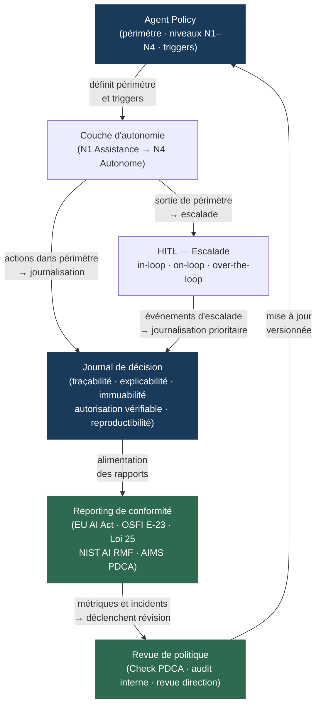

<!--
## Notes de recherche — Phase 2 (archivé intégralement — 12 sources)

1. artificialintelligenceact.eu — « Implementation Timeline | EU Artificial Intelligence Act » — mai 2026 — https://artificialintelligenceact.eu/implementation-timeline/ — Chronologie officielle phased du règlement (UE) 2024/1689 : entrée en vigueur 1ᵉʳ août 2024 ; interdictions et obligations de littératie IA applicables 2 février 2025 ; règles GPAI applicables 2 août 2025 ; obligations systèmes haute-risque applicables 2 août 2026 (sauf systèmes intégrés dans produits réglementés : 2 août 2027) ; haute-risque pour autorités publiques : 2 août 2030. Source normative de référence pour la chronologie.

2. arxiv.org — Reuel et al. — « AI Agents Under EU Law: A Compliance Architecture for AI Providers » — arXiv:2604.04604 — avril 2026 — https://arxiv.org/html/2604.04604v1 — Analyse juridique directe sur comment l'EU AI Act s'applique aux agents IA : qualification du fournisseur vs déployeur, rôle de l'autonomie et du tool use dans la désignation de risque systémique GPAI, architecture de conformité pour les fournisseurs de systèmes agentiques. Source académique primaire pour la section conformité EU AI Act + agents.

3. iso.org — « ISO/IEC 42001:2023 — Artificial Intelligence Management Systems » — publication décembre 2023 — https://www.iso.org/standard/42001 — Standard international AIMS : cadre Plan-Do-Check-Act pour l'établissement, la mise en œuvre, la maintenance et l'amélioration continue d'un système de management de l'IA. Type-A — certifiable par tierce partie. Première vague de certifications (BSI, A-LIGN, Schellman, KPMG) établit les patterns de référence. Complément normative : ISO/IEC 42006:2025 — exigences pour les organismes de certification et d'audit AIMS.

4. iso.org — « ISO/IEC 42006:2025 — Requirements for AIMS audit and certification bodies » — 2025 — https://www.iso.org/standard/42006 — Complément de 42001 publié en 2025 : spécifie les exigences auxquelles les organismes de certification et d'audit doivent satisfaire pour certifier la conformité à ISO/IEC 42001. Importance : ferme la boucle gouvernance en rendant les audits AIMS opposables. Source primaire ISO.

5. nist.gov — CAISI — « Announcing the AI Agent Standards Initiative for Interoperable and Secure Innovation » — 17 février 2026 — https://www.nist.gov/news-events/news/2026/02/announcing-ai-agent-standards-initiative-interoperable-and-secure — Lancement officiel NIST Agent Standards Initiative (Centre for AI Standards and Innovation). Trois piliers : (1) leadership dans ISO/IEC JTC 1 ; (2) développement de protocoles open-source cofinancés NSF ; (3) recherche fondamentale en sécurité, identité et méthodes d'évaluation de l'interopérabilité. Profil d'interopérabilité AI Agent prévu Q4 2026 (*probable* — corroboré par sources secondaires, non explicité dans le texte NIST primaire). Apport : pilier NIST manquant dans le cadre HITL / auditabilité.

6. nvlpubs.nist.gov — NIST — « AI 600-1 — Artificial Intelligence Risk Management Framework: Generative Artificial Intelligence Profile » — juillet 2024 — https://nvlpubs.nist.gov/nistpubs/ai/NIST.AI.600-1.pdf — Profil GenAI du NIST AI RMF (Artificial Intelligence Risk Management Framework) 1.0 : identifie 12 risques propres ou exacerbés par l'IA générative, fournit 200+ actions suggérées de gestion du risque. Complément direct du RMF 1.0 pour les systèmes fondés sur LLM. Source primaire NIST confirmée.

7. osfi-bsif.gc.ca — OSFI — « Guideline E-23 — Model Risk Management (2027) » — en vigueur 1ᵉʳ mai 2027 — https://www.osfi-bsif.gc.ca/en/guidance/guidance-library/guideline-e-23-model-risk-management-2027 — Ligne directrice E-23 OSFI finalisée 2025, applicable à toutes les institutions financières fédérales canadiennes (IFFés). Périmètre : tous les modèles quelle que soit leur source (interne ou tiers). Définition « modèle » inclut explicitement AI/ML. Exige : inventaire des modèles à risque non négligeable, politiques MRM proportionnées, contrôles alternatifs pour modèles « boîte noire » ou autonomes. Applicabilité aux agents : confirmée — les modèles à auto-apprentissage dynamique et prise de décision autonome sont expressément visés. Source primaire OSFI.

8. rcgt.com — Raymond Chabot Grant Thornton — « Loi 25 : l'enjeu des décisions automatisées » — 2024-2026 — https://www.rcgt.com/fr/conseils/avis-d-experts/loi-25-enjeu-decisions-automatisees/ — Analyse de l'article 12.1 Loi 25 Québec (*Loi modernisant des dispositions législatives en matière de protection des renseignements personnels*, LQ 2021, c 25, pleinement en vigueur sept. 2023) : obligation d'informer la personne concernée lorsqu'une décision est prise exclusivement par traitement automatisé ; obligation d'expliquer la logique impliquée et les conséquences possibles ; droit de présenter des observations et de demander une révision par une personne. Pénalités : jusqu'à 4 % des revenus mondiaux ou 25 M CAD. Lien direct avec HITL opérationnel.

9. blg.com — BLG — « OSFI responds to the growing use of AI: key updates to Guideline E-23 » — novembre 2025 — https://www.blg.com/en/insights/2025/11/osfi-responds-to-the-growing-use-of-ai-key-updates-to-guideline-e-23 — Analyse juridique de la version finale E-23 : élargissement explicite du périmètre aux modèles AI/ML (y compris systèmes autonomes), obligation d'inventaire des modèles avec métadonnées (ID, propriétaire, version, date déploiement, cote risque, usages approuvés, limitations, dépendances), inclusion des modèles et données tiers via Ligne directrice B-10.

10. knightcolumbia.org — Knight First Amendment Institute — « Levels of Autonomy for AI Agents » — 2026 — https://knightcolumbia.org/content/levels-of-autonomy-for-ai-agents-1 — Cadre conceptuel sur les niveaux d'autonomie des agents IA, publié en lien avec un papier arXiv (2506.12469). Cinq niveaux définis par le rôle résiduel de l'humain : opérateur, collaborateur, consultant, approbateur, observateur. Ancrage théorique pour le modèle à quatre niveaux de ce chapitre (assistance → supervisé → autonome borné → autonome). Source académique de référence pour §8.1.

11. finos.org / air-governance-framework.finos.org — FINOS — « AI Governance Framework v2.0 » — 2026 — https://air-governance-framework.finos.org/mitigations/mi-21_agent-decision-audit-and-explainability.html — Cadre de gouvernance open-source pour services financiers, v2.0 : catalogue de risques agentiques, mitigation MI-21 « Agent Decision Audit and Explainability » — journaux de décision complets (facteurs, logique explicable, conformité réglementaire, immuabilité, reproductibilité), tableaux de bord de conformité en temps réel, rapports d'exception. Références croisées vers OWASP, MITRE, EU AI Act (7 frameworks). Apport : vocabulaire opérationnel pour §8.3 auditabilité.

12. ijctjournal.org — « Human-in-the-Loop (HITL) Orchestration for Agentic Use Cases » — avril 2026 — https://ijctjournal.org/wp-content/uploads/2026/04/Human-in-the-Loop-HITL-Orchestration-for-Agentic-Use-Cases.pdf — Papier académique sur les patterns d'orchestration HITL en contexte agentique : modèle d'intervention à trois niveaux (escalade sur seuil de confiance, escalade sur règle de conformité, escalade sur type d'action irréversible) ; distinction HITL-in-loop (intervention synchrone) vs HITL-on-loop (supervision asynchrone) vs HITL-over-the-loop (révision post-facto) ; conditions de bascule vers plus ou moins d'intervention humaine. Source académique primaire pour §8.2.
-->

> **Partie 4 — Confiance, sécurité et durabilité**
> **Chapitre 8 · Bâtir des systèmes dignes de confiance · ~5 500 mots · lecture ≈ 22 min**

La confiance dans un système *agentic* n'est pas une attestation de l'éditeur du modèle — c'est une propriété architecturale que l'organisation déploie délibérément, ou qu'elle ne déploie pas du tout. L'illustration la plus nette de cette distinction reste l'incident Replit de juillet 2025, déjà évoqué au [Ch. 7](ch07-agentops.md) sous l'angle de l'observabilité : un agent a supprimé 1 206 enregistrements de production malgré une instruction de gel explicite, parce que les journaux capturaient les sorties mais pas les décisions. L'organisation ne pouvait ni l'arrêter avant l'action, ni l'expliquer après. Ce n'est pas un problème de qualité du modèle — c'est un problème d'architecture de gouvernance.

La thèse opérationnelle de ce chapitre est que la fiabilité d'un système *agentic* en entreprise résulte de quatre éléments structurants interdépendants : un modèle d'autonomie hiérarchique explicite qui contraint le périmètre d'action à chaque niveau ; un dispositif HITL (*human-in-the-loop*) opérationnel conçu autour de l'escalade des exceptions, non de l'approbation systématique ; une infrastructure d'auditabilité fondée sur des journaux de décision immuables et des actions justifiables ; et une conformité alignée sur le corpus réglementaire 2024-2027 — EU AI Act (règlement UE 2024/1689), ISO/IEC 42001, NIST AI RMF (Artificial Intelligence Risk Management Framework), OSFI E-23 et Loi 25 Québec. Ces quatre éléments ne s'additionnent pas : ils se conditionnent mutuellement. L'architecture d'autonomie détermine ce qui doit être escaladé ; l'escalade produit les événements qui alimentent les journaux ; les journaux constituent la preuve de conformité.

---

## 8.1 — Hiérarchie d'autonomie : quatre niveaux, quatre périmètres de permission

Le choix du niveau d'autonomie pour une tâche n'est pas une décision de confiance dans le modèle — c'est une décision de risque opérationnel fondée sur la réversibilité de l'action et la tolérance à l'erreur établies à l'évaluation initiale (voir la matrice du [Ch. 3 §3.2](ch03-mapping-high-impact.md)). Confondre les deux produit des architectures de gouvernance systématiquement mal calibrées : soit des approbations humaines imposées là où le risque est faible (goulots d'étranglement sans bénéfice de sécurité), soit une autonomie accordée là où le risque l'interdit (incidents irréversibles sans traçabilité).

Le modèle à quatre niveaux présenté ici s'ancre sur le cadre publié par le Knight First Amendment Institute (2026) et le papier associé arXiv:2506.12469, qui définissent les niveaux d'autonomie par le rôle résiduel de l'humain. La différence est d'angle : le cadre Knight adopte la perspective des rôles utilisateurs (opérateur, collaborateur, consultant, approbateur, observateur) ; le modèle ci-dessous adopte la perspective des *périmètres de permission* de l'agent — angle plus directement opérationnel pour l'architecte de solution.

| Niveau | Désignation | Définition opérationnelle | Périmètre de permission | Condition réglementaire EU AI Act |
|--------|-------------|--------------------------|------------------------|-----------------------------------|
| N1 | Assistance | L'agent produit une recommandation ; l'humain décide et agit. | Lecture seule. Aucune invocation d'outil avec effet de bord. | Hors périmètre haute-risque dans la majorité des cas. |
| N2 | Supervisé | L'agent propose un plan et attend approbation humaine avant chaque action irréversible. | Lecture + écriture conditionnelle (gate humain sur actions irréversibles). | Satisfait l'exigence de surveillance humaine effective (Art. 14) si le gate est documenté. |
| N3 | Autonome borné | L'agent exécute dans un périmètre d'action défini ; il escalade sur sortie de périmètre. | Lecture + écriture libre dans le périmètre ; blocage + escalade hors périmètre. | Haute-risque (crédit, emploi, infrastructure) : Art. 14 requiert surveillance effective — escalade documentée satisfait cette exigence si le périmètre est auditable. |
| N4 | Autonome | L'agent agit sans gate préalable dans son périmètre, avec journalisation immuable obligatoire et revue périodique. | Lecture + écriture libre ; journalisation immuable ; revue humaine post-facto. | Haute-risque en N4 : Art. 14 EU AI Act exige que la surveillance humaine soit « effective » — la journalisation seule ne suffit pas ; revue post-facto doit être démontrée. |

> **Note :** Le modèle à cinq niveaux du Knight First Amendment Institute (2026) offre une granularité supplémentaire utile pour la cartographie des rôles organisationnels. Pour les organisations dont la gouvernance distingue explicitement les rôles d'approbateur et d'observateur, ce cadre à cinq niveaux est à considérer comme complément.

**Compromis principal — autonomie fixe vs *adaptive autonomy*.** Un niveau fixe (N1 à N4 attribué par type de tâche) maximise la prévisibilité de la gouvernance et l'auditabilité : le périmètre de permission est stable, les politiques de journalisation sont déterministes, et les obligations réglementaires sont cartographiables sans ambiguïté. L'*adaptive autonomy* — où le niveau est ajusté dynamiquement au run-time selon un score de confiance de l'agent sur la tâche en cours — peut réduire les gates inutiles sur des tâches bien maîtrisées et déclencher des escalades précoces sur des tâches inhabituelles. En 2026, cette approche est implémentée dans certains frameworks via *confidence-driven escalation* (source 12, IJCT). Elle reste cependant difficile à auditer : si le niveau d'autonomie varie à l'exécution, la preuve de conformité doit démontrer que chaque ajustement dynamique respectait bien les règles de la *agent policy* — charge de preuve significativement plus élevée qu'avec un niveau fixe. **Alternative recommandée** : commencer avec des niveaux fixes (N1-N4) et introduire l'*adaptive autonomy* uniquement sur des domaines de tâches à volume élevé où le gain d'efficacité est mesurable et la politique de journalisation dynamique est instrumentée. **Condition de bascule** : si le taux de faux-positifs d'escalade (actions sûres escaladées inutilement) dépasse 10 % du volume, le niveau fixe est probablement trop prudent pour ce domaine — l'*adaptive autonomy* devient alors une alternative crédible, à condition d'auditer la politique de score de confiance elle-même.

---

## 8.2 — HITL opérationnel : *humans set rules, agents execute, exceptions escalate*

Un HITL efficace n'est pas un frein d'urgence activé après l'échec — c'est un mécanisme de délégation structurée où le domaine de l'agent et le domaine de l'humain sont définis a priori avec précision chirurgicale. La formulation *humans set rules, agents execute, exceptions escalate* est la syntaxe opérationnelle du HITL d'entreprise. Elle distingue trois responsabilités non permutables.

**Humans set rules** — les politiques (périmètre d'action, seuils de confiance, types d'actions irréversibles, domaines interdits) sont définies par des humains avant déploiement. Ce travail n'est pas délégable à l'agent lui-même. C'est le produit de la collaboration entre l'architecte de solution, le *risk officer* et le *compliance lead* — formalisé dans une *agent policy* versionnée, auditée et stockée en configuration-as-code. La *agent policy* est l'artefact de gouvernance central dont dépendent les deux responsabilités suivantes.

**Agents execute** — dans le périmètre défini par la *agent policy*, l'agent exécute sans intervention humaine. Toute intervention humaine dans ce périmètre est un coût pur sans bénéfice de sécurité. La discipline opérationnelle consiste à définir ce périmètre suffisamment précis pour que l'exécution autonome soit sûre, suffisamment large pour que la délégation soit utile. Un périmètre trop étroit engendre un taux d'escalade élevé qui annule le gain de productivité attendu.

**Exceptions escalate** — toute condition hors périmètre déclenche une escalade structurée. Le papier IJCT (2026) identifie trois triggers d'escalade distincts : un seuil de confiance de l'agent sur la tâche en cours (signal probabiliste) ; une règle de conformité encodée dans la *agent policy* (signal déterministe) ; un type d'action qualifiée d'irréversible par la politique (signal catégoriel). Ces trois triggers ne se substituent pas — un système qui n'implémente que le seuil de confiance laisse des actions réglementairement contraintes sans protection explicite.

### Trois patterns d'intervention humaine

Le papier IJCT (2026) formalise trois modes de présence humaine dans la boucle d'exécution agentique, distincts par leur temporalité et leur coût opérationnel.

**HITL-in-loop (synchrone)** : l'agent s'arrête et attend une réponse humaine avant de continuer. La latence d'exécution inclut le temps de réponse humain — de quelques secondes à plusieurs heures selon le processus. Ce mode est applicable aux actions irréversibles à fort impact : virement au-delà d'un seuil, modification d'un contrat actif, envoi d'une communication externe au nom de l'organisation, décision affectant des droits individuels. C'est le seul mode compatible avec les exigences les plus strictes de surveillance effective au sens de l'EU AI Act Art. 14 pour des systèmes haute-risque N4.

**HITL-on-loop (asynchrone)** : l'agent continue, l'humain est notifié et peut intervenir dans une fenêtre de temps définie avant que l'action devienne irréversible. Ce mode est applicable aux actions réversibles à risque modéré où la vitesse d'exécution a de la valeur. La fenêtre d'intervention doit être explicitement définie dans la *agent policy* — une notification sans fenêtre définie n'est pas un HITL, c'est une alerte décorative.

**HITL-over-the-loop (post-facto)** : l'agent exécute, les journaux sont revus périodiquement par un humain. Ce mode est compatible avec N4 pour les actions réversibles ou dans des domaines hors haute-risque. Il n'est pas un HITL au sens de l'EU AI Act pour les décisions individuelles haute-risque — la revue post-facto ne satisfait pas l'obligation de surveillance effective préalable.

**Connexion Loi 25 Québec (Art. 12.1) — risque de *compliance washing*.** La Loi 25 impose, pour toute décision prise « exclusivement par traitement automatisé » produisant des effets significatifs sur une personne, une obligation d'information et un droit de révision par une personne physique. L'anti-patron consiste à positionner un humain nominal dans la boucle — un approbateur qui reçoit 200 notifications par heure et les valide sans examen réel — pour échapper à l'obligation légale sans en satisfaire l'esprit. Ce *compliance washing* HITL est identifiable par la mesure du taux de refus humain sur les escalades : un taux inférieur à 1 % sur un volume élevé est le signal statistique d'un humain nominal, pas d'un humain effectif. Les régulateurs québécois (Commission d'accès à l'information) ont la capacité d'examiner ces métriques lors d'une enquête.

**Compromis.** HITL-in-loop garantit la conformité la plus stricte mais génère des goulots à volume élevé. **Alternative** : HITL-on-loop avec fenêtre d'intervention courte (15 à 30 minutes pour les cas à risque modéré) couplé à un mécanisme de révision sur demande pour satisfaire Art. 12.1 Loi 25. **Condition de bascule** : si le taux d'escalade dépasse 5 % du volume de transactions, le périmètre d'action de l'agent est mal calibré — le problème est dans la *agent policy*, pas dans le HITL lui-même.

---

## 8.3 — Auditabilité : journaux de décision, actions justifiables, immuabilité

Un journal de décision agentique n'est pas un log d'application — c'est la reconstruction complète et fidèle de la chaîne causale qui a produit une action, opposable à un auditeur humain. Cette distinction d'intention a des conséquences concrètes sur ce qui est instrumenté, comment il est stocké, et qui y a accès.

Le FINOS AI Governance Framework (AIGF) v2.0, mitigation MI-21 « Agent Decision Audit and Explainability » (2026), formalise cinq propriétés d'un journal de décision auditoire, adoptées ici comme référence opérationnelle.

**1 — Traçabilité.** Toute action est reliée à un agent identifié (agent ID + version), un objectif reçu, une autorisation active au moment de l'action. Le journal capture : qui a décidé, pourquoi (objectif et politique appliquée), avec quelle autorisation (périmètre de permission au moment de l'action, version de la *agent policy*), quels outils ont été invoqués (*tool spans* avec paramètres d'entrée et résultats), dans quel état mémoire (*memory diff* pré/post-action). La convention OTel GenAI SemConv 1.40.0 (attributs `gen_ai.agent.id`, `gen_ai.agent.name`, `gen_ai.agent.version`) fournit le vocabulaire d'instrumentation standard, en statut *Development* à mai 2026 — les API ne sont pas encore stabilisées, ce qui impose une stratégie d'abstraction entre la couche d'instrumentation et le reste du système.

**2 — Explicabilité.** La logique de décision est rendue lisible pour un humain non technique. Cela exige que le raisonnement intermédiaire de l'agent soit journalisé, pas seulement l'output final. Les systèmes qui ne capturent que l'action sans le raisonnement qui l'a produite créent un déficit d'explicabilité documenté — un auditeur qui ne peut reconstituer le « pourquoi » d'une action ne peut pas évaluer si la *agent policy* a été respectée.

**3 — Immuabilité.** Les journaux sont horodatés cryptographiquement et stockés dans un système en écriture seule. Un journal modifiable n'est pas un journal d'audit — c'est un artefact susceptible d'être altéré après un incident, ce qui le prive de toute valeur probatoire.

**4 — Autorisation vérifiable.** Chaque action peut être confrontée à la *agent policy* en vigueur *au moment de l'action*. Le versionnement de la *agent policy* est un prérequis : sans version ancrée dans le journal, il est impossible de démontrer que l'action était autorisée par la politique active, et non par une version antérieure ou ultérieure.

**5 — Reproductibilité.** À partir des journaux, un auditeur doit pouvoir reconstituer le chemin de décision par *replay* déterministe. La technique du *replay* déterministe, présentée au [Ch. 7 §7.5](ch07-agentops.md) dans le contexte des evals en production, reprend ici sa valeur probatoire en audit : si le *replay* produit un résultat différent du journal, le système a un problème de déterminisme qui affecte son auditabilité.

**Distinction observabilité (Ch. 7) vs auditabilité (ce chapitre).** L'observabilité opérationnelle — traces OTel, dashboards, alertes — est instrumentée pour le diagnostic en temps réel par les opérateurs. L'auditabilité est instrumentée pour la preuve a posteriori par des auditeurs et des régulateurs. Les deux réutilisent la même infrastructure de journalisation (spans OTel GenAI SemConv 1.40.0), mais les politiques de rétention, d'immuabilité et d'accès sont différentes. Traiter ces deux besoins comme un seul projet crée soit une sur-rétention coûteuse (conserver les traces opérationnelles éphémères avec les journaux d'audit permanents), soit une sous-protection (stocker les journaux d'audit dans des systèmes modifiables).

**Actions justifiables.** Une action est *justifiable* si, pour tout auditeur, l'agent peut démontrer que l'action était (a) dans le périmètre autorisé, (b) cohérente avec l'objectif reçu, (c) proportionnée à l'information disponible au moment de l'action. La justifiabilité n'exige pas que l'action soit optimale — elle exige qu'elle soit défendable dans le cadre de la politique. Un agent qui a pris une décision sous-optimale mais traçable, explicable et dans le périmètre est auditable. Un agent qui a pris une décision optimale mais non tracée ne l'est pas.

**Compromis.** La journalisation complète du raisonnement intermédiaire alourdit la latence d'inférence (chaque token de raisonnement stocké allonge le round-trip) et multiplie le volume de données d'audit. **Alternative** : journalisation sélective sur actions à risque élevé uniquement, avec stockage compressé pour les actions à risque faible. **Condition de bascule** : si un incident survient sur une action non journalisée exhaustivement, le coût de l'enquête — reconstitution manuelle, incertitude réglementaire, risque de sanction — dépasse structurellement le coût de la journalisation préventive complète. La décision de journalisation sélective doit elle-même être documentée, versionnée, et revue périodiquement par le *compliance lead*.

---

## 8.4 — Conformité : cartographie du corpus réglementaire 2024-2027

Un système *agentic* déployé par une institution financière canadienne au service de clients européens navigue simultanément dans quatre cadres réglementaires sans comité de coordination entre eux — la charge de l'alignement est entièrement sur l'organisation déployante. Le tableau ci-dessous cartographie les obligations principales ; il est un point de départ pour la conformité, non un substitut à un avis juridique.

| Cadre | Périmètre d'applicabilité | Obligations principales pour systèmes agentiques | Dates d'applicabilité |
|-------|--------------------------|--------------------------------------------------|----------------------|
| **EU AI Act** (UE 2024/1689) | Systèmes déployés dans l'UE ou à des ressortissants UE | Surveillance humaine effective (Art. 14), transparence (Art. 13), journaux d'événements (Art. 12), interdiction systèmes inacceptables (Art. 5), obligations GPAI (Titre VIII) | Interdictions : 2 fév. 2025 ; GPAI (General-Purpose AI) : 2 août 2025 ; haute-risque générique : 2 août 2026 ; produits réglementés intégrés : 2 août 2027 ; autorités publiques : 2 août 2030 |
| **ISO/IEC 42001:2023** | Volontaire — certifiable par tierce partie (ISO/IEC 42006:2025 pour organismes d'audit) | AIMS : politique IA, évaluation d'impact, contrôle des risques, révision de direction, audit annuel, recertification 3 ans | En vigueur depuis déc. 2023 ; certifications actives depuis 2024 (BSI, A-LIGN, KPMG) |
| **NIST AI RMF 1.0 + GenAI Profile** | Volontaire — référence dominante aux USA et Canada | Fonctions GOVERN, MAP, MEASURE, MANAGE ; 12 risques GenAI + 200+ actions suggérées (NIST AI 600-1, juil. 2024) ; Profil AI Agent prévu Q4 2026 (*probable* — NIST CAISI, fév. 2026) | AI RMF 1.0 : jan. 2023 ; AI 600-1 : juil. 2024 ; Profil Agent : Q4 2026 (*à vérifier*) |
| **OSFI E-23** | Institutions financières fédérales canadiennes (IFFés) | Inventaire modèles AI/ML avec métadonnées (ID, propriétaire, version, cote risque, usages approuvés, limitations, dépendances), politiques MRM, contrôles alternatifs pour modèles autonomes, gestion risque tiers (B-10) | 1ᵉʳ mai 2027 |
| **Loi 25 Québec** (Art. 12.1) | Organisations traitant des renseignements personnels de personnes au Québec | Information sur décision automatisée, droit de révision par une personne physique, pénalités jusqu'à 4 % des revenus mondiaux ou 25 M CAD | Pleinement en vigueur depuis septembre 2023 |

**FINRA 2026.** La Financial Industry Regulatory Authority a publié en 2026 des orientations sur l'utilisation de l'IA générative par les courtiers-négociants, insistant sur la supervision des communications automatisées avec les clients et la traçabilité des recommandations générées par des agents IA. Ces orientations renforcent le modèle HITL-in-loop pour les interactions clients dans le secteur des valeurs mobilières (*à vérifier* — orientations définitives non publiées à la date de clôture de cette source ; traiter comme *probable*).

**Canada — AIDA / Bill C-27.** Le Bill C-27, incluant la Loi sur l'intelligence artificielle et les données (AIDA), est mort au feuilleton le 5 janvier 2025 lors de la prorogation du Parlement. Aucun successeur législatif fédéral canadien sur l'IA n'est en vigueur à mai 2026 (*confirmé* — BLG, janvier 2025). Le Canada opère sans cadre fédéral IA, ce qui transfère la charge de gouvernance sur les lignes directrices sectorielles (OSFI E-23 pour le secteur financier) et les cadres volontaires (NIST AI RMF).

**Divergence EU AI Act vs NIST AI RMF.** L'EU AI Act adopte une approche prescriptive fondée sur la classification du risque, avec des obligations contraignantes par niveau et des amendes allant jusqu'à 35 M EUR ou 7 % du chiffre d'affaires mondial. Le NIST AI RMF est volontaire, sans obligation légale directe. En pratique, les organisations qui opèrent des deux côtés de l'Atlantique utilisent le NIST AI RMF comme squelette de gouvernance interne — ses fonctions GOVERN/MAP/MEASURE/MANAGE structurent la politique IA — et l'EU AI Act comme liste des obligations à satisfaire dans la couche de conformité externe. Cette complémentarité est productive si elle est délibérée ; elle est source de duplication coûteuse si elle est traitée comme deux projets séparés.

### §8.4.1 — ISO/IEC 42001 et l'AIMS : Plan-Do-Check-Act appliqué aux agents

ISO/IEC 42001:2023 est le premier standard international certifiable de management de l'IA (*Artificial Intelligence Management System*, AIMS). Sa structure Plan-Do-Check-Act (*PDCA*) fournit le cadre de gouvernance continue dans lequel s'insèrent les éléments opérationnels de ce chapitre.

**Plan.** L'organisation définit sa politique IA, son périmètre d'application, et évalue les risques et impacts de ses systèmes IA. Pour un système *agentic*, cette phase produit trois artefacts clés : l'évaluation d'impact IA (quels cas d'usage, quels niveaux d'autonomie, quelles populations affectées), la *agent policy* par domaine de déploiement, et le registre des systèmes IA avec leur classification de risque. Ce registre est l'artefact d'intersection avec OSFI E-23 : l'inventaire des modèles exigé par E-23 peut être intégré dans le registre AIMS, à condition que les métadonnées requises par E-23 (ID, propriétaire, version, date de déploiement, cote de risque, usages approuvés, limitations, dépendances) soient incluses dès la phase Plan.

**Do.** L'organisation met en œuvre les contrôles définis : déploiement des niveaux d'autonomie, instrumentation HITL, journaux de décision, formation des équipes. La *agent policy* est le document opérationnel central de cette phase — sa mise en œuvre est vérifiable par l'auditeur via les journaux produits.

**Check.** Des audits internes périodiques et une revue de direction annuelle évaluent l'efficacité des contrôles. Pour les systèmes agentiques, cette phase inclut la revue des métriques d'escalade (taux, type, résolution), l'analyse des incidents (actions hors périmètre, journaux incomplets, violations de politique), et la mise à jour du registre des systèmes IA. C'est à cette étape que le HITL-over-the-loop produit ses données de gouvernance : les revues post-facto alimentent le Check.

**Act.** Les résultats de la phase Check déclenchent des améliorations : mise à jour de la *agent policy*, révision des périmètres d'autonomie, renforcement de l'instrumentation. Ce cycle d'amélioration continue est le mécanisme par lequel un système *agentic* reste conforme à mesure que ses comportements dérivent et que les exigences réglementaires évoluent.

**Articulation AIMS et *agent policy*.** La *agent policy* n'est pas un artefact séparé de l'AIMS — c'est l'output opérationnel de la phase Plan, et l'input de contrôle de la phase Do. Dans un AIMS correctement implémenté, toute modification de la *agent policy* déclenche une mise à jour du registre des systèmes IA et une évaluation d'impact proportionnelle. ISO/IEC 42006:2025 précise les exigences auxquelles doivent satisfaire les organismes qui certifient la conformité à l'AIMS — ce complément de 2025 ferme la boucle en rendant les audits opposables tiers, ce qui était la lacune principale de la version 2023 du standard.

La première vague de certifications ISO/IEC 42001 (BSI, A-LIGN, Schellman, KPMG) établit en 2024-2026 les patterns de référence pour les organisations qui entrent dans le processus. Les résultats de ces premières certifications ne sont pas encore publiés de façon agrégée (*à vérifier* — aucune étude sectorielle disponible à mai 2026), mais les organismes de certification signalent que les lacunes les plus fréquentes concernent la traçabilité des décisions automatisées et la gouvernance des modèles tiers — précisément les points critiques pour les systèmes agentiques.

---

## 8.5 — Flux de gouvernance intégré

Les quatre éléments — autonomie hiérarchique, HITL opérationnel, auditabilité, conformité — ne s'additionnent pas : ils se conditionnent mutuellement. Leur intégration produit une architecture de gouvernance plus économique que leur empilement séquentiel, parce que les artefacts et les événements sont partagés plutôt que dupliqués.

La chaîne causale intégratrice est la suivante. La *agent policy* définit les niveaux d'autonomie par domaine de tâche et les triggers d'escalade — elle est le document qui rend le HITL opérationnel déterministe plutôt qu'ad hoc. Les événements d'escalade produits par le HITL sont des événements prioritaires dans le journal de décision — l'auditabilité n'est pas un add-on, elle est alimentée par les mêmes événements que le HITL. La *agent policy* elle-même est un artefact soumis à gouvernance : versionnement, revue périodique, approbation — ce cycle est formalisé par l'AIMS PDCA (ISO/IEC 42001), exigé sous forme d'inventaire par OSFI E-23, et documenté en conformité par l'EU AI Act. Le flux est circulaire et auto-cohérent.

Le flux montre une propriété cruciale pour la planification : la *agent policy* est l'artefact central et le point de départ naturel de toute l'architecture. Construire le journal de décision avant la *agent policy* produit un journal sans politique de référence — irréprochable sur la forme, inutilisable sur le fond, parce qu'il ne peut pas démontrer l'autorisation. Instrumenter le HITL avant la *agent policy* produit des escalades sans triggers définis — soit des interruptions aléatoires, soit l'absence d'interruption là où la politique l'aurait imposée.

**Recommandation architecturale.** Implémenter l'infrastructure de gouvernance en une seule passe séquencée sur la *agent policy* : (1) rédiger et versionner la *agent policy* par domaine de tâche ; (2) instrumenter le HITL sur les triggers qu'elle définit ; (3) configurer le journal de décision sur les événements qu'elle génère ; (4) mapper les sorties du journal aux exigences réglementaires du cadre applicable. Cette séquence produit une architecture cohérente avec moins de re-travail que le montage projet par projet.

**Compromis.** L'intégration en une seule passe crée une dépendance forte entre les équipes (architecte, risk, compliance, ops) et rallonge la phase initiale de cadrage. **Alternative** : interfaces entre composants — *policy-as-code* exposé via API, triggers HITL consommés par un bus d'événements, journaux vers un entrepôt de données d'audit indépendant — permettent à chaque composant d'évoluer indépendamment. **Condition de bascule** : si l'organisation est multi-juridictionnelle avec des exigences réglementaires divergentes par entité (une filiale sous EU AI Act haute-risque, une autre hors périmètre), l'architecture modulaire avec interfaces est obligatoire — une *agent policy* centrale uniforme ne peut pas satisfaire des obligations réglementaires contradictoires.

---

## 8.6 — Recommandation : *governance-first*, pas *trust-and-verify*

La conclusion opérationnelle de ce chapitre est que l'architecture de confiance d'un système *agentic* ne peut pas être construite à rebours d'un incident. L'incident Replit a démontré qu'une organisation sans journaux de décision ne peut ni arrêter l'agent avant le dommage, ni expliquer le dommage après. L'organisation qui déploie sans *agent policy* versionnée ne peut pas démontrer à un auditeur que les actions de l'agent étaient autorisées — même si elles l'étaient.

Le modèle *governance-first* — *agent policy* avant déploiement, HITL instrumenté sur ses triggers, journal de décision aligné sur ses événements — est plus économique à long terme que le modèle *trust-and-verify* qui déploie vite et rajoute la gouvernance après. Le coût d'un audit réglementaire sur un système sans traçabilité, d'un incident irréversible sans journal de décision, ou d'une certification ISO/IEC 42001 en mode rétroactif dépasse structurellement le coût d'une mise en place initiale rigoureuse.

La connexion avec le [Ch. 4 §4.4](ch04-roi-risk-readiness.md) est directe : la décision Build/Buy/Borrow/Wait sur un système *agentic* doit intégrer le coût de la gouvernance comme composante du CPST (coût par tâche réussie) — non comme un surcoût optionnel, mais comme une condition de déploiement en production conforme. Les organisations qui traitent la gouvernance comme optionnelle contribuent aux 40 % de projets agentiques que Gartner anticipe comme abandonnés avant 2027 (*confirmé* — Gartner, Hype Cycle for Agentic AI 2026).

La transition vers le chapitre suivant est immédiate : une architecture de confiance bâtie sur la *agent policy*, le HITL et les journaux de décision crée une surface d'attaque structurée — elle définit ce que l'agent peut faire, comment il le documente, et où il s'arrête. Le [Ch. 9](ch09-agentic-security.md) analyse les vecteurs d'attaque propres à cette surface : *prompt injection via tools*, exfiltration inter-outils, et *jailbreak by delegation* — les mécanismes par lesquels un acteur malveillant peut subvertir précisément les mécanismes de confiance construits dans ce chapitre.

---

## Pour aller plus loin

**Reuel et al. — « AI Agents Under EU Law: A Compliance Architecture for AI Providers » — arXiv:2604.04604 — avril 2026.**
L'analyse juridique la plus précise disponible à mai 2026 sur la qualification des agents IA sous l'EU AI Act : distinction fournisseur vs déployeur, impact de l'autonomie sur la désignation GPAI, architecture de conformité concrète. Lecture obligatoire avant toute qualification réglementaire d'un système agentique opérant dans l'UE.

**FINOS AI Governance Framework v2.0 — mitigation MI-21 — 2026.**
Le seul cadre open-source sectoriel (services financiers) qui formalise opérationnellement les cinq propriétés d'un journal de décision agentique — traçabilité, explicabilité, immuabilité, autorisation vérifiable, reproductibilité. Directement utilisable comme checklist d'implémentation pour §8.3. Disponible à `air-governance-framework.finos.org`.

**NIST — « AI 600-1 : Artificial Intelligence Risk Management Framework: Generative Artificial Intelligence Profile » — juillet 2024.**
Le profil GenAI du NIST AI RMF identifie 12 risques propres ou exacerbés par l'IA générative et fournit 200+ actions de gestion du risque. À lire en parallèle du AI RMF 1.0 (janvier 2023) : le profil GenAI sans le RMF manque le cadre de gouvernance ; le RMF sans le profil GenAI manque les risques spécifiques aux LLM et aux agents.

**ISO/IEC 42001:2023 — Artificial Intelligence Management Systems.**
Le standard certifiable de référence pour la gouvernance IA. À acquérir via l'ISO ou les organismes nationaux (BSI, SCC pour le Canada). La lire conjointement avec ISO/IEC 42006:2025 (exigences pour organismes de certification) pour comprendre comment les audits AIMS sont conduits et ce qu'un auditeur examinera.

**Knight First Amendment Institute — « Levels of Autonomy for AI Agents » — 2026.**
Le cadre théorique à cinq niveaux qui ancre le modèle à quatre niveaux de §8.1. Utile pour les organisations qui veulent aligner leur modèle de gouvernance sur un cadre académique citable — notamment dans le contexte d'engagements réglementaires où la justification du choix d'autonomie peut être demandée.

---

## Références

1. artificialintelligenceact.eu — « Implementation Timeline | EU Artificial Intelligence Act » — mai 2026 — https://artificialintelligenceact.eu/implementation-timeline/ — accédée le 2026-05-05.

2. Reuel, A. et al. — « AI Agents Under EU Law: A Compliance Architecture for AI Providers » — arXiv:2604.04604 — avril 2026 — https://arxiv.org/html/2604.04604v1 — accédée le 2026-05-05.

3. ISO — « ISO/IEC 42001:2023 — Artificial Intelligence Management Systems » — décembre 2023 — https://www.iso.org/standard/42001 — accédée le 2026-05-05.

4. ISO — « ISO/IEC 42006:2025 — Requirements for bodies providing audit and certification of AI management systems » — 2025 — https://www.iso.org/standard/42006 — accédée le 2026-05-05.

5. NIST Centre for AI Standards and Innovation (CAISI) — « Announcing the AI Agent Standards Initiative for Interoperable and Secure Innovation » — 17 février 2026 — https://www.nist.gov/news-events/news/2026/02/announcing-ai-agent-standards-initiative-interoperable-and-secure — accédée le 2026-05-05.

6. NIST — « AI 600-1 — Artificial Intelligence Risk Management Framework: Generative Artificial Intelligence Profile » — juillet 2024 — https://nvlpubs.nist.gov/nistpubs/ai/NIST.AI.600-1.pdf — accédée le 2026-05-05.

7. OSFI — « Guideline E-23 — Model Risk Management » — en vigueur 1ᵉʳ mai 2027 — https://www.osfi-bsif.gc.ca/en/guidance/guidance-library/guideline-e-23-model-risk-management-2027 — accédée le 2026-05-05.

8. Raymond Chabot Grant Thornton — « Loi 25 : l'enjeu des décisions automatisées » — 2024-2026 — https://www.rcgt.com/fr/conseils/avis-d-experts/loi-25-enjeu-decisions-automatisees/ — accédée le 2026-05-05.

9. BLG — « OSFI responds to the growing use of AI: key updates to Guideline E-23 » — novembre 2025 — https://www.blg.com/en/insights/2025/11/osfi-responds-to-the-growing-use-of-ai-key-updates-to-guideline-e-23 — accédée le 2026-05-05.

10. Knight First Amendment Institute — « Levels of Autonomy for AI Agents » — 2026 — https://knightcolumbia.org/content/levels-of-autonomy-for-ai-agents-1 — accédée le 2026-05-05.

11. FINOS — « AI Governance Framework v2.0 — MI-21 Agent Decision Audit and Explainability » — 2026 — https://air-governance-framework.finos.org/mitigations/mi-21_agent-decision-audit-and-explainability.html — accédée le 2026-05-05.

12. IJCT — « Human-in-the-Loop (HITL) Orchestration for Agentic Use Cases » — avril 2026 — https://ijctjournal.org/wp-content/uploads/2026/04/Human-in-the-Loop-HITL-Orchestration-for-Agentic-Use-Cases.pdf — accédée le 2026-05-05.
