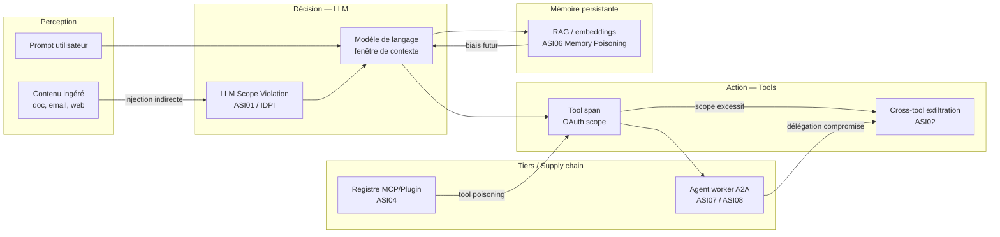

<!--
## Notes de recherche — Phase 2 (archivé intégralement — 12 sources)

1. OWASP GenAI Security Project — « OWASP Top 10 for Agentic Applications for 2026 » — décembre 2025 — https://genai.owasp.org/resource/owasp-top-10-for-agentic-applications-for-2026/ — Liste ASI01 à ASI10 peer-reviewée par 100+ experts. ASI01 Agent Goal Hijack (redirection des objectifs via injection), ASI02 Tool Misuse & Exploitation (chaînes d'outils non sécurisées), ASI03 Agent Identity & Privilege Abuse (exploitation de la délégation de confiance), ASI04 Agentic Supply Chain Compromise (agents, plugins, registres tiers compromis), ASI05 Unexpected Code Execution, ASI06 Memory & Context Poisoning (corruption RAG/mémoire épisodique), ASI07 Insecure Inter-Agent Communication (spoofing A2A), ASI08 Cascading Failures, ASI09 Human-Agent Trust Exploitation, ASI10 Rogue Agents. Distinct du LLM Top 10 v2 (orienté modèle unique) : la liste Agentic se concentre sur les risques propres à l'autonomie, l'intégration d'outils, la coordination multi-agents, et l'état persistant. Apport : taxonomie de référence pour le modèle de menace du chapitre ; nomenclature ASI à adopter.

2. OWASP GenAI Security Project — « Agentic AI — Threats and Mitigations » v1.1 — février 2025, mise à jour synchronisée décembre 2025 — https://genai.owasp.org/resource/agentic-ai-threats-and-mitigations/ — Premier document de taxonomie des menaces agentiques publié (avant le Top 10). Couvre le cycle de vie complet : threat modelling, développement sécurisé, gouvernance, paysage produit. Référencé par AWS et Microsoft dans leurs propres documentations sécurité. Apport : fond conceptuel derrière le Top 10 ; permet de situer *prompt injection via tools*, *cross-tool exfiltration*, et *jailbreak by delegation* dans la taxonomie OWASP.

3. NVD / Aim Security — « CVE-2025-32711 (EchoLeak) — Microsoft 365 Copilot » — patch juin 2025 — https://nvd.nist.gov/vuln/detail/cve-2025-32711 — Première exploitation zero-click documentée dans un système LLM de production. CVSS 9.3 (critique). Mécanisme : *LLM Scope Violation* — contenu masqué dans un courriel Outlook (champ invisible, métadonnées) contient des instructions d'injection de prompt ; Copilot les exécute sans interaction utilisateur et exfiltre contenu OneDrive, SharePoint, Teams, Outlook dans le périmètre de contexte. Découvert par Aim Labs (Aim Security), divulgué de façon responsable à Microsoft, patché côté serveur (aucune action utilisateur requise). Aucune exploitation malveillante confirmée dans la nature. Apport : incident concret *cross-tool exfiltration* de niveau production, avec CVE traçable. Confirme que l'injection indirecte via le contenu ingéré par l'agent (pas via prompt utilisateur direct) est la classe de risque dominante en 2025-2026.

4. arXiv:2509.10540 — Amit et al. / Aim Security — « EchoLeak: The First Real-World Zero-Click Prompt Injection Exploit in a Production LLM System » — septembre 2025 — https://arxiv.org/abs/2509.10540 — Analyse technique complète de CVE-2025-32711. Formalise la notion de *LLM Scope Violation* : le modèle ne distingue pas le contenu de confiance (instructions système) du contenu non fiable (contenu utilisateur ingéré) lorsque celui-ci est présent dans la fenêtre de contexte. Démontre que l'agent peut être contraint d'agir sur des instructions encodées dans des données qu'il traite, sans que l'utilisateur ait initié d'action explicite. Apport : source académique primaire sur EchoLeak ; fonde la distinction injection directe vs indirecte dans le modèle de menace.

5. arXiv:2504.16489 — « Amplified Vulnerabilities: Structured Jailbreak Attacks on LLM-based Multi-Agent Debate » — avril 2025 — ICLR 2026 Workshop on Agents in the Wild — https://arxiv.org/abs/2504.16489 — Démontre que les systèmes multi-agents de type *debate* (où plusieurs LLM débattent pour converger) amplifient les attaques de jailbreak : un agent compromis injecte des instructions malveillantes dans le flux de délégation, et la propagation à travers les tours de dialogue atteint d'autres agents. Les cadres MAD (*multi-agent debate*) testés (quatre frameworks) présentent tous des vulnérabilités au *jailbreak by delegation* via modification des descriptions de tâche inter-agents. Apport : papier académique primaire sur *jailbreak by delegation* ; mécanisme de propagation multi-hop formalisé.

6. arXiv:2505.02077 — « Open Challenges in Multi-Agent Security: Towards Secure Systems of Interacting AI Agents » — mai 2025 — https://arxiv.org/html/2505.02077 — Synthèse des défis ouverts en sécurité des systèmes multi-agents : (1) absence de frontières d'authentification entre agents (*trust-authorization mismatch*) ; (2) propagation de prompts compromis à travers des chaînes de délégation de confiance (*cascading jailbreaks*) ; (3) effets de réseau qui amplifient les vulnérabilités à l'échelle. Formalise la notion d'*orchestrateur comme mécanisme d'exécution* d'un DAG de dépendances pour défendre contre les menaces de coordination. Apport : cadre conceptuel pour la défense en profondeur multi-agents ; base théorique du modèle de menace agentique.

7. NCCoE / NIST — « Accelerating the Adoption of Software and AI Agent Identity and Authorization » (Concept Paper) — 5 février 2026 — https://www.nccoe.nist.gov/news-insights/new-concept-paper-identity-and-authority-software-agents — PDF : https://www.nccoe.nist.gov/sites/default/files/2026-02/accelerating-the-adoption-of-software-and-ai-agent-identity-and-authorization-concept-paper.pdf — Concept paper NCCoE publié pour commentaires publics (délai : 2 avril 2026). Aborde l'identité des agents au-delà des clés API : comment les agents doivent être identifiés dans les architectures d'entreprise, ce que constitue une authentification robuste pour un agent IA, et pourquoi les comptes de service partagés sont insuffisants. Recommande une identité de niveau enterprise avec gestion du cycle de vie et autorisation *least-privilege* by design. Lien avec NIST SP 800-207 (Zero Trust Architecture). Apport : source primaire NIST sur l'identité d'agent ; pilier identité du NIST AI Agent Standards Initiative.

8. Microsoft — « Announcing Microsoft Entra Agent ID: Secure and manage your AI agents » — Microsoft Entra Blog — 2025-2026 — https://techcommunity.microsoft.com/blog/microsoft-entra-blog/announcing-microsoft-entra-agent-id-secure-and-manage-your-ai-agents/3827392 — Microsoft Entra Agent ID : identités dédiées pour agents IA (distinct des comptes de service utilisateur). Authentification par *Federated Identity Credentials* (FIC) — pas de mots de passe, pas de secrets. Politiques d'accès adaptatives, détection de risque en temps réel, gouvernance du cycle de vie. *Agent identity blueprints* : modèles parent-enfant pour déployer des politiques cohérentes à grande échelle. Intégration Azure AI Foundry et Microsoft 365 Copilot. Apport : implémentation de référence de l'identité vérifiable d'agents chez un hyperscaleur ; illustration concrète de *least-privilege* dynamique par design.

9. AWS — « Introducing Amazon Bedrock AgentCore Identity: Securing agentic AI at scale » — AWS Security Blog — https://aws.amazon.com/blogs/machine-learning/introducing-amazon-bedrock-agentcore-identity-securing-agentic-ai-at-scale/ — AgentCore Identity (powered by Amazon Cognito) : gestion d'identité et de credentials spécifique aux agents et aux flux automatisés. *Token vault* pour sécuriser les tokens OAuth 2.0 des utilisateurs délégués. Intégration native AWS Secrets Manager. Rôles IAM fins par composant AgentCore, avec ARNs spécifiques aux ressources (*least privilege* opérationnel). Principe : les credentials utilisateur ne circulent jamais dans le prompt — ils sont injectés programmatiquement par le runtime au moment de l'exécution de l'outil. Note de sécurité indépendante (Sonrai Security, 2025-2026) : chemin de privilege escalation documenté dans AgentCore via mauvaise configuration SCPs — *à vérifier* en source primaire AWS. Apport : contrepartie AWS de Microsoft Entra Agent ID ; pattern *token vault* pour la délégation OAuth.

10. IETF / NIST — Drafts OAuth 2.1 pour agents — 2025-2026 — https://datatracker.ietf.org/doc/draft-ietf-oauth-v2-1/ + https://www.ietf.org/archive/id/draft-patwhite-aauth-00.html + https://www.ietf.org/archive/id/draft-goswami-agentic-jwt-00.html — (a) OAuth 2.1 (draft-ietf-oauth-v2-1) : consolidation OAuth 2.0, PKCE obligatoire, rotation des refresh tokens, suppression du flux implicite. *Tool-level scopes* : granularité permettant « lecture contacts Salesforce » sans « création/suppression ». (b) AAuth (draft-patwhite-aauth-00) : extension OAuth 2.1 pour clients agents confidentiels — consentement de l'utilisateur final via HTTP polling, SSE ou WebSocket. (c) Agentic JWT (draft-goswami-agentic-jwt-00) : extension JWT OAuth 2.0 pour l'autorisation des systèmes agentiques autonomes (*zero-trust drift*). RFC 9700 (Best Current Practice OAuth 2.0 Security) : référence de sécurité actuelle. Apport : état de l'art des proposals IETF sur l'identité agentique ; fondement réglementaire du *per-task token* et du *least-privilege* dynamique.

11. Maxim AI / AI Security in Practice — « Guardrails Engineering: Bedrock Guardrails vs NeMo Guardrails vs Lakera Guard » + « Top 5 AI Guardrails Platforms 2026 » — 2026 — https://www.aisecurityinpractice.com/defend-and-harden/guardrails-engineering/ + https://www.getmaxim.ai/articles/top-5-ai-guardrails-platforms-for-responsible-enterprise-ai-in-2026/ — Panorama des plateformes de guardrails en 2026 : (a) Llama Guard 4 (Meta, 12B paramètres multimodaux, MLCommons hazards taxonomy, pruned from Llama 4 Scout MoE → dense) : filtre I/O, texte + images ; (b) NeMo Guardrails (NVIDIA, open-source, middleware en Colang entre app et LLM, *topical*, *fact-checking*, *jailbreak rails*) ; (c) Anthropic Constitutional Classifiers (classificateurs entraînés sur données synthétiques dérivées d'une constitution NLP, défense contre *universal jailbreaks*, live demo fév. 2025) ; (d) Microsoft Azure AI Content Safety + Prompt Shield (détection injection indirecte via documents récupérés, intégration Azure OpenAI) ; (e) AWS Bedrock Guardrails (6 politiques : content moderation, prompt attack detection, topic classification, PII redaction, hallucination detection, custom word filters ; cross-provider). Divergence documentée : méta-analyse de 78 études (2021-2026) rapporte un taux de succès > 85 % des stratégies d'attaque adaptative contre les défenses état de l'art — à traiter comme borne supérieure du risque résiduel, pas comme invalidation des guardrails. Apport : inventaire complet et versions 2025-2026 de tous les guardrails cités dans le périmètre.

12. Northflank / Modal / E2B — « Top AI sandbox platforms in 2026 » + « AI Agent Sandboxing Guide: Firecracker, gVisor, runtimes » — 2026 — https://northflank.com/blog/top-ai-sandbox-platforms-for-code-execution + https://manveerc.substack.com/p/ai-agent-sandboxing-guide — Technologies d'isolation : (a) Firecracker microVMs (AWS open-source) : frontière hardware-level VM, noyau séparé par sandbox, 150 ms de démarrage (E2B) ; (b) gVisor (Google) : espace utilisateur kernel, interception des syscalls, plus fort que les conteneurs standard (Modal) ; (c) Kata Containers : VM légères compatibles OCI (Northflank). Plateformes 2026 : E2B (Firecracker, 200M+ sandboxes démarrés, Fortune 100), Daytona (Docker, 90 ms cold start), Modal (gVisor), Northflank (Kata/gVisor, 2M+ workloads/mois, durée de session illimitée). Émergence des sandboxes spécialisés comme catégorie distincte des frameworks agents. Apport : inventaire des runtimes de sandboxing pour agents en 2026 ; distinction des niveaux d'isolation (conteneur Docker < gVisor < Firecracker microVM).
-->

> **Partie 4 — Confiance, sécurité et durabilité**
> **Chapitre 9 · Sécurité *agentic* · ~6 000 mots · lecture ≈ 24 min**

La sécurité d'un système *agentic* n'est pas héritée du modèle de langage sous-jacent — c'est une propriété architecturale délibérément construite, ou absente. Cette distinction a pris une forme concrète en juin 2025 avec CVE-2025-32711, baptisé EchoLeak par les chercheurs d'Aim Security : premier exploit zero-click documenté dans un système LLM de production, CVSS 9.3 (critique). Un courriel anodin dans Outlook, aucun clic requis, aucune action de l'utilisateur. Microsoft 365 Copilot lisait le message, exécutait les instructions encodées dans les métadonnées invisibles, et exfiltrait des fichiers OneDrive, SharePoint, Teams et Outlook vers un endpoint externe contrôlé par l'attaquant. Le mécanisme est formalisé dans arXiv:2509.10540 comme *LLM Scope Violation* : le modèle ne distingue pas le contenu de confiance (instructions système) du contenu ingéré (données utilisateur, e-mails, documents) lorsque les deux coexistent dans la fenêtre de contexte (Amit et al., Aim Security, sept. 2025 ; NVD, CVE-2025-32711, patché côté serveur sans action utilisateur requise — aucune exploitation malveillante confirmée dans la nature).

Ce n'est pas un bug isolé. EchoLeak est la conséquence d'une décision d'architecture : le modèle dispose d'un accès multi-outil (courriel, stockage, collaboration) sans frontière de confiance entre ce qu'il est autorisé à lire et ce qu'il est autorisé à exécuter. La thèse de ce chapitre est directe : les vecteurs d'attaque agentiques exploitent systématiquement la confiance implicite accordée au contenu ingéré, aux outils invoqués, et aux agents délégués — trois surfaces structurellement distinctes, un seul principe de défense applicable à toutes : *zero trust* à chaque frontière de confiance. La réponse n'est pas un seul mécanisme de défense mais une architecture à trois couches composées — guardrails de contenu, sandboxing d'exécution, identité et accès par tâche — dont l'efficacité est composée et non additive. Ce chapitre construit sur le modèle de menace protocolaire du [Ch. 5 §5.8](ch05-protocols-interoperability.md) (*tool poisoning*, injection MCP *sampling*, RCE supply chain), sur le plan de contrôle AgentOps du [Ch. 7 §7.6](ch07-agentops.md) (kill switches, retry budgets, permission boundaries), et sur les niveaux d'autonomie N1-N4 définis au [Ch. 8 §8.1](ch08-trustworthy-systems.md) — sans les redéfinir.

---

## 9.1 — Pourquoi la sécurité agentique est différente

Un LLM passif produit du texte. Un agent *agentic* transforme du texte en actions : il invoque des outils avec des effets de bord irréversibles, délègue des sous-tâches à d'autres agents, accumule un état mémoire persistant entre les sessions, et opère sur un horizon temporel plus long que la fenêtre de contexte d'une seule interaction. Ces quatre caractéristiques structurelles — actions réelles, délégation multi-hop, mémoire persistante, temporalité longue — créent des classes de risque absentes dans le modèle de menace des API classiques et dans le LLM Top 10 v2 d'OWASP, qui reste orienté modèle unique sans autonomie d'action.

Le Cloud Security Alliance résume la différence fondamentale en mars 2026 (arXiv:2603.11088v1) : le risque agentique introduit un gap temporel structurel entre l'initiation d'une action et son observation par un opérateur humain. Un agent qui traite 10 000 messages d'Outlook sur 48 heures peut exfiltrer des données pendant 12 heures avant qu'une alerte soit déclenchée — si tant est qu'une alerte existe. Cette asymétrie temporelle n'est pas une faille d'implémentation : elle est inhérente à l'autonomie opérationnelle qui constitue la valeur du système. La sécurité agentique ne peut donc pas être réduite à la sécurité périmétrique classique (qui contrôle qui peut entrer dans le système) : elle doit contrôler ce que le système fait une fois à l'intérieur.

Trois propriétés structurelles rendent la sécurité agentique irréductible aux approches héritées.

**Contenu comme vecteur d'attaque.** Dans une API REST, les données traitées et les instructions d'exécution empruntent des canaux séparés — le payload et le header. Dans un agent *agentic*, instructions et données coexistent dans la fenêtre de contexte, sans barrière cryptographique entre elles. Tout contenu ingéré — document analysé, page web récupérée, résultat d'outil, courriel reçu — peut contenir des instructions que le modèle exécutera si sa politique d'interprétation ne distingue pas les deux espaces. C'est la *LLM Scope Violation* formalisée par EchoLeak.

**Délégation comme vecteur de propagation.** Une compromission dans un agent orchestrateur se propage à ses agents workers par le mécanisme de délégation lui-même, sans que les workers puissent vérifier l'intégrité de l'intention transmise. Les systèmes MAD (*multi-agent debate*) amplifient ce vecteur : arXiv:2504.16489 démontre que quatre frameworks MAD testés présentent tous des vulnérabilités au *jailbreak by delegation* via modification des descriptions de tâche inter-agents, avec propagation multi-hop à travers les tours de dialogue.

**Mémoire persistante comme vecteur de durée.** Un vecteur d'attaque encodé dans la mémoire épisodique ou sémantique (embeddings, RAG) persiste au-delà d'une session, survit à un redémarrage de l'agent, et influence le raisonnement futur sans que l'injection initiale soit tracée. L'exfiltration ne se produit pas au moment de l'injection mais lors de la prochaine requête qui active la mémoire compromise — gap temporel entre attaque et effet pouvant dépasser plusieurs jours.

---

## 9.2 — Modèle de menace agentique : taxonomie OWASP ASI01–ASI10

L'OWASP (Open Web Application Security Project) GenAI Security Project a publié en décembre 2025 le premier Top 10 dédié aux applications *agentic* (peer-reviewé par 100+ experts), distinct du LLM Top 10 v2 orienté modèle unique. La nomenclature ASI (*Agentic Security Incident*) 01–10 structure le modèle de menace de ce chapitre selon trois familles opérationnelles.

### Famille 1 — Injection et détournement d'objectifs (ASI01, ASI02, ASI06)

**ASI01 — Agent Goal Hijack.** L'injection indirecte (*indirect prompt injection*, IDPI) est la classe dominante en 2025-2026 : les instructions malveillantes sont encodées dans le contenu que l'agent ingère, pas dans le prompt de l'utilisateur. EchoLeak est l'instance de production la plus documentée. Les systèmes affectés incluent les navigateurs, moteurs de recherche, processeurs de contenu et agents automatisés — 22 techniques d'ingénierie de charge identifiées par Palo Alto Networks Unit 42 (mars 2026). La *cross-tool exfiltration* (ASI02) en est la conséquence directe : l'injection dans l'outil A contrôle l'invocation de l'outil B pour exfiltrer vers un endpoint externe. Taux de succès documentés en laboratoire : GPT-4o à 72-80 % sur tâche de résumé avec exfiltration de clés SSH ; Copilot/Cursor à 84 % sur exécution de commandes malveillantes — ces chiffres proviennent d'études en conditions contrôlées, pas de production, et doivent être interprétés comme des bornes de risque, non comme des taux de succès attendus.

**ASI06 — Memory & Context Poisoning.** La corruption des stores de mémoire persistante (embeddings, RAG, mémoire épisodique) biaise le raisonnement futur de manière durable. Ce vecteur est distinct de l'injection directe : l'attaque persiste entre les sessions et survit aux redémarrages de l'agent. Aucun outil standard de détection de corruption de mémoire n'est disponible à mai 2026 — les approches existantes (validation de cohérence, signatures d'embeddings) sont expérimentales. Renvoi [Ch. 6 §6.5](ch06-orchestration-memory-tools.md) pour l'architecture mémoire sous-jacente.

### Famille 2 — Délégation et chaînes de confiance (ASI03, ASI07, ASI08, ASI09)

**ASI03 — Agent Identity & Privilege Abuse.** Un agent qui hérite des permissions de l'orchestrateur sans réduction du périmètre à la délégation opère avec des droits excessifs pour sa sous-tâche. Le *trust-authorization mismatch* formalisé par arXiv:2505.02077 est la pathologie structurelle : l'agent fait confiance à ses pairs sans vérifier que l'autorisation transmise est cohérente avec la sous-tâche reçue.

**ASI07 — Insecure Inter-Agent Communication.** L'absence d'authentification mutuelle entre agents A2A — usurpation d'Agent Card, man-in-the-middle sur les messages de délégation — permet à un attaquant de se faire passer pour un agent légitime dans la chaîne. La spec A2A v1.0.0 prévoit OAuth 2.0 et mTLS comme mécanismes d'authentification (renvoi [Ch. 5 §5.2](ch05-protocols-interoperability.md)), mais leur déploiement effectif reste à la charge de l'implémenteur — aucun mécanisme obligatoire n'est imposé par le protocole.

**ASI08 — Cascading Failures.** Dans un système multi-agents à grande échelle, un *cascading jailbreak* se propage à travers les chaînes de délégation de confiance : un agent compromis transmet des instructions malveillantes à ses workers, qui les transmettent aux leurs. arXiv:2505.02077 formalise les effets de réseau qui amplifient les vulnérabilités à l'échelle — la posture de sécurité du système est déterminée par l'agent le moins sécurisé dans la chaîne.

### Famille 3 — Supply chain et exécution non maîtrisée (ASI04, ASI05, ASI10)

**ASI04 — Agentic Supply Chain Compromise.** La surface d'attaque protocolaire MCP documentée au [Ch. 5 §5.8](ch05-protocols-interoperability.md) — *tool poisoning*, injection via *sampling*, RCE dans les SDKs officiels (OX Security, avril 2026 : 9 registres sur 11 testés compromis) — s'étend ici aux registres de plugins des plateformes (Copilot Studio, Bedrock AgentCore), aux agents tiers dans les systèmes A2A, et aux bibliothèques SDK de la chaîne de dépendances. La chaîne de confiance va du SDK au registre, du registre au serveur MCP, du serveur à l'agent orchestrateur.

**ASI05 — Unexpected Code Execution.** Un agent qui génère et exécute du code sans sandbox expose l'environnement hôte à toute instruction encodée dans le code généré — qu'elle provienne d'une injection indirecte ou d'une hallucination productive d'une action destructrice. C'est la classe de risque qui rend le sandboxing non optionnel pour les agents à niveau N3-N4 (voir §9.3).

| Classe OWASP | Famille | Impact maximum | Contrôle primaire |
|---|---|---|---|
| ASI01 Agent Goal Hijack | Injection | Déviation complète d'objectif | Guardrails I/O + séparation des espaces de confiance |
| ASI02 Tool Misuse / Cross-tool exfiltration | Injection | Exfiltration de données enterprise | Scopes OAuth par outil + monitoring tool spans |
| ASI03 Identity & Privilege Abuse | Délégation | Escalade de privilèges dans la chaîne | OAuth 2.1 per-task + RFC 8693 scope narrowing |
| ASI04 Supply Chain | Supply chain | Compromission de l'infrastructure MCP | Vérification de registres + SBOMs agents |
| ASI05 Unexpected Code Execution | Exécution | RCE sur hôte ou ressources enterprise | Sandboxing microVM obligatoire |
| ASI06 Memory Poisoning | État persistant | Biais durable du raisonnement | Validation de cohérence + signatures d'embeddings |
| ASI07 Insecure Inter-Agent Comm. | Délégation | Usurpation d'agent dans la chaîne | mTLS + OAuth 2.0 sur messages A2A |
| ASI08 Cascading Failures | Délégation | Propagation système multi-agents | Isolation par périmètre + kill switch par agent |
| ASI09 Human-Agent Trust Exploitation | Délégation | Manipulation du superviseur humain | HITL structuré (voir [Ch. 8 §8.2](ch08-trustworthy-systems.md)) |
| ASI10 Rogue Agents | Exécution | Agent hors gouvernance opérant en autonome | Inventaire agents + politique d'enregistrement obligatoire |

---

## 9.3 — Défense en profondeur : trois couches composées

La défense en profondeur agentique n'est pas une somme de contrôles indépendants — c'est un pipeline ordonné dont chaque couche compense les lacunes des couches adjacentes. La divergence centrale sur l'efficacité des guardrails doit être posée d'emblée : une méta-analyse de 78 études (2021-2026) rapporte un taux de succès supérieur à 85 % des stratégies d'attaque *adaptative* contre les défenses état de l'art prises isolément (*à vérifier* — source secondaire identifiée dans les inventaires guardrails 2026 ; non retracée à une publication académique primaire unique à la clôture de ce chapitre). Cette borne ne disqualifie pas les guardrails ; elle indique que les guardrails seuls ne constituent pas une défense suffisante et qu'ils doivent être composés avec le sandboxing et l'identité par tâche.

### Couche 1 — Guardrails de contenu (filtrage I/O)

Les guardrails interceptent les entrées malveillantes avant qu'elles atteignent le modèle, et les sorties dangereuses avant qu'elles soient exécutées ou transmises. Cinq familles documentées à mai 2026, comparées sur quatre dimensions :

| Guardrail | Architecture | Couverture | Déploiement | Remarque |
|---|---|---|---|---|
| **Llama Guard 4** (Meta, 12B, multimodal) | Modèle dense ouvert, pruné de Llama 4 Scout MoE | Texte + images, MLCommons hazards taxonomy | On-premise ou API tierce | Seul guardrail ouvert multimodal à mai 2026 |
| **NeMo Guardrails** (NVIDIA, Colang) | Middleware open-source entre app et LLM | *Topical*, *fact-checking*, *jailbreak rails* | On-premise, intégration framework | Version de production enterprise peu documentée (*à vérifier*) |
| **Anthropic Constitutional Classifiers** | Classificateurs entraînés sur données synthétiques | *Universal jailbreaks*, constitution NLP | API Anthropic uniquement | Démo publique février 2025 ; intégration via API |
| **Azure AI Content Safety + Prompt Shield** | Service cloud Microsoft | Injection indirecte via docs récupérés, PII | Azure-native, intégration Azure OpenAI | Couvre spécifiquement la détection IDPI dans documents |
| **AWS Bedrock Guardrails** (6 politiques) | Service cloud cross-provider | Content, prompt attack, topic, PII, hallucination, custom words | Cross-provider (Bedrock + OpenAI + Gemini) | Seul guardrail cross-provider du tableau |

La divergence d'efficacité doit être présentée à l'architecte sans ambiguïté : en conditions de laboratoire avec attaques adaptatives, les guardrails sont contournables dans la majorité des scénarios testés. En production avec défense en profondeur composée (guardrails + sandboxing + kill switches), l'efficacité *composée* est différente de l'efficacité isolée — mais aucune étude primaire ne quantifie encore cette efficacité composée en production enterprise à mai 2026. Le guardrail reste un premier filtre indispensable, pas une assurance complète.

### Couche 2 — Sandboxing de l'exécution

Un agent qui exécute du code généré ou invoque des outils avec effets de bord doit opérer dans un environnement isolé. Le choix du niveau d'isolation est une décision architecturale à calibrer selon le niveau d'autonomie de l'agent (voir §9.7 pour la matrice N1-N4 × couches de sécurité).



Trois niveaux d'isolation disponibles en 2026, par ordre croissant de robustesse :

**Conteneur Docker standard** : isolation au niveau des processus, partage du noyau hôte. L'évasion par exploit noyau est documentée. Insuffisant pour les agents exécutant du code non fiable ou accédant à des ressources enterprise. Tolérable uniquement en prototype sans accès à des systèmes de production.

**gVisor (Google)** : noyau en espace utilisateur qui intercepte les syscalls avant qu'ils atteignent le noyau hôte. Isolation significativement supérieure aux conteneurs. Surcoût en latence de l'ordre de 10-20 % selon la charge (*à vérifier* — estimation basée sur benchmarks gVisor open-source). Utilisé par Modal pour les sandboxes agents en production.

**Firecracker microVM (AWS open-source)** : frontière hardware-level VM, noyau séparé par sandbox. Démarrage 150 ms (E2B, confirmé — Northflank 2026). Isolation la plus forte disponible commercialement. Utilisé par E2B (200M+ sandboxes démarrés, clients Fortune 100 — E2B, 2026). Kata Containers (VM légères compatibles OCI) offrent une alternative sur Northflank (2M+ workloads/mois).

Le pattern opérationnel recommandé pour les agents N3-N4 : session courte + rotation systématique du sandbox après chaque tâche. Les sessions longue durée dans un seul sandbox accumulent l'état d'attaque potentiel entre les tâches successives.

### Couche 3 — Kill switches et plan de contrôle

Le plan de contrôle AgentOps du [Ch. 7 §7.6](ch07-agentops.md) définit les kill switches dans leur dimension opérationnelle (permission boundaries, retry budgets, rate limits). La sécurité agentique ajoute quatre modes de désactivation ciblée qui ne supposent pas d'arrêt complet du système :

- **Kill switch par agent** : désactiver une instance sans affecter les autres agents du système. Prérequis : chaque agent a une identité distincte (voir §9.4).
- **Kill switch par outil** : révoquer l'accès d'un agent à un outil spécifique (ex. outil d'envoi de courriel) sans arrêter l'agent. Prérequis : scopes OAuth par outil révocables indépendamment.
- **Kill switch par périmètre de données** : isoler un store de mémoire potentiellement compromis (ASI06) sans perturber les autres composants. Prérequis : mémoire segmentée avec accès contrôlé.
- ***Dry-run mode*** : basculer un agent en mode lecture seule (effets de bord désactivés) pour investigation sans arrêt du flux. Pattern utile pour les investigations forensiques sans interruption du service.

La gouvernance des kill switches — qui détient l'autorité d'activation, dans quel délai, avec quelle traçabilité — est documentée dans le RACI agentique de l'[Annexe D](annexe-D-governance-raci.md).

---

## 9.4 — Identité et accès pour agents : du compte de service à l'identité vérifiable

Un compte de service partagé avec une clé API statique n'est pas une identité d'agent — c'est un périmètre d'attaque permanent sans attribution. Quand un incident implique une clé API partagée entre 12 agents, il est impossible de déterminer quel agent a initié l'action non autorisée. Le NCCoE (National Cybersecurity Center of Excellence) du NIST formule cette exigence dans son concept paper de février 2026 (NCCoE, fév. 2026) : les comptes de service partagés sont architecturalement insuffisants pour l'identité d'agent enterprise — ils doivent être remplacés par des identités dédiées avec gestion du cycle de vie, en lien avec NIST SP 800-207 (Zero Trust Architecture).

Trois niveaux de maturité d'identité pour agents, du moins sécurisé au plus sécurisé :

**Niveau 0 — Clé API statique partagée.** Pattern dominant dans les déploiements de première génération (2024-2025). Problèmes structurels : absence d'attribution (quelle action de quel agent ?), révocation coûteuse (révoquer la clé coupe tous les agents), aucune rotation automatique, périmètre binaire (la clé donne accès à tout le service). Incompatible avec les exigences OSFI E-23 d'inventaire des modèles avec métadonnées de propriété et périmètre autorisé (en vigueur 1ᵉʳ mai 2027).

**Niveau 1 — Rôles IAM (Identity and Access Management) fins + OAuth 2.1 per-task.** Le pattern *per-task token* s'articule autour de quatre mécanismes complémentaires.

OAuth 2.1 (IETF draft-ietf-oauth-v2-1) : PKCE (*Proof Key for Code Exchange*) obligatoire, rotation des refresh tokens, suppression du flux implicite. La granularité des *tool-level scopes* est la contribution critique pour la sécurité agentique : un scope « lecture contacts Salesforce » est révocable indépendamment d'un scope « création Salesforce » — l'agent worker d'analyse reçoit le premier, jamais le second.

RFC 8693 (Token Exchange) : réduction du périmètre (*scope narrowing*) à chaque hop de délégation. L'orchestrateur échange son token large contre un token plus étroit avant de déléguer à un worker — le worker ne peut pas hériter de permissions que l'orchestrateur lui-même ne détient pas (RFC 8693 est un standard IETF publié, non un draft).

SPIFFE/SVID : identité machine vérifiable par certificat X.509 ou JWT pour les flux M2M (*machine-to-machine*) dans un même cluster ou une même organisation. Utilisé par les déploiements Kubernetes pour les communications inter-services.

AAuth (IETF draft-patwhite-aauth-00, *hypothèse/émergent* — draft initial, pas standard à mai 2026) : extension OAuth 2.1 pour clients agents confidentiels — consentement utilisateur via HTTP polling, SSE ou WebSocket, sans interaction synchrone obligatoire.

**Niveau 2 — Identité vérifiable d'agent avec gouvernance du cycle de vie.** Deux implémentations de référence disponibles à mai 2026.

Microsoft Entra Agent ID : identités dédiées par agent (pas de mots de passe, authentification par *Federated Identity Credentials*), politiques d'accès adaptatives, détection de risque en temps réel, *agent identity blueprints* parent-enfant pour déployer des politiques cohérentes à grande échelle. Intégration native Azure AI Foundry et Microsoft 365 Copilot. Le lifecycle management (création, rotation, révocation) est géré comme une identité humaine dans Entra ID (Microsoft Entra Blog, 2025-2026).

AWS Bedrock AgentCore Identity (powered by Amazon Cognito) : *token vault* pour les tokens OAuth 2.0 des utilisateurs délégués — les credentials ne circulent jamais dans le prompt, ils sont injectés programmatiquement par le runtime au moment de l'exécution de l'outil. Intégration native AWS Secrets Manager. Rôles IAM fins par composant AgentCore, avec ARNs spécifiques aux ressources (AWS Security Blog). Un chemin de privilege escalation dans AgentCore via mauvaise configuration des SCPs (*Service Control Policies*) a été documenté par Sonrai Security (2025-2026 — *à vérifier* : source unique, non corroborée par une source primaire AWS directe) — l'architecte doit valider la configuration des SCPs avec une revue IAM explicite lors du déploiement.

Voici un exemple minimal en Python 3.13 illustrant le pattern *per-task scoped token* avec réduction de périmètre à la délégation (Niveau 1) :

```python
# Python 3.13 — pattern per-task scoped token avec scope narrowing
# Prérequis : bibliothèques requests-oauthlib, PyJWT
import jwt
import time
from oauthlib.oauth2 import BackendApplicationClient
from requests_oauthlib import OAuth2Session

ORCHESTRATOR_SCOPES = ["crm:read", "crm:write", "calendar:read"]
WORKER_ANALYSIS_SCOPES = ["crm:read"]  # scope narrowing : pas de write

def fetch_task_token(
    token_endpoint: str,
    client_id: str,
    client_secret: str,
    scopes: list[str],
) -> str:
    """Échange un token client credentials avec scopes réduits par tâche."""
    client = BackendApplicationClient(client_id=client_id)
    session = OAuth2Session(client=client, scope=" ".join(scopes))
    token = session.fetch_token(
        token_url=token_endpoint,
        client_id=client_id,
        client_secret=client_secret,
    )
    return token["access_token"]

def delegate_to_worker(orchestrator_token: str, task_id: str) -> str:
    """RFC 8693 token exchange : réduit le scope avant délégation au worker."""
    # En production : appel à l'endpoint token avec grant_type=urn:ietf:params:oauth:grant-type:token-exchange
    # Simplifié ici pour illustration du principe de scope narrowing
    payload = jwt.decode(orchestrator_token, options={"verify_signature": False})
    worker_payload = {
        **payload,
        "scope": " ".join(WORKER_ANALYSIS_SCOPES),
        "task_id": task_id,
        "exp": int(time.time()) + 300,  # token valide 5 min max par tâche
    }
    return jwt.encode(worker_payload, "worker-secret", algorithm="HS256")
```

Ce patron garantit qu'un worker compromis ne peut exfiltrer que ce que son scope autorise — dans cet exemple, lecture seule CRM, sans écriture ni accès calendrier.

---

## 9.5 — La surface de confiance distribuée : défense inter-agents

Dans un système multi-agents, la posture de sécurité du système est déterminée par l'agent le moins sécurisé dans la chaîne de délégation. Cette propriété n'est pas intuitive : un orchestrateur parfaitement sécurisé peut être compromis indirectement si un worker reçoit du contenu malveillant et remonte des instructions manipulées dans sa réponse.

La formalisation par arXiv:2505.02077 est opérationnellement utile : un système multi-agents est un DAG (*directed acyclic graph*) de dépendances d'exécution. Chaque arête du DAG est une frontière de confiance implicite. Sans mécanisme d'authentification et de réduction de scope sur chaque arête, le DAG est une infrastructure de propagation des compromissions, pas seulement une infrastructure d'exécution.

Trois patterns de défense pour la communication inter-agents, par ordre croissant de robustesse :

**Authentification mutuelle sur les messages A2A.** La spec A2A v1.0.0 prévoit OAuth 2.0 et mTLS (mutual TLS) comme mécanismes d'authentification entre agents (renvoi [Ch. 5 §5.2](ch05-protocols-interoperability.md)). En l'absence d'implémentation obligatoire imposée par le protocole, l'architecte doit spécifier explicitement l'authentification mutuelle dans la *agent policy*. Un agent qui accepte des messages A2A non authentifiés est exposé à l'usurpation d'identité (ASI07).

**Scope narrowing systématique à chaque délégation.** RFC 8693 Token Exchange permet à l'orchestrateur de réduire son périmètre avant de déléguer à un worker. Le worker reçoit un token dont les scopes sont strictement inférieurs ou égaux à ceux de l'orchestrateur — la propagation de privilèges excessifs (ASI03) est ainsi contenue à la frontière de chaque délégation. Ce mécanisme est implémentable aujourd'hui avec OAuth 2.1 et un serveur d'autorisation standard.

**Attestation d'intention inter-agents** (*hypothèse/émergent* — non standardisé à mai 2026). L'orchestrateur encode dans le message de délégation une attestation signée de l'intention originale. Le worker peut vérifier que sa sous-tâche est cohérente avec l'intention déclarée avant de l'exécuter. Si le contenu malveillant a modifié la description de tâche transmise par un agent compromis, l'attestation d'intention permet au worker de détecter la divergence. Aucun standard IETF ni NIST ne définit ce mécanisme à mai 2026 — les drafts AAuth et Agentic JWT (IETF, drafts initiaux) posent des fondations mais n'adressent pas encore ce cas précis. Le profil d'interopérabilité AI Agent prévu par le NIST pour Q4 2026 (*probable* — NIST CAISI, fév. 2026) pourrait standardiser ce pattern.

Cas concret illustrant la défense composée : un système Bedrock AgentCore avec un orchestrateur et trois workers spécialisés (analyse, rédaction, envoi-courriel). Le worker analyse reçoit un document avec injection indirecte encodée. Sans défense inter-agents, il modifie les instructions transmises au worker envoi, qui envoie le courriel malveillant. Avec authentification mutuelle + scope narrowing : le token du worker analyse ne comporte pas le scope `email:send` — il ne peut pas invoquer le worker envoi directement, et doit passer par l'orchestrateur qui valide la cohérence de l'instruction avec l'intention initiale. La compromission est contenue dans le périmètre du worker analyse.

---

## 9.6 — Cas Sonrai AgentCore : privilege escalation via SCPs (*à vérifier*)

Sonrai Security a documenté (2025-2026) un chemin de privilege escalation dans Amazon Bedrock AgentCore résultant d'une mauvaise configuration des SCPs (*Service Control Policies*) AWS Organizations. Le mécanisme décrit : un agent opérant avec un rôle IAM fin peut, via une combinaison de politiques SCPs permissives et de *confused deputy*, accéder à des ressources situées hors de son périmètre autorisé par des API calls latéraux non prévus dans la *agent policy*.

Cette vulnérabilité de configuration — pas une vulnérabilité protocolaire dans AgentCore lui-même — illustre un anti-patron structurel : les rôles IAM fins par composant ne suffisent pas si la couche de politique organisationnelle (SCPs) n'est pas alignée avec les périmètres d'agent définis dans la *agent policy*. La revue de configuration IAM/SCP doit être explicitement incluse dans la checklist de déploiement AgentCore.

**Statut de la source** : *à vérifier* — la documentation Sonrai Security est une source unique non corroborée par une source primaire AWS directe (advisory de sécurité, bulletin AWS Security, ou CVE). AWS n'a pas publié d'advisory officiel sur ce vecteur à mai 2026. L'architecte déployant AgentCore doit vérifier directement auprès d'AWS la validité et la portée de cette vulnérabilité de configuration avant de l'inclure dans son évaluation de risque. L'anti-patron de configuration (SCPs non alignées avec les périmètres d'agent) est, lui, structurellement valide indépendamment de la source.

---

## 9.7 — Recommandation : guardrails-as-gate vs sandboxing-first vs identity-first

La défense en profondeur à trois couches est le résultat cible pour tout système N3-N4. La question opérationnelle n'est pas laquelle des trois couches est la plus importante — elles sont toutes nécessaires — mais dans quel ordre les déployer et où concentrer l'investissement initial selon le profil de risque du système.

La matrice ci-dessous croise les niveaux d'autonomie N1-N4 (définis au [Ch. 8 §8.1](ch08-trustworthy-systems.md)) avec les couches de sécurité requises :

| Niveau | Désignation | Guardrails I/O | Sandboxing | Identité par tâche | Kill switches actifs |
|---|---|---|---|---|---|
| N1 | Assistance (lecture seule) | Recommandé | Non requis | Clé API par agent | Non requis |
| N2 | Supervisé (gate humain) | Obligatoire | Fortement recommandé | OAuth 2.1 per-task | Gate humain suffit |
| N3 | Autonome borné | Obligatoire | Obligatoire (gVisor minimum) | OAuth 2.1 + SPIFFE/SVID | Obligatoire par agent |
| N4 | Autonome (journalisation immuable) | Obligatoire | Obligatoire (Firecracker/microVM) | Identité vérifiable (Entra/AgentCore) | Obligatoire par agent + par outil |

**Recommandation principale — identity-first pour les systèmes greenfield.** Pour un déploiement *agentic* en cours de conception, déployer l'identité vérifiable d'agent (Niveau 1 OAuth 2.1 per-task minimum) avant les guardrails et le sandboxing. La raison est d'ordre forensique : sans identité distincte par agent, un incident post-production est impossible à attribuer, ce qui empêche toute amélioration causale de la posture de sécurité. Les guardrails et le sandboxing peuvent être ajoutés itérativement ; l'identité ne peut pas être rétroactivement imposée sans refactoring de l'architecture de permission.

**Compromis principal.** L'identité vérifiable de Niveau 2 (Entra Agent ID, AgentCore Identity) ajoute une latence d'authentification de 50-200 ms par échange de token selon le fournisseur (*à vérifier* — estimation basée sur les benchmarks OAuth 2.0 standards ; les SLA des services Entra et AgentCore Identity ne publient pas de latences d'authentification granulaires à mai 2026). Pour les cas d'usage à contrainte de latence forte (réponse totale < 500 ms), l'architecte doit dimensionner le compromis et documenter la décision de latence vs sécurité.

**Alternative crédible — guardrails-as-gate centralisé.** Un gateway unique applique les guardrails et le sandboxing pour tous les agents, plutôt qu'une implémentation par service. Pattern observé dans les déploiements enterprise matures 2025-2026. Avantage : réduit la complexité opérationnelle, crée un point de contrôle unifié. Risque : crée un point de défaillance unique et un goulot de latence centralisé. Recommandé pour les organisations dont la maturité AgentOps est insuffisante pour gérer des guardrails distribués par service.

**Alternative crédible — sandboxing-first pour les agents code-exécuteurs.** Si le système agentique est principalement un exécuteur de code généré (agent SRE, agent développement), le sandboxing microVM est la couche la plus urgente à déployer — ASI05 est le vecteur de risque dominant pour ce profil, et les guardrails de contenu ont un impact limité contre le code malveillant généré. Déployer Firecracker/E2B avant les guardrails I/O pour ce profil spécifique.

**Condition qui renverse identity-first.** Si le système agentique est un prototype d'exploration en environnement isolé — réseau air-gappé, aucun accès à des ressources enterprise réelles, données synthétiques uniquement — une clé API par agent avec rotation hebdomadaire est suffisant. L'investissement en identité vérifiable se justifie uniquement lorsque le système accède à des ressources enterprise réelles ou opère dans un environnement multi-tenant.

**Condition qui renverse guardrails-as-gate.** À partir du moment où le système dépasse une dizaine d'agents avec des scopes distincts, le gateway centralisé devient un goulot de latence et un point de défaillance unique inacceptable pour des systèmes à haute disponibilité. La cible est des guardrails distribués par périmètre de service, avec un plan de contrôle centralisé pour la configuration et la révocation.

La checklist de revue architecturale de l'[Annexe A](annexe-A-architecture-review.md) intègre la section sécurité agentique correspondant aux décisions de ce chapitre : couverture des trois couches de défense, validation des scopes OAuth par agent et par outil, présence d'identités distinctes par composant, et activation des kill switches par périmètre.

---

## 9.8 — Limites de la sécurité agentique à mai 2026

Quatre problèmes ouverts sans réponse standardisée disponible à la clôture de ce chapitre.

**Standardisation de l'attestation d'intention.** Aucun standard d'*intent attestation* entre agents n'est ratifié. Les drafts IETF AAuth et Agentic JWT sont en phase initiale (version -00, signifiant premier draft soumis). Le profil d'interopérabilité NIST AI Agent prévu pour Q4 2026 (*probable* — NIST CAISI, fév. 2026) pourrait introduire ce mécanisme, mais sa portée n'est pas confirmée.

**Efficacité composée de la défense en profondeur.** La méta-analyse documentée rapporte > 85 % de succès des attaques *adaptatives* contre les guardrails seuls — mais cette borne est mesurée isolément, en conditions de laboratoire. L'efficacité de la défense *composée* (guardrails + sandboxing + identité + kill switches) en production enterprise n'est pas encore quantifiée dans une étude primaire. L'architecte ne dispose pas de métriques fiables pour calibrer le risque résiduel d'un système à défense en profondeur complète.

**Détection de memory poisoning.** Aucun outil standard de détection de corruption des stores de mémoire persistante (ASI06) n'est disponible à mai 2026. Les approches expérimentales (validation de cohérence sémantique, signatures d'embeddings, détection d'anomalies dans les scores de pertinence RAG) n'ont pas de benchmark de production établi. Ce vecteur reste le plus difficile à défendre parce que la corruption est silencieuse et ne produit pas d'erreur détectable au moment de l'injection.

**Responsabilité distribuée dans les systèmes multi-agents à grande échelle.** Dans un système avec 20+ workers, déterminer quel agent a initié une action non autorisée requiert une trace d'audit inter-agents standardisée. OTel GenAI SemConv 1.40.0 (*Development*, attributs `gen_ai.agent.*`) fournit les attributs d'instrumentation, mais les *orchestration spans* inter-agents ne capturent pas encore la chaîne causale complète de délégation avec réduction de scope à chaque hop (renvoi [Ch. 7 §7.2](ch07-agentops.md) pour l'état des traces agentiques). Sans cette traçabilité causale complète, la conformité OSFI E-23 (inventaire des modèles avec métadonnées d'action) et EU AI Act Art. 12 (journaux d'événements) reste incomplète pour les systèmes multi-agents.

---

## Pour aller plus loin

**OWASP GenAI Security Project — « OWASP Top 10 for Agentic Applications 2026 »**
La référence normative pour le modèle de menace agentique. Couvre les 10 classes ASI01-ASI10 avec des mitigations pratiques pour chaque classe. Mise à jour synchronisée avec les incidents de production documentés. Point de départ obligatoire pour tout architecte qui modélise les menaces d'un système *agentic* en enterprise.
URL : https://genai.owasp.org/resource/owasp-top-10-for-agentic-applications-for-2026/

**NCCoE / NIST — « Accelerating the Adoption of Software and AI Agent Identity and Authorization » (2026)**
Concept paper du National Cybersecurity Center of Excellence sur l'identité d'agent. Pose les fondements de ce que devrait être une identité d'agent enterprise et pourquoi les comptes de service partagés sont insuffisants. Lire en complément de NIST SP 800-207 (Zero Trust Architecture) pour situer l'identité d'agent dans le cadre Zero Trust.
URL : https://www.nccoe.nist.gov/sites/default/files/2026-02/accelerating-the-adoption-of-software-and-ai-agent-identity-and-authorization-concept-paper.pdf

**arXiv:2509.10540 — Amit et al. — « EchoLeak » (Aim Security, 2025)**
Analyse technique primaire de CVE-2025-32711. Formalise le mécanisme de *LLM Scope Violation* avec précision suffisante pour guider les décisions architecturales sur la séparation des espaces de confiance dans la fenêtre de contexte. À lire conjointement avec la fiche NVD CVE-2025-32711.
URL : https://arxiv.org/abs/2509.10540

**arXiv:2505.02077 — « Open Challenges in Multi-Agent Security » (mai 2025)**
Synthèse des défis ouverts en sécurité multi-agents. Formalise le concept de *trust-authorization mismatch* et les effets de réseau dans la propagation des *cascading jailbreaks*. Source théorique fondamentale pour comprendre pourquoi la sécurité agentique ne se réduit pas à la sécurité de chaque agent pris isolément.
URL : https://arxiv.org/html/2505.02077

**IETF — OAuth 2.1 (draft-ietf-oauth-v2-1) + RFC 8693 (Token Exchange)**
Les deux documents IETF qui fondent le pattern *per-task token* avec scope narrowing. OAuth 2.1 consolide les meilleures pratiques OAuth 2.0 avec PKCE obligatoire et granularité des scopes. RFC 8693 définit le mécanisme d'échange de token permettant la réduction de périmètre à chaque délégation — mécanisme central de la défense ASI03.
URL OAuth 2.1 : https://datatracker.ietf.org/doc/draft-ietf-oauth-v2-1/
URL RFC 8693 : https://datatracker.ietf.org/doc/html/rfc8693

---

## Références

OWASP GenAI Security Project — « OWASP Top 10 for Agentic Applications for 2026 » — OWASP — décembre 2025 — https://genai.owasp.org/resource/owasp-top-10-for-agentic-applications-for-2026/ — accédé le 2026-05-05

OWASP GenAI Security Project — « Agentic AI — Threats and Mitigations » v1.1 — OWASP — février 2025, mise à jour décembre 2025 — https://genai.owasp.org/resource/agentic-ai-threats-and-mitigations/ — accédé le 2026-05-05

NVD (National Vulnerability Database) — « CVE-2025-32711 » — NIST — juin 2025 — https://nvd.nist.gov/vuln/detail/cve-2025-32711 — accédé le 2026-05-05

Amit et al. (Aim Security) — « EchoLeak: The First Real-World Zero-Click Prompt Injection Exploit in a Production LLM System » — arXiv:2509.10540 — septembre 2025 — https://arxiv.org/abs/2509.10540 — accédé le 2026-05-05

Auteurs anonymisés — « Amplified Vulnerabilities: Structured Jailbreak Attacks on LLM-based Multi-Agent Debate » — arXiv:2504.16489 — avril 2025 — ICLR 2026 Workshop on Agents in the Wild — https://arxiv.org/abs/2504.16489 — accédé le 2026-05-05

Auteurs — « Open Challenges in Multi-Agent Security: Towards Secure Systems of Interacting AI Agents » — arXiv:2505.02077 — mai 2025 — https://arxiv.org/html/2505.02077 — accédé le 2026-05-05

NCCoE / NIST — « Accelerating the Adoption of Software and AI Agent Identity and Authorization » (Concept Paper) — 5 février 2026 — https://www.nccoe.nist.gov/sites/default/files/2026-02/accelerating-the-adoption-of-software-and-ai-agent-identity-and-authorization-concept-paper.pdf — accédé le 2026-05-05

Microsoft — « Announcing Microsoft Entra Agent ID: Secure and manage your AI agents » — Microsoft Entra Blog — 2025-2026 — https://techcommunity.microsoft.com/blog/microsoft-entra-blog/announcing-microsoft-entra-agent-id-secure-and-manage-your-ai-agents/3827392 — accédé le 2026-05-05

AWS — « Introducing Amazon Bedrock AgentCore Identity: Securing agentic AI at scale » — AWS Security Blog — 2025 — https://aws.amazon.com/blogs/machine-learning/introducing-amazon-bedrock-agentcore-identity-securing-agentic-ai-at-scale/ — accédé le 2026-05-05

IETF — « The OAuth 2.1 Authorization Framework » (draft-ietf-oauth-v2-1) — IETF — 2025-2026 — https://datatracker.ietf.org/doc/draft-ietf-oauth-v2-1/ — accédé le 2026-05-05

IETF — « AAuth: Authorization for Agentic AI Clients » (draft-patwhite-aauth-00) — IETF — 2025-2026 — https://www.ietf.org/archive/id/draft-patwhite-aauth-00.html — accédé le 2026-05-05

IETF — « Agentic JWT: OAuth 2.0 JWT Authorization for Agentic Systems » (draft-goswami-agentic-jwt-00) — IETF — 2025-2026 — https://www.ietf.org/archive/id/draft-goswami-agentic-jwt-00.html — accédé le 2026-05-05

IETF — « OAuth 2.0 Token Exchange » (RFC 8693) — IETF — janvier 2020 — https://datatracker.ietf.org/doc/html/rfc8693 — accédé le 2026-05-05

Maxim AI — « Top 5 AI Guardrails Platforms for Responsible Enterprise AI in 2026 » — Maxim AI — 2026 — https://www.getmaxim.ai/articles/top-5-ai-guardrails-platforms-for-responsible-enterprise-ai-in-2026/ — accédé le 2026-05-05

AI Security in Practice — « Guardrails Engineering: Bedrock Guardrails vs NeMo Guardrails vs Lakera Guard » — 2026 — https://www.aisecurityinpractice.com/defend-and-harden/guardrails-engineering/ — accédé le 2026-05-05

Northflank — « Top AI sandbox platforms for code execution in 2026 » — 2026 — https://northflank.com/blog/top-ai-sandbox-platforms-for-code-execution — accédé le 2026-05-05

Singh, M. — « AI Agent Sandboxing Guide: Firecracker, gVisor, runtimes » — Substack — 2026 — https://manveerc.substack.com/p/ai-agent-sandboxing-guide — accédé le 2026-05-05

Palo Alto Networks Unit 42 — « New Prompt Injection Attack Vectors Through MCP Sampling » — 2025-2026 — https://unit42.paloaltonetworks.com/model-context-protocol-attack-vectors/ — accédé le 2026-05-05

Palo Alto Networks Unit 42 — « Fooling AI Agents: Web-Based Indirect Prompt Injection Observed in the Wild » — 3 mars 2026 — https://unit42.paloaltonetworks.com/ai-agent-prompt-injection/ — accédé le 2026-05-05

Cloud Security Alliance — « The Attack and Defense Landscape of Agentic AI: A Comprehensive Survey » — arXiv:2603.11088 — mars 2026 — https://arxiv.org/html/2603.11088v1 — accédé le 2026-05-05
