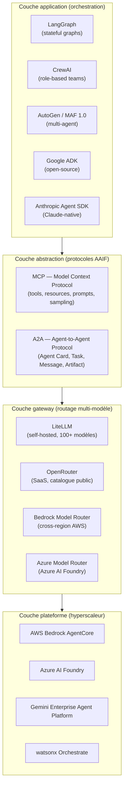
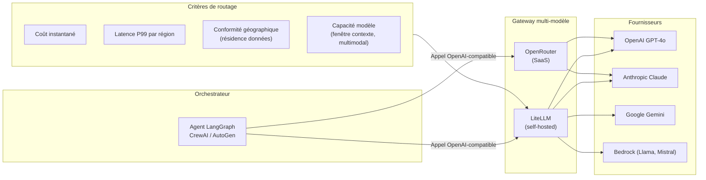

<!-- Notes de recherche — Phase 2 (archivé intégralement — 12 sources)

1. AWS Bedrock AgentCore 2026 — « Amazon Bedrock now offers OpenAI models, Codex, and Managed Agents (Limited Preview) » — AWS News Blog — avril 2026 — https://aws.amazon.com/about-aws/whats-new/2026/04/bedrock-openai-models-codex-managed-agents/ — Multi-vendor expansion : Bedrock ajoute modèles OpenAI et support d'agents gérés. Feature Supervisor with Routing Mode pour orchestration multi-agents. Apport : validation que Bedrock devient plus multi-fournisseur, mais resterait cloudlock au transport AWS.

2. Microsoft Azure AI Foundry — « Azure AI Foundry Agent Service Practical Guide: Enterprise Deployment Decisions for 2026 » — youngju.dev — avril 2026 — https://www.youngju.dev/blog/ai-platform/2026-04-12-azure-ai-foundry-agent-service-practical-guide.en — Azure-locked : agents tightly bound à subscriptions Azure, Entra ID, networking Azure. Soutient A2A, MCP pour interop. Apport : identification précise du lock-in Azure AI Foundry au niveau cloud/identity.

3. Google Vertex AI Agent Builder 2026 — « Google Cloud Next 2026: AI agents, A2A protocol, Workspace Studio » — thenextweb.com — mai 2026 — https://thenextweb.com/news/google-cloud-next-ai-agents-agentic-era — Vertex AI renommé Gemini Enterprise Agent Platform. A2A protocol natif. MCP support complet pour Google services (BigQuery, Maps, Compute Engine, Kubernetes Engine). Apport : Vertex AI comme first-mover A2A natif, avec edge vers portabilité inter-plateforme.

4. IBM watsonx Orchestrate 2026 — « Manage all your AI agents in one place with watsonx Orchestrate | IBM » — IBM official announcement — 2026 — https://www.ibm.com/new/announcements/manage-all-your-ai-agents-in-one-place-with-watsonx-orchestrate — Agent Catalog : support agents IBM, Langflow, LangGraph, A2A. Framework-agnostic orchestration. 150+ enterprise connectors. Apport : IBM comme joueur openness-first, multi-framework interop.

5. Salesforce Agent Fabric 2026 — « Salesforce Advances Agent Fabric: New Guided Determinism and Governance Controls » — Salesforce Newsroom — 2026 — https://www.salesforce.com/news/stories/agent-fabric-control-plane-announcement/ — Multi-vendor control plane : découverte agents Bedrock, Foundry, GoDaddy. Agent Broker beta avril 2026. GA juin 2026 (*à vérifier* — date confirmée dans le communiqué mais non encore effective à mai 2026). Limitation : full governance sur Agentforce seulement. Apport : cas de contrôle plan multi-vendor avec limites d'enforcement concrètes.

6. LiteLLM Gateway Patterns 2026 — « LLM Gateway Comparison 2026: OpenRouter, Cloudflare, LiteLLM, and RelayPlane » — relayplane.com — 2026 — https://relayplane.com/blog/llm-gateway-comparison-2026 — LiteLLM : open-source proxy MIT, Python, OpenAI-compatible, 100+ modèles. Stratégie : self-host, route anywhere, cost control. OpenRouter : SaaS managed. Apport : pattern de gateway multi-vendor comme alternative à lock-in propriétaire.

7. Vendor Lock-In Enterprise Agentic AI 2026 — « Enterprise Agentic AI Landscape 2026: Trust, Flexibility, and Vendor Lock-In » — Kai Waehner — avril 2026 — https://www.kai-waehner.de/blog/2026/04/06/enterprise-agentic-ai-landscape-2026-trust-flexibility-and-vendor-lock-in/ — Multi-model strategy pour éviter lock-in fournisseur. 86 % enterprises multi-cloud. AI vendor lock-in = coût de migration six chiffres par workload unique. Apport : chiffrage TCO migration, justification multi-cloud architecturale.

8. Open Agentic Stack vs Proprietary 2026 — « Top 5 AI Agent Frameworks 2026: LangGraph, CrewAI & More » — intuz.com — 2026 — https://www.intuz.com/blog/top-5-ai-agent-frameworks-2025 — LangGraph (stateful workflows), AutoGen (multi-agent), CrewAI (role teams), OpenAgents (finance), MetaGPT (software dev). Gap closed between open/proprietary sur coding benchmarks. Apport : paysage frameworks open-source com alternative.

9. A2A Protocol in Production — « Google Cloud Next 2026: AI agents, A2A protocol, Workspace Studio, and the full-stack bet against OpenAI and Anthropic » — thenextweb.com — mai 2026 — https://thenextweb.com/news/google-cloud-next-ai-agents-agentic-era — A2A : 150 organisations production, enabling scenarios Salesforce+Google+ServiceNow cross-vendor. Standard de fait pour multi-vendor orchestration. Apport : A2A maturité production, validation cross-vendor delegation.

10. MCP Adoption Across Platforms — « Multi-Agent AI Systems with Google Vertex AI, ADK, A2A, and MCP » — tietoevry.com — 2025-2026 — https://www.tietoevry.com/en/blog/2025/07/building-multi-agents-google-ai-services/ — MCP now available across Google, AWS (via Bedrock), Azure (via Foundry). Standard de facto pour tool abstraction. Apport : MCP convergence multi-vendor validation.

11. Multi-Vendor Governance and Portability 2026 — « Salesforce Stakes Out Multi-Vendor Agent Control Plane—Determinism, Governance, Enforcement Remains the Test » — futurumgroup.com — 2026 — https://futurumgroup.com/insights/salesforce-stakes-out-multi-vendor-agent-control-plane-determinism-governance-enforcement-remains-the-test/ — Control plane architecture pour multi-vendor agents. Challenges : deterministic orchestration, governance parity, enforcement. Apport : technical challenges multi-vendor governance identifiés.

12. Open Source vs Proprietary Trade-Offs 2026 — « Best Open-Source AI Agents 2026 | AgentGavel » — agentgavel.com — 2026 — https://agentgavel.com/blog/best-open-source-ai-agents-2026 — Open-source : customization, privacy, no lock-in. Proprietary : faster deployment, vendor support, tighter integration. Framework choice lock-in vs transport layer lock-in. Apport : articulation explicite des trade-offs open vs proprietary au niveau framework vs infrastructure.

-->

> **Partie 4 — Confiance, sécurité et durabilité**
> **Chapitre 10 · Scaling Without Lock-In · ~5 200 mots · lecture ≈ 20 min**

La conclusion de ce chapitre tient en une phrase : l'architecture qui évite le *lock-in* agentique ne choisit pas entre plateforme propriétaire et *stack* ouvert — elle isole la logique métier dans une couche d'abstraction (MCP + A2A) qui lui permet de cohabiter avec n'importe quel hyperscaleur sans en devenir tributaire. Les hyperscaleurs l'ont compris : en mai 2026, AWS Bedrock AgentCore, Azure AI Foundry, Google Gemini Enterprise Agent Platform, IBM watsonx Orchestrate et Salesforce Agent Fabric adoptent tous MCP et A2A comme couches standards. La convergence transforme ces protocoles d'option technique en infrastructure de fait. Pour l'architecte d'entreprise, cela modifie le problème : la question n'est plus « faut-il utiliser les protocoles ouverts ? » mais « dans quel ordre instrumenter la pile pour que le choix de plateforme reste réversible sans bloquer la livraison ? »

Ce chapitre s'appuie sur les fondations posées au [Ch. 5](ch05-protocols-interoperability.md) (MCP, A2A, AAIF — primitives et gouvernance) et au [Ch. 7](ch07-agentops.md) (cycle de vie d'un agent comme tuple versionnable). Il ne duplique pas ces fondations. Il les applique au problème de la portabilité à l'échelle, en articulant les décisions d'architecture qui déterminent si une organisation se retrouve captive dans 24 mois ou libre de changer de fournisseur sans réécriture.

---

## 10.1 — Lock-in agentique : nature et coût

Le terme *lock-in* recouvre trois phénomènes distincts que la majorité des équipes confondent, ce qui produit des mitigations ciblées sur la mauvaise couche.

**Lock-in de plateforme** : l'agent dépend du transport, de l'identité et du réseau d'un hyperscaleur unique. Les outils appellent AWS SDK directement, la mémoire est stockée dans DynamoDB sans couche d'abstraction, l'observabilité repose exclusivement sur CloudWatch, l'authentification passe par IAM AWS. Coût de migration documenté : six chiffres par workload unique, 18 à 36 mois pour une plateforme partagée (Kai Waehner, avril 2026). Irréversibilité principale : les données de production et les contrats de volume rendent le départ coûteux indépendamment de la qualité technique du travail de migration.

**Lock-in de *framework*** : la logique d'orchestration est écrite dans les primitives natives d'un SDK — LangGraph (`StateGraph`, `ToolNode`), CrewAI (`Crew`, `Task`, `Agent`), AutoGen (`AssistantAgent`, `ConversableAgent`) — sans wrapper d'isolation. Ce lock-in est plus faible que le lock-in de plateforme : migrer de LangGraph vers CrewAI est une réécriture de 3 à 12 mois selon la complexité des graphes d'état, pas de 36 mois. Mais il est invisible jusqu'au moment où l'organisation décide d'en sortir.

**Lock-in de modèle** : l'agent n'invoque qu'un seul fournisseur de LLM (*grand modèle de langage*) — OpenAI-only, Claude-only, Gemini-only — sans couche d'abstraction entre la logique applicative et l'API du fournisseur. Coût de migration le plus faible des trois si une gateway (*LiteLLM*, *OpenRouter*) est intégrée : jours à semaines. Sans gateway, le remplacement impose de modifier tous les points d'appel dans le code.

**Lock-in de mémoire** : les données d'entraînement *fine-tuned* spécifiques au fournisseur, les embeddings stockés dans une base vectorielle propriétaire, et les schémas de mémoire épisodique couplés à un SDK particulier créent un quatrième vecteur souvent ignoré. Un agent Bedrock *fine-tuned* sur données propriétaires AWS est verrouillé à Bedrock non par contractualisation mais par dépendance de données — même si le code source est entièrement portable.

| Type de lock-in | Coût de migration | Délai moyen | Irréversibilité principale | Priorité de mitigation |
|---|---|---|---|---|
| Plateforme (transport, identité, réseau) | 6-7 chiffres (workload unique) | 18-36 mois | Données de production + contrats volume | Critique |
| Mémoire (embeddings, fine-tuning) | 5-6 chiffres | 6-18 mois | Qualité modèle spécifique au fournisseur | Élevée |
| *Framework* (SDK, primitives) | 4-5 chiffres | 3-12 mois | Complexité graphes d'état | Modérée |
| Modèle (API fournisseur LLM) | 3-4 chiffres | Jours-semaines | Aucune, si gateway intégrée | Faible |

La matrice de priorité est directe : commencer par isoler la couche plateforme, puis protéger la mémoire, puis abstraire le *framework*, et enfin ajouter une gateway modèle. Les organisations qui inversent l'ordre — et elles sont nombreuses — investissent en abstraction LLM (facile, visible) pendant que le vrai risque s'accumule au niveau plateforme (difficile, invisible).

---

## 10.2 — Plateformes propriétaires : état de convergence (mai 2026)

La cartographie ci-dessous documente l'état des cinq plateformes majeures au 2026-05-05. Elle distingue cinq dimensions : support MCP natif, support A2A natif, présence d'un *backbone* open, structure tarifaire, et dimension principale de lock-in résiduel.

| Plateforme | MCP natif | A2A natif | *Backbone* ouvert | Structure tarifaire | Lock-in résiduel principal |
|---|---|---|---|---|---|
| AWS Bedrock AgentCore | Via serveurs tiers (pas natif) | Oui — AgentCore Runtime | LangGraph, AutoGen supportés | Compute + token + appels API | Transport (IAM, CloudWatch, réseau VPC) |
| Azure AI Foundry | Oui — Agent Service | Oui — natif | LangGraph, AutoGen, Semantic Kernel | Compute (Azure) + token | Identité (Entra ID, subscriptions) |
| Google Gemini Enterprise Agent Platform | Oui — services Google (BigQuery, Maps, GKE) | Oui — natif et first-mover | ADK (*Agent Development Kit*) open | Compute (GCP) + token | Données (BigQuery, Cloud Storage, GCP projects) |
| IBM watsonx Orchestrate | Partiel — *à vérifier* | Oui — Agent Catalog | LangFlow, LangGraph, BeeAI Framework | Licence watsonx + compute | Orchestrateur central propriétaire |
| Salesforce Agent Fabric | Partiel (Agentforce natif) | Oui — Agent Broker (GA juin 2026 *à vérifier*) | Découverte agents Bedrock, Foundry, GoDaddy | Licences Salesforce + usage | Gouvernance complète sur Agentforce uniquement |

Trois observations critiques ressortent de cette comparaison.

**Première observation.** La convergence MCP + A2A est réelle mais asymétrique. Google est le *first-mover* A2A natif — A2A est intégré dans l'ADK depuis le lancement, et 150 organisations l'utilisent en production (mai 2026, communiqué PRNewswire). Microsoft a intégré A2A dans Azure AI Foundry et Copilot Studio. AWS supporte A2A dans AgentCore Runtime mais ne l'expose pas nativement au niveau MCP — l'intégration MCP passe par des serveurs tiers. IBM supporte A2A dans l'Agent Catalog mais le support MCP natif reste *à vérifier* en source primaire.

**Deuxième observation.** Le lock-in résiduel n'est plus au niveau du protocole — il est au niveau des plans de données et d'identité. Azure est verrouillé par Entra ID et les subscriptions, pas par le protocole A2A. AWS est verrouillé par IAM et CloudWatch, pas par LangGraph. Google est verrouillé par les projets GCP et BigQuery, pas par l'ADK. Cette distinction est opérationnellement importante : instrumenter MCP + A2A correctement permet de changer de fournisseur LLM ou de *framework* d'orchestration sans réécriture, mais ne libère pas des plans de données et d'identité qui exigent un travail architectural distinct.

**Troisième observation — limitation Salesforce Agent Fabric.** L'architecture Agent Fabric est conçue pour la découverte multi-vendor : un Agent Broker central peut localiser et déléguer à des agents hébergés sur Bedrock, Foundry ou des fournisseurs tiers. La limitation architecturale est que le *enforcement* complet de la gouvernance — politiques de conformité, audit trails complets, kill switches — reste disponible uniquement pour les agents Agentforce natifs. Pour les agents tiers intégrés via Agent Broker, la gouvernance est partielle et dépend de la qualité de l'implémentation A2A côté fournisseur. Cette limitation est confirmée par l'analyse Futurum Group (2026) et constitue un risque pour les organisations qui souhaiteraient utiliser Agent Fabric comme plan de contrôle unifié réellement multi-vendor.

---

## 10.3 — *Open agentic stack* : composantes et AAIF

La *stack* ouverte d'agents en 2026 n'est pas un framework unique — c'est un assemblage de couches indépendantes, chacune substituable sans perturber les autres. L'AAIF (*Agentic AI Foundation*) sous la Linux Foundation fournit la gouvernance des deux couches de protocoles fondamentales ; les *frameworks* d'orchestration constituent la couche applicative au-dessus.

**LangGraph** (Apache 2.0) est le choix dominant pour les agents à état persistant complexe en 2026 : les graphes d'état (*StateGraph*) permettent de modéliser des flux de décision non linéaires, avec branchement conditionnel, cycles et *interrupts* pour le HITL (*human-in-the-loop*). Intégré nativement dans LangSmith pour l'observabilité. Risque de *framework lock-in* : les graphes LangGraph ne se compilent pas vers d'autres *frameworks* — une migration vers CrewAI ou AutoGen implique une réécriture partielle.

**CrewAI** (MIT) privilégie la modélisation par rôles : chaque agent a un rôle, un but et des outils définis explicitement. Approche plus déclarative que LangGraph, moins flexible pour les flux complexes mais plus lisible pour les équipes non spécialisées en ingénierie LLM.

**MAF 1.0** (*Multi-Agent Framework*, Microsoft Research, avril 2026 — *à vérifier* date exacte de disponibilité publique) et **AutoGen** partagent une architecture de type conversation multi-agents : les agents s'envoient des messages texte dans une topologie configurable (*round-robin*, *selector*, *graph*). Le pattern *debate* (débat entre agents pour converger) documenté dans arXiv:2504.16489 est un cas d'usage AutoGen ; il présente aussi les vulnérabilités de *jailbreak by delegation* documentées au [Ch. 9 §9.2](ch09-agentic-security.md).

**Google ADK** (*Agent Development Kit*, open-source) et **Anthropic Agent SDK** (Claude-native) sont les *frameworks* first-party de leurs éditeurs respectifs. Les deux exposent nativement MCP et A2A. Ils constituent des points d'entrée naturels si l'organisation est déjà sur GCP ou si Claude est le modèle de base — sans pour autant enfermer dans la plateforme si les couches d'abstraction sont correctement instrumentées.

La gouvernance de l'AAIF — *Governing Board* avec membres Platinum (AWS, Anthropic, Block, Bloomberg, Cloudflare, Google, Microsoft, OpenAI) et processus RFC public — garantit que MCP et A2A évoluent de façon coordonnée avec les implémentations hyperscaleur. Elle ne garantit pas la stabilité de l'API à court terme : OTel GenAI SemConv est en statut *Development* (mai 2026), et la date de release officielle de la spec A2A v1.0.0 n'est pas explicitement publiée dans les sources disponibles (*à vérifier* — voir [Ch. 5 §5.4](ch05-protocols-interoperability.md)).

---

## 10.4 — Portabilité par MCP/A2A : patrons d'abstraction

L'argument de portabilité repose sur un principe simple : si la couche outil et la couche coordination inter-agents sont toutes les deux exprimées en protocoles standards (MCP et A2A), alors changer le *framework* d'orchestration ou le fournisseur LLM ne nécessite pas de réécrire les intégrations.

Trois patrons concrets traduisent ce principe en décisions d'implémentation.

**Patron 1 — Serveur MCP comme unité de déploiement outil.** Chaque intégration avec un système externe (base de données, API métier, service cloud) est encapsulée dans un serveur MCP indépendant — déployé comme un microservice avec son propre cycle de vie. L'agent invoque le serveur MCP sans connaître l'implémentation interne. Si le fournisseur de base de données change, seul le serveur MCP est modifié ; l'agent, le *framework* et la gateway modèle ne sont pas touchés. La contrepartie est opérationnelle : chaque serveur MCP est un processus à opérer, à instrumenter (OTel), à sécuriser (authentification OAuth 2.1 *Client Credentials* pour flux *machine-to-machine*) et à versionner — charge opérationnelle non triviale pour des équipes qui débutent avec AgentOps. Voir [Ch. 7 §7.6](ch07-agentops.md) pour le cycle de vie du tuple agent + outils MCP.

**Patron 2 — Agent Card A2A comme contrat de délégation.** Tout agent qui peut recevoir des tâches d'un autre agent — y compris des agents hébergés sur une autre plateforme — publie une *Agent Card* JSON signée décrivant ses capacités, son endpoint, et ses exigences d'authentification. Ce contrat est indépendant de la plateforme qui héberge l'agent. Un agent sur Bedrock AgentCore peut déléguer à un agent sur Azure AI Foundry via A2A sans que l'un ou l'autre n'ait besoin de partager le même cloud ou le même *framework*. La production confirme ce scénario : en mai 2026, les 150 organisations A2A incluent des configurations Salesforce + Google + ServiceNow sans plateforme commune (The Next Web, mai 2026). La condition de succès : les deux agents doivent implémenter le cycle de vie de tâche A2A complet (SUBMITTED → WORKING → COMPLETED / FAILED / INPUT_REQUIRED) — une implémentation partielle côté agent délégué suffit à rompre la garantie de portabilité.

**Patron 3 — Observabilité OTel indépendante de la plateforme.** Le *lock-in* d'observabilité est subtil et souvent découvert trop tard : CloudWatch pour Bedrock, Azure Monitor pour Foundry, Cloud Trace pour Vertex — si l'instrumentation est couplée à ces backends propriétaires, la migration de plateforme implique aussi une migration de la pile d'observabilité, avec perte de données historiques. La mitigation est directe : instrumenter en OTel (*OpenTelemetry*) avec les conventions sémantiques GenAI (SemConv 1.40.0, statut *Development*) et router les traces vers un backend neutre (Datadog, Prometheus + Grafana, ou Elastic). Cette couche OTel est également la base des évaluations continues et des *shadow runs* documentés au [Ch. 7 §7.3](ch07-agentops.md).

Le [Ch. 5](ch05-protocols-interoperability.md) documente les surfaces d'attaque introduites par ces deux protocoles — *tool poisoning*, injection via *sampling*, RCE *supply chain*. Ces risques ne disparaissent pas avec l'adoption de MCP + A2A ; ils se déplacent vers la couche d'abstraction. L'architecte qui instrumente ces patrons doit simultanément instrumenter les contrôles de sécurité correspondants — voir [Ch. 9 §9.3](ch09-agentic-security.md).

---

## 10.5 — Stratégie multi-vendor : gateway patterns et routage

La *gateway* multi-modèle est la couche la moins discutée et la plus rapide à instrumenter. Elle opère entre la couche *framework* (LangGraph, CrewAI) et les APIs fournisseurs de LLM, exposant une interface unifiée compatible OpenAI vers le *framework* et routant dynamiquement les requêtes vers le fournisseur optimal selon des critères mesurables.

**LiteLLM** (open-source MIT, Python) est la référence auto-hébergée en 2026 : 100+ modèles supportés (OpenAI, Anthropic, Gemini, Bedrock, Mistral, Llama via Ollama), interface compatible OpenAI, *fallback* automatique sur panne fournisseur, suivi de budget par équipe ou par projet, *virtual keys* pour isoler les accès. Déploiement : conteneur Docker ou Kubernetes avec un fichier de configuration YAML déclarant les *models*, les *router_settings* et les *model_list*. Le coût d'opération est réel : LiteLLM est un composant critique du plan de données qui requiert haute disponibilité, monitoring et gestion de configuration.

**OpenRouter** est l'alternative SaaS : même catalogue, sans charge opérationnelle, avec marge commerciale sur les tokens. Pertinent pour les petites équipes ou les phases exploratoires ; à reconsidérer dès que le volume dépasse 10 M tokens/mois (*hypothèse* — seuil de rentabilité dépend du différentiel de prix par modèle).

**Bedrock cross-region inference** (AWS) et **Azure Model Router** (Azure AI Foundry) sont les gateway propriétaires des deux hyperscaleurs. Elles résolvent le routage par région (*cross-region failover*, résidence de données) dans le périmètre de leur cloud respectif, mais ne permettent pas le routage vers des modèles hors cloud. Utiles dans un déploiement AWS-primary ou Azure-primary qui accepte le lock-in plateforme mais veut diversifier les fournisseurs LLM *à l'intérieur* du même cloud.

Le routage par **coût** est le cas d'usage le plus immédiat : les prix des modèles LLM varient de deux à trois ordres de grandeur entre un modèle léger (*Gemini Flash*, *Claude Haiku*) et un modèle de raisonnement lourd (*o3*, *Claude Opus*). Une tâche de classification simple dirigée vers le bon modèle réduit le coût d'inférence de 80 à 95 % sans dégradation de qualité mesurable (*probable* — cohérent avec les pratiques FinOps documentées au [Ch. 2](ch02-business-case.md)).

Le routage par **latence** est critique pour les agents *client-facing* (support, interface conversationnelle) avec une contrainte P99 inférieure à 500 ms. La gateway mesure la latence par région et par modèle en temps réel et route la requête vers le fournisseur actuellement le plus rapide sur le segment géographique concerné.

Le routage par **conformité géographique** est le plus complexe opérationnellement et le plus important réglementairement en contexte UE ou canadien. Une requête contenant des données à caractère personnel au sens du RGPD (*Règlement général sur la protection des données*) ou de la Loi 25 Québec doit être traitée par un modèle hébergé dans une région conforme. Aucun hyperscaleur n'implémente ce routage nativement via A2A à mai 2026 — l'orchestrateur client doit implémenter la politique de routage et la gateway doit pouvoir l'appliquer au niveau de la requête individuelle, pas seulement au niveau du déploiement.

---

## 10.6 — Conformité géographique et résidence des données

La résidence des données est une contrainte orthogonale à la stratégie multi-vendor, mais elle détermine les options architecturales disponibles. Ce paragraphe résume les implications pour l'architecte *agentic* — le traitement normatif complet est au [Ch. 8 §8.4](ch08-trustworthy-systems.md).

L'EU AI Act (règlement UE 2024/1689) impose des obligations de transparence, de traçabilité et de documentation technique aux systèmes à *haut risque* applicables à partir du 2 août 2026. Les obligations de résidence de données stricto sensu relèvent du RGPD, pas de l'AI Act — mais les deux se combinent : un système *agentic* qui traite des données personnelles de ressortissants UE et qui s'appuie sur un modèle hébergé hors UE doit justifier le transfert (clauses contractuelles types, adéquation, ou exception applicable). Pour les institutions financières canadiennes, OSFI E-23 (en vigueur 1ᵉʳ mai 2027) exige un inventaire de modèles incluant les dépendances tierces — ce qui couvre explicitement les modèles LLM de fournisseurs externes.

Trois implications architecturales directes pour la *stack* agentique.

**Première implication.** Le routage de conformité doit être implémenté à la couche gateway, pas à la couche *framework*. Le *framework* (LangGraph, CrewAI) n'a pas de visibilité sur la région d'exécution du modèle — il délègue à la gateway. Si la gateway ne peut pas appliquer une politique de routage par région sur une base par-requête, le *framework* ne peut pas compenser.

**Deuxième implication.** La mémoire de l'agent est soumise aux mêmes contraintes de résidence que les données de production. Un agent qui stocke des conversations dans une base vectorielle hébergée hors de la région réglementaire crée une obligation de transfert de données distincte de l'inférence LLM. Les bases vectorielles managées (Pinecone, Weaviate Cloud, pgvector sur RDS) ont des configurations régionales — les valider explicitement avant déploiement.

**Troisième implication.** Aucun hyperscaleur n'implémente le routage multi-région natif via A2A à mai 2026 (*confirmé* — aucune source primaire disponible ne documente cette fonctionnalité). Pour les organisations UE et canadiennes, cela signifie que le plan de conformité géographique repose entièrement sur l'orchestrateur client et la gateway — deux composants dont la correctitude est critique et doit être auditée régulièrement. Un changement d'hyperscaleur principal (par exemple Bedrock → Foundry) peut invalider une configuration de conformité géographique validée, si les régions disponibles ou les engagements contractuels de résidence diffèrent entre les deux plateformes. Planifier cet audit dans toute migration de plateforme.

---

## 10.7 — Recommandation architecturale : modèle en couches isolées

La recommandation principale de ce chapitre est d'adopter une architecture à trois couches dont les responsabilités et les frontières sont explicites, versionnées et auditables.

**Couche 1 — Agent** : logique métier, prompts système, règles de décision, cycle de vie. Cette couche est indépendante de toute plateforme et de tout *framework* si elle est exprimée en termes de primitives MCP et A2A, pas en primitives SDK propriétaires. La logique de décision (quand escalader, quel outil appeler, comment interpréter les résultats) est la valeur de l'organisation — elle ne doit pas être couplée à LangGraph ou à Bedrock.

**Couche 2 — Abstraction** : serveurs MCP (un par domaine d'outil), contrats A2A (*Agent Cards* signées), gateway multi-modèle (LiteLLM ou équivalent), instrumentation OTel. Cette couche est le bouclier de portabilité. Son coût opérationnel est réel : plus de composants à opérer, plus de surfaces d'attaque à sécuriser (voir [Ch. 9](ch09-agentic-security.md) pour les contrôles MCP supply chain). Mais c'est le coût explicite de la portabilité.

**Couche 3 — Plateforme** : déploiement, identité, réseau. Le *lock-in* de plateforme est accepté à cette couche, mais il est *isolé*. L'isolation signifie que les Couches 1 et 2 ne contiennent aucune référence directe aux APIs, SDKs ou services propriétaires de la Couche 3. Si la Couche 3 change (Bedrock → Foundry), les Couches 1 et 2 ne sont pas modifiées.

**Compromis principal.** Cette architecture ajoute une couche d'indirection (Couche 2) qui consomme de la latence — entre 20 et 80 ms par saut de gateway selon les benchmarks LiteLLM disponibles (*à vérifier* — chiffres issus de benchmarks communautaires non contrôlés). Pour des agents *client-facing* avec une contrainte de latence stricte (P99 < 200 ms de réponse utilisateur), cette surcharge peut être inacceptable. Dans ce cas, l'alternative est de déployer la Couche 1 directement sur la Couche 3 (sans Couche 2), d'accepter le *lock-in* sur ces agents spécifiques, et de réserver l'architecture à trois couches aux agents *batch* et aux agents internes où la latence n'est pas contrainte. Cette décision doit être prise agent par agent, pas à l'échelle du portefeuille.

**Alternative principale.** Pour les organisations qui débutent ou dont les équipes n'ont pas la maturité AgentOps pour opérer la Couche 2, accepter le *lock-in* à court terme sur un hyperscaleur et investir dans la documentation exhaustive des couplages (quels outils, quelles APIs propriétaires, quels schémas de mémoire) pour faciliter la migration future. Cette décision de *lock-in* délibéré doit être formellement inscrite dans le registre d'architecture avec une date de réévaluation.

**Condition qui renverse la recommandation.** Si le portefeuille d'agents est inférieur à 5 agents, tous sur un même domaine métier, avec un seul fournisseur LLM et aucune exigence de conformité géographique stricte, la complexité opérationnelle de la Couche 2 n'est pas justifiée. La recommandation s'inverse : déployer directement sur la plateforme hyperscaleur, instrumenter a minima l'OTel pour préserver l'option de migration, et réévaluer à 12 mois quand le portefeuille atteint 5 à 10 agents.

---

## 10.8 — Timing de portabilité et transition vers le Ch. 11

La recommandation de timing est la suivante : **commencer l'instrumentation MCP + A2A maintenant, sur les nouveaux agents ; attendre 2027-2028 pour les bascules majeures sur les agents en production existants.** La justification est double.

D'un côté, la maturité des protocoles et de l'écosystème justifie l'instrumentation immédiate : MCP atteint 110 M+ téléchargements SDK par mois (MCP Dev Summit, avril 2026) ; A2A est en production dans 150 organisations ; les trois hyperscaleurs principaux adoptent formellement les deux protocoles. Le risque que MCP ou A2A soit abandonné dans les 18 prochains mois est faible (*probable* — évaluation subjective fondée sur la taille de l'écosystème AAIF et les engagements des membres Platinum, non sur une projection formelle).

De l'autre côté, la gouvernance de l'AAIF est encore en stabilisation. Les conventions sémantiques OTel GenAI sont en statut *Development* (mai 2026) — un changement de spec non rétrocompatible reste possible. La date de release officielle de A2A v1.0.0 n'est pas publiée. Les registres MCP présentent des vulnérabilités *supply chain* non résolues à ce jour (voir [Ch. 9 §9.4](ch09-agentic-security.md)). Pour des agents en production à fort volume, une migration prématurée sur une spec non stabilisée crée un risque de régression difficile à anticiper.

Deux marqueurs de maturité suffisante pour déclencher une migration majeure : (1) OTel GenAI SemConv passe en statut *Stable* (actuellement *Development*) ; (2) au moins un hyperscaleur publie un *SLA* (accord de niveau de service) formellement fondé sur la spec A2A v1.x. Aucun des deux n'est atteint à mai 2026.

Le chapitre suivant — [Ch. 11 : Redesigning Work, Not Augmenting It](ch11-redesigning-work.md) — opère la transition de la question technique (comment architecturer la *stack* pour que la plateforme soit substituable) à la question organisationnelle (comment restructurer les rôles et les processus pour que l'organisation soit capable d'exploiter cette flexibilité). La portabilité technique sans agilité organisationnelle produit des *stacks* abstraites que personne ne maîtrise suffisamment pour en changer. L'inverse — des équipes agiles sur une *stack* verrouillée — produit des cycles de réarchitecture coûteux qui absorbent la valeur créée. Les deux dimensions sont nécessaires.

---

## Pour aller plus loin

**Kai Waehner — « Enterprise Agentic AI Landscape 2026: Trust, Flexibility, and Vendor Lock-In »** (blog, avril 2026, https://www.kai-waehner.de/blog/2026/04/06/enterprise-agentic-ai-landscape-2026-trust-flexibility-and-vendor-lock-in/). Analyse pragmatique du TCO (*coût total de possession*) du lock-in agentique, avec chiffrage des coûts de migration par type de couplage. Point d'entrée recommandé pour un *business case* de portabilité à destination d'un comité de direction.

**Futurum Group — « Salesforce Stakes Out Multi-Vendor Agent Control Plane »** (2026, https://futurumgroup.com/insights/salesforce-stakes-out-multi-vendor-agent-control-plane-determinism-governance-enforcement-remains-the-test/). Analyse indépendante des limites architecturales d'Agent Fabric. Utile pour tout architecte qui évalue Salesforce comme plan de contrôle multi-vendor et doit cartographier les cas où la garantie de gouvernance ne tient pas.

**LiteLLM documentation officielle — « Getting Started »** (https://docs.litellm.ai/docs/). Documentation de référence pour l'implémentation d'une gateway multi-modèle auto-hébergée. La section *Router* documente les stratégies de *fallback*, de *load balancing* et de *retry* disponibles en production.

**AAIF — « MCP Is Now Enterprise Infrastructure »** (blog, avril 2026, https://aaif.io/blog/mcp-is-now-enterprise-infrastructure-everything-that-happened-at-mcp-dev-summit-north-america-2026/). Compte-rendu du MCP Dev Summit NYC (2-3 avril 2026) : adoption à l'échelle, cas Uber (5 000+ ingénieurs, 10 000+ services, 1 500+ agents actifs mensuels). Référence pour argumenter la maturité opérationnelle de MCP dans un contexte de déploiement à grande échelle.

**a2a-protocol.org — Spec v1.0.0** (https://a2a-protocol.org/latest/specification/). Spec normative de référence pour A2A. Indispensable avant toute implémentation de *Agent Card* ou de cycle de vie de tâche A2A en production.

---

## Références

- AWS — « Amazon Bedrock now offers OpenAI models, Codex, and Managed Agents (Limited Preview) » — AWS News Blog — avril 2026 — https://aws.amazon.com/about-aws/whats-new/2026/04/bedrock-openai-models-codex-managed-agents/ — accédée le 2026-05-05
- youngju.dev — « Azure AI Foundry Agent Service Practical Guide: Enterprise Deployment Decisions for 2026 » — 12 avril 2026 — https://www.youngju.dev/blog/ai-platform/2026-04-12-azure-ai-foundry-agent-service-practical-guide.en — accédée le 2026-05-05
- TheNextWeb — « Google Cloud Next 2026: AI agents, A2A protocol, Workspace Studio, and the full-stack bet against OpenAI and Anthropic » — mai 2026 — https://thenextweb.com/news/google-cloud-next-ai-agents-agentic-era — accédée le 2026-05-05
- IBM — « Manage all your AI agents in one place with watsonx Orchestrate » — IBM Announcement — 2026 — https://www.ibm.com/new/announcements/manage-all-your-ai-agents-in-one-place-with-watsonx-orchestrate — accédée le 2026-05-05
- Salesforce — « Salesforce Advances Agent Fabric: New Guided Determinism and Governance Controls to Scale Multi-Vendor AI Faster » — Salesforce Newsroom — 2026 — https://www.salesforce.com/news/stories/agent-fabric-control-plane-announcement/ — accédée le 2026-05-05
- RelayPlane — « LLM Gateway Comparison 2026: OpenRouter, Cloudflare, LiteLLM, and RelayPlane » — 2026 — https://relayplane.com/blog/llm-gateway-comparison-2026 — accédée le 2026-05-05
- Kai Waehner — « Enterprise Agentic AI Landscape 2026: Trust, Flexibility, and Vendor Lock-In » — 6 avril 2026 — https://www.kai-waehner.de/blog/2026/04/06/enterprise-agentic-ai-landscape-2026-trust-flexibility-and-vendor-lock-in/ — accédée le 2026-05-05
- Intuz — « Top 5 AI Agent Frameworks 2026: LangGraph, CrewAI & More » — 2026 — https://www.intuz.com/blog/top-5-ai-agent-frameworks-2025 — accédée le 2026-05-05
- Tietoevry — « Multi-Agent AI Systems with Google Vertex AI, ADK, A2A, and MCP » — 2025-2026 — https://www.tietoevry.com/en/blog/2025/07/building-multi-agents-google-ai-services/ — accédée le 2026-05-05
- Futurum Group — « Salesforce Stakes Out Multi-Vendor Agent Control Plane—Determinism, Governance, Enforcement Remains the Test » — 2026 — https://futurumgroup.com/insights/salesforce-stakes-out-multi-vendor-agent-control-plane-determinism-governance-enforcement-remains-the-test/ — accédée le 2026-05-05
- AgentGavel — « Best Open-Source AI Agents 2026 » — 2026 — https://agentgavel.com/blog/best-open-source-ai-agents-2026 — accédée le 2026-05-05
- PRNewswire / A2A Project — « A2A Protocol Surpasses 150 Organizations, Lands in Major Cloud Platforms, and Sees Enterprise Production Use in First Year » — 2026 — https://www.prnewswire.com/news-releases/a2a-protocol-surpasses-150-organizations-lands-in-major-cloud-platforms-and-sees-enterprise-production-use-in-first-year-302737641.html — accédée le 2026-05-05
- AAIF — « MCP Is Now Enterprise Infrastructure: Everything That Happened at MCP Dev Summit North America 2026 » — avril 2026 — https://aaif.io/blog/mcp-is-now-enterprise-infrastructure-everything-that-happened-at-mcp-dev-summit-north-america-2026/ — accédée le 2026-05-05
