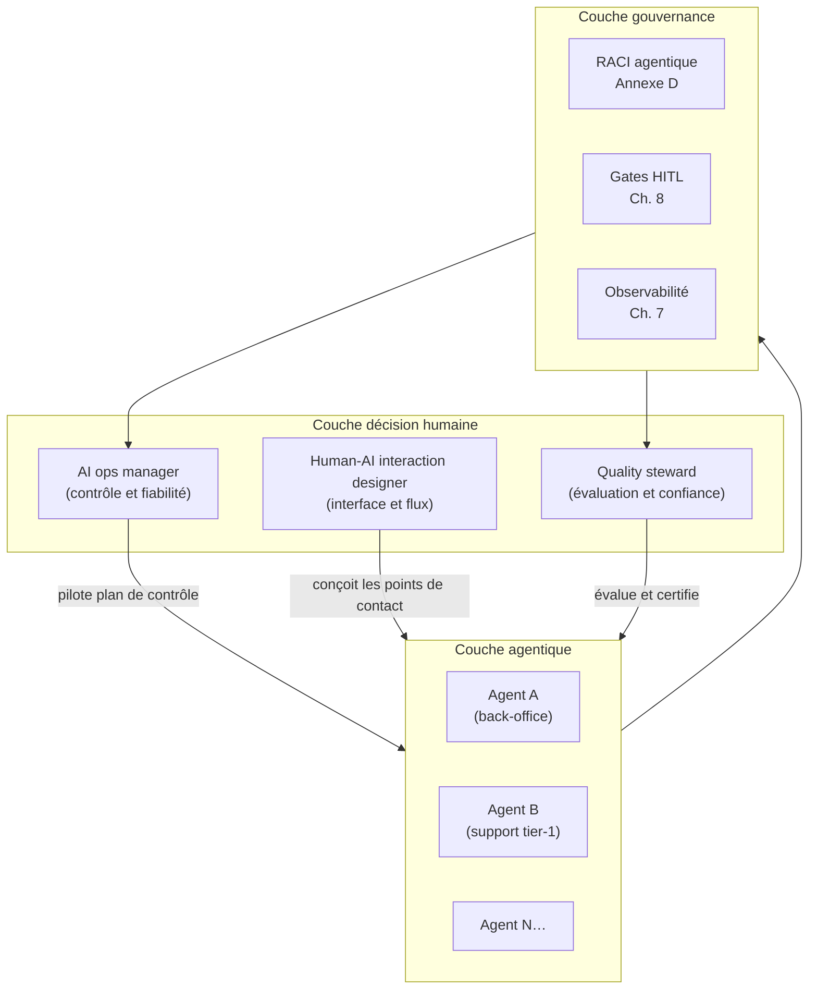
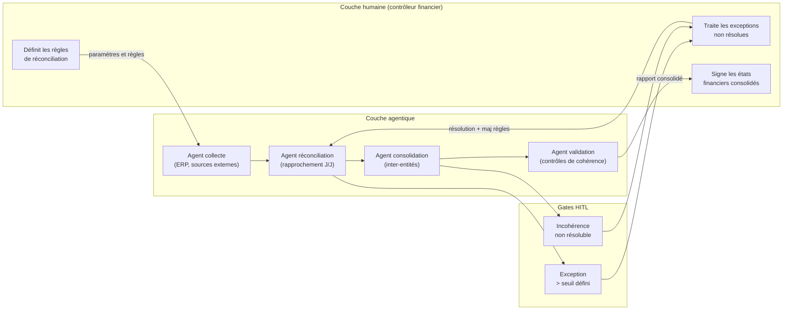

<!--
## Notes de recherche — Phase 2 (archivé intégralement — 12 sources)

1. Deloitte — « The State of AI in the Enterprise 2026 » — Deloitte AI Institute — mars 2026 — https://www.deloitte.com/us/en/what-we-do/capabilities/applied-artificial-intelligence/content/state-of-ai-in-the-enterprise.html — Enquête 3 235 dirigeants (director à C-suite), 24 pays, 6 industries ; données de terrain : seulement 34 % des organisations reimaginent produits/services/modèles d'affaires autour de l'IA ; 20 % seulement estiment leurs talents « hautement préparés » ; 21 % ont la gouvernance adéquate pour les agents autonomes. DIVERGENCE : le chiffre « 54 % » cité dans la TOC ne correspond PAS à la disruption organisationnelle du C-suite dans Deloitte — il se réfère à un chiffre Writer/Workplace Intelligence (54 % des C-suite qui disent que l'IA « déchire l'organisation »). Aucun chiffre de 54 % lié à la disruption C-suite n'est confirmé dans les sources Deloitte disponibles. Décision de rédaction : utiliser BCG/MIT SMR (76 % dirigeants voient l'IA agentique comme collègue, 45 % anticipent réduction managériale) et Deloitte sur les données vérifiées (34 %, 20 %, 21 %) — conformément aux décisions tranchées du prompt.

2. Deloitte — « The Agentic Reality Check: Preparing for a Silicon-Based Workforce » — Deloitte Tech Trends 2026 — 2026 — https://www.deloitte.com/us/en/insights/topics/technology-management/tech-trends/2026/agentic-ai-strategy.html — Source pour « silicon-based workforce » : encadrement conceptuel de la main-d'œuvre agentique comme nouvelle catégorie de travail. Seuls 14 % des organisations ont des solutions agentiques déployables ; 11 % utilisent en production. Concept opérationnel : « workslop » — applications agentiques mal conçues qui augmentent la charge plutôt que de la réduire. APPORT : distinction entre automatiser des processus humains existants vs repenser des flux de travail natifs agents.

3. Writer / Workplace Intelligence — « Enterprise AI Adoption in 2026 » — Writer + Workplace Intelligence — 7 avril 2026 — https://writer.com/blog/enterprise-ai-adoption-survey-results-press-release/ — Enquête 2 400 employés et cadres C-suite mondiaux. Chiffres confirmés : 92 % des C-suite cultivent une nouvelle classe d'« élites IA » ; 60 % planifient des licenciements pour non-adopteurs IA ; 29 % des employés admettent avoir saboté les déploiements IA ; 87 % des leaders rapportent que les super-utilisateurs IA sont au moins 5× plus productifs. DIVERGENCE SUR LE « 87 % upskilling » : ce chiffre Writer 2026 désigne la productivité des super-utilisateurs, PAS la priorisation de l'upskilling — statut *inconnu* pour un « 87 % upskilling » générique. Décision : ne pas utiliser le 87 % dans le contexte upskilling. Substituer avec Deloitte.

4. BCG / MIT Sloan Management Review — « The Emerging Agentic Enterprise: How Leaders Must Navigate a New Age of AI » — MIT SMR + BCG — novembre 2025 — https://sloanreview.mit.edu/projects/the-emerging-agentic-enterprise-how-leaders-must-navigate-a-new-age-of-ai/ — Enquête 2 102 répondants, 21 industries, 116 pays (printemps 2025). Chiffres confirmés : 35 % des organisations déploient déjà l'IA agentique ; 44 % planifient de le faire ; 76 % des dirigeants voient l'IA agentique comme « collègue » plutôt qu'outil ; 45 % des organisations à adoption étendue anticipent des réductions de couches managériales intermédiaires ; 29 % offriront moins de postes d'entrée de gamme ; 95 % des employés dans les organisations à adoption étendue rapportent que l'IA a amélioré leur satisfaction. Quatre tensions stratégiques : scalabilité vs adaptabilité, investissement vs emploi, supervision vs autonomie, refonte vs plaquage de processus.

5. HBR — « To Thrive in the AI Era, Companies Need Agent Managers » — Harvard Business Review — 12 février 2026 — https://hbr.org/2026/02/to-thrive-in-the-ai-era-companies-need-agent-managers — Auteurs : Suraj Srinivasan et Vivienne Wei. Cas Salesforce Agentforce : Zach Stauber, agent manager, gère une flotte d'agents IA sur support, ventes, marketing. Résultats : 74 % des cas de support résolus de façon autonome ; SDR passent de 12-15 prospects/jour à 350+ rendez-vous/semaine ; pipeline annualisé de 60 M$ ; 300+ nouveaux clients en 4 mois. Rôle défini : traduit les objectifs métier en instructions, paramètres et critères de succès pour les agents. L'expertise du domaine prime sur l'expertise IA.

6. HBR — « Agentic AI Is Already Changing the Workforce » — Harvard Business Review — mai 2025 — https://hbr.org/2025/05/agentic-ai-is-already-changing-the-workforce — Données sur le marché du travail : -17 % de postes dans les rôles à forte automatisation ; +22 % dans les postes à haute collaboration humain-IA (*à vérifier* sur article primaire complet).

7. Google Cloud — « AI Agent Trends 2026: Five Shifts That Will Redefine Roles, Workflows, and Business Value » — Google Cloud — 2026 — https://cloud.google.com/resources/content/ai-agent-trends-2026 — Cinq bascules identifiées ; statistique : 85 % des dirigeants anticipent que les employés s'appuieront sur les recommandations agents pour des décisions en temps réel en 2026 ; 88 % des adopteurs précoces voient un ROI positif. Taxonomie : flux de travail en « lignes d'assemblage numériques » (*digital assembly lines*).

8. Gartner — « Gartner Says AI Revolution and Cost Pressures Are Two Forces Driving the Top Four Trends for Talent Acquisition in 2026 » — Gartner Newsroom — 7 octobre 2025 — https://www.gartner.com/en/newsroom/press-releases/2025-10-07-gartner-says-ai-revolution-and-cost-pressures-are-two-forces-driving-the-top-four-trends-for-talent-acquisition-in-2026 — 55 % des leaders en chaîne d'approvisionnement anticipent que l'IA agentique réduira le besoin de postes d'entrée de gamme. Stratégie des leaders performants : upskiller pour travailler aux côtés de l'IA, pas embaucher des remplaçants.

9. ODSC / Open Data Science — « From Context Engineers to Chief AI Officers: Emerging AI Job Roles for 2026 » — Medium / ODSC — 2026 — https://odsc.medium.com/from-context-engineers-to-chief-ai-officers-emerging-ai-job-roles-for-2026-9f757603f547 — Panorama des nouveaux rôles 2026 : *context engineer*, *AI ops manager*, *human-AI interaction specialist*, *AI evaluation engineer*, *Chief AI Officer*. L'expertise de domaine prime sur l'expertise technique pour la plupart de ces rôles.

10. Forrester — « Predictions 2026: AI Agents, Changing Business Models, And Workplace Culture Impact Enterprise Software » — Forrester — 2026 — https://www.forrester.com/blogs/predictions-2026-ai-agents-changing-business-models-and-workplace-culture-impact-enterprise-software/ — Les applications d'entreprise passent de l'activation d'employés humains à l'accueil d'une main-d'œuvre numérique d'agents IA. Les leaders tech devront décider jusqu'où numériser les processus métier et orchestrer des flux de travail indépendants des travailleurs humains.

11. Stanford HAI — « The 2026 AI Index Report » — Stanford HAI — 2026 — https://hai.stanford.edu/ai-index/2026-ai-index-report — Rapport annuel de référence sur l'état de l'IA, incluant données sur impact emploi, compétences, adoption organisationnelle.

12. Klarna — Cas documenté de réorganisation 2024-2026 — Fortune (9 mai 2025), Fast Company, TechCrunch — Trajectoire confirmée : 7 000+ employés en 2022 → réduction à ~3 000 ; objectif <2 000 d'ici 2030 par attrition naturelle. Réembauche humaine en cours après reconnaissance des limites de l'IA en support complexe. CEO Sebastian Siemiatkowski : « We went too far. » Licenciement de Salesforce et Workday comme fournisseurs SaaS, remplacés par alternatives ou IA interne. HARMONISATION avec Ch. 2 : Ch. 2 cite 700 postes supprimés (chiffre officiel 2024) ; ce chapitre documente la trajectoire complète 2022-2026 avec réembauche partielle 2025.

-->

> **Partie 5 — Piloter la transition**
> **Chapitre 11 · Redesigning Work, Not Augmenting It · ~5 500 mots · lecture ≈ 22 min**

Plaquer de l'*agentic AI* sur des processus conçus pour des humains ne produit pas de transformation — cela produit du « workslop » (*probable* — terme issu de Deloitte Tech Trends 2026) : des applications agentiques qui augmentent la charge opérationnelle sous couvert d'automatisation, en ajoutant une couche d'approbations, d'exceptions non anticipées et de surveillance manuelle à un processus qui n'a pas été repensé. La conclusion est contre-intuitive mais traceable : la valeur stratégique de l'*agentic AI* est inaccessible à quiconque traite le déploiement comme un problème d'outillage plutôt que comme un problème de design organisationnel.

BCG et MIT Sloan Management Review (novembre 2025, n=2 102, 21 industries, 116 pays) ont identifié la ligne de partage empiriquement : les organisations qui redesignent leurs processus depuis les premiers principes — qui redéfinissent qui fait quoi, à quel niveau d'abstraction, sur quelle unité de décision — sont celles qui atteignent 95 % de satisfaction employés et des gains mesurables en productivité. Celles qui plaquent des agents sur des processus existants s'accumulent dans la cohorte du 40 % que Gartner prédit abandonnée avant 2027, pour des raisons qui ne sont pas techniques mais organisationnelles : valeur métier floue, résistance interne, absence de nouveaux rôles capables d'opérer la surface agentique déployée.

Ce chapitre établit les trois décisions structurelles qui séparent ces deux trajectoires. Il s'appuie sur les fondations AgentOps posées au [Ch. 7](ch07-agentops.md), sur le modèle HITL (*human-in-the-loop*) du [Ch. 8](ch08-trustworthy-systems.md), et sur la portabilité architecturale du [Ch. 10](ch10-scaling-without-lockin.md) — non pour les répéter, mais pour en tirer les implications organisationnelles. L'architecture technique parfaite sans structure organisationnelle alignée produit une *stack* agentique que personne ne maîtrise. L'inverse — des équipes restructurées sur une architecture inadéquate — produit des cycles de réarchitecture qui absorbent la valeur créée.

---

## 11.1 — Pourquoi l'augmentation seule ne suffit pas

Augmenter signifie ajouter un outil à un rôle existant. Redesigner signifie redéfinir qui fait quoi, à quel niveau d'abstraction, sur quelle unité de décision — et quels rôles n'existent plus dans leur forme actuelle. La distinction n'est pas sémantique : elle détermine le modèle d'investissement, la structure d'équipe et le type de change management requis.

Les données BCG/MIT SMR établissent la posture du terrain en 2025-2026 : 35 % des organisations déploient déjà l'*agentic AI*, 44 % planifient de le faire, mais la fraction qui redesigne effectivement est minoritaire. Deloitte State of AI 2026 (n=3 235, 24 pays) documente le fossé : seulement 34 % des organisations reimaginent leurs produits, services ou modèles d'affaires autour de l'IA — les 66 % restants cherchent à intégrer l'IA dans ce qui existe. Vingt pour cent seulement estiment leurs talents « hautement préparés » pour opérer des agents en production. Vingt et un pour cent ont une gouvernance adéquate pour les agents autonomes. Ces trois chiffres ne sont pas des indicateurs de retard — ce sont les symptômes d'une approche d'augmentation qui évite de poser la question du redesign.

La mécanique du plaquage est simple à illustrer : un processus de validation de crédit en cinq étapes humaines, augmenté d'un agent IA qui assiste à l'étape trois, reste un processus de cinq étapes avec une couche supplémentaire de coordination. Le temps de cycle peut s'améliorer marginalement ; la structure de coût reste la même ; les goulets d'étranglement se déplacent mais ne disparaissent pas. Un processus redesigné pour des agents peut passer à deux étapes humaines — définition des règles de crédit et traitement des exceptions irréversibles — et N étapes agentiques exécutées en parallèle. Le rapport de productivité n'est pas marginal : il est structurel.

BCG/MIT SMR formalise quatre tensions stratégiques que toute organisation en transition doit résoudre explicitement, sous peine de laisser la décision se faire par défaut :

| Tension | Pôle « plaquage » | Pôle « redesign » | Signal de position |
|---|---|---|---|
| Scalabilité vs adaptabilité | Dupliquer ce qui fonctionne | Reconstruire pour ce qui est possible | Proportion de nouveaux processus natifs agents |
| Investissement vs emploi | Réduire les coûts salariaux | Élever la capacité par collaborateur | Ratio coût par résultat vs coût par poste |
| Supervision vs autonomie | Maintenir l'approbation humaine systématique | Confier les exceptions à l'humain uniquement | Taux d'escalade vs taux d'intervention |
| Plaquage vs refonte | Greffer l'IA sur les processus existants | Redesigner depuis les premiers principes | Part des processus repensés vs augmentés |

La tension la plus sous-estimée est supervision vs autonomie. Le modèle HITL opérationnel défini au [Ch. 8 §8.2](ch08-trustworthy-systems.md) — *humans set rules, agents execute, exceptions escalate* — exige que l'humain soit repositionné sur l'exception, pas sur chaque action. Une organisation qui maintient l'approbation humaine systématique sur des décisions routinières a opté pour le plaquage par défaut, indépendamment de la sophistication technique de ses agents.

Le signal Gartner (octobre 2025) complète ce tableau : 55 % des leaders en chaîne d'approvisionnement anticipent que l'*agentic AI* réduira le besoin de postes d'entrée de gamme. La réponse des organisations performantes n'est pas de gérer l'attrition passive — c'est de redesigner les trajectoires de carrière autour des nouveaux rôles hybrides avant que la pression ne s'accumule. La recommandation architecturale de cette section est directe : avant tout déploiement agentique, cartographier les processus cibles sur la matrice autonomie × réversibilité × tolérance-erreur définie au [Ch. 3](ch03-mapping-high-impact.md), et identifier explicitement les étapes qui deviennent agentiques, les étapes qui restent humaines, et les étapes qui disparaissent. Cette cartographie est le document fondateur du redesign — sans elle, chaque décision d'architecture technique est prise dans le vide organisationnel.

---

## 11.2 — Trois nouveaux rôles structurants

Le marché du travail *agentic* bifurque empiriquement : -17 % de postes dans les rôles à forte automatisation, +22 % dans les postes à haute collaboration humain-IA (HBR, mai 2025 — *à vérifier sur article primaire complet*). Cette bifurcation ne se gère pas par des programmes de formation génériques — elle exige la définition délibérée des rôles qui occupent la jonction entre humains et agents, et qui n'existaient pas dans les organigrammes de 2023.

Trois rôles structurants émergent de la confluence des sources disponibles (HBR, ODSC, BCG/MIT SMR) comme nécessaires dans toute organisation dont la surface agentique dépasse cinq agents en production.

### *AI ops manager* (contrôle et fiabilité à l'échelle)

L'*AI ops manager* assure que les agents fonctionnent de façon fiable à l'échelle — infrastructure, pipelines d'automatisation, gouvernance des périmètres de permission, budgets de *retry*, *kill switches*, mise à jour des règles métier encodées dans les agents. Ce rôle est la matérialisation humaine du plan de contrôle AgentOps documenté au [Ch. 7 §7.6](ch07-agentops.md) : quelqu'un doit piloter les *dashboards* de dérive, décider des promotions et des rollbacks, et escalader les incidents qui dépassent les seuils automatiques.

La compétence primaire n'est pas l'ingénierie LLM — c'est la connaissance du processus métier que les agents opèrent, couplée à la capacité de lire une trace d'observabilité et d'en tirer une décision opérationnelle. L'*AI ops manager* est à l'AgentOps ce que le SRE (*Site Reliability Engineer*) est aux systèmes distribués : le profil qui transforme l'instrumentation technique en fiabilité opérationnelle.

### *Human-AI interaction designer* (interface et flux hybrides)

Le *human-AI interaction designer* conçoit les flux de travail hybrides — pas l'interface graphique au sens classique, mais la géographie de la collaboration : à quel moment l'humain intervient, sous quelle forme l'exception lui est présentée, comment le contexte accumulé par l'agent est rendu intelligible pour une décision humaine en moins de 30 secondes. Ce rôle intègre l'UX design (*user experience*), le *prompt engineering* au niveau système, et la psychologie comportementale : concevoir pour un humain qui supervise des dizaines de flux agentiques simultanément exige de comprendre les biais cognitifs de la vigilance dégradée, pas seulement les principes de l'interface intuitive.

La distinction avec le designer UX classique est précise : le designer UX modélise le comportement de l'utilisateur ; le *human-AI interaction designer* modélise simultanément le comportement de l'utilisateur et le comportement de l'agent, et optimise leur point de contact. ODSC (2026) identifie ce rôle sous l'appellation *human-AI interaction specialist* — la monographie retient le terme *designer* pour souligner la dimension de conception de flux, pas seulement d'interface.

### *Quality steward* (évaluation continue en production)

Le *quality steward* mesure la qualité des agents IA en production — construction et maintenance des ensembles d'évaluation, simulation d'interactions limites, identification précoce des modes d'échec, analyse des cas d'escalade pour en extraire des patterns. Ce rôle donne une chair opérationnelle aux métriques *task success*, *tool correctness* et *policy compliance* définies au [Ch. 4](ch04-roi-risk-readiness.md) et instrumentées au [Ch. 7](ch07-agentops.md) : quelqu'un doit posséder ces métriques, les interpréter dans leur contexte métier, et en tirer des décisions de promotion ou de rollback.

> **Note terminologique** : la littérature industrielle (ODSC 2026) utilise le terme *AI evaluation engineer* pour ce rôle. La monographie retient *quality steward* comme terme maison pour souligner la dimension de responsabilité continue sur la qualité — pas seulement l'ingénierie des tests, mais la gardiennage de la confiance opérationnelle dans les agents déployés.

Le tableau suivant positionne les trois rôles sur quatre dimensions opérationnelles :

| Rôle | Compétence primaire | Compétence secondaire | Objet quotidien | Lien AgentOps |
|---|---|---|---|---|
| *AI ops manager* | Connaissance du processus métier + lecture de traces | Gouvernance, gestion du risque | Plan de contrôle, incidents, promotions/rollbacks | [Ch. 7 §7.6](ch07-agentops.md) : plan de contrôle |
| *Human-AI interaction designer* | UX design + psychologie comportementale | *Prompt engineering* système, design de flux | Points d'escalade, interfaces d'exception, flux hybrides | [Ch. 7 §7.2](ch07-agentops.md) : observabilité des gates HITL |
| *Quality steward* | Métriques d'évaluation + analyse des modes d'échec | Statistiques, connaissance du domaine | Ensembles d'évaluation, analyse escalades, décisions qualité | [Ch. 7 §7.5](ch07-agentops.md) : évaluation en production |

Ces trois rôles ne remplacent pas les rôles existants — ils s'y ajoutent ou en transforment une fraction. L'*AI ops manager* émerge souvent d'un profil opérations IT ou BPO (*Business Process Outsourcing*) reconverti. Le *quality steward* peut provenir d'un rôle d'assurance qualité ou d'analyste métier. Le *human-AI interaction designer* est le plus nouveau : il n'existe pas de filière établie à mai 2026, et les organisations pionnières le construisent par hybridation interne.

---

## 11.3 — Hybrid workflows : design depuis les premiers principes

Un flux de travail hybride performant n'est ni un processus humain avec IA ajoutée, ni un processus entièrement automatisé avec supervision humaine décorative. C'est un système redesigné depuis les premiers principes autour d'une ligne de partage explicite : ce que l'agent fait mieux que l'humain (volume, cohérence, parallélisme, mémoire de règles complexes), et ce que l'humain fait mieux que l'agent (jugement contextuel sur des situations inédites, décisions irréversibles à fort impact, relations à enjeu élevé).

Google Cloud (2026) nomme le modèle le plus courant en production la « ligne d'assemblage numérique » (*digital assembly line*) : un flux humain-guidé orchestrant des agents multiples bout en bout, où l'humain définit les paramètres en entrée et approuve le résultat en sortie, tandis que les agents exécutent toutes les étapes intermédiaires. Ce modèle est séduisant mais contient deux erreurs symétriques de design.

**Erreur par excès de supervision** : laisser l'humain approuver chaque étape intermédiaire d'un flux agentique — parce que la gouvernance est mal définie, parce que l'organisation n'a pas confiance dans les agents, ou parce que les escalades ont été mal calibrées — transforme le flux hybride en goulot d'étranglement humain avec une couche d'IA qui ne sert à rien. La productivité diminue par rapport au processus entièrement humain, car l'humain perd le fil du raisonnement à chaque intervention. C'est le workslop dans sa forme la plus documentée.

**Erreur par insuffisance de supervision** : laisser l'agent décider sans point de contrôle humain sur les exceptions irréversibles produit le risque opérationnel documenté au [Ch. 8](ch08-trustworthy-systems.md) — l'incident Replit (suppression de 1 206 enregistrements de production malgré instruction de gel) en est l'illustration la plus précise disponible. L'erreur n'est pas technique : c'est une erreur de design de flux qui n'a pas identifié quelle classe d'action requiert un gate humain.

Les quatre principes de design qui permettent d'éviter ces deux erreurs sont directement dérivables des fondations posées aux chapitres précédents :

**Principe 1 — Séparation des décisions par réversibilité.** Les décisions réversibles (extraction de données, classification, rédaction de brouillons, résumé) sont déléguées à l'agent sans approbation intermédiaire. Les décisions irréversibles à fort impact (envoi d'une communication externe, modification d'un enregistrement réglementaire, exécution d'un paiement supérieur à un seuil défini) requièrent un gate humain explicite. Ce seuil est une décision métier, pas technique, et doit être documenté dans le RACI agentique ([Annexe D](annexe-D-governance-raci.md)). La matrice de référence est au [Ch. 8 §8.1](ch08-trustworthy-systems.md) (niveaux N1-N4 d'autonomie).

**Principe 2 — Élévation du niveau d'abstraction humain.** Dans un flux hybride bien designé, l'humain opère à un niveau d'abstraction supérieur à celui des agents : il définit les règles, fixe les critères d'exception, approuve les exceptions — il n'exécute pas les étapes. Cela exige de redesigner les critères de performance de l'humain en conséquence : un analyste crédit dans ce modèle est évalué sur la qualité de ses décisions d'exception et sur la pertinence des règles qu'il définit, pas sur le volume de dossiers traités manuellement.

**Principe 3 — Boucle de feedback bidirectionnelle.** L'agent remonte les exceptions inhabituelles à l'humain ; l'humain met à jour les règles sur la base des patterns d'exceptions. Ce mécanisme transforme chaque interaction d'exception en signal d'apprentissage organisationnel. Sans cette boucle, les agents accumulent les exceptions sans amélioration, et les humains perdent progressivement la compréhension du flux réel. L'instrumentation de cette boucle est une responsabilité du *quality steward* (§11.2) et doit être visible dans l'observabilité AgentOps ([Ch. 7 §7.2](ch07-agentops.md)).

**Principe 4 — Instrumentation dès le design.** Aucun flux hybride ne peut être piloté sans observabilité des *spans* agentiques et des *gates* humains. Ajouter l'instrumentation après coup produit des lacunes dans les traces — précisément là où les décisions critiques ont eu lieu. La règle opérationnelle : si une étape du flux produit un effet sur l'environnement (écriture, envoi, modification), elle doit générer un *span* OTel avec le contexte de décision. Ce n'est pas négociable dans un environnement réglementaire soumis à l'EU AI Act (en vigueur pour les systèmes à haut risque au 2 août 2026) ou à la Loi 25 Québec.

Le cas Salesforce Agentforce (HBR, février 2026) illustre ce que ces principes produisent en pratique. Avant le redesign, le flux de support client était linéaire et humain : chaque ticket était assigné à un agent humain qui en gérait l'intégralité. Après redesign, l'agent IA traite 74 % des cas de façon autonome en appliquant des règles définies par l'*AI ops manager* et validées par le *quality steward*. Les 26 % restants — cas complexes, réclamations à risque réglementaire, situations émotionnelles — sont escaladés à des agents humains qui opèrent maintenant exclusivement sur les cas à valeur ajoutée. Le SDR (*Sales Development Representative*) passe de 12-15 prospects traités par jour à 350+ rendez-vous qualifiés par semaine — non parce que le même humain travaille davantage, mais parce que l'humain s'est repositionné sur la décision stratégique pendant que l'agent gère le volume.

L'anti-patron symétrique est Klarna. Entre 2022 et 2024, Klarna a réduit ses effectifs de plus de 4 000 postes en automatisant le service client avec des agents IA, passant de 7 000+ employés à environ 3 000. L'annonce officielle de 700 suppressions de postes citée au [Ch. 2 §2.4](ch02-business-case.md) représentait une tranche de cette trajectoire plus longue. Le résultat documenté en 2025 (Fortune, 9 mai 2025) : baisse mesurable de la satisfaction client, réembauche partielle en mode hybride à partir de 2025, et la déclaration du CEO Sebastian Siemiatkowski — « We went too far ». Le problème n'était pas la technologie agentique : c'était l'absence de redesign des flux de traitement des cas complexes et l'absence de définition explicite des cas où l'humain reste irremplaçable.

---

## 11.4 — Change management : transformer sans résistance structurelle

Le *change management* agentique échoue lorsqu'il est traité comme un programme de formation. Il réussit lorsqu'il est traité comme une reconception des incitations, des structures de pouvoir et des critères de performance. Cette distinction est rarement formulée explicitement dans les feuilles de route de transformation — et sa conséquence est que 29 % des employés admettent avoir saboté activement les déploiements d'IA dans leur organisation (Writer / Workplace Intelligence, avril 2026).

Ce chiffre n'est pas un signal de mauvaise foi généralisée — c'est un signal de conception défaillante. Quand les employés ne comprennent pas l'impact de l'IA agentique sur leur poste, quand aucune trajectoire de rôle n'est communiquée, et quand leurs critères de performance restent inchangés pendant que les outils changent, la résistance est une réponse rationnelle. Les organisations qui investissent massivement dans la technologie et zéro dans la restructuration des incitations produisent exactement ce résultat.

Writer et Workplace Intelligence (2026) documentent par ailleurs que 92 % des C-suite cultivent délibérément une nouvelle classe d'« élites IA » — les super-utilisateurs qui s'approprient les agents et les exploitent pour atteindre des niveaux de productivité 5× supérieurs aux non-utilisateurs. Le risque organisationnel de cette stratégie non accompagnée d'un programme de transition : elle polarise l'organisation entre les 8 % d'élites et les 92 % restants, accélère la résistance plutôt que de la réduire, et produit une dette de compétences structurelle qui ralentit le déploiement à l'échelle.

Deloitte State of AI 2026 documente la réponse des organisations qui gèrent activement cette transition : 53 % éduquent l'ensemble de leur population (formation généralisée à l'IA, literacy de base, utilisation des outils) et 48 % conçoivent des stratégies formelles d'*upskilling* et de *reskilling* ciblées sur les rôles les plus impactés. Ces deux approches ne sont pas mutuellement exclusives — elles opèrent à des niveaux différents : la formation généralisée adresse la peur et la résistance ; la stratégie d'*upskilling* ciblée adresse la reconversion opérationnelle.

Les trois raisons d'échec du *change management* agentique sont identifiables et évitables :

**Raison 1 — Formation sans redesign des incitations.** Former à l'utilisation des agents IA sans modifier les critères de performance produit des employés formés qui ne changent pas leur comportement, parce que leur évaluation reste fondée sur des métriques de volume qui ne valorisent pas l'utilisation des agents. Un analyste financier évalué sur le nombre de rapports produits manuellement n'a aucun intérêt à déléguer la production à un agent.

**Raison 2 — Déploiement sans communication sur la trajectoire des rôles.** L'absence de visibilité sur l'impact de l'IA sur un poste spécifique — quel contenu du rôle disparaît, quel contenu se transforme, quelle nouvelle compétence devient critique — alimente l'anxiété et la résistance. La communication proactive sur la trajectoire n'est pas un exercice de relations publiques internes : c'est une condition opérationnelle pour obtenir l'adhésion nécessaire à un déploiement à l'échelle.

**Raison 3 — Pilotes sans plan de transition.** Déployer un agent en pilote sur un sous-ensemble du flux de travail sans définir ce que les humains font après que l'agent prend les tâches automatisables produit deux issues également mauvaises : soit les humains restent à proximité du processus sans charge de travail réelle (workslop humain), soit le pilote réussit et personne ne sait comment passer à l'échelle sans éliminer des postes sans plan de reconversion.

Un programme de *change management* efficace pour un déploiement *agentic* contient au minimum quatre composantes :

**Cartographie des rôles impactés par type.** Pour chaque rôle concerné par le déploiement, identifier explicitement : quel contenu de tâche disparaît (automatisé par l'agent), quel contenu se transforme (l'humain opère à un niveau d'abstraction supérieur), quel contenu reste intact (expertise de domaine, relation, jugement irréversible), et quel contenu nouveau émerge (*AI ops manager*, *quality steward*, *human-AI interaction designer*). Cette cartographie est l'entrée du plan de *reskilling* — sans elle, le plan est générique et inefficace.

**Communication sur la trajectoire avec délai et critères.** Pas une annonce, mais un dispositif continu : à quelle vitesse l'automatisation progressera, selon quels critères les décisions de transition de rôle seront prises, et quel est le mécanisme de recours pour les employés dont le rôle est substantiellement modifié. La transparence sur les critères de décision — même quand ils impliquent des réductions d'effectif — produit moins de résistance que l'opacité.

**Upskilling ciblé sur les nouveaux rôles.** Les données Deloitte (48 % des organisations conçoivent des stratégies formelles d'*upskilling*) indiquent que les organisations les plus avancées ne traitent pas l'*upskilling* comme une obligation sociale — elles le traitent comme un investissement en capital humain qui conditionne la vitesse du déploiement à l'échelle. L'*upskilling* ciblé vers les rôles de *quality steward* et d'*AI ops manager* a un retour sur investissement direct et mesurable : chaque *quality steward* opérationnel permet de maintenir X agents en production avec un niveau de risque maîtrisé.

**Structures de pilotage claires.** Le RACI agentique ([Annexe D](annexe-D-governance-raci.md)) n'est pas seulement un artefact de gouvernance technique — c'est l'instrument qui clarifie les responsabilités pendant et après la transition, et qui transforme les décisions de redesign en engagements nommés. Sans RACI, la question « qui décide de rollback un agent en production » n'a pas de réponse claire, et les crises produisent des paralysies.

### Recommandation : redesign délibéré vs augmentation incrémentale

La recommandation de ce chapitre est de privilégier le redesign délibéré sur l'augmentation incrémentale pour les processus à fort potentiel agentique, en acceptant une période de transition plus longue en échange d'un gain structurel plus élevé.

**Compromis principal.** Le redesign délibéré exige un investissement amont plus élevé en cartographie, en design de flux, en définition des nouveaux rôles et en *change management* — sur un horizon de 6 à 18 mois selon la complexité du processus. L'augmentation incrémentale livre un bénéfice visible plus tôt (réduction de 20 à 40 % du temps d'exécution d'une étape spécifique) mais plafonne rapidement et accumule une dette organisationnelle sous forme de processus hybrides non conçus qui nécessiteront un redesign ultérieur de toute façon.

**Alternative crédible.** Pour les processus à faible réversibilité de l'action (faible risque d'effets irréversibles) et à complexité faible (flux linéaires, règles de décision explicites), l'augmentation incrémentale est une stratégie valide à court terme — elle permet d'accumuler de l'expérience opérationnelle avec les agents, de former les équipes dans le contexte réel, et de construire les données d'évaluation nécessaires à un redesign plus ambitieux en phase deux. Le [Ch. 3](ch03-mapping-high-impact.md) fournit la matrice de qualification.

**Condition qui renverse la recommandation.** Si l'organisation n'a pas encore de *quality steward* ni d'*AI ops manager* opérationnels, le redesign délibéré à grande échelle est prématuré : les agents redésignés pour opérer de façon autonome sur des flux critiques sans la capacité humaine de les surveiller et de les corriger créent plus de risque qu'ils n'en réduisent. Dans ce cas, l'augmentation incrémentale sur des périmètres bornés, combinée à la formation prioritaire des rôles de jonction, est la séquence correcte.

---

## 11.5 — Cas concret : redesign d'une fonction back-office (clôture financière)

La fonction de clôture financière mensuelle — réconciliation, rapprochement des comptes, consolidation, production des états financiers — est l'un des cas back-office les plus documentés de redesign agentique réussi, parce qu'elle combine des volumes de données traçables, des règles de décision explicites, et des exceptions bien définies qui exigent un jugement humain.

**État de départ (processus augmenté).** Un processus de clôture augmenté typique ajoute un agent d'extraction de données qui automatise la collecte depuis les ERP, et un agent de réconciliation qui signale les écarts. Le contrôleur financier reste responsable de l'ensemble de la vérification, travaille sur les signaux produits par les agents, et valide chaque poste. Résultat observé : réduction du temps de collecte de 40 %, mais temps global de clôture réduit de 15 % seulement — parce que le goulot humain de vérification n'a pas changé de nature.

**État redesigné.** Le processus redesigné repositionne le contrôleur financier sur trois rôles exclusifs : définition des règles de réconciliation (seuils de tolérance, règles d'exception par catégorie de compte, critères de déclenchement d'une investigation), validation des exceptions non résolues par les agents, et signature des états financiers consolidés. Les agents exécutent l'intégralité de la chaîne de traitement standard — collecte, rapprochement, validation croisée, réconciliation inter-entités, consolidation préliminaire — et escaladent uniquement les exceptions qui sortent des règles définies.

**Étapes opérationnelles du redesign.** La transition du premier état au second suit six étapes, dont les deux premières sont organisationnelles, non techniques :

1. **Cartographie des exceptions.** Analyser 12 mois de données de clôture pour identifier la distribution des exceptions : quelles catégories, à quelle fréquence, avec quel délai de résolution. Cette analyse détermine le volume d'escalade que l'humain devra traiter après redesign et permet de calibrer la charge résiduelle.

2. **Définition des règles d'escalade.** Traduire les heuristiques implicites du contrôleur financier en règles explicites : quels écarts sont automatiquement acceptables (< X % sur les catégories Y), lesquels déclenchent une vérification automatisée supplémentaire, lesquels exigent un gate humain. C'est le travail le plus critique et le plus sous-estimé du redesign — il requiert de rendre explicite ce qui était tacite.

3. **Design du flux hybride.** Spécifier l'architecture des agents (collecte, réconciliation, consolidation, validation) avec leurs contrats d'escalade, leurs seuils d'autonomie par étape, et leurs exigences d'observabilité. Chaque agent produit un *span* OTel pour chaque décision de classification d'exception.

4. **Pilote sur périmètre borné.** Déployer sur une entité juridique ou une catégorie de comptes, avec le contrôleur financier en supervision active, pour valider les règles d'escalade et identifier les cas non anticipés. Cette étape est non optionnelle : les données de clôture de 12 mois n'anticipent jamais 100 % des situations réelles.

5. **Calibration des escalades.** Sur la base du pilote, ajuster les seuils. L'objectif est un taux d'escalade de 5 à 15 % des transactions (*hypothèse* — calibrée sur les cas publiés, à ajuster selon le contexte) : un taux plus élevé indique des règles trop conservatrices (workslop), un taux plus faible indique des règles potentiellement trop larges (risque de sous-escalade sur des exceptions réglementaires).

6. **Extension et boucle d'amélioration.** Déployer à l'ensemble des entités avec le *quality steward* en responsabilité de la qualité des agents, l'*AI ops manager* en responsabilité de la fiabilité opérationnelle, et le contrôleur financier en responsabilité des décisions d'exception et des règles. La boucle de feedback — chaque exception résolue enrichit les règles pour le mois suivant — est le mécanisme d'amélioration continue du système hybride.

Le gain documenté dans les cas publiés les plus proches de ce modèle (*à vérifier sur données propres* — convergence de plusieurs rapports industrie sans source primaire unique) : réduction du temps de clôture de 30 à 60 %, avec réduction du taux d'erreur de réconciliation de l'ordre de 40 à 70 %. Ces chiffres ne sont pas des cibles — ce sont des ordres de grandeur qui dépendent fortement de la qualité initiale du processus et de la maturité des données sources.

---

## 11.6 — Transition vers le Ch. 12

La ligne de partage entre les organisations qui réussissent cette transformation et celles qui la ratent tient à moins de décisions qu'on ne le croit — mais ces décisions sont rarement celles que les équipes technologiques identifient comme critiques. Elles sont organisationnelles : a-t-on défini qui opère les agents, à quel niveau d'abstraction l'humain intervient, et comment les trajectoires de rôle sont communiquées avant que la pression de l'automatisation ne se manifeste ?

Les organisations qui réussissent définissent le problème comme une question de design organisationnel *avant* de le traiter comme une question technologique. Celles documentées au [Ch. 12](ch12-lessons-failed.md) ont fait l'inverse — elles ont optimisé la stack technique en laissant les questions de rôle, de processus et de change management s'accumuler jusqu'à ce qu'elles deviennent des crises. La frontière entre les deux trajectoires est identifiable en amont, avant l'investissement irréversible, à condition de poser les bonnes questions au bon moment.

La portabilité technique du [Ch. 10](ch10-scaling-without-lockin.md) est une condition nécessaire mais insuffisante : une organisation agile sur une architecture portative mais sans *quality steward* ni *AI ops manager* opérationnels n'a pas la capacité d'exploiter la flexibilité de sa stack. L'[Introduction](00-introduction.md) posait la question de la rupture de 2026 — ce chapitre a posé les fondations organisationnelles de la réponse. La [Gouvernance RACI](annexe-D-governance-raci.md) en fournit l'artefact opérationnel immédiatement applicable.

---

## Pour aller plus loin

**BCG / MIT Sloan Management Review — « The Emerging Agentic Enterprise: How Leaders Must Navigate a New Age of AI »** (novembre 2025, https://sloanreview.mit.edu/projects/the-emerging-agentic-enterprise-how-leaders-must-navigate-a-new-age-of-ai/). La source empirique la plus complète disponible à mai 2026 sur les tensions stratégiques du déploiement *agentic* à l'échelle de l'entreprise, avec n=2 102 sur 21 industries. Indispensable avant toute présentation exécutive sur la stratégie d'adoption.

**HBR — « To Thrive in the AI Era, Companies Need Agent Managers »** — Srinivasan & Wei (12 février 2026, https://hbr.org/2026/02/to-thrive-in-the-ai-era-companies-need-agent-managers). Le cas Salesforce Agentforce documenté avec les métriques de performance réelles. Point d'entrée recommandé pour tout directeur opérationnel qui veut comprendre ce que l'*agent manager* fait concrètement dans une organisation en production.

**Deloitte — « The Agentic Reality Check: Preparing for a Silicon-Based Workforce »** (Tech Trends 2026, https://www.deloitte.com/us/en/insights/topics/technology-management/tech-trends/2026/agentic-ai-strategy.html). Encadrement conceptuel de la main-d'œuvre agentique comme nouvelle catégorie — et introduction du concept de *workslop* avec ses mécanismes. Utile pour un CHRO ou un directeur de transformation qui cherche à cadrer le problème devant un comité de direction.

**Google Cloud — « AI Agent Trends 2026: Five Shifts That Will Redefine Roles, Workflows, and Business Value »** (https://cloud.google.com/resources/content/ai-agent-trends-2026). Taxonomie des flux de travail hybrides (digital assembly lines) et des nouveaux rôles, avec données d'adoption des adopteurs précoces. Plus proche du terrain opérationnel que les rapports de recherche académique.

**ODSC — « From Context Engineers to Chief AI Officers: Emerging AI Job Roles for 2026 »** (https://odsc.medium.com/from-context-engineers-to-chief-ai-officers-emerging-ai-job-roles-for-2026-9f757603f547). Panorama des rôles émergents le plus complet à mai 2026 — à croiser avec HBR et BCG/MIT SMR pour valider les tendances. Utile pour les équipes RH qui construisent les fiches de poste des nouveaux rôles hybrides.

---

## Références

- BCG / MIT Sloan Management Review — « The Emerging Agentic Enterprise: How Leaders Must Navigate a New Age of AI » — MIT SMR + BCG — novembre 2025 — https://sloanreview.mit.edu/projects/the-emerging-agentic-enterprise-how-leaders-must-navigate-a-new-age-of-ai/ — accédée le 2026-05-05
- Deloitte AI Institute — « The State of AI in the Enterprise 2026 » — mars 2026 — https://www.deloitte.com/us/en/what-we-do/capabilities/applied-artificial-intelligence/content/state-of-ai-in-the-enterprise.html — accédée le 2026-05-05
- Deloitte — « The Agentic Reality Check: Preparing for a Silicon-Based Workforce » — Tech Trends 2026 — https://www.deloitte.com/us/en/insights/topics/technology-management/tech-trends/2026/agentic-ai-strategy.html — accédée le 2026-05-05
- Writer / Workplace Intelligence — « Enterprise AI Adoption in 2026 » — 7 avril 2026 — https://writer.com/blog/enterprise-ai-adoption-survey-results-press-release/ — accédée le 2026-05-05
- Srinivasan, S. & Wei, V. — « To Thrive in the AI Era, Companies Need Agent Managers » — Harvard Business Review — 12 février 2026 — https://hbr.org/2026/02/to-thrive-in-the-ai-era-companies-need-agent-managers — accédée le 2026-05-05
- HBR — « Agentic AI Is Already Changing the Workforce » — Harvard Business Review — mai 2025 — https://hbr.org/2025/05/agentic-ai-is-already-changing-the-workforce — accédée le 2026-05-05
- Google Cloud — « AI Agent Trends 2026: Five Shifts That Will Redefine Roles, Workflows, and Business Value » — 2026 — https://cloud.google.com/resources/content/ai-agent-trends-2026 — accédée le 2026-05-05
- Gartner — « Gartner Says AI Revolution and Cost Pressures Are Two Forces Driving the Top Four Trends for Talent Acquisition in 2026 » — Gartner Newsroom — 7 octobre 2025 — https://www.gartner.com/en/newsroom/press-releases/2025-10-07-gartner-says-ai-revolution-and-cost-pressures-are-two-forces-driving-the-top-four-trends-for-talent-acquisition-in-2026 — accédée le 2026-05-05
- ODSC — « From Context Engineers to Chief AI Officers: Emerging AI Job Roles for 2026 » — Medium / Open Data Science — 2026 — https://odsc.medium.com/from-context-engineers-to-chief-ai-officers-emerging-ai-job-roles-for-2026-9f757603f547 — accédée le 2026-05-05
- Forrester — « Predictions 2026: AI Agents, Changing Business Models, And Workplace Culture Impact Enterprise Software » — 2026 — https://www.forrester.com/blogs/predictions-2026-ai-agents-changing-business-models-and-workplace-culture-impact-enterprise-software/ — accédée le 2026-05-05
- Stanford HAI — « The 2026 AI Index Report » — Stanford Human-Centered Artificial Intelligence — 2026 — https://hai.stanford.edu/ai-index/2026-ai-index-report — accédée le 2026-05-05
- Fortune — « Klarna Reverses AI Customer Service Replacement » — 9 mai 2025 — https://fortune.com/2025/05/09/klarna-ai-humans-return-on-investment/ — accédée le 2026-05-05
