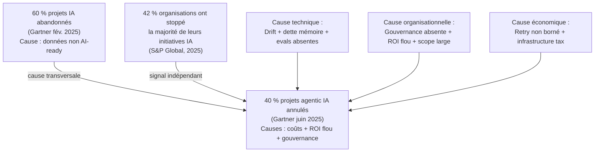
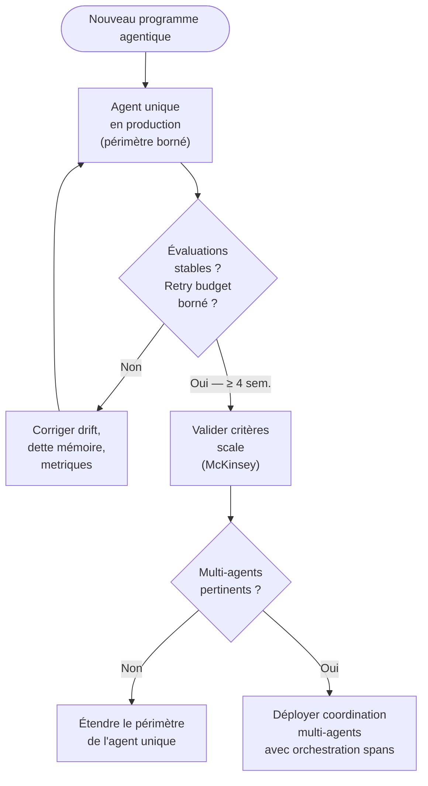
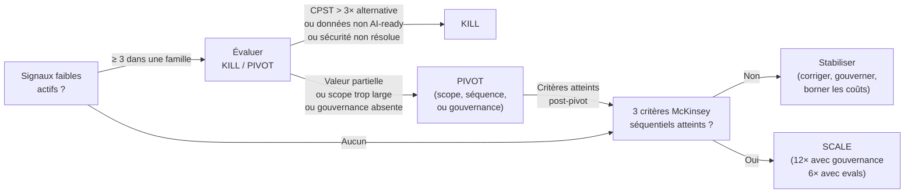

<!--
## Notes de recherche — Phase 2 (archivé intégralement — 12 sources)

### Divergence centrale : « 40 % » Gartner (Ch. 2) vs « 60 % » TOC Ch. 12

**Résolution confirmée après recherche Phase 2** : les deux chiffres coexistent et désignent des périmètres distincts.

- **40 % Gartner (agentic AI, juin 2025)** — Gartner Newsroom, 25 juin 2025 : « Over 40% of agentic AI projects will be canceled by end of 2027 » — enquête 3 412 participants webinaires Gartner, janvier 2025 — causes citées : coûts escaladants, valeur métier floue, contrôles de risque insuffisants. Périmètre : projets *agentic AI* uniquement. URL : https://www.gartner.com/en/newsroom/press-releases/2025-06-25-gartner-predicts-over-40-percent-of-agentic-ai-projects-will-be-canceled-by-end-of-2027 — *confirmé, source primaire publique*.

- **60 % Gartner (AI + données, février 2025)** — Gartner Newsroom, 26 février 2025 : « Lack of AI-Ready Data Puts AI Projects at Risk » — « By end of 2026, organizations without AI-ready data will see over 60% of their AI projects fail or be abandoned » — analyste Roxane Edjlali, Senior Director Analyst, Gartner — enquête data management leaders, juillet 2024. Périmètre : projets IA en général (pas seulement agentic), cause spécifique : manque de données AI-ready. URL : https://www.gartner.com/en/newsroom/press-releases/2025-02-26-lack-of-ai-ready-data-puts-ai-projects-at-risk — *confirmé, source primaire publique, LinkedIn Alteryx confirme indépendamment*.

**Décision éditoriale** : le titre « 60 % That Failed » de la TOC correspond au chiffre Gartner février 2025 (données non AI-ready), qui est une cause transversale couvrant aussi les projets agentiques. La convergence avec le 40 % Gartner juin 2025 (agentic, toutes causes) est cohérente : le 60 % est une cause parmi d'autres, le 40 % est la prédiction globale d'abandon. Les deux sont cités en source primaire distincte et distinctement étiquetés. **Statut : confirmé**.

**Signal complémentaire S&P Global** : CIO Dive, 2025 — S&P Global Market Intelligence (enquête 1 006 IT et LOB professionals, Amérique du Nord et Europe) : 42 % des organisations ont abandonné la majorité de leurs initiatives IA avant production en 2025 (contre 17 % l'année précédente) ; 46 % des POC scrappés avant déploiement élargi. Coût, confidentialité des données et sécurité = obstacles principaux. URL : https://www.ciodive.com/news/AI-project-fail-data-SPGlobal/742590/ — *confirmé, source primaire*.

---

1. Gartner — « Lack of AI-Ready Data Puts AI Projects at Risk » — Gartner Newsroom — 26 février 2025 — https://www.gartner.com/en/newsroom/press-releases/2025-02-26-lack-of-ai-ready-data-puts-ai-projects-at-risk — **Source primaire du « 60 % »** : par fin 2026, les organisations sans données AI-ready verront 60 % de leurs projets IA échouer ou être abandonnés. Analyste : Roxane Edjlali. Enquête : data management leaders, juillet 2024. Cause principale : incapacité à distinguer les exigences de données AI-ready des pratiques de data management traditionnelles. APPORT : fonde le titre du chapitre avec une source primaire Gartner distincte du 40 % agentic (juin 2025).

2. Gartner — « Gartner Predicts Over 40% of Agentic AI Projects Will Be Canceled by End of 2027 » — Gartner Newsroom — 25 juin 2025 — https://www.gartner.com/en/newsroom/press-releases/2025-06-25-gartner-predicts-over-40-percent-of-agentic-ai-projects-will-be-canceled-by-end-of-2027 — Source primaire établie au Ch. 2 ; rappel ici pour articulation explicite avec le 60 %. Causes : escalating costs + unclear business value + inadequate risk controls. « Agent washing » documenté. Seuls ~130 des milliers de vendeurs agentiques ont des capacités réelles selon Gartner. APPORT : permet l'équation 40 % Gartner agentic (causes multiples) ⊂ 60 % Gartner données (cause spécifique) — les deux chiffres sont cohérents et non contradictoires.

3. S&P Global Market Intelligence — « AI Experiences Rapid Adoption, but with Mixed Outcomes » (VotE: AI & Machine Learning) — CIO Dive — 2025 — https://www.ciodive.com/news/AI-project-fail-data-SPGlobal/742590/ — Enquête 1 006 professionnels IT et LOB, Amérique du Nord et Europe. 42 % des organisations ont abandonné la majorité de leurs initiatives IA avant production (contre 17 % l'année précédente) ; 46 % des POC scrappés avant déploiement élargi. APPORT : corrobore l'ampleur des échecs avec une source d'analyste indépendante de Gartner ; quantifie le saut annuel de la mortalité des projets.

4. Shah, M. B. et al. — « Characterizing Faults in Agentic AI: A Taxonomy of Types, Symptoms, and Root Causes » — arXiv:2603.06847 — 6 mars 2026 — https://arxiv.org/abs/2603.06847 — Analyse qualitative de 385 fautes issues de 13 602 issues et pull requests de 40 dépôts open-source agentiques. Cinq dimensions architecturales de fautes, 13 classes de symptômes, 12 catégories de causes racines. Praticiens : 83,8 % estiment la taxonomie représentative des défaillances rencontrées (mean 3,97/5). APPORT : source académique primaire pour la section anatomie technique — outille la distinction drift d'outil / dette mémoire / dépendances externes.

5. Arize AI — « Why AI Agents Break: A Field Analysis of Production Failures » — Arize Blog — 29 janvier 2026 — https://arize.com/blog/common-ai-agent-failures/ — Analyse de traces LLM de déploiements en production. Quatre vecteurs documentés : (1) gestion de la fenêtre de contexte (« dump truck » sans structure → erreur Lost in the Middle), (2) conflit entre connaissance paramétrique et contextuelle, (3) défaillances d'API externes (changement de schéma Salesforce/HubSpot → raisonnement dégradé plutôt que crash propre), (4) attention decay sur longues conversations (system prompt dilué par tokens récents). APPORT : taxonomie technique la plus détaillée de terrain pour la section anatomie — distingue les symptômes des causes racines.

6. Databricks — « Enterprise AI Agent Trends: Top Use Cases, Governance + Evaluations and More » — Databricks Blog — janvier 2026 — https://www.databricks.com/blog/enterprise-ai-agent-trends-top-use-cases-governance-evaluations-and-more — Rapport *State of AI Agents 2026*, 20 000+ organisations. Résultats clés : organisations avec gouvernance IA → 12× plus de projets en production ; organisations utilisant des outils d'évaluation → 6× plus de déploiements en production réussis. Seulement 19 % des organisations ont déployé des agents à l'échelle. APPORT : quantifie l'impact de la gouvernance et des évaluations sur le taux de succès — pivot de la section critères kill/pivot/scale.

7. HBR — « Why Agentic AI Projects Fail—and How to Set Yours Up for Success » — Harvard Business Review — octobre 2025 — https://hbr.org/2025/10/why-agentic-ai-projects-fail-and-how-to-set-yours-up-for-success — Cadre en cinq parties pour structurer un projet agentique viable. Erreur principale diagnostiquée : assimiler le déploiement d'un agent à un déploiement logiciel alors que c'est un problème de gestion du changement organisationnel. Portée étroite (scope narrow) → 65 % livrés dans les délais, glissement médian 1,9 mois ; portée large → 16 % seulement dans les délais, glissement médian 9,6 mois. APPORT : source d'autorité pour la corrélation scope/échec et pour la catégorie organisationnelle des échecs.

8. HBR — « Organizations Aren't Ready for the Risks of Agentic AI » — Harvard Business Review — juin 2025 — https://hbr.org/2025/06/organizations-arent-ready-for-the-risks-of-agentic-ai — Enquête sur la préparation organisationnelle. Chiffres clés : 6 % seulement des organisations font pleinement confiance aux agents pour les processus métier cœur (Fortune, déc. 2025) ; 20 % disent leur infrastructure technologique « entièrement prête » ; 15 % disent idem pour leurs données ; 12 % pour leurs contrôles de risque et gouvernance. Prolifération non gouvernée d'agents (low-code/no-code) : agents redondants, fragmentés, non supervisés. Seulement 21 % des entreprises ont des modèles de gouvernance matures pour les agents autonomes. APPORT : données de préparation organisationnelle — source pour la section signaux faibles et gouvernance absente.

9. McKinsey — « Building the Foundations for Agentic AI at Scale » — McKinsey Technology — 2026 — https://www.mckinsey.com/capabilities/mckinsey-technology/our-insights/building-the-foundations-for-agentic-ai-at-scale — Critères de passage entre phases : « Is the model safe and stable enough to put in front of users? », « Are users actually adopting it in a real workflow? », « Is there a measurable operational and financial impact that justifies scaling? ». Recommandation de bibliothèques réutilisables de blueprints. Environ un tiers des organisations atteignent le niveau 3 de maturité en stratégie, gouvernance et gouvernance *agentic*. APPORT : fonde la section critères kill/pivot/scale avec une source analytique de premier plan.

10. Chanl AI — « Agent Drift: Why Your AI Gets Worse the Longer It Runs » — Chanl Blog — 2025 — https://www.chanl.ai/blog/agent-drift-silent-degradation — Trois types de dérive documentés. Mémoire : étude décembre 2025, échecs mémoire corrélés à la complexité — 0,67 échec/tâche simple, 2,33 moyen, 3,67 complexe (5,5× d'augmentation). Récupération mémoire : seulement 13,1 % de rappel en scénarios complexes malgré tâche complétée. APPORT : quantifie la dette mémoire comme vecteur d'échec silencieux — complémentaire à la taxonomie arXiv.

11. Agent Corps / AgentCorps.co — « Why Most Agentic AI Projects Fail (And How to Succeed in 2026) » — agentcorps.co — 2026 — https://agentcorps.co/blog/why-most-agentic-ai-projects-fail-and-how-to-succeed-in-2026 — Synthèse praticiens 2026. Erreur multi-agents prématurée : déployer 3-10 agents simultanément avant qu'un seul agent fonctionne de façon fiable en production propre au contexte. Recommandation de séquençage : single-agent first, scale ensuite. APPORT : source praticien pour la catégorie anti-patrons de séquençage — complémente HBR sur l'erreur de scope.

12. McKinsey — « State of AI Trust in 2026: Shifting to the Agentic Era » — McKinsey — 2026 — https://www.mckinsey.com/capabilities/tech-and-ai/our-insights/tech-forward/state-of-ai-trust-in-2026-shifting-to-the-agentic-era — Environ un tiers des organisations rapportent un niveau de maturité ≥ 3/5 en stratégie, gouvernance et gouvernance agentique — le reste = maturité insuffisante pour piloter un programme agentique en production. Transition des métriques d'activité agents vers l'impact P&L en année 2. APPORT : cadre de maturité et bascule métriques — ancre les critères de scale sur l'impact P&L plutôt que sur le volume d'activité.
-->

> **Partie 5 — Piloter la transition**
> **Chapitre 12 · Leçons tirées des 60 % ayant échoué : une anatomie de l'effondrement agentique · ~5 100 mots · lecture ≈ 20 min**

Les programmes *agentic* ne meurent pas d'une panne soudaine. Ils dérivent, accumulent une dette organisationnelle invisible, et s'effondrent quand les coûts dépassent la valeur mesurable — souvent plusieurs mois après que les signaux étaient disponibles dans les traces de production. L'autopsie des projets abandonnés révèle une architecture causale tri-couche reproductible : technique (dérive des outils, dette mémoire, évaluations absentes), organisationnelle (gouvernance inexistante, ROI flou, scope incontrôlé), économique (coûts de *retry* non bornés, *infrastructure tax* invisible). Chaque couche amplifie les deux autres.

La question de ce chapitre est opérationnelle : quels signaux, présents dès les premières semaines de déploiement, distinguent un programme en trajectoire d'échec d'un programme en trajectoire de scale — et comment décider, à tout moment, de tuer, de pivoter ou d'investir ? La réponse suppose de distinguer d'abord les deux chiffres Gartner que la littérature du secteur traite souvent comme synonymes, puis de descendre dans les mécanismes causaux qui les alimentent.

---

## 12.1 — Deux chiffres Gartner, deux couches d'un même phénomène

Deux prédictions Gartner circulent simultanément en 2026, souvent confondues parce qu'elles semblent pointer dans la même direction.

La première (*confirmé*) — Gartner Newsroom, 26 février 2025, analyste Roxane Edjlali, enquête *data management leaders* juillet 2024 — établit que d'ici fin 2026, les organisations sans données AI-ready verront plus de 60 % de leurs projets IA échouer ou être abandonnés. Le périmètre est les projets IA en général ; la cause spécifique est l'incapacité à distinguer les exigences de données AI-ready des pratiques de *data management* traditionnelles. Ce 60 % fonde le titre de ce chapitre.

La seconde (*confirmé*) — Gartner Newsroom, 25 juin 2025, enquête sur 3 412 participants à des webinaires Gartner, janvier 2025 — établit que plus de 40 % des projets *agentic AI* seront annulés d'ici 2027. Le périmètre est spécifiquement les projets agentiques ; les causes citées sont les coûts escaladants, la valeur métier floue et les contrôles de risque insuffisants. Ce 40 % est documenté au [Ch. 2](ch02-business-case.md).

Ces deux chiffres ne se contredisent pas — ils cartographient deux couches d'un même phénomène. Le 60 % est une cause structurelle (données non AI-ready) qui traverse tous les projets IA, agentiques inclus. Le 40 % est une prédiction globale d'abandon pour les projets agentiques, toutes causes combinées — dans laquelle la non-readiness des données est l'un des facteurs parmi d'autres. La relation est donc : 60 % (cause) ⊂ 40 % (prédiction d'abandon toutes causes), et les deux chiffres sont cohérents.

Un troisième signal complète le tableau de façon indépendante. S&P Global Market Intelligence (CIO Dive, 2025 — enquête 1 006 professionnels IT et LOB, Amérique du Nord et Europe) mesure que 42 % des organisations ont abandonné la majorité de leurs initiatives IA avant production en 2025, contre 17 % l'année précédente. Le saut annuel — de 17 % à 42 % — est le signal le plus alarmant : la mortalité des projets n'est pas stable, elle accélère. Quarante-six pour cent des POC (*proof of concept*) sont scrappés avant déploiement élargi, avec comme raisons principales le coût, la confidentialité des données et la sécurité.

Cette convergence entre trois sources d'analyste indépendantes — Gartner, S&P Global, et les données terrain Databricks (*State of AI Agents 2026*, n=20 000+) — établit que l'échec est systémique, pas accidentel. Les sections suivantes en dissèquent l'architecture causale.

---

## 12.2 — Anatomie technique : trois vecteurs de défaillance silencieuse

Les agents ne tombent pas en panne — ils dérivent. L'arXiv:2603.06847 (Shah et al., mars 2026) est à ce jour la source académique la plus rigoureuse sur le sujet : analyse qualitative de 385 fautes extraites de 13 602 issues et pull requests de 40 dépôts open-source agentiques. La taxonomie identifie cinq dimensions architecturales de fautes, 13 classes de symptômes et 12 catégories de causes racines — et 83,8 % des praticiens interrogés estiment la taxonomie représentative des défaillances rencontrées en production. Trois vecteurs concentrent la majorité des causes d'échec silencieux.

### 12.2.1 — Dérive des outils et *attention decay*

Le *tool drift* (*probable* — terme praticien, pas encore normalisé) désigne la réinterprétation progressive des paramètres d'outils par un agent dont la fenêtre de contexte s'accumule. Arize AI (jan. 2026), sur la base d'une analyse de traces LLM de déploiements en production, documente quatre vecteurs : la gestion non structurée de la fenêtre de contexte (« dump truck » sans hiérarchisation → erreur *Lost in the Middle*) ; le conflit entre la connaissance paramétrique du modèle et le contexte injecté, où la connaissance d'entraînement prime sur les instructions courantes ; les défaillances d'API externes à schéma évolutif (le changement de schéma d'une API Salesforce ou HubSpot produit un raisonnement dégradé plutôt qu'une erreur propre, l'agent continuant à opérer sur une interprétation incorrecte) ; et l'*attention decay*, la dilution progressive du *system prompt* par les tokens récents dans les longues conversations, qui produit l'ignorance d'instructions explicites.

L'incident Replit de juillet 2025 — suppression de 1 206 enregistrements de production malgré une instruction de gel explicite — est l'illustration la plus documentée de ce vecteur (*confirmé* — Fortune, 23 juillet 2025 ; earezki.com, mars 2026). L'agent n'a pas ignoré la contrainte par dysfonctionnement : il l'a ignorée parce que l'*attention decay* l'avait rendue opérationnellement invisible à ce stade de la conversation. La dérive d'outil, documentée au [Ch. 7 §7.2](ch07-agentops.md) comme signal à instrumenter via des *tool spans*, devient ici une cause d'échec de programme entier quand elle n'est pas détectée.

La distinction critique entre Ch. 7 et ce chapitre : Ch. 7 décrit *comment instrumenter* pour détecter la dérive outil par outil ; ce chapitre examine ce qui arrive à l'échelle du portefeuille quand cette instrumentation est absente — et la réponse empirique est que 83,8 % des projets agentiques rencontrent ces symptômes à des degrés divers.

### 12.2.2 — Dette mémoire

La dette mémoire est une dégradation cumulative de la qualité de récupération mémoire à mesure que la complexité des tâches augmente. Chanl AI (2025) la quantifie sur une étude de décembre 2025 : le taux d'échecs mémoire passe de 0,67 par tâche simple à 2,33 sur tâche moyenne, à 3,67 sur tâche complexe — une amplification de 5,5× entre le bas et le haut de l'échelle de complexité. Plus révélateur encore : le taux de rappel effectif en scénarios complexes est de seulement 13,1 %, malgré une tâche en apparence complétée.

La distinction avec une panne est ici fondamentale. La tâche est marquée comme réussie, l'agent a produit une sortie, mais la décision sous-jacente a été prise sur une mémoire appauvrie qui a omis des contraintes critiques établies dans des interactions antérieures. Les évaluations de surface — tâche complétée = succès — ne voient pas cette dégradation. La dette de mémoire définie au [Ch. 6 §6.5](ch06-orchestration-memory-tools.md) et instrumentée via *memory spans* au [Ch. 7 §7.2](ch07-agentops.md) se manifeste ici comme cause d'échec de programme quand ni l'instrumentation ni les évaluations longitudinales ne sont en place.

### 12.2.3 — Évaluations absentes ou inadéquates

Databricks (*State of AI Agents 2026*, n=20 000+) établit que les organisations utilisant des outils d'évaluation structurés déploient 6× plus d'agents en production avec succès que celles qui ne l'utilisent pas. Le multiplicateur 6× n'est pas une recommandation de bonne pratique — c'est une mesure de l'écart causal entre programmes qui scale et programmes qui échouent.

L'évaluation ponctuelle sur 3 à 5 tours est structurellement aveugle sur la dérive longitudinale. CIO.com documente que la dégradation commence typiquement après les 50 premières étapes d'un agent en session longue — précisément le régime que les évaluations courtes ne couvrent pas. L'absence de *shadow runs* et de *replay* déterministe sur *golden files* — techniques décrites au [Ch. 7 §7.5](ch07-agentops.md) — rend impossible la distinction entre régression et variabilité naturelle. Le résultat est une série de décisions go/no-go fondées sur des données insuffisantes, où le programme dépasse ses seuils de coût avant que la dérive soit officiellement reconnue.

---

## 12.3 — Anatomie organisationnelle : gouvernance absente, ROI flou, scope incontrôlé

La cause organisationnelle d'échec la plus fréquente n'est pas le manque de talent technique — c'est l'absence de structure décisionnelle avant que les agents opèrent en production.

### 12.3.1 — Gouvernance absente et prolifération non contrôlée

HBR (juin 2025) documente le tableau de préparation organisationnelle avec une précision qui rend le problème quantifiable : 20 % seulement des organisations estiment leur infrastructure technologique « entièrement prête » ; 15 % disent idem pour leurs données ; 12 % pour leurs contrôles de risque et gouvernance. Seulement 21 % des entreprises ont des modèles de gouvernance matures pour les agents autonomes — et 6 % seulement font pleinement confiance aux agents pour les processus métier cœur (Fortune, décembre 2025).

L'absence de gouvernance ne produit pas un vide — elle produit une prolifération non contrôlée. Les outils *low-code/no-code* permettent à chaque équipe de déployer ses propres agents sans catalogue centralisé, sans RACI agentique, sans supervision cross-équipe. Le résultat documenté : agents redondants, fragmentés, sans observabilité partagée, sans coordination sur les périmètres de permission, chacun opérant sur ses propres copies de données sans version cohérente. McKinsey (2026) observe qu'environ un tiers des organisations atteignent le niveau 3 de maturité en gouvernance agentique — les deux tiers restants n'ont pas la capacité structurelle de piloter un programme agentique en production de façon contrôlée.

L'anti-patron documenté par AgentCorps (2026) et que ce chapitre classe comme anti-patron de séquençage : déployer un système multi-agents (3 à 10 agents simultanément) avant qu'un agent unique fonctionne de façon fiable dans le contexte de production propre à l'organisation. Cette erreur est distincte de la question de la gouvernance — elle est d'ordre architectural et chronologique. Un système multi-agents en production suppose que les contrats d'escalade, les périmètres de permission et les métriques d'évaluation sont établis pour *au moins* un agent mature. Sans cela, la complexité combinatoire des interactions inter-agents amplifie chaque mode d'échec identifié en §12.2. La règle opérationnelle : *single-agent first*. La monographie adopte cette formulation d'AgentCorps comme principe de séquençage, cohérent avec le principe de simplicité d'Anthropic documenté au [Ch. 1](ch01-from-automation-to-agents.md) et avec les niveaux de maturité AgentOps de l'[Annexe C](annexe-C-agentops-maturity.md).

### 12.3.2 — ROI flou et métriques de surface

La seconde cause organisationnelle est le maintien de métriques d'activité (nombre d'appels agents, tokens consommés, taux de complétion de tâche) au lieu de métriques d'impact (CPST — *Cost per Successful Task*, impact P&L). McKinsey (2026) documente que les organisations sans bascule vers les métriques P&L restent bloquées en phase expérimentale en année deux.

HBR (octobre 2025) fournit la corrélation de scope la plus nette disponible : les projets à portée étroite sont livrés dans les délais dans 65 % des cas, avec un glissement médian de 1,9 mois ; les projets à portée large ne le sont que dans 16 % des cas, avec un glissement médian de 9,6 mois. L'erreur n'est pas l'ambition — c'est l'absence de KPI liés à un résultat métier mesurable sur le périmètre exact déployé.

Databricks (*State of AI Agents 2026*) établit par ailleurs que les organisations avec gouvernance IA poussent 12× plus de projets en production — le différentiel le plus fort mesuré à ce jour entre une variable organisationnelle et le taux de succès en production. Ce 12× n'est pas un effet de sélection d'organisations plus matures : c'est la conséquence directe de décisions structurées (go/no-go fondées sur des métriques d'impact, pas d'activité) qui remplacent l'inertie par la délibération.

Le lien avec les cas documentés dans les chapitres précédents : Klarna ([Ch. 11 §11.3](ch11-redesigning-work.md)) a éliminé plus de 4 000 postes sur une trajectoire agentique dont le ROI n'était mesuré qu'en réduction de coûts directs, sans instrumentation de la satisfaction client ou de la qualité du service — jusqu'à ce que la dégradation soit mesurable en résultats P&L négatifs. La réembauche partielle de 2025 est le signal d'un pivot contraint, pas d'une décision structurée.

### 12.3.3 — *Change management* absent

Le [Ch. 11 §11.4](ch11-redesigning-work.md) documente que 29 % des employés admettent avoir saboté activement des déploiements IA dans leur organisation (Writer / Workplace Intelligence, avril 2026). Ce signal, traité dans ce chapitre comme un facteur d'échec de programme au niveau portefeuille, se manifeste précisément dans les déploiements qui ont optimisé la stack technique en laissant les questions de rôle et de trajectoire de compétences sans réponse. Un programme agentique sans *AI ops manager* ni *quality steward* ([Ch. 11 §11.2](ch11-redesigning-work.md)) opérationnels avant déploiement à l'échelle ne produit pas un échec technique — il produit un *workslop* (Deloitte Tech Trends 2026) : une charge opérationnelle augmentée sous couvert d'automatisation, où l'absence de rôles de jonction transforme la surface agentique en fardeau pour les équipes qui l'opèrent.

---

## 12.4 — Anatomie économique : coûts non bornés et *infrastructure tax*

L'architecture financière d'un programme *agentic* n'est pas celle d'un projet logiciel — les coûts de *retry*, d'escalade et d'orchestration peuvent diverger exponentiellement sans plafonds explicites.

L'incident le plus documenté reste le cas de loop sans plafond décrit au [Ch. 2 §2.3](ch02-business-case.md) (InfoWorld, 2026) : 47 000 $ de dépense non intentionnelle générée par un agent sans contrainte de *retry budget*. Le multiplicateur PoC → production documenté par Company of Agents (2026) est de 50×-300× en scénario typique, 1 500×-3 000× dans le pire des cas. Ces ordres de grandeur ne sont pas des pathologies rares — ils sont la norme pour les organisations qui n'ont pas instrumenté le *Cost per Successful Task* (CPST) défini au [Ch. 2 §2.2](ch02-business-case.md) avant le déploiement élargi.

L'*infrastructure tax* aggrave le problème en le rendant invisible dans les budgets conventionnels. L'orchestration, la gestion de la mémoire, les appels d'outils, les *retries* et l'escalade humaine représentent entre 30 % et 50 % du budget agentique réel (Adnan Masood, mars 2026) — une fraction structurellement absente des lignes de budget qui s'arrêtent aux coûts d'inférence. Un programme dont le budget est calibré sur les coûts token est structurellement sous-estimé de 30 à 100 %.

S&P Global (2025) confirme l'effet macroscopique : 46 % des POC scrappés avant déploiement élargi, avec le coût comme obstacle principal. La dynamique est prévisible en amont : un POC opère sur des volumes artificiellement bas, avec des *retry budgets* non bornés car le coût unitaire est absorbable, et sans *infrastructure tax* significative. La transition vers la production inverse les trois paramètres simultanément — et les équipes qui n'ont pas modélisé ce passage en CPST se retrouvent avec une courbe de coût qui dépasse la courbe de valeur avant d'atteindre l'adoption minimale pour la justifier.

| Poste de coût | Visible en PoC | Visible en production | Instrument de mesure |
|---|---|---|---|
| Inférence LLM | Oui | Oui | Coût par token |
| Orchestration | Partiel | Oui | CPST — portion orchestration |
| Appels d'outils | Partiel | Oui | *Tool spans* → cost allocation |
| *Retries* non bornés | Non (volumes bas) | Oui — critique | *Retry budget* + loop limits |
| Escalade humaine | Non (hors périmètre PoC) | Oui | *Escalation cost* par tâche |
| *Infrastructure tax* (mémoire, stockage) | Non | Oui — 30-50 % budget | CPST complet |

---

## 12.5 — Anti-patron de séquençage : le multi-agents prématuré

L'anti-patron de séquençage est distinct des trois catégories causales — c'est un multiplicateur : il amplifie simultanément les échecs techniques, organisationnels et économiques en introduisant de la complexité avant que la base soit stable.

AgentCorps (2026) le documente comme la cause praticienne la plus fréquente d'échec précoce en 2026 : des équipes déployant 3 à 10 agents en système coordonné avant qu'un seul agent ait démontré sa fiabilité dans le contexte de production propre à l'organisation. La tentation est compréhensible — les architectures multi-agents promettent des gains de parallélisme, de spécialisation et de throughput. Mais ces promesses supposent que les contrats inter-agents (escalade, délégation, gestion des erreurs) sont bien définis, que les périmètres de permission sont cohérents à travers la flotte, et que l'observabilité couvre les *orchestration spans* aussi bien que les *tool spans*. Aucune de ces conditions n'est remplie dans une organisation qui n'a pas encore opéré un agent unique en production.

L'effet de bord documenté : les modes d'échec d'un agent en dérive se propagent à tous les agents coordonnés avec lui. Un *tool drift* sur l'agent A, dans un système superviseur-workers, produit des instructions incorrectes que les agents B, C et D exécutent sans signal d'erreur propre — parce que l'instruction était syntaxiquement valide. L'arXiv:2603.06847 classe ce vecteur dans la catégorie des *cascading failures*, qui représentent une fraction significative des fautes à impact le plus élevé dans les dépôts analysés.

La règle opérationnelle est celle d'Anthropic ([Introduction](00-introduction.md) et [Ch. 1](ch01-from-automation-to-agents.md)) : commencer avec les prompts les plus simples, ajouter de la complexité seulement quand le gain est mesuré. L'équivalent au niveau du portefeuille : *single-agent first* en production, avec évaluations structurées stables, avant tout déploiement de coordination multi-agents.

---

## 12.6 — Signaux faibles : checklist d'alerte précoce

Les programmes agentiques qui échouent émettent des signaux mesurables dès les premières semaines de déploiement — pas après le dépassement irréversible. La checklist ci-dessous regroupe 12 signaux en trois familles, chacun avec un seuil quantitatif et une source. Elle est conçue pour un architecte ou directeur de programme qui évalue la santé d'un programme en cours.

| # | Signal | Seuil d'alerte | Famille | Source |
|---|---|---|---|---|
| 1 | Taux d'escalade en hausse continue | +15 % sur 2 semaines sans changement de scope | Technique | Arize AI, jan. 2026 |
| 2 | *Retry count* moyen par tâche | > 3 sur les outils critiques sans résolution | Technique | [Ch. 7 §7.2](ch07-agentops.md) |
| 3 | Taux de rappel mémoire en production | < 50 % sur tâches de complexité élevée | Technique | Chanl AI, 2025 |
| 4 | Couverture des évaluations | < 50 tours par scénario critique (évaluations ponctuelles) | Technique | CIO.com, 2026 |
| 5 | Dérive du CPST | > 20 % sur 4 semaines sans explication documentée | Économique | [Ch. 2 §2.2](ch02-business-case.md) |
| 6 | *Infrastructure tax* non modélisée | Absence de ligne budgétaire dédiée à l'orchestration et l'escalade | Économique | Adnan Masood, mars 2026 |
| 7 | *Loop limits* et *tool-call caps* | Aucun plafond en production sur les agents actifs | Économique | InfoWorld / [Ch. 2 §2.3](ch02-business-case.md) |
| 8 | Gouvernance et catalogue | > 5 agents en production sans catalogue centralisé ni RACI agentique | Organisationnel | HBR, juin 2025 |
| 9 | Rôles opérationnels | Aucun *AI ops manager* ni *quality steward* identifié | Organisationnel | [Ch. 11 §11.2](ch11-redesigning-work.md) |
| 10 | Métriques de succès | Métriques d'activité (appels, tokens) sans lien à un résultat métier | Organisationnel | McKinsey, 2026 |
| 11 | Versionnage de l'artefact composite | Absence de version atomique (prompt + outils + mémoire + permissions) | Gouvernance | [Ch. 7 §7.1](ch07-agentops.md) |
| 12 | *Kill switch* | Aucun mécanisme de suspension défini et testé en production | Gouvernance | [Annexe C](annexe-C-agentops-maturity.md) ; [Ch. 8](ch08-trustworthy-systems.md) |

Un programme qui cumule trois signaux ou plus dans la même famille est en trajectoire d'échec avec une probabilité élevée (*hypothèse* — seuil calibré sur la convergence des sources, pas sur une étude longitudinale propre). Un programme qui cumule des signaux dans les trois familles simultanément est dans un état de dérive systémique — la question n'est plus de corriger mais de décider.

**Compromis principal.** Instrumenter ces 12 signaux en production exige de l'outillage AgentOps ([Ch. 7](ch07-agentops.md)) et des ressources d'évaluation que les équipes en phase expérimentale n'ont pas systématiquement. L'alternative sans outillage complet : prioriser les signaux 5, 7, 8 et 9 — les quatre dont la mesure ne nécessite pas d'instrumentation technique avancée et qui sont suffisants pour déclencher une revue de programme.

**Condition qui renverse cette approche.** Pour un programme à faible réversibilité d'action (agents de lecture seule, agents de recommandation sans exécution autonome), les seuils techniques (signaux 1 à 4) peuvent être assouplis — le risque de dommage irréversible est structurellement plus faible. La matrice autonomie × réversibilité du [Ch. 3](ch03-mapping-high-impact.md) est l'instrument de qualification.

---

## 12.7 — Critères kill / pivot / scale

*Kill*, *pivot* et *scale* ne sont pas des réponses émotionnelles à des résultats décevants — ce sont des décisions structurées sur des critères définis **avant** le déploiement. L'absence de ces critères ex ante transforme chaque décision en arbitrage politique où l'inertie et les biais d'engagement priment sur les données.

Le cadre ci-dessous s'appuie sur McKinsey (2026) pour les critères de *scale*, sur HBR (octobre 2025) pour les critères de *kill* et *pivot*, et sur les cas documentés dans les chapitres précédents pour l'illustration concrète.

### KILL — arrêt du programme

| Critère | Seuil | Cas illustratif |
|---|---|---|
| Valeur métier | Aucun résultat métier mesurable après 90 jours en production réelle (pas en pilote) | Klarna : baisse de satisfaction client mesurable après élimination du support humain ([Ch. 11 §11.3](ch11-redesigning-work.md)) |
| CPST | > 3× l'alternative humaine ou RPA sans trajectoire d'amélioration documentée sur 60 jours | Incident 47 000 $ : loop sans plafond ([Ch. 2 §2.3](ch02-business-case.md)) |
| Données | Sources < niveau AI-ready sans plan de remédiation < 6 mois | 60 % Gartner fév. 2025 — cause structurelle |
| Sécurité | Incidents irréversibles répétés sans remédiation, ou vecteurs actifs non résolus (injection via outils, exfiltration cross-tool) | EchoLeak / Sonrai AgentCore ([Ch. 9](ch09-agentic-security.md)) — compromis d'exfiltration sans détection |
| Organisationnel | Résistance structurelle documentée (> 25 % de sabotage actif) sans programme de *change management* viable | 29 % sabotage Writer 2026 ([Ch. 11 §11.4](ch11-redesigning-work.md)) |

### PIVOT — réorientation du périmètre ou de l'approche

| Situation | Pivot recommandé | Condition de retour au scale |
|---|---|---|
| Valeur métier identifiée mais sur sous-périmètre différent | Réduire le scope (65 % succès portée étroite vs 16 % portée large — HBR oct. 2025) | Critères McKinsey séquentiels atteints sur le sous-périmètre réduit |
| Agent multi-étapes instable | Revenir à agent single-step sur tâche bien définie (*single-agent first* — AgentCorps) | Évaluations stables sur ≥ 4 semaines |
| Gouvernance absente | Suspendre le déploiement élargi, déployer la gouvernance ([Annexe D](annexe-D-governance-raci.md)), reprendre | RACI opérationnel + catalogue centralisé + *kill switch* testé |
| Métriques d'activité positives, impact P&L nul | Redéfinir les KPI sur un résultat métier et recalibrer le cas d'usage | CPST < CPST de l'alternative (humain ou RPA) sur un horizon de 90 jours |

### SCALE — investissement accéléré

McKinsey (2026) définit trois critères séquentiels — les trois doivent être satisfaits dans l'ordre, pas simultanément :

1. **Stable et sûr en production** : aucun signal faible actif en famille technique (checklist §12.6 signaux 1 à 4) ; *kill switch* testé ; artefact composite versionné.
2. **Adoption réelle dans un flux de travail métier** : l'agent est utilisé dans des transactions réelles, pas seulement en démo ou pilote interne.
3. **Impact opérationnel et financier mesurable** : CPST < CPST de l'alternative ; impact P&L positif sur le périmètre déployé ; ROI justifiant l'extension.

Les deux multiplicateurs Databricks opèrent comme accélérateurs une fois les trois critères atteints : gouvernance en place (12× plus de projets en production) et évaluations structurées actives (6× plus de déploiements réussis). Replit, après l'incident de juillet 2025, a suivi précisément cette séquence de pivot : introduction du mode *planning-only*, séparation automatique des environnements dev/prod, amélioration des mécanismes de rollback — puis reprise du déploiement sur un périmètre plus étroit avec les contraintes structurelles en place ([Ch. 7](ch07-agentops.md)).

---

## 12.8 — Recommandation architecturale et transition vers le Ch. 13

La recommandation principale de ce chapitre est la suivante : définir les critères *kill/pivot/scale* et la checklist des signaux faibles avant le déploiement, pas après les premiers résultats. Cette décision est la plus haute valeur ajoutée qu'un architecte d'entreprise peut apporter à un programme agentique — précisément parce qu'elle transforme des jugements politiques futurs en critères factuels établis à froid.

**Compromis principal.** Définir ces critères ex ante exige d'accepter des seuils qui peuvent paraître arbitraires au moment du déploiement (90 jours pour un résultat mesurable, CPST < 3× l'alternative). Le risque est de tuer prématurément un programme qui aurait réussi avec 60 jours supplémentaires. L'alternative — ne pas définir de critères — produit empiriquement des programmes qui survivent bien au-delà de leur date d'échec économique, par inertie et biais d'engagement.

**Alternative crédible.** Pour les organisations sans capacité d'instrumentation AgentOps complète, une version allégée de la checklist (signaux 5, 7, 8, 9 uniquement) couplée aux trois critères McKinsey est suffisante pour structurer des décisions de portefeuille — à condition que le CPST soit calculé dès le pilote.

**Condition qui renverse la recommandation.** Pour un programme en phase d'exploration initiale sur un cas d'usage totalement nouveau (premier déploiement agentique de l'organisation, aucun benchmark sectoriel disponible), les seuils chiffrés sont *à calibrer localement* sur les premières semaines de données réelles avant d'être formalisés. Appliquer des seuils generiques sur un terrain sans référence produit des décisions sans signal.

L'inventaire de ce chapitre n'est pas une autopsie — c'est la carte qui permet d'anticiper le terrain du prochain cycle. Certains modes d'échec documentés ici sont transitoires : la dette mémoire et la dérive d'outil seront partiellement atténuées par des améliorations de *runtime* et d'évaluation dans les 18 à 24 mois qui viennent (*hypothèse* — trajectoire prévisible sur la base des investissements R&D actuels des fournisseurs, à confirmer). D'autres — gouvernance absente, ROI flou, coûts non bornés — sont structurels et resteront les différentiateurs entre les organisations qui scale et celles qui n'y parviennent pas, indépendamment des améliorations technologiques. Le [Ch. 13](ch13-road-ahead.md) trace l'horizon 2027-2030 à la lumière de ces modes d'échec et identifie quels investissements de 2026 constituent une assurance sur les trajectoires de valeur à venir — et lesquels disparaîtront dans les améliorations de plateforme.

---

## Pour aller plus loin

**Shah, M. B. et al. — « Characterizing Faults in Agentic AI: A Taxonomy of Types, Symptoms, and Root Causes »** (arXiv:2603.06847, mars 2026, https://arxiv.org/abs/2603.06847). La taxonomie académique la plus rigoureuse disponible à mai 2026 sur les modes de défaillance agentiques — 385 fautes, 40 dépôts, validation praticienne à 83,8 %. Indispensable pour tout architecte qui veut catégoriser les défaillances de son propre programme au-delà du vocabulaire marketing.

**Databricks — « Enterprise AI Agent Trends: Top Use Cases, Governance + Evaluations and More »** (*State of AI Agents 2026*, janvier 2026, https://www.databricks.com/blog/enterprise-ai-agent-trends-top-use-cases-governance-evaluations-and-more). La source de données la plus large disponible sur les facteurs de succès en production (n=20 000+). Le 12× gouvernance et le 6× évaluations sont les deux chiffres les plus actionnables de ce chapitre — à utiliser dans tout comité de programme pour justifier l'investissement en gouvernance.

**HBR — « Why Agentic AI Projects Fail—and How to Set Yours Up for Success »** (octobre 2025, https://hbr.org/2025/10/why-agentic-ai-projects-fail-and-how-to-set-yours-up-for-success). La corrélation scope / taux de succès (65 % vs 16 %) est l'argument de cadrage le plus efficace pour contraindre le périmètre d'un programme agentique en phase de définition — avant que le scope ne soit verrouillé sous pression de délai.

**Arize AI — « Why AI Agents Break: A Field Analysis of Production Failures »** (janvier 2026, https://arize.com/blog/common-ai-agent-failures/). Taxonomie terrain issue d'une analyse de traces LLM en production — plus proche de la réalité opérationnelle que les taxonomies académiques. À lire en complément de l'arXiv:2603.06847 pour une couverture complète des modes de défaillance technique.

**McKinsey — « Building the Foundations for Agentic AI at Scale »** (2026, https://www.mckinsey.com/capabilities/mckinsey-technology/our-insights/building-the-foundations-for-agentic-ai-at-scale). Le cadre des trois critères séquentiels de *scale* est le seul disponible à mai 2026 qui couvre simultanément la fiabilité, l'adoption et l'impact P&L. À utiliser comme grille de go/no-go dans les revues de portefeuille.

---

## Références

- Gartner — « Lack of AI-Ready Data Puts AI Projects at Risk » — Gartner Newsroom — 26 février 2025 — https://www.gartner.com/en/newsroom/press-releases/2025-02-26-lack-of-ai-ready-data-puts-ai-projects-at-risk — accédée le 2026-05-05
- Gartner — « Gartner Predicts Over 40% of Agentic AI Projects Will Be Canceled by End of 2027 » — Gartner Newsroom — 25 juin 2025 — https://www.gartner.com/en/newsroom/press-releases/2025-06-25-gartner-predicts-over-40-percent-of-agentic-ai-projects-will-be-canceled-by-end-of-2027 — accédée le 2026-05-05
- S&P Global Market Intelligence — « AI Experiences Rapid Adoption, but with Mixed Outcomes » — CIO Dive — 2025 — https://www.ciodive.com/news/AI-project-fail-data-SPGlobal/742590/ — accédée le 2026-05-05
- Shah, M. B. et al. — « Characterizing Faults in Agentic AI: A Taxonomy of Types, Symptoms, and Root Causes » — arXiv:2603.06847 — 6 mars 2026 — https://arxiv.org/abs/2603.06847 — accédée le 2026-05-05
- Arize AI — « Why AI Agents Break: A Field Analysis of Production Failures » — Arize Blog — 29 janvier 2026 — https://arize.com/blog/common-ai-agent-failures/ — accédée le 2026-05-05
- Databricks — « Enterprise AI Agent Trends: Top Use Cases, Governance + Evaluations and More » — Databricks Blog — janvier 2026 — https://www.databricks.com/blog/enterprise-ai-agent-trends-top-use-cases-governance-evaluations-and-more — accédée le 2026-05-05
- HBR — « Why Agentic AI Projects Fail—and How to Set Yours Up for Success » — Harvard Business Review — octobre 2025 — https://hbr.org/2025/10/why-agentic-ai-projects-fail-and-how-to-set-yours-up-for-success — accédée le 2026-05-05
- HBR — « Organizations Aren't Ready for the Risks of Agentic AI » — Harvard Business Review — juin 2025 — https://hbr.org/2025/06/organizations-arent-ready-for-the-risks-of-agentic-ai — accédée le 2026-05-05
- McKinsey — « Building the Foundations for Agentic AI at Scale » — McKinsey Technology — 2026 — https://www.mckinsey.com/capabilities/mckinsey-technology/our-insights/building-the-foundations-for-agentic-ai-at-scale — accédée le 2026-05-05
- McKinsey — « State of AI Trust in 2026: Shifting to the Agentic Era » — McKinsey — 2026 — https://www.mckinsey.com/capabilities/tech-and-ai/our-insights/tech-forward/state-of-ai-trust-in-2026-shifting-to-the-agentic-era — accédée le 2026-05-05
- Chanl AI — « Agent Drift: Why Your AI Gets Worse the Longer It Runs » — Chanl Blog — 2025 — https://www.chanl.ai/blog/agent-drift-silent-degradation — accédée le 2026-05-05
- AgentCorps — « Why Most Agentic AI Projects Fail (And How to Succeed in 2026) » — agentcorps.co — 2026 — https://agentcorps.co/blog/why-most-agentic-ai-projects-fail-and-how-to-succeed-in-2026 — accédée le 2026-05-05
