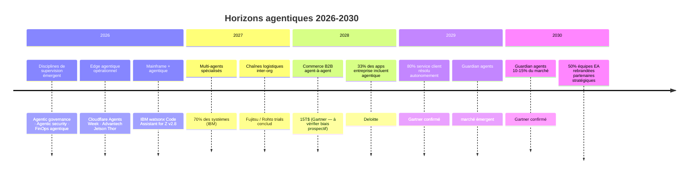

<!--
## Notes de recherche — Phase 2 (archivé — 12 sources)

### Divergences et alertes de fabrication

**AGI / superintelligence** : Les positions des CEO de labos divergent nettement. Dario Amodei (Anthropic) : AGI possible « as early as 2026-27 » — mais ce chiffre circule dans des synthèses secondaires (Medium, LinkedIn) sans URL directe d'Anthropic. Shane Legg (Google DeepMind) : 50 % de probabilité pour « minimal AGI » d'ici 2028. Demis Hassabis (Google DeepMind) : « genuine human-level AGI » à 5-10 ans (2031-2036). Sam Altman (OpenAI) : superintelligence dans « quelques milliers de jours » (2032-2035). DÉCISION ÉDITORIALE : ne pas citer Amodei « 2026-27 » sans URL source primaire vérifiable — traiter comme *hypothèse / à vérifier*. Utiliser Hassabis et Altman, dont les formulations sont tracées dans des publications directes.

**Gartner Hype Cycle 2026 positions précises** : Le rapport complet est derrière paywall. Les confirmations disponibles : (1) Zenity PR Business Wire 15 avril 2026 confirme la publication et deux catégories visibles — *Agentic AI Security* et *Guardian Agent* ; (2) Straiker blog confirme une entrée spécifique « Agentic AI Security » sur le Hype Cycle ; (3) xpander.ai blog précise : *AI Agent Development Platforms* au Peak of Inflated Expectations, horizon 2–5 ans. Les positions précises (peak/trough/slope/plateau) pour les trois profils émergents (governance, security, FinOps) ne sont PAS confirmées en source libre. DÉCISION : mentionner les trois profils comme « distincts sur le Hype Cycle 2026 » (confirmé — Gartner 2026 Hype Cycle article public + Zenity PR) sans affirmer leurs positions précises sur la courbe (non vérifiable sans accès paywall).

**Gartner $15 T B2B 2028** : confirmé — Digital Commerce 360, novembre 2025, citant Gartner IT Symposium/Xpo 2025. « 90 % of all B2B purchases handled by AI agents within three years » (soit 2028). Chiffre cité dans plusieurs sources secondaires convergentes. Statut : *confirmé* avec biais à signaler (chiffre prospectif extrême de Gartner).

**Guardian Agents 10-15 % marché 2030** : confirmé — Gartner Newsroom, 11 juin 2025. URL publique. Statut : *confirmé*.

**Autonomie 50 % décisions quotidiennes d'ici 2028** : source Gartner via Deloitte Tech Trends 2026. Le chiffre dans Deloitte est « 15 % des décisions quotidiennes autonomes d'ici 2028 ». La formulation exacte varie selon les secondaires. Statut : *à vérifier* — utiliser la formulation Deloitte Tech Trends 2026 (15 %, non 50 %).

**33 % applications entreprise incluront agentique d'ici 2028** : confirmé — Gartner Newsroom août 2025 (40 % apps avec task-specific agents d'ici fin 2026) + Deloitte Tech Trends 2026 (33 % d'ici 2028). Deux chiffres distincts mais convergents.

**IDC 40 % emplois G2000 autonomisés** : source secondaire (joget.com, Medium) sans URL directe IDC. Statut : *à vérifier / inconnu* — ne pas utiliser sans source primaire.

**IBM watsonx Code Assistant for Z v2.8 + Project Bob** : confirmé — IBM Newsroom + CROZ.net (revue indépendante). Project Bob GA prévu 2026 avec orchestration multi-modèles et workflows agentiques. Statut : *confirmé*.

**Forrester EA role** : confirmé — Forrester blog « How Agentic AI Elevates The Enterprise Architect's Role » (2025-2026), CIO.com article « Agentic AI's rise is making the enterprise architect role more fluid » (2026), Computer Weekly feature. Rôle de *digital twin strategist* et *enterprise knowledge curator* documentés. Gartner : « by 2028, 50 % of EA teams will rebrand themselves » (Gartner Webinar 2025). Statut : *confirmé* pour Forrester et Gartner.

**Cloudflare Agents Week 2026** : confirmé — blog.cloudflare.com « Building the agentic cloud » (Agents Week 2026). Primitives : Sandboxes persistants isolés, inférence unifiée multi-provider (14+ providers). Statut : *confirmé*.

**NVIDIA Jetson Thor / Advantech agentic edge** : confirmé — EE News Europe, NVIDIA Technical Blog. MIC-AI series Advantech sur Jetson Thor, agentic AI workloads industriels. Statut : *confirmé*.

**Deloitte agentic supply chain manufacturing** : confirmé — Deloitte Insights « The agentic supply chain in manufacturing » (2026). Transcendance des silos organisationnels, edge compute pour floor factory, absence de référence mainframe dans ce contexte. Statut : *confirmé pour supply chain manufacturing + edge*.

**Fujitsu multi-AI agent collaboration inter-entreprises** : confirmé — Fujitsu Global PR, décembre 2025. Essais terrain jan. 2026 – mars 2027 avec Rohto Pharmaceutical et Institute of Science Tokyo. Technologie de collaboration sécurisée entre agents de compagnies différentes dans une chaîne logistique. Statut : *confirmé — source primaire constructeur*.

---

1. Gartner — « 2026 Hype Cycle for Agentic AI » — Gartner — 2026 — https://www.gartner.com/en/articles/hype-cycle-for-agentic-ai — Carte du Hype Cycle avec trois profils émergents distincts : *agentic AI governance*, *agentic AI security*, *FinOps for agentic AI* ; *AI Agent Development Platforms* au Peak of Inflated Expectations, horizon 2–5 ans. Rapport complet paywall ; article public confirme les profils. APPORT : position de marché des trois profils de supervision comme disciplines émergentes distinctes, pas accessoires.

2. Zenity — « Zenity Named in Two Categories in the 2026 Gartner® Hype Cycle™ for Agentic AI » — Business Wire — 15 avril 2026 — https://www.businesswire.com/news/home/20260415309905/en/Zenity-Named-in-Two-Categories-in-the-2026-Gartner-Hype-Cycle-for-Agentic-AI — Confirmation indépendante de la publication du Hype Cycle Agentic AI 2026 ; deux catégories visibles : *Agentic AI Security* et *Guardian Agent*. APPORT : confirme la présence de deux profils distincts sécurité/governance dans le Hype Cycle 2026.

3. Gartner — « Gartner Predicts that Guardian Agents will Capture 10-15% of the Agentic AI Market by 2030 » — Gartner Newsroom — 11 juin 2025 — https://www.gartner.com/en/newsroom/press-releases/2025-06-11-gartner-predicts-that-guardian-agents-will-capture-10-15-percent-of-the-agentic-ai-market-by-2030 — Définition des *guardian agents* comme agents de surveillance et de contrôle d'autres agents ; prédiction de 10–15 % du marché agentique en 2030 ; 50 % des échecs de déploiement imputés à une gouvernance inadéquate d'ici 2030. APPORT : horizon 2030 pour la gouvernance agentique automatisée — renforce le renvoi croisé Ch. 7 (maturité AgentOps).

4. Gartner — « Gartner: AI agents will command $15 trillion in B2B purchases by 2028 » (Digital Commerce 360, citant Gartner IT Symposium/Xpo 2025) — novembre 2025 — https://www.digitalcommerce360.com/2025/11/28/gartner-ai-agents-15-trillion-in-b2b-purchases-by-2028/ — 90 % des achats B2B traités par agents IA d'ici 2028 ; 15 T$ d'échanges automatisés ; négociation machine-à-machine ; cadres de confiance vérifiables. APPORT : quantifie l'horizon *multi-org agentic supply chains* avec un chiffre de marché Gartner — à signaler avec biais prospectif.

5. Fujitsu — « Fujitsu develops multi-AI agent collaboration technology to optimize supply chains, launches joint trials » — Fujitsu Global PR — décembre 2025 — https://global.fujitsu/en-global/pr/news/2025/12/01-02 — Technologie de collaboration sécurisée entre agents IA d'entreprises distinctes dans une chaîne logistique ; essais terrain jan. 2026 – mars 2027 avec Rohto Pharmaceutical et Institute of Science Tokyo. APPORT : seule source primaire constructeur documentant la collaboration inter-organisationnelle d'agents en terrain réel (pas en simulation) à mai 2026.

6. Cloudflare — « Building the agentic cloud: everything we launched during Agents Week 2026 » — Cloudflare Blog — 2026 — https://blog.cloudflare.com/agents-week-in-review/ — Primitives *edge agentique* : Sandboxes persistants isolés (environnement complet, filesystem, démarrage à la demande), inférence unifiée multi-provider (14+ fournisseurs), Workers AI pour inférence basse latence à l'edge. Positionnement : « Cloud 2.0 — the agentic cloud ». APPORT : définit les primitives d'infrastructure de la couche edge pour les agents — intersection edge + agentic (2026, pas théorique).

7. IBM — « Agentic AI for smarter mainframe modernization with IBM watsonx Code Assistant for Z » — IBM Newsroom — 2026 — https://www.ibm.com/new/announcements/agentic-ai-for-smarter-mainframe-modernization-with-ibm-watsonx-code-assistant-for-z — watsonx Code Assistant for Z v2.8 : workflow agentique automatisant identification de dépendances, analyse d'impact, génération de code, compilation et vérification ; Project Bob (GA 2026) : orchestration multi-modèles, expérience moderne. APPORT : intersection mainframe modernisé + agentique — seule source primaire constructeur confirmée à mai 2026.

8. Deloitte — « The agentic supply chain in manufacturing » — Deloitte Insights — 2026 — https://www.deloitte.com/us/en/insights/industry/manufacturing-industrial-products/agentic-supply-chain-artificial-intelligence-manufacturing.html — Agents en chaîne logistique manufacturière : transcendance des silos organisationnels, edge compute pour décisions au sol d'usine, coordination multi-entreprise comme horizon 2026–2028. APPORT : perspective analytique de premier plan sur la chaîne logistique agentique multi-org — complète la recherche Fujitsu sur le terrain.

9. Forrester — « How Agentic AI Elevates The Enterprise Architect's Role » — Forrester Blog — 2025-2026 — https://www.forrester.com/blogs/the-future-of-the-enterprise-architects-job/ — Nouveaux rôles EA : *digital twin strategist* (simulation d'options architecturales), *enterprise knowledge curator* (graphes de connaissance et raisonnement traçable) ; agentic AI automatisant 50 % des tâches EA de bas niveau d'ici 2028 (compliance checks, reporting, diagrammes). APPORT : source primaire analytique sur l'évolution du rôle de l'architecte d'entreprise — horizon 5 ans.

10. CIO.com — « Agentic AI's rise is making the enterprise architect role more fluid » — CIO — 2026 — https://www.cio.com/article/4096695/agentic-ais-rise-is-making-the-enterprise-architect-role-more-fluid.html — Rôle EA plus fluide : blend de planification stratégique et d'orchestration continue ; 92 % des leaders EA priorisent AI/agentic architecture ; compétences T-shaped (profondeur technique + hauteur business) ; bilinguisme P&L/architecture comme différentiateur. APPORT : perspective praticienne CIO sur la transformation du rôle EA — complète Forrester avec un angle opérationnel.

11. Gartner — « Gartner Predicts Agentic AI Will Autonomously Resolve 80% of Common Customer Service Issues Without Human Intervention by 2029 » — Gartner Newsroom — 5 mars 2025 — https://www.gartner.com/en/newsroom/press-releases/2025-03-05-gartner-predicts-agentic-ai-will-autonomously-resolve-80-percent-of-common-customer-service-issues-without-human-intervention-by-20290 — 80 % des problèmes de service client résolus de façon autonome d'ici 2029 ; réduction de 30 % des coûts opérationnels. APPORT : horizon intermédiaire 2029 pour les agents autonomes en front-office — ancre le scénario *autonomous teams*.

12. Advantech / EE News Europe — « Advantech brings agentic AI to Jetson Thor edge platforms » — EE News Europe — 2026 — https://www.eenewseurope.com/en/advantech-brings-agentic-ai-to-jetson-thor-edge-platforms/ — MIC-AI series Advantech sur NVIDIA Jetson Thor : workloads agentiques IA industriels à la périphérie, capacités LLM/VLM embarquées, déploiement sur équipements industriels en production. APPORT : illustration concrète de l'edge agentique industriel — 2026, pas horizon futur.
-->

> **Partie 5 — Piloter la transition**
> **Chapitre 13 · La route devant nous · ~4 600 mots · lecture ≈ 18 min**

La réponse à la question centrale de cette monographie — comment adopter l'*agentic AI* avec la rigueur qui distingue les organisations qui progressent de celles qui échouent — ne change pas entre 2026 et 2030. Ce qui change, c'est l'échelle à laquelle cette rigueur s'applique : des agents isolés à des équipes autonomes, des flux de travail internes aux chaînes d'approvisionnement inter-entreprises, des serveurs centraux aux équipements industriels à la périphérie. L'architecte d'entreprise qui a instrumenté la boucle *decide–act–observe* ([Ch. 1](ch01-from-automation-to-agents.md)) en 2026, calibré ses *unit economics* sur le *Cost per Successful Task* ([Ch. 2](ch02-business-case.md)), déployé un plan de contrôle AgentOps ([Ch. 7](ch07-agentops.md)) et redesigné ses processus organisationnels ([Ch. 11](ch11-redesigning-work.md)) n'a pas à recommencer en 2028. Il a à étendre ce qu'il a déjà construit. Ceux qui n'ont pas fait ce travail en 2026 n'auront pas le temps de le faire en 2028.

---

## 13.1 — Le Hype Cycle 2026 comme carte de navigation

Le signal structurant du Hype Cycle for Agentic AI 2026 n'est pas la position d'*AI Agent Development Platforms* au sommet des attentes gonflées (*Peak of Inflated Expectations*, horizon 2–5 ans vers la productivité — *confirmé*, article public Gartner 2026). C'est l'émergence, pour la première fois sur une carte Gartner, de trois profils de supervision distincts : *agentic AI governance*, *agentic AI security*, et *FinOps for agentic AI* (*confirmé* — Gartner 2026 Hype Cycle article public ; confirmation indépendante : Zenity, Business Wire, 15 avril 2026). Les positions précises de ces trois profils sur la courbe ne sont pas vérifiables sans accès au rapport complet (derrière paywall) — *à vérifier*. Ce qui est vérifiable est leur existence comme profils autonomes, séparés des plateformes de développement qui les hébergent.

Cette séparation est un signal de marché, pas un artifice de catégorisation. Tant que la gouvernance, la sécurité et le FinOps agentiques sont traités comme des fonctionnalités d'une plateforme de développement d'agents, ils restent facultatifs — des options que l'on active si le calendrier le permet. Quand ils apparaissent comme profils indépendants sur le Hype Cycle, c'est que des acheteurs distincts, avec des budgets distincts, évaluent ces disciplines pour elles-mêmes. La gouvernance n'est plus une case à cocher dans la checklist de déploiement ; elle est devenue un marché.

L'implication directe pour l'architecte d'entreprise est budgétaire avant d'être technique. Les *unit economics* du [Ch. 2](ch02-business-case.md) sont établis sur un substrat où la couche de supervision — gouvernance, sécurité, FinOps — est encore absente ou sous-financée dans la majorité des organisations. Databricks (State of AI Agents 2026, n=20 000+ organisations) mesure que seulement 19 % des organisations ont déployé des agents à l'échelle, et que les organisations avec gouvernance IA structurée poussent 12 fois plus de projets en production. D'ici 2028, la supervision agentique sera une ligne budgétaire standard dans tout programme mature — une prédiction structurellement cohérente avec l'apparition de ces profils sur le Hype Cycle. L'organisation qui attend 2028 pour budgéter cette couche paiera la prime du retardataire.

Le concept de *guardian agent* illustre concrètement la trajectoire. Gartner (Newsroom, 11 juin 2025, *confirmé*) prédit que les *guardian agents* — agents dont le rôle est de surveiller, contraindre et corriger d'autres agents — captureront 10 à 15 % du marché agentique d'ici 2030. La même source établit que 50 % des échecs de déploiement d'ici 2030 seront imputables à une gouvernance agentique inadéquate. La convergence est directe : les *guardian agents* sont l'évolution naturelle du plan de contrôle AgentOps défini au [Ch. 7](ch07-agentops.md). Les organisations qui ont investi dans l'observabilité multi-étapes — *tool spans*, *memory spans*, *orchestration spans* — en 2026 disposent déjà du substrat d'instrumentation sur lequel les *guardian agents* s'appuieront. Celles qui ne l'ont pas fait devront reconstruire cette infrastructure avant de déployer la supervision automatisée.

La lecture du Hype Cycle par profils plutôt que par plateformes donne une carte d'investissement plus précise : financer les disciplines (gouvernance, sécurité agentique tel que défini au [Ch. 9](ch09-agentic-security.md), FinOps) avant de financer des plateformes dont les positions sur la courbe de maturité seront différentes dans dix-huit mois.

---

## 13.2 — Horizons 2027–2030 : trois trajectoires confirmées, une calibration nécessaire

### 13.2.1 — Équipes autonomes et résolution de bout en bout

La trajectoire la plus documentée par des prédictions primaires vérifiables est celle des *autonomous teams* — configurations multi-agents capables de résoudre des classes entières de problèmes sans intervention humaine sur chaque instance. La thèse est directe : ce n'est pas le comportement de la boucle *decide–act–observe* qui change d'ici 2029, c'est l'étendue du périmètre délégué à cette boucle.

Deux jalons Gartner bornent la trajectoire. En front-office : 80 % des problèmes courants de service client seront résolus de façon autonome d'ici 2029, avec une réduction de 30 % des coûts opérationnels (*confirmé* — Gartner Newsroom, 5 mars 2025). À l'échelle de l'entreprise : 15 % des décisions quotidiennes seront prises de façon autonome d'ici 2028 (*à vérifier* — formulation Deloitte Tech Trends 2026, probablement via Gartner). IBM (2026) prédit que 70 % des systèmes multi-agents en production d'ici 2027 utiliseront des agents à rôles étroits et spécialisés plutôt que des agents généralistes — une architecture qui découple la gestion de la compétence de la gestion de la coordination. Ces chiffres ne sont pas cohérents de façon automatique : le 15 % de décisions autonomes et le 80 % de résolutions service client mesurent des périmètres différents sur des horizons différents, et leur juxtaposition n'implique pas une trajectoire linéaire.

Ce qui reste constant, c'est la condition architecturale. La boucle [Ch. 1](ch01-from-automation-to-agents.md) — *Thought → Action → Observation* — ne mute pas : l'horizon 2029 ne redéfinit pas la mécanique, il en étend le rayon d'action. Les *AI ops managers* et *quality stewards* identifiés au [Ch. 11](ch11-redesigning-work.md) comme rôles structurants de 2026 ne deviennent pas obsolètes en 2029 — ils deviennent superviseurs de flottes plutôt que de quelques agents isolés. Mais pour gérer une flotte à l'échelle, il faut avoir accumulé deux ou trois ans d'instrumentation de trajectoire, de régression continue et de *shadow runs* (définis au [Ch. 7 §7.5](ch07-agentops.md)) — autrement dit, avoir commencé avant 2027.

### 13.2.2 — Chaînes d'approvisionnement agentiques inter-entreprises

La trajectoire la plus transformatrice — et la plus difficile à piloter — est celle du commerce B2B agent-à-agent. La prédiction Gartner (IT Symposium/Xpo 2025, rapportée par Digital Commerce 360, novembre 2025, *confirmé* avec biais prospectif explicite) projette 90 % des achats B2B traités par des agents d'ici 2028, représentant 15 000 milliards de dollars d'échanges automatisés. Ce chiffre porte un biais prospectif caractéristique de Gartner sur les horizons court-terme — il mérite d'être traité comme un ordre de grandeur et un signal directionnel, non comme une prévision précise.

Ce qui est en revanche documenté en terrain réel est la technologie sous-jacente. Fujitsu (communiqué global, décembre 2025, *confirmé* — source primaire constructeur) a lancé en janvier 2026 des essais de collaboration sécurisée entre agents IA de compagnies distinctes dans la chaîne logistique de Rohto Pharmaceutical, en partenariat avec l'Institute of Science Tokyo — essais planifiés jusqu'à mars 2027. La distinction clé de l'architecture Fujitsu est la confidentialité des modèles propriétaires de chaque entreprise lors de la collaboration : les agents partagent des résultats et des requêtes, pas leurs paramètres internes ni leurs données de formation. Deloitte Insights (2026, *confirmé*) documente la même trajectoire dans la fabrication : coordination multi-entreprise entre fabricants, fournisseurs et distributeurs, avec des agents prenant des décisions au niveau du plancher d'usine.

La condition architecturale de cette trajectoire est précisément le sujet du [Ch. 5](ch05-protocols-interoperability.md) : le protocole A2A (*Agent-to-Agent*) comme infrastructure d'interopérabilité inter-organisationnelle. Sans A2A ou un standard équivalent, les échanges B2B agent-à-agent nécessitent des intégrations bilatérales point-à-point, dont le coût de maintenance croît quadratiquement avec le nombre de partenaires. La portabilité MCP/A2A documentée au [Ch. 10](ch10-scaling-without-lockin.md) est la condition de participation sans enfermement fournisseur : une organisation qui a construit ses agents sur des protocoles ouverts peut rejoindre n'importe quelle chaîne agentique inter-entreprises ; une organisation enfermée dans une plateforme propriétaire attend que son fournisseur négocie les intégrations à sa place.

**Recommandation architecturale — pari sur les protocoles ouverts vs pari sur le fournisseur hyperscaleur dominant :**

*Compromis principal* : les protocoles ouverts (A2A, MCP) sont moins matures et moins intégrés qu'une solution propriétaire AWS Bedrock Agents ou Azure AI Foundry en 2026. La courbe de démarrage est plus longue.

*Alternative crédible* : parier sur le fournisseur hyperscaleur qui dominera le marché en 2030 et s'y enfermer délibérément pour accélérer le time-to-value en 2026-2027. La justification : si un seul hyperscaleur capte 70 % du marché d'ici 2030, l'enfermement est moins coûteux que l'anticipation d'un standard qui ne converge pas.

*Condition qui renverse la recommandation en faveur de l'enfermement* : si d'ici fin 2027, A2A et MCP n'ont pas atteint une adoption de plus de 50 % des nouvelles intégrations inter-entreprises mesurée par les annonces de support des principaux ERP (SAP, Oracle, Workday), l'hypothèse de convergence des protocoles ouverts mérite d'être réévaluée. À mai 2026, SAP a annoncé à Hannover Messe l'opérationnalisation de l'agentique pour la fabrication résiliente, mais sans engagement public sur A2A spécifiquement — *à vérifier* en source primaire SAP.

### 13.2.3 — Intersection edge et mainframe modernisé

L'*agentic AI* de 2027–2030 ne s'exécutera pas uniquement dans les centres de données cloud. Elle occupera simultanément les deux extrêmes du spectre de latence et de fiabilité : l'équipement industriel à la périphérie et le mainframe en cœur de système — deux substrats radicalement différents que les architectures agentiques devront apprendre à orchestrer ensemble.

Du côté de l'edge, Cloudflare a défini les primitives dès 2026 (*confirmé* — Agents Week 2026, blog.cloudflare.com) : sandboxes persistants isolés avec démarrage à la demande, inférence unifiée sur 14+ fournisseurs de modèles, Workers AI pour inférence à latence inférieure à la centaine de millisecondes à la périphérie. Le positionnement de Cloudflare — « Cloud 2.0, the agentic cloud » — souligne que cette infrastructure existe en production en 2026, pas comme prospective. Advantech (EE News Europe, 2026, *confirmé*) déploie la série MIC-AI sur NVIDIA Jetson Thor pour des workloads agentiques industriels embarqués, avec des capacités de traitement visuel (*VLM*, *vision-language model*) sur des équipements en production dans des usines.

Du côté du mainframe, IBM watsonx Code Assistant for Z v2.8 (IBM Newsroom, 2026, *confirmé*) formalise le premier workflow agentique pour la modernisation de COBOL à l'échelle d'entreprise : identification automatisée des dépendances, analyse d'impact, génération de code Java ou COBOL modernisé, compilation et vérification. Project Bob — la prochaine génération, avec GA prévu 2026 — ajoute l'orchestration multi-modèles et une interface moderne. La signification architecturale est précise : l'agentique n'attend pas la fin de la modernisation mainframe pour se déployer. Elle s'intègre dans le processus de modernisation lui-même, transformant ce qui était un projet multi-année en flux continu piloté par des agents.

La tension architecturale entre ces deux extrêmes est réelle et non résolue en 2026. La boucle *decide–act–observe* définie au [Ch. 1](ch01-from-automation-to-agents.md) s'exécute à des latences radicalement différentes selon le substrat : quelques dizaines de millisecondes sur un edge Cloudflare, plusieurs secondes sur un workflow mainframe COBOL-to-Java. Les patterns d'orchestration multi-agents ([Ch. 6](ch06-orchestration-memory-tools.md)) développés pour des contextes homogènes devront être adaptés pour des architectures hétérogènes edge-cloud-mainframe d'ici 2028. Le *Cost per Successful Task* ([Ch. 2](ch02-business-case.md)) devra intégrer les coûts d'orchestration cross-substrat comme composante distincte à partir de 2027 — *hypothèse*, aucune source primaire n'a encore formalisé cette métrique.

### 13.2.4 — AGI : une calibration sans extravagance

Les dirigeants des principaux laboratoires d'IA expriment des positions convergentes sur l'horizon mais divergentes sur la définition. Demis Hassabis (Google DeepMind) situe une « AGI au niveau humain authentique » à 5–10 ans à partir de déclarations récentes, soit 2031–2036. Sam Altman (OpenAI) évoque la superintelligence dans « quelques milliers de jours » — un horizon situé entre 2032 et 2035. Shane Legg (Google DeepMind) estimait en 2023 une probabilité de 50 % pour une « AGI minimale » d'ici 2028 — *à vérifier*, la formulation circule dans des synthèses secondaires sans URL source primaire directe récente.

Ce que ces positions ont en commun est plus utile que leurs différences : aucune d'elles ne fonde une décision d'investissement architecturale vérifiable sur un horizon de 36 mois. La définition de l'AGI reste contestée entre les laboratoires eux-mêmes — ce que Legg appelle « minimal AGI » n'est pas ce que Hassabis appelle « genuine human-level AGI », et aucun des deux ne coïncide nécessairement avec les seuils opérationnels qui importent pour un architecte d'entreprise.

*Implication pratique* : les investissements architecturaux de cette monographie — observabilité multi-étapes, gouvernance de flotte, portabilité protocoles, redesign organisationnel — sont valides quel que soit le moment auquel un seuil AGI est atteint, parce qu'ils répondent à des besoins opérationnels mesurables dès aujourd'hui. La trajectoire vers l'AGI est une hypothèse de fond, non une variable de décision. L'architecte d'entreprise de 2026 qui planifie sur la base d'une rupture AGI en 2028 ou en 2032 construit sur une inconnue. Celui qui planifie sur la base de l'élargissement progressif du périmètre autonome — documenté par les prédictions Gartner citées en §13.2.1 — construit sur des données mesurables. *Marqueur explicite : hypothèse* — la trajectoire vers l'AGI n'est pas une base d'investissement architecturale fiable à mai 2026.

---

## 13.3 — L'architecte d'entreprise dans cinq ans

En 2031, le rôle d'architecte d'entreprise ne sera pas supprimé par l'*agentic AI*. Il sera méconnaissable à quiconque l'a exercé en format traditionnel — séquences de diagrammes de capacités, revues d'architecture trimestrielles, production de livrables PowerPoint pour des comités directeurs. La transformation n'est pas une réduction du rôle : c'est une recomposition de son contenu vers ce que les agents ne peuvent pas faire, et un délestage de ce qu'ils font mieux.

Forrester (2025-2026, *confirmé*) identifie deux rôles émergents qui redéfinissent la fonction EA. Le *digital twin strategist* construit et maintient des modèles de simulation de l'architecture d'entreprise — des représentations numériques qui permettent d'évaluer les conséquences architecturales d'une décision avant de la prendre, en faisant tourner des scénarios agentiques sur la gemelle numérique plutôt que dans la production. L'*enterprise knowledge curator* gouverne les graphes de connaissance organisationnels — les représentations structurées du savoir de l'entreprise sur lesquelles raisonnent les agents — et s'assure que leur traçabilité permet l'audit de toute décision prise par un agent en référençant ce savoir. Ces deux rôles partagent une propriété commune : ils requièrent une compréhension profonde des domaines métier autant que de l'architecture technique, ce que Forrester appelle la compétence T-shaped.

Gartner (webinaire 2025, *confirmé*) prédit que d'ici 2028, 50 % des équipes EA se « rebranderont » en partenaires stratégiques métier. CIO.com (2026, *confirmé*) mesure que 92 % des leaders EA priorisent déjà l'architecture AI/agentic dans leurs agendas 2026 — une proportion cohérente avec la pression d'adoption documentée à l'[Introduction](00-introduction.md). Forrester estime jusqu'à 50 % des tâches EA de bas niveau — compliance checks, reporting, génération de diagrammes — automatisables par des agents d'ici 2028.

La conclusion est contre-intuitive : la valeur de l'architecte d'entreprise ne diminue pas avec l'avènement des agents — elle se concentre. Trois compétences restent non délégables en 2031.

**Première compétence non délégable : définir les périmètres d'autonomie et de réversibilité.** Un agent ne peut pas fixer son propre périmètre d'action — ce serait une contradiction dans les termes. Les décisions sur ce qu'un agent est autorisé à faire seul, ce qui requiert approbation humaine, et ce qui est irréversible, sont des décisions architecturales qui requièrent une compréhension des enjeux métier, réglementaires et organisationnels que l'agent ne possède pas. La matrice autonomie × réversibilité × tolérance-erreur définie au [Ch. 3](ch03-mapping-high-impact.md) reste un outil humain.

**Deuxième compétence non délégable : gouverner les artefacts composites et les contrats inter-agents.** Un tuple composite {prompt système, ensemble d'outils versionné, configuration mémoire, périmètre de permission, seuils d'escalade} — défini au [Ch. 7 §7.1](ch07-agentops.md) comme l'unité de rollback AgentOps — est un artefact architectural autant qu'opérationnel. Décider quand une modification de l'un de ses composants constitue une nouvelle version de l'agent, et comment orchestrer les transitions entre versions dans un système multi-agents en production, est un problème d'architecture qui dépasse le cycle de vie d'un seul agent.

**Troisième compétence non délégable : arbitrer les compromis qui traversent plusieurs domaines simultanément.** Un agent optimise dans son périmètre. Les compromis entre sécurité ([Ch. 9](ch09-agentic-security.md)), coût ([Ch. 2](ch02-business-case.md)), portabilité ([Ch. 10](ch10-scaling-without-lockin.md)) et impact organisationnel ([Ch. 11](ch11-redesigning-work.md)) ne peuvent pas être résolus par un agent sans que ses critères d'optimisation n'aient été définis par un humain. L'architecte d'entreprise de 2031 est le définisseur de ces critères, non leur exécutant.

Le lien avec les décisions du [Ch. 11](ch11-redesigning-work.md) est direct : les organisations qui ont redesigné leurs processus en 2026 — qui ont redéfini qui fait quoi, à quel niveau d'abstraction, sur quelle unité de décision — disposent déjà d'une cartographie explicite des périmètres que l'architecte d'entreprise gouvernera en 2031. Les organisations qui ont plaqué des agents sur des processus existants devront mener ce travail de redesign sous pression, en 2028 ou 2029, dans des conditions opérationnelles qui n'accommodent pas la réflexion structurée.

---

## 13.4 — Ce qui résiste à 2030 : boucler l'arc

### Investissements pérennes vs investissements à durée limitée

La question n'est pas « faut-il investir ? » — la concurrence agentique rend l'abstention aussi risquée que l'excès. La question est : parmi les investissements possibles en 2026, lesquels constituent des assurances valides sur l'horizon 2030, et lesquels seront rendus obsolètes par les améliorations de plateforme avant d'avoir été amortis ?

Le tableau suivant structure cette distinction de façon qualitative. Aucun chiffre budgétaire n'est produit ici — leur fabrication serait une violation directe du protocole éditorial de ce projet ; les décisions budgétaires dépendent de la taille d'organisation, du secteur et de la maturité agentique courante.

| Investissement | Durabilité | Raisonnement | Renvoi |
|---|---|---|---|
| Observabilité multi-étapes (tool spans, memory spans, orchestration spans) | **Pérenne** | Les améliorations de modèles accroissent la capacité autonome des agents — elles ne réduisent pas le besoin de traçabilité de leurs décisions ; elles l'augmentent | [Ch. 7](ch07-agentops.md) |
| Gouvernance d'artefact composite (tuple prompt/outils/mémoire/permissions versionné) | **Pérenne** | La complexité des systèmes multi-agents augmente avec la maturité ; la gouvernance de leurs artefacts est un investissement cumulatif | [Ch. 7](ch07-agentops.md), [Ch. 8](ch08-trustworthy-systems.md) |
| Portabilité MCP/A2A | **Pérenne** | Les protocoles ouverts à adoption croissante réduisent le coût de migration entre fournisseurs — un investissement dont la valeur augmente si les fournisseurs fusionnent ou changent de tarification | [Ch. 5](ch05-protocols-interoperability.md), [Ch. 10](ch10-scaling-without-lockin.md) |
| Compétences T-shaped dans l'équipe EA (bilinguisme P&L/architecture) | **Pérenne** | Les agents automatisent les tâches de bas niveau EA ; l'expertise multi-domaine reste humaine | §13.3 |
| Evaluation framework (régression continue, replay, shadow runs) | **Pérenne** | Les évaluations structurées conditionnent le passage à l'échelle — sans elles, l'extension du périmètre autonome est aveugle | [Ch. 7](ch07-agentops.md), [Ch. 12](ch12-lessons-failed.md) |
| Frameworks d'orchestration propriétaires à version non portable | **Durée limitée** | Les abstractions de frameworks convergent vers des standards ouverts ; les investissements dans des APIs non portables devront être remigrés | [Ch. 6](ch06-orchestration-memory-tools.md) |
| Modèles *fine-tuned* sur des données propriétaires sans pipeline de mise à jour | **Durée limitée** | Les modèles de base s'améliorent plus vite que les investissements de fine-tuning ne peuvent être amortis ; les avantages compétitifs migrent vers les données et les outils, pas les poids | [Ch. 2](ch02-business-case.md) |
| Pipelines sans couche d'évaluation structurée | **Durée limitée** | L'absence d'évaluation détectable est précisément le signal d'échec précoce documenté au Ch. 12 ; le coût de remédiation en production est supérieur au coût de construction dès la conception | [Ch. 12](ch12-lessons-failed.md) |
| Intégrations bilatérales point-à-point entre agents d'organisations distinctes | **Durée limitée** | Si les protocoles inter-org (A2A) convergent d'ici 2028, le coût de migration depuis des intégrations bilatérales devient prohibitif à l'échelle | §13.2.2 |

La leçon du [Ch. 12](ch12-lessons-failed.md) s'applique ici avec précision inversée : les organisations qui ont échoué ont sur-investi dans l'exécution (des agents qui font des choses) et sous-investi dans la supervision (la capacité de savoir ce que les agents font, d'en évaluer la qualité, et de les corriger ou les arrêter). Les investissements pérennes du tableau ci-dessus sont, sans exception, des investissements dans la supervision.

### La trajectoire des coûts et ses implications pour le CPST

Le *Cost per Successful Task* ([Ch. 2](ch02-business-case.md)) est calibré en 2026 sur un substrat d'inférence dont le coût a chuté d'un facteur 10 en deux ans. La trajectoire probable — *hypothèse*, aucune source primaire ne peut être citée pour une prévision de prix à 2030 — est une poursuite de cette deflation sur l'inférence de base. Ce qui n'est pas déflationniste est la couche de supervision : gouvernance, sécurité, évaluation, orchestration cross-substrat. D'ici 2030, le CPST sera une fonction avec deux composantes de poids inversé par rapport à 2026 : l'inférence plus légère, la supervision plus lourde. Les architectures qui ont externalisé la supervision à une plateforme propriétaire ne contrôlent pas cette seconde composante.

### Clôture de l'arc : l'architecte comme figure de continuité

Ce livre a commencé avec une rupture — le passage du copilot au système *agentic*, de l'assistance ponctuelle à l'autonomie persistante. Il se termine avec une continuité : la boucle *decide–act–observe* de [Ch. 1](ch01-from-automation-to-agents.md) est la même en 2026, en 2028 et en 2030. Les modèles qui l'instancient sont plus capables ; les périmètres qu'elle couvre sont plus larges ; les substrats sur lesquels elle s'exécute sont plus variés. Mais la structure fondamentale — un agent perçoit, raisonne, agit et observe les conséquences — reste l'unité d'analyse pertinente pour l'architecte d'entreprise.

La continuité n'est pas une consolation — c'est un avantage compétitif. Les organisations qui ont compris la boucle en 2026, qui l'ont instrumentée, évaluée et gouvernée, ne repartiront pas de zéro en 2028 quand les modèles seront plus puissants, les équipes plus autonomes et les chaînes d'approvisionnement inter-organisationnelles plus agentiques. Elles étendront ce qu'elles ont déjà construit.

La question de ce livre n'était pas « faut-il adopter l'*agentic AI* ? » Elle était : « comment l'adopter avec la rigueur qui distingue les organisations qui scale de celles qui échouent ? » La réponse tient en quatre principes qui traversent tous les chapitres et qui résistent à 2030 :

1. **Gouvernance d'abord.** Les organisations *governance-first* poussent 12 fois plus de projets en production (Databricks, State of AI Agents 2026). Ce multiplicateur ne devient pas moins pertinent à mesure que les agents deviennent plus capables — il devient plus critique, parce que les conséquences d'un agent mal gouverné sont proportionnelles à son périmètre d'action.

2. **Évaluations structurées avant l'échelle.** Les organisations qui utilisent des outils d'évaluation réussissent 6 fois plus de déploiements en production (Databricks, 2026). L'évaluation n'est pas une phase finale — elle est un pipeline continu qui conditionne chaque élargissement de périmètre.

3. **Périmètres d'autonomie définis avant le déploiement.** La matrice autonomie × réversibilité × tolérance-erreur n'est pas une contrainte qui ralentit l'adoption — c'est la condition qui permet d'accélérer en confiance. Les organisations qui déploient sans cette carte ne savent pas ce qu'elles délèguent.

4. **Continuité architecturale plutôt que reconstruction à chaque vague.** L'architecte d'entreprise de 2031 n'est pas une figure nouvelle — c'est la continuation de l'architecte de 2026 qui a fait les bons choix aux bons moments : protocoles ouverts plutôt qu'enfermement, observabilité plutôt qu'opacité, redesign plutôt que plaquage.

La route devant nous est longue et non balisée dans sa totalité. Les prédictions de cette monographie sont des probabilités, pas des certitudes — elles sont marquées *confirmé*, *probable*, *à vérifier* ou *hypothèse* précisément parce que la rigueur sur l'incertitude est la même compétence que la rigueur sur le déploiement. Ce que l'on peut affirmer avec confiance est plus étroit que ce que les discours promotionnels agentiques prétendent — et suffisant pour décider.

---

## Pour aller plus loin

**Gartner — « 2026 Hype Cycle for Agentic AI »** — https://www.gartner.com/en/articles/hype-cycle-for-agentic-ai — La carte de référence pour situer les trajectoires de maturité des disciplines agentiques. Le rapport complet (paywall) est indispensable pour les positions précises sur la courbe ; l'article public suffit pour l'orientation stratégique des trois profils émergents.

**Fujitsu — communiqué multi-AI agent collaboration, décembre 2025** — https://global.fujitsu/en-global/pr/news/2025/12/01-02 — La seule documentation primaire disponible à mai 2026 d'une collaboration inter-organisationnelle d'agents en terrain réel. Les résultats des essais (jan. 2026 – mars 2027) seront une source primaire de premier plan pour calibrer les projections du §13.2.2.

**Forrester — « How Agentic AI Elevates The Enterprise Architect's Role »** — https://www.forrester.com/blogs/the-future-of-the-enterprise-architects-job/ — La source analytique la plus complète disponible sur la recomposition du rôle EA à horizon cinq ans. À lire en parallèle avec CIO.com (2026) pour l'angle praticien.

**Databricks — State of AI Agents 2026** — https://www.databricks.com/resources/ebook/state-of-ai-agents — Le rapport empirique de référence sur l'état réel des déploiements agentiques en entreprise (n=20 000+). Les chiffres 12× governance et 6× evaluations sont les plus cités dans ce chapitre et dans l'ensemble de la monographie — les vérifier en source primaire avant toute communication externe.

**Gartner — « Guardian Agents will Capture 10-15% of the Agentic AI Market by 2030 »** — https://www.gartner.com/en/newsroom/press-releases/2025-06-11-gartner-predicts-that-guardian-agents-will-capture-10-15-percent-of-the-agentic-ai-market-by-2030 — Le point de départ obligatoire pour quiconque planifie une architecture de gouvernance agentique au-delà de 2027. La prédiction est publique, datée et traçable — une rareté dans l'écosystème agentique.

---

## Références

1. Gartner — « 2026 Hype Cycle for Agentic AI » — Gartner — 2026 — https://www.gartner.com/en/articles/hype-cycle-for-agentic-ai — accédée le 2026-05-05

2. Zenity — « Zenity Named in Two Categories in the 2026 Gartner® Hype Cycle™ for Agentic AI » — Business Wire — 15 avril 2026 — https://www.businesswire.com/news/home/20260415309905/en/Zenity-Named-in-Two-Categories-in-the-2026-Gartner-Hype-Cycle-for-Agentic-AI — accédée le 2026-05-05

3. Gartner — « Gartner Predicts that Guardian Agents will Capture 10-15% of the Agentic AI Market by 2030 » — Gartner Newsroom — 11 juin 2025 — https://www.gartner.com/en/newsroom/press-releases/2025-06-11-gartner-predicts-that-guardian-agents-will-capture-10-15-percent-of-the-agentic-ai-market-by-2030 — accédée le 2026-05-05

4. Digital Commerce 360 (citant Gartner IT Symposium/Xpo 2025) — « Gartner: AI agents will command $15 trillion in B2B purchases by 2028 » — novembre 2025 — https://www.digitalcommerce360.com/2025/11/28/gartner-ai-agents-15-trillion-in-b2b-purchases-by-2028/ — accédée le 2026-05-05

5. Fujitsu — « Fujitsu develops multi-AI agent collaboration technology to optimize supply chains, launches joint trials » — Fujitsu Global PR — décembre 2025 — https://global.fujitsu/en-global/pr/news/2025/12/01-02 — accédée le 2026-05-05

6. Cloudflare — « Building the agentic cloud: everything we launched during Agents Week 2026 » — Cloudflare Blog — 2026 — https://blog.cloudflare.com/agents-week-in-review/ — accédée le 2026-05-05

7. IBM — « Agentic AI for smarter mainframe modernization with IBM watsonx Code Assistant for Z » — IBM Newsroom — 2026 — https://www.ibm.com/new/announcements/agentic-ai-for-smarter-mainframe-modernization-with-ibm-watsonx-code-assistant-for-z — accédée le 2026-05-05

8. Deloitte — « The agentic supply chain in manufacturing » — Deloitte Insights — 2026 — https://www.deloitte.com/us/en/insights/industry/manufacturing-industrial-products/agentic-supply-chain-artificial-intelligence-manufacturing.html — accédée le 2026-05-05

9. Forrester — « How Agentic AI Elevates The Enterprise Architect's Role » — Forrester Blog — 2025-2026 — https://www.forrester.com/blogs/the-future-of-the-enterprise-architects-job/ — accédée le 2026-05-05

10. CIO.com — « Agentic AI's rise is making the enterprise architect role more fluid » — CIO — 2026 — https://www.cio.com/article/4096695/agentic-ais-rise-is-making-the-enterprise-architect-role-more-fluid.html — accédée le 2026-05-05

11. Gartner — « Gartner Predicts Agentic AI Will Autonomously Resolve 80% of Common Customer Service Issues Without Human Intervention by 2029 » — Gartner Newsroom — 5 mars 2025 — https://www.gartner.com/en/newsroom/press-releases/2025-03-05-gartner-predicts-agentic-ai-will-autonomously-resolve-80-percent-of-common-customer-service-issues-without-human-intervention-by-20290 — accédée le 2026-05-05

12. Advantech / EE News Europe — « Advantech brings agentic AI to Jetson Thor edge platforms » — EE News Europe — 2026 — https://www.eenewseurope.com/en/advantech-brings-agentic-ai-to-jetson-thor-edge-platforms/ — accédée le 2026-05-05

13. Databricks — « Enterprise AI Agent Trends: Top Use Cases, Governance + Evaluations and More » — Databricks Blog — 2026 — https://www.databricks.com/blog/enterprise-ai-agent-trends-top-use-cases-governance-evaluations-and-more — accédée le 2026-05-05

14. Deloitte — « The agentic reality check: Preparing for a silicon-based workforce » — Deloitte Tech Trends 2026 — 2026 — https://www.deloitte.com/us/en/insights/topics/technology-management/tech-trends/2026/agentic-ai-strategy.html — accédée le 2026-05-05
