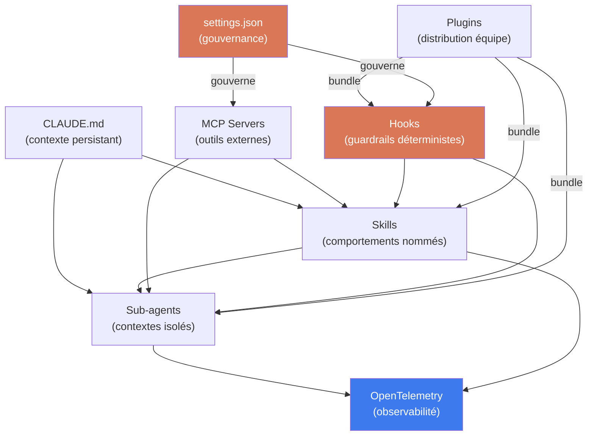

<!--
## Notes de recherche — Phase 2 (archivé)

### Statut transcript YouTube
La vidéo source « Build Your CUSTOM Claude Code Agentic OS (3 Steps) » (https://www.youtube.com/watch?v=Bgxsx8slDEA, chaîne Chase AI) a été identifiée mais son transcript n'est PAS accessible via WebFetch direct. Les résultats de recherche web confirment l'existence de la vidéo mais ne fournissent ni transcript complet ni résumé structuré de son contenu exact.
DÉCISION ÉDITORIALE : les trois étapes décrites au §14.2 sont une **reconstruction depuis la documentation officielle Claude Code** (code.claude.com/docs) et sources communautaires vérifiables. Elles ne sont PAS un transcript fidèle. Marqueur explicite posé en §14.2.

### Sources utilisées

(a) Documentation officielle Claude Code — source primaire vérifiée
1. Anthropic / code.claude.com — « Extend Claude with skills » — mai 2026 — https://code.claude.com/docs/en/skills — Architecture complète des skills : frontmatter YAML, file structure, scopes (personal/project/plugin/managed), invoke control, dynamic context injection, `context: fork`, hooks scoped, `allowed-tools`. Statut : *confirmé* — documentation officielle.

2. Anthropic / code.claude.com — « Create custom subagents » — mai 2026 — https://code.claude.com/docs/en/sub-agents — Architecture des subagents : isolated context window, custom system prompt, tool access restrictions, model override, permission bubbling, preloading of skills. Distinctions subagents vs agent teams. Statut : *confirmé* — documentation officielle.

3. Anthropic / code.claude.com — « Claude Code Hooks Reference » — mai 2026 — https://code.claude.com/docs/en/hooks — 27 lifecycle events (5 safety-related), 5 hook types (command, HTTP, mcp_tool, prompt, agent), JSON input/output format, exit codes, environment variables. Statut : *confirmé* — documentation officielle.

4. Anthropic / code.claude.com — « Settings reference » — mai 2026 — https://code.claude.com/docs/en/settings — settings.json structure complète : 4 scopes (managed > local > project > user), permissions, MCP, sandbox, plugins, hooks. Statut : *confirmé* — documentation officielle.

5. Anthropic / code.claude.com — « Create plugins » — mai 2026 — https://code.claude.com/docs/en/plugins — Plugin structure : `.claude-plugin/plugin.json` manifest, skills/, agents/, hooks/hooks.json, .mcp.json, bin/, monitors/, settings.json. Distribution via marketplaces. Statut : *confirmé* — documentation officielle.

6. Anthropic / code.claude.com — « Overview » — mai 2026 — https://code.claude.com/docs/en/overview — Timeline des composantes : MCP lancé nov. 2024, Subagents juil. 2025, Hooks sept. 2025, Plugins oct. 2025, Skills oct. 2025, Agent Teams fév. 2026. Statut : *confirmé* — documentation officielle.

(b) Sources académiques et techniques vérifiées
7. Bhatt et al. — « Dive into Claude Code: The Design Space of Today's and Future AI Agent Systems » — arXiv 2604.14228v1 — avril 2026 — https://arxiv.org/html/2604.14228v1 — Analyse systémique de l'architecture Claude Code : 5 valeurs, 13 principes de design, 4 mécanismes d'extensibilité, pipeline de compaction 5 couches, 98.4% du codebase = infrastructure opérationnelle. Statut : *confirmé* — source académique primaire.

(c) Sources synthèse communautaire vérifiées
8. alexop.dev — « Understanding Claude Code's Full Stack » — 2026 — https://alexop.dev/posts/understanding-claude-code-full-stack/ — 3 couches architecturales (External Integration / Core Orchestration / Distribution & Scheduling). Statut : *probable* — synthèse communautaire cohérente avec documentation officielle.

9. MindStudio — « How to Build an Agentic Operating System with Claude Code » — 2026 — https://www.mindstudio.ai/blog/how-to-build-agentic-operating-system-claude-code — 4 couches : persistent context, tool registry, memory/logging, orchestration. Séquence 4 semaines. Statut : *probable* — synthèse pratique cohérente.

10. DEV Community / Jan Lucas Andmann — « Claude Code to AI OS Blueprint » — 2026 — https://dev.to/jan_lucasandmann_bb9257c/claude-code-to-ai-os-blueprint-skills-hooks-agents-mcp-setup-in-2026-46gg — 4 couches : workspace persistant, skills, hooks, agents+MCP. Statut : *probable* — synthèse communautaire.

11. Jock.pl — « Claude Code vs Codex CLI vs Aider vs OpenCode vs Pi vs Cursor » — 2026 — https://thoughts.jock.pl/p/ai-coding-harness-agents-2026 — Comparaison agents 2026 : Claude Code (80.9% SWE-bench Verified), Codex (~80%), architecture differences. Statut : *probable* — source secondaire journalistique.

12. AgentSkills.io — Open standard pour skills cross-outils — https://agentskills.io — Spécification ouverte à laquelle Claude Code skills se conforment. Statut : *confirmé* — référencé dans la documentation officielle Claude Code.

### Timeline des composantes Claude Code (confirmé — documentation officielle)
- MCP support : novembre 2024
- Subagents : juillet 2025
- Hooks : septembre 2025
- Plugins : octobre 2025
- Skills : octobre 2025
- Agent Teams : février 2026

### Comparaison outillage (source 11 + recherches WebSearch)
- Claude Code SWE-bench Verified : 80.9% (Anthropic, confirmé)
- Codex Agent : ~80% (OpenAI, confirmé)
- Aider, Cline : outils en mode paire, non autonomes longue durée
- Cursor : IDE fork, UX axée développeur, multi-modèles
-->

> **Partie 5 — Piloter la transition**
> **Chapitre 14 · Coda tactique : construire son OS agentique personnalisé — ~4 200 mots · lecture ≈ 16 min**

La thèse de ce chapitre peut être énoncée directement : les treize chapitres précédents ont défini ce que l'*agentic AI* doit être — gouvernée, observable, portable, réversible. Ce chapitre montre comment l'assembler concrètement, en trois étapes, avec un outil opérationnel dont la stack complète est publique et versionnée. L'outil est Claude Code. La décision n'est pas un choix éditorial arbitraire : Claude Code est le seul harnais *agentic* dont l'architecture interne a fait l'objet d'une analyse systémique académique publiée (Bhatt et al., arXiv 2604.14228v1, avril 2026) et dont l'intégralité des mécanismes d'extensibilité — skills, hooks, sub-agents, MCP, plugins — est documentée officiellement à mai 2026. C'est aussi le sujet de la vidéo source de ce chapitre : « Build Your CUSTOM Claude Code Agentic OS (3 Steps) » (Chase AI, YouTube). **Note de transparence** : le transcript de cette vidéo n'a pas pu être récupéré. Les trois étapes décrites au §14.2 sont une reconstruction depuis la documentation officielle Claude Code et les sources académiques citées en notes de recherche — elles ne constituent pas un transcript fidèle.

---

## 14.1 — Pourquoi assembler son OS agentique plutôt qu'adopter une plateforme clé-en-main

La question de la plateforme propriétaire versus le harnais personnalisé a été posée au [Ch. 10](ch10-scaling-without-lockin.md) sous l'angle de la portabilité et du *lock-in*. Elle mérite ici un angle différent : celui du contrôle opérationnel.

Une plateforme clé-en-main — AWS Bedrock Agents, Azure AI Foundry, Google Vertex AI Agent Builder — optimise pour la mise en service rapide. Elle fournit une interface de configuration, un modèle de déploiement, des connecteurs préconfigurés, et un tableau de bord de supervision. Ce que la plateforme ne fournit pas, c'est la transparence du mécanisme de sécurité et le contrôle fin du comportement de l'agent à chaque point de son cycle de vie.

L'analyse de l'architecture Claude Code par Bhatt et al. (arXiv 2604.14228v1, *confirmé*) établit un fait structurel : dans ce harnais, 98,4 % du code constitue de l'infrastructure opérationnelle — permissions, sandboxing, observabilité, compaction de contexte, gestion du cycle de vie — contre 1,6 % de logique de décision du modèle. Cette proportion n'est pas une curiosité statistique. Elle signifie que la sécurité du système repose sur sept couches d'autorisation indépendantes, chacune capable de bloquer une invocation d'outil, et que le modèle ne peut pas contourner ces couches parce qu'il communique uniquement via des blocs `tool_use` structurés, validés avant exécution. Une plateforme propriétaire dont les mécanismes internes sont opaques offre une confiance par contrat, pas une confiance par architecture vérifiable.

Le second argument est la composabilité. Un OS agentique personnalisé peut charger un skill de revue de code PR pour les projets d'ingénierie, un hook de validation de conformité OSFI E-23 pour les flux financiers, et un sous-agent d'analyse de mémoire épisodique pour les sessions de rédaction longue — en une seule configuration YAML versionnée dans le dépôt. Une plateforme propriétaire délimite ce qu'il est possible de composer à l'intérieur de ses primitives. Le harnais personnalisé délimite uniquement ce que les outils sous-jacents permettent.

Le troisième argument est la gouvernance. Le [Ch. 8](ch08-trustworthy-systems.md) a posé la condition : « humans set rules, agents execute, exceptions escalate. » Un OS agentique personnalisé implémente cette condition au niveau du fichier de configuration — un `.claude/settings.json` commité dans le dépôt, auditable, versionné, déployable par IT via les paramètres gérés (*managed settings*). Le changement d'une règle de permission est un *commit* avec un historique traçable. Dans une plateforme propriétaire, ce changement est un clic dans une interface web dont l'auditabilité dépend des logs de la plateforme.

**Compromis principal** : l'OS personnalisé requiert un investissement initial plus élevé — comprendre les mécanismes, configurer les composantes, former les équipes — et une charge de maintenance continue. La plateforme propriétaire est opérationnelle en jours, non en semaines.

**Condition qui renverse la recommandation en faveur de la plateforme** : si l'organisation n'a pas de praticien capable de maintenir des configurations YAML et des scripts de hooks, ou si les exigences de conformité imposent une certification de fournisseur que seule une plateforme certifiée peut fournir, la plateforme propriétaire est le choix correct. Ce chapitre s'adresse à l'organisation qui a choisi de construire.

---

## 14.2 — Les trois étapes d'assemblage

**Avertissement de transparence** : ces trois étapes sont une reconstruction documentaire depuis la documentation officielle Claude Code (code.claude.com/docs, mai 2026) et les sources académiques et communautaires citées en notes de recherche. Elles ne sont pas un transcript de la vidéo source. La structure en trois étapes est cohérente avec la logique d'accumulation des composantes dans la documentation officielle et avec les synthèses communautaires vérifiées.

### Étape 1 — Poser le contexte et les skills : le cerveau déclaratif

La première étape consiste à donner à l'agent une identité persistante et un répertoire de comportements nommés. Elle produit trois artefacts versionnés : un fichier `CLAUDE.md`, une collection de skills, et un premier sous-agent spécialisé.

**Le `CLAUDE.md` comme contrat organisationnel**

Le fichier `CLAUDE.md` — chargé au démarrage de chaque session depuis la racine du projet, depuis `~/.claude/CLAUDE.md` (scope personnel) et depuis les niveaux encaissés (*nested*) selon la hiérarchie des scopes — est le point d'entrée de tout contexte persistant. Ce n'est pas une simple documentation : c'est l'instruction système de l'agent. Il doit contenir les éléments que l'architecte du [Ch. 8](ch08-trustworthy-systems.md) classerait comme règles non délégables : standards de code, conventions de sécurité, procédures d'escalade, périmètres d'autonomie, seuils de reversibilité.

Un `CLAUDE.md` efficace pour un OS agentique d'entreprise est dense, pas exhaustif. Il nomme les skills disponibles et leurs conditions d'invocation, liste les outils MCP actifs et leurs domaines d'application, et énonce les périmètres de permission (ce que l'agent peut faire seul, ce qui requiert confirmation humaine, ce qui est interdit). La cible pratique est sous 400 lignes (*hypothèse maison* — fondée sur les coûts de contexte typiques d'un Claude Sonnet 4.x avec corpus chargé en parallèle) ; au-delà, le coût de contexte constant devient prohibitif.

**Les skills comme macros de comportement reproductible**

Un *skill* dans Claude Code est un fichier `SKILL.md` placé dans `.claude/skills/<nom>/` (scope projet) ou `~/.claude/skills/<nom>/` (scope personnel), conforme au standard ouvert AgentSkills.io (*confirmé* — référencé dans la documentation officielle). La structure minimale est un frontmatter YAML suivi d'instructions en Markdown :

```yaml
# ~/.claude/skills/code-review/SKILL.md
---
name: code-review
description: Revue de PR : sécurité, couverture, conventions. Invoquer quand l'utilisateur demande une revue de code ou mentionne une PR.
disable-model-invocation: false
allowed-tools: Bash(gh pr *) Read Grep
context: fork
agent: Explore
---

Analyse la pull request $ARGUMENTS selon les critères suivants :
1. Sécurité : injection, exposition de secrets, surface d'attaque
2. Couverture de tests : identifier les chemins non couverts
3. Conventions : vérifier la conformité au style du projet

!`gh pr diff $ARGUMENTS`
!`gh pr view $ARGUMENTS --comments`

Produis un rapport structuré avec : risques critiques, avertissements, suggestions.
```

La ligne `context: fork` envoie l'exécution dans un sous-agent isolé avec un contexte propre — le résultat résumé revient dans la session principale sans polluer son fenêtre de contexte. C'est le pattern de composition fondamental de l'OS agentique : déléguer à un contexte isolé, récupérer le résumé.

Le frontmatter contrôle également qui peut invoquer le skill. `disable-model-invocation: true` réserve l'invocation à l'utilisateur — utile pour les skills à effets de bord (déploiements, envoi de courriels, commits). `user-invocable: false` réserve l'invocation au modèle — utile pour le contexte de fond (conventions d'un système hérité, politique de sécurité) que le modèle doit charger automatiquement mais que l'utilisateur n'invoquerait pas directement.

### Étape 2 — Intégrer les MCP servers et les hooks : les nerfs et les réflexes

La deuxième étape connecte l'agent aux systèmes extérieurs (MCP) et implémente les politiques déterministes qui ne peuvent pas reposer sur le jugement du modèle (hooks).

**MCP servers : résoudre le problème N×M**

Le [Ch. 5](ch05-protocols-interoperability.md) a établi le rôle de MCP (*Model Context Protocol*) dans l'architecture agentique d'entreprise : remplacer N×M adaptateurs custom par N+M composantes standard. Dans un OS agentique personnalisé, les serveurs MCP se configurent à deux niveaux distincts.

Le niveau utilisateur (`~/.claude.json`) héberge les serveurs qui traversent tous les projets — GitHub, gestionnaire de mots de passe, base de connaissances interne :

```json
{
  "mcpServers": {
    "github": {
      "command": "uvx",
      "args": ["mcp-server-github"],
      "env": { "GITHUB_TOKEN": "${GITHUB_TOKEN}" }
    },
    "memory": {
      "command": "node",
      "args": ["/usr/local/bin/mcp-memory-server.js"],
      "env": { "MEMORY_DB": "${HOME}/.claude/memory.db" }
    }
  }
}
```

Le niveau projet (`.mcp.json` à la racine du dépôt, commitable) héberge les serveurs spécifiques au projet — base de données de staging, API interne, registre de documents :

```json
{
  "mcpServers": {
    "project-db": {
      "command": "npx",
      "args": ["-y", "@company/mcp-postgres", "--db", "${DATABASE_URL}"]
    }
  }
}
```

La séparation des scopes est une décision de gouvernance autant que technique. Un serveur MCP configuré au niveau projet peut être commité dans le dépôt — il passe par le processus de revue de code habituel, avec les règles de permission associées définies dans `.claude/settings.json`. Un serveur MCP au niveau utilisateur est sous la responsabilité du praticien individuel.

**Hooks : les réflexes déterministes**

Le [Ch. 9](ch09-agentic-security.md) a identifié les *guardrails* comme couche défensive non négociable. Dans Claude Code, les hooks sont le mécanisme d'implémentation de ces guardrails au niveau du cycle de vie de l'agent — et leur nature déterministe (scripts shell, endpoints HTTP, outils MCP) est précisément ce qui les rend fiables là où le jugement du modèle ne l'est pas.

La documentation officielle (*confirmé*) liste 27 événements de cycle de vie. Les cinq événements à impact direct sur la sécurité sont `PreToolUse`, `PostToolUse`, `PostToolUseFailure`, `PermissionDenied`, et `PermissionRequest`. La configuration se fait dans `.claude/settings.json` (scope projet) ou `~/.claude/settings.json` (scope personnel) :

```json
{
  "hooks": {
    "PreToolUse": [
      {
        "matcher": "Bash",
        "hooks": [
          {
            "type": "command",
            "command": "\"$CLAUDE_PROJECT_DIR\"/.claude/hooks/validate-bash.sh",
            "timeout": 10
          }
        ]
      }
    ],
    "PostToolUse": [
      {
        "matcher": "Write|Edit",
        "hooks": [
          {
            "type": "command",
            "command": "jq -r '.tool_input.file_path' | xargs npx eslint --fix"
          }
        ]
      }
    ]
  }
}
```

Le script `validate-bash.sh` reçoit sur stdin un objet JSON décrivant l'outil invoqué (`tool_name`, `tool_input`, contexte de session). Il retourne via le code de sortie et stdout la décision : sortie `0` pour continuer, sortie `2` pour bloquer avec un message d'erreur. Cette interface stdin/stdout est le contrat formel entre l'agent et les guardrails — indépendant du modèle, exécutable par n'importe quel script shell.

Trois types de hooks valent d'être systématiquement configurés dans un OS agentique d'entreprise :

1. **Validation pré-exécution** (`PreToolUse` sur `Bash`) : détecter les commandes destructrices, interdire l'accès à des chemins hors périmètre, valider les paramètres d'invocation d'outils critiques.

2. **Qualité post-édition** (`PostToolUse` sur `Write|Edit`) : lancer automatiquement le linter ou le formatter après chaque modification de fichier — ce que le [Ch. 7](ch07-agentops.md) nomme un *quality gate* déterministe.

3. **Contexte de session** (`SessionStart`) : charger des variables d'environnement, injecter du contexte de projet spécifique à l'environnement (URL de staging vs production, identifiants de ticket courant), initialiser les logs de session.

### Étape 3 — Déployer, observer, gouverner : le plan de contrôle

La troisième étape est celle que les équipes sautent le plus souvent — et c'est précisément l'omission que le [Ch. 12](ch12-lessons-failed.md) identifie comme signal d'échec précoce. Déployer un OS agentique sans plan de contrôle, c'est livrer un agent sans AgentOps.

**Le fichier `settings.json` comme manifeste de gouvernance**

L'intégralité des règles de permission de l'OS agentique se concentre dans `settings.json`. La structure de cascade — *managed* (IT, inaltérable) → *local* (`.claude/settings.local.json`, ignoré de git) → *project* (`.claude/settings.json`, commitable) → *user* (`~/.claude/settings.json`, personnel) — implémente exactement le modèle *humans set rules, agents execute* du [Ch. 8](ch08-trustworthy-systems.md) : l'IT définit les règles inaltérables, le projet définit les règles d'équipe, le praticien affine pour son usage personnel.

Un `settings.json` de référence pour un OS agentique d'entreprise combine permissions granulaires, périmètre sandbox, et politique de hooks :

```json
{
  "$schema": "https://json.schemastore.org/claude-code-settings.json",
  "model": "claude-sonnet-4-5",
  "effortLevel": "high",
  "permissions": {
    "allow": [
      "Bash(git diff *)",
      "Bash(git log *)",
      "Bash(git status)",
      "Bash(npm run test)",
      "Bash(npm run lint)",
      "Read(**)"
    ],
    "deny": [
      "Bash(git push --force *)",
      "Bash(rm -rf *)",
      "Read(./.env*)",
      "Read(./secrets/**)",
      "WebFetch(domain:*.internal-only.example.com)"
    ],
    "ask": [
      "Bash(git push *)",
      "Bash(npm publish *)"
    ],
    "defaultMode": "default"
  },
  "sandbox": {
    "enabled": true,
    "filesystem": {
      "denyRead": ["~/.aws/credentials", "~/.ssh/"],
      "allowWrite": ["/tmp/claude-workspace", "./"]
    }
  }
}
```

**Plugins comme unité de distribution d'équipe**

Dès que l'OS agentique doit s'étendre à une équipe, le plugin est la primitive de distribution. Un plugin Claude Code est un dépôt avec la structure suivante :

```
monorepo-workflow-plugin/
├── .claude-plugin/
│   └── plugin.json          # manifest : nom, version, description
├── skills/
│   ├── review-pr/
│   │   └── SKILL.md
│   └── release-notes/
│       └── SKILL.md
├── agents/
│   └── security-auditor.md  # sous-agent spécialisé sécurité
├── hooks/
│   └── hooks.json           # hooks d'équipe (lint, validation)
└── .mcp.json                # serveurs MCP du projet
```

L'installation par un membre de l'équipe se fait par `/plugin install github:org/monorepo-workflow-plugin`. La mise à jour est gérée par le versionnage sémantique dans `plugin.json`. Le responsable de l'OS agentique publie une nouvelle version du plugin à chaque évolution des politiques d'équipe — sans déploiement manuel sur chaque poste.

**Observabilité agentique : la connexion avec AgentOps**

Le [Ch. 7](ch07-agentops.md) a établi les quatre catégories de spans agentiques (*LLM spans*, *tool spans*, *memory spans*, *orchestration spans*). Dans un OS agentique Claude Code, cette observabilité passe par deux mécanismes complémentaires.

Le premier est natif : les hooks `PostToolUse` peuvent écrire dans un journal structuré chaque invocation d'outil, avec les paramètres, le résultat, et la latence. Ce journal est le substrat de l'évaluation en production définie au [Ch. 7 §7.5](ch07-agentops.md) — il permet de détecter les dérives de comportement, de mesurer le *tool correctness*, et de rejouer les sessions pour diagnostic.

Le second est externe : Claude Code exporte ses traces via OpenTelemetry quand l'environnement est configuré (`CLAUDE_CODE_ENABLE_TELEMETRY=1` dans `settings.json > env`). L'instrumentation s'appuie sur les conventions sémantiques GenAI OTel 1.40.0 (statut *Development* à mai 2026, attributs `gen_ai.agent.*` — *confirmé*, [Ch. 7](ch07-agentops.md)) pour les plateformes qui les supportent (Datadog, Grafana, Elastic).

---

## 14.3 — Cas concret : la monographie elle-même comme OS agentique

Ce chapitre a été rédigé dans un contexte qui illustre directement le patron qu'il décrit. La monographie *The Agentic Enterprise* a été produite via un harnais agentique dont les composantes correspondent précisément aux trois étapes du §14.2. La méta-référence n'est pas décorative — c'est un cas de validation du patron sur un projet documentaire réel, avec des contraintes de traçabilité, de cohérence terminologique et d'anti-fabrication directement analogues aux contraintes de conformité d'un projet d'entreprise.

**Le `CLAUDE.md` comme contrat éditorial**

Le fichier `CLAUDE.md` à la racine du dépôt encode l'intégralité du protocole éditorial : rôle et lectorat (architectes d'entreprise senior), hiérarchie des sources de vérité (documents du projet > sources primaires > sources secondaires), protocole de rédaction en quatre phases (cadrage → recherche Web → rédaction → vérification), format de sortie (Markdown GitHub-flavored, frontmatter YAML, Mermaid), et règles éditoriales (français canadien, marqueurs d'incertitude obligatoires, interdiction de fabrication). Ce fichier est l'équivalent du `CLAUDE.md` d'un projet logiciel — mais pour un flux de travail éditorial. À chaque session de rédaction d'un chapitre, l'agent charge ce contexte sans que l'opérateur ait à le rétablir manuellement.

**Les chapitres comme skills de mémoire procédurale**

Chaque chapitre précédent est un artefact de mémoire procédurale — une décision editoriale tranchée, versionnée, référençable. Les renvois croisés (`[Ch. 5](ch05-protocols-interoperability.md)`, `[Ch. 7](ch07-agentops.md)`) sont l'équivalent des invocations de skills : l'agent accède au contenu déjà validé plutôt que de régénérer un raisonnement depuis zéro. La résistance à la fabrication repose sur ce même mécanisme — les marqueurs d'incertitude (`*confirmé / probable / à vérifier / hypothèse / inconnu*`) encodent dans chaque chapitre l'état épistémique de chaque affirmation, rendant l'audit anti-fabrication vérifiable par une lecture simple.

**Les sub-agents comme rédacteurs spécialisés**

Le plan de production (fichier `plan.md`) décompose la monographie en tâches indépendantes déléguées à des sub-agents distincts : chaque sous-agent rédige un chapitre dans son propre contexte isolé, lit les fichiers requis, exécute la recherche Web, et retourne le fichier produit. L'orchestrateur (session principale) coordonne les vagues de production, valide les esquisses avant rédaction, et applique les hooks de cohérence terminologique. Ce patron est exactement celui du [Ch. 6](ch06-orchestration-memory-tools.md) — superviseur qui décompose, workers qui exécutent dans des contextes isolés, orchestrateur qui intègre les résultats.

La similitude n'est pas accidentelle. Le patron *superviseur + workers isolés + validation orchestrateur* est générique. Il s'applique indifféremment à la rédaction d'une monographie, à la revue de code dans un monorepo, à l'analyse de conformité multi-juridictions, ou à l'audit de sécurité multi-composantes. Ce que l'OS agentique personnalisé fournit, c'est le harnais qui rend ce patron reproductible, auditable et maintenable — pas le contenu métier.

---

## 14.4 — Limites, compromis, et quand basculer vers une plateforme propriétaire



### Les compromis de l'OS personnalisé

**Maintenance continue.** Un OS agentique personnalisé est un produit logiciel, pas une configuration one-shot. Les skills évoluent avec les processus métier. Les hooks requièrent une mise à jour quand les règles de sécurité changent. Les serveurs MCP ont leurs propres cycles de versionnage. L'organisation qui ne budgète pas une demi-journée par semaine de maintenance pour son OS agentique verra sa configuration dériver en quelques mois — un anti-patron directement documenté au [Ch. 12](ch12-lessons-failed.md) sous « dette de configuration ».

**Courbe d'apprentissage par composante.** Les quatre mécanismes d'extensibilité de Claude Code (MCP, plugins, skills, hooks) opèrent à des coûts de contexte différents et répondent à des cas d'usage distincts — le choix entre skill inline et `context: fork`, entre hook `PreToolUse` et règle de permission dans `settings.json`, entre plugin distribué et configuration projet, requiert une compréhension de la sémantique de chaque mécanisme. L'arXiv 2604.14228v1 (*confirmé*) soulève explicitement ce compromis comme tension architecturale : « Simplicity vs. Extensibility — Four extension mechanisms provide flexibility but require users to understand which mechanism suits each use case. A unified API would simplify onboarding at the cost of reduced specialization. »

**Sécurité par configuration.** Les sept couches de permission de Claude Code sont robustes, mais leur robustesse dépend de la rigueur de la configuration. Une règle `allow` trop large dans `settings.json` neutralise plusieurs couches simultanément. Les vulnérabilités documentées de MCP — *tool poisoning*, injection via `sampling`, RCE supply chain dans les SDKs officiels (OX Security, avril 2026, *confirmé* — [Ch. 5](ch05-protocols-interoperability.md)) — s'appliquent à l'OS personnalisé comme à toute autre utilisation de MCP. La sécurité agentique ([Ch. 9](ch09-agentic-security.md)) n'est pas résolue par le harnais — elle est implémentée par ses opérateurs.

### Tableau comparatif des harnais

| Composante | Claude Code | OpenAI Codex Agent | Cursor | Cline |
|---|---|---|---|---|
| **Skills / macros** | Skills YAML (`SKILL.md`, standard AgentSkills.io) | Aucun mécanisme natif équivalent | Règles `.cursorrules` (flat text) | Modes custom (flat text) |
| **Sub-agents** | Sub-agents + Agent Teams (fév. 2026) | Sandboxes cloud parallèles | Non natif | Non natif |
| **MCP servers** | Natif (Tier 1 : TS, Python, C#, Go) | Non natif à mai 2026 | Non natif | Partiel via plugins |
| **Hooks lifecycle** | 27 événements, 5 types (command, HTTP, MCP, prompt, agent) | Non disponible | Non disponible | Non disponible |
| **Gouvernance versionnée** | `settings.json` (4 scopes, schéma JSON officiel) | Paramètres d'organisation ChatGPT | `.cursorignore`, règles UI | `.clinerules` |
| **Distribution équipe** | Plugins (manifest JSON, marketplaces, npm/git) | Non disponible | Partage de templates | Non disponible |
| **Exécution locale** | Oui (CLI natif, Windows/macOS/Linux) | Optionnel (Codex CLI local) | Oui (IDE fork VS Code) | Oui (extension VS Code) |
| **Exécution cloud** | Oui (Routines, sessions web, iOS) | Oui (mode cloud primaire) | Non | Non |
| **SWE-bench Verified** | 80,9 % (Anthropic, *confirmé*) | ~80 % (OpenAI, *confirmé*) | N/A (IDE, non agent autonome) | N/A |
| **Cas d'usage principal** | OS agentique complet, codebase profonde, composabilité | Tâches autonomes asynchrones, PR sans surveillance | Développement interactif quotidien | Pair programming guidé |

Sources : documentation officielle respective, arXiv 2604.14228v1, Jock.pl (2026, *probable*), NxCode (2026, *probable*).

### Quand basculer vers une plateforme propriétaire

Quatre conditions rendent la plateforme propriétaire préférable à l'OS personnalisé :

**Certification de conformité requise par contrat.** Certains secteurs (santé, finance, défense) imposent que les outils traitant des données sensibles soient certifiés par des organismes reconnus. AWS Bedrock Agents et Azure AI Foundry disposent de certifications SOC 2, FedRAMP, HIPAA que Claude Code, en tant qu'outil CLI, n'est pas positionné à offrir comme produit certifié. Si un contrat ou un audit impose la certification du harnais lui-même, la plateforme propriétaire est le choix par défaut.

**Absence de praticien de maintenance.** L'OS agentique personnalisé requiert une compétence de configuration et de maintenance. Si l'organisation n'a pas de rôle équivalent à l'*AI ops manager* identifié au [Ch. 11](ch11-redesigning-work.md), le harnais dérivera inévitablement. La plateforme propriétaire externalise cette maintenance à son SLA.

**Intégration native dans un écosystème hyperscaleur déjà choisi.** Une organisation entièrement dans Azure (Azure DevOps, Azure Monitor, Entra ID, Azure OpenAI) bénéficiera d'intégrations natives qu'un harnais Claude Code ne peut pas répliquer sans travail d'intégration significatif. Le [Ch. 10](ch10-scaling-without-lockin.md) documente le compromis : l'enfermement dans l'écosystème hyperscaleur est acceptable si l'organisation ne prévoit pas de porter ses agents hors de cet écosystème.

**Déploiement à très grande échelle sans équipe d'ingénierie dédiée.** Au-delà de quelques centaines d'utilisateurs simultanés, la gestion d'un parc de configurations `settings.json` et de plugins versionnés nécessite des outils de déploiement et de monitoring qui rapprochent rapidement l'investissement du coût d'une plateforme. La frontière n'est pas fixe — elle dépend de la maturité DevOps de l'organisation — mais elle existe.

---

## Pour aller plus loin

**Anthropic / code.claude.com — Documentation officielle Claude Code** — https://code.claude.com/docs — La source de référence unique pour toutes les composantes décrites dans ce chapitre. Les pages `skills`, `sub-agents`, `hooks`, `settings`, et `plugins` sont les cinq lectures prioritaires pour tout praticien qui assemble un OS agentique. La documentation est mise à jour en continu ; vérifier les changelogs avant tout déploiement.

**Bhatt et al. — « Dive into Claude Code: The Design Space of Today's and Future AI Agent Systems »** — arXiv 2604.14228v1 — avril 2026 — https://arxiv.org/html/2604.14228v1 — L'analyse systémique la plus complète disponible de l'architecture Claude Code à mai 2026. Les sections sur les treize principes de design, les sept couches de permission, et les six directions ouvertes sont les contributions les plus directement actionnables pour un architecte d'entreprise.

**AgentSkills.io — Open Standard for Agent Skills** — https://agentskills.io — La spécification ouverte à laquelle les skills Claude Code se conforment. La lecture de cette spec permet d'évaluer la portabilité des skills vers d'autres outils qui implémentent le même standard.

**Anthropic — « Claude Code: Best Practices »** — https://code.claude.com/docs/en/best-practices — Le guide pratique officiel pour la rédaction efficace de `CLAUDE.md`, la structuration des skills, et l'optimisation du coût de contexte. Complémentaire à ce chapitre pour l'implémentation opérationnelle.

**OpenTelemetry — « Semantic Conventions for GenAI agent spans »** — https://opentelemetry.io/docs/specs/semconv/gen-ai/gen-ai-agent-spans/ — La spec OTel GenAI SemConv 1.40.0 (statut *Development*, avril 2026) est le standard d'instrumentation à utiliser pour l'observabilité des OS agentiques. À suivre pour la stabilisation des attributs `gen_ai.agent.*`.

---

## Références

1. Anthropic — « Extend Claude with skills » — Claude Code Docs — mai 2026 — https://code.claude.com/docs/en/skills — accédée le 2026-05-05

2. Anthropic — « Create custom subagents » — Claude Code Docs — mai 2026 — https://code.claude.com/docs/en/sub-agents — accédée le 2026-05-05

3. Anthropic — « Hooks reference » — Claude Code Docs — mai 2026 — https://code.claude.com/docs/en/hooks — accédée le 2026-05-05

4. Anthropic — « Settings reference » — Claude Code Docs — mai 2026 — https://code.claude.com/docs/en/settings — accédée le 2026-05-05

5. Anthropic — « Create plugins » — Claude Code Docs — mai 2026 — https://code.claude.com/docs/en/plugins — accédée le 2026-05-05

6. Anthropic — « Claude Code overview » — Claude Code Docs — mai 2026 — https://code.claude.com/docs/en/overview — accédée le 2026-05-05

7. Bhatt, D. et al. — « Dive into Claude Code: The Design Space of Today's and Future AI Agent Systems » — arXiv 2604.14228v1 — avril 2026 — https://arxiv.org/html/2604.14228v1 — accédée le 2026-05-05

8. AgentSkills.io — « Agent Skills Open Standard » — https://agentskills.io — accédée le 2026-05-05

9. OpenTelemetry — « Semantic Conventions for GenAI agent and framework spans » — OTel SemConv 1.40.0 — avril 2026 — https://opentelemetry.io/docs/specs/semconv/gen-ai/gen-ai-agent-spans/ — accédée le 2026-05-05

10. OX Security — « The Mother of All AI Supply Chains: Critical, Systemic Vulnerability at the Core of Anthropic's MCP » — avril 2026 — https://www.ox.security/blog/the-mother-of-all-ai-supply-chains-critical-systemic-vulnerability-at-the-core-of-the-mcp/ — accédée le 2026-05-05

11. Jock.pl — « Claude Code vs Codex CLI vs Aider vs OpenCode vs Pi vs Cursor: Which AI Coding Harness Actually Works Without You? » — 2026 — https://thoughts.jock.pl/p/ai-coding-harness-agents-2026 — accédée le 2026-05-05

12. alexop.dev — « Understanding Claude Code's Full Stack: MCP, Skills, Subagents, and Hooks Explained » — 2026 — https://alexop.dev/posts/understanding-claude-code-full-stack/ — accédée le 2026-05-05

13. MindStudio — « How to Build an Agentic Operating System with Claude Code » — 2026 — https://www.mindstudio.ai/blog/how-to-build-agentic-operating-system-claude-code — accédée le 2026-05-05
