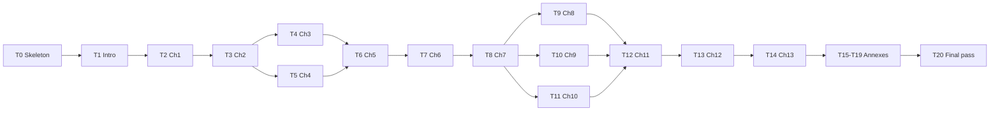

# Plan d'exécution — Monographie *The Agentic Enterprise*

> **Pour les workers agentiques :** SOUS-COMPÉTENCE REQUISE — utiliser `superpowers:subagent-driven-development` (recommandé) ou `superpowers:executing-plans` pour exécuter ce plan tâche par tâche. Les étapes utilisent la syntaxe checkbox (`- [ ]`).

**Objectif** : produire l'intégralité du contenu de [TOC.md](TOC.md) — introduction + 13 chapitres + 5 annexes + glossaire + bibliographie — en français canadien, conformément au protocole éditorial de [CLAUDE.md](CLAUDE.md.md), en déléguant la recherche et la rédaction à des **subagents Claude Code** dispatchés par vagues.

**Architecture** :
- 1 chapitre = 1 fichier Markdown autonome à la racine du dépôt.
- L'orchestrateur (session principale) coordonne ; les subagents (`subagent_type=general-purpose`) exécutent recherche et rédaction.
- Deux gabarits de prompt subagent : **Gabarit A** (Phases 1-2, livre une esquisse) et **Gabarit B** (Phase 3, livre la rédaction complète).
- Validation humaine systématique entre A et B (porte de qualité).
- Parallélisation par vagues, plafond 3 subagents simultanés.

**Stack** : Markdown GitHub-flavored · frontmatter YAML · Mermaid · subagents Claude Code (`Agent` tool).

---

## Conventions de nommage de fichiers

| # | Fichier cible | Cible mots | Lecture (min) |
|---|---|---|---|
| Intro | `00-introduction.md` | 2 500 | 10 |
| Ch 1 | `ch01-from-automation-to-agents.md` | 5 000 | 20 |
| Ch 2 | `ch02-business-case.md` | 5 500 | 22 |
| Ch 3 | `ch03-mapping-high-impact.md` | 5 000 | 20 |
| Ch 4 | `ch04-roi-risk-readiness.md` | 5 500 | 22 |
| Ch 5 | `ch05-protocols-interoperability.md` | 6 500 | 26 |
| Ch 6 | `ch06-orchestration-memory-tools.md` | 6 000 | 24 |
| Ch 7 | `ch07-agentops.md` | 6 500 | 26 |
| Ch 8 | `ch08-trustworthy-systems.md` | 5 500 | 22 |
| Ch 9 | `ch09-agentic-security.md` | 6 000 | 24 |
| Ch 10 | `ch10-scaling-without-lockin.md` | 5 000 | 20 |
| Ch 11 | `ch11-redesigning-work.md` | 5 500 | 22 |
| Ch 12 | `ch12-lessons-failed.md` | 5 000 | 20 |
| Ch 13 | `ch13-road-ahead.md` | 4 500 | 18 |
| Annexes | `annexe-A-architecture-review.md` … `annexe-E-glossaire-lectures.md` | 1 500 chacune | 6 |
| Glossaire | `glossaire.md` | — | — |
| Bibliographie | `references.md` | — | — |

---

## Gabarit A — Subagent *Cadrage + Recherche* (Phases 1-2)

```
[Identité]
Tu es subagent rédacteur de la monographie *The Agentic Enterprise*. La session parente ne te transmet AUCUN contexte hors ce prompt. Lis les fichiers listés AVANT toute autre action.

[Lectures obligatoires]
1. CLAUDE.md.md (protocole éditorial intégral)
2. TOC.md (table des matières, focus sur la Partie {P} — Chapitre {N})
3. plan.md (gabarits et conventions de fichiers)
4. Chapitre précédent `{prev_file}` si existant
5. Chapitre suivant `{next_file}` si existant
6. glossaire.md si existant

[Tâche]
Produire l'esquisse du chapitre {N} — « {titre TOC.md} » dans le fichier `{target_file}`. Phases 1 et 2 uniquement. NE PAS rédiger le chapitre complet.

[Livrable — fichier `{target_file}` contient EXACTEMENT]
- Frontmatter YAML : title, chapter, part, status: "esquisse", length_target_words: {target_words}, reading_time_min: {target_min}, last_updated
- Bloc `<!-- Notes de recherche -->` : 8-12 sources Phase 2, format "éditeur — titre — date — URL — apport spécifique"
- Section « Esquisse » (3-5 lignes) : (a) thèse, (b) question à laquelle le chapitre répond, (c) lecteur cible, (d) renvois croisés prévus
- Section « Plan détaillé » : titres de section + phrase-clé par section
- Section « Sources clés » : 5-10 sources retenues + justification courte

[Contraintes Phase 2 — recherche Web obligatoire]
Couvrir au minimum, calibré au sujet du chapitre :
- Versions courantes (Kafka, MCP SDK, A2A spec, frameworks agents : LangChain/LangGraph, AutoGen, CrewAI, OpenAI Agents SDK, Anthropic SDK, Google ADK)
- Papiers et keynotes 2025-2026 (KubeCon, NeurIPS, ICML, AAAI, AgentOps Day, Ray Summit, Anthropic/OpenAI DevDay)
- Incidents publics 2025-2026 (jailbreaks, exfiltrations cross-tool, échecs documentés)
- Évolutions réglementaires (EU AI Act, ISO/IEC 42001, NIST AI RMF, OSFI E-21, Loi 25 Québec)
- Position Gartner Hype Cycle 2026 + Deloitte Tech Trends 2026 si pertinent

[Rapport de retour]
- Chemin du fichier créé
- Liste exhaustive des 8-12 sources retenues
- Divergences entre sources (à signaler explicitement)
- Questions ouvertes nécessitant arbitrage humain

[Interdictions strictes]
- NE PAS rédiger le corps du chapitre.
- NE PAS inventer de sources, chiffres, versions, citations, dates.
- NE PAS ajouter de contenu hors livrable spécifié.
- AUCUN préambule courtois, métacommentaire IA, emoji.
```

---

## Gabarit B — Subagent *Rédaction* (Phase 3)

```
[Identité]
Tu es subagent rédacteur. Aucun contexte transmis hors ce prompt. Lis les fichiers listés AVANT rédaction.

[Lectures obligatoires]
1. CLAUDE.md.md (intégral)
2. TOC.md
3. plan.md
4. `{target_file}` (contient esquisse Phase 1-2 validée — sources et plan détaillé à respecter)
5. Chapitre précédent `{prev_file}` si existant
6. Chapitre suivant `{next_file}` si existant
7. glossaire.md

[Tâche]
Rédiger le chapitre {N} complet dans `{target_file}`. REMPLACER la version esquisse par la version rédigée.

[Livrable — fichier `{target_file}` final]
- Frontmatter YAML mis à jour : status: "rédigé", length_words (comptage réel), reading_time_min, last_updated
- Bloc `<!-- Notes de recherche -->` archivé en tête (conserver intégralement)
- Corps du chapitre conforme à CLAUDE.md.md §3 Phase 3 :
  - Pyramide inversée par section : thèse → premiers principes → cas concret → limites
  - Densité non négociable (aucun paragraphe sans charge informationnelle)
  - Toute recommandation : (1) compromis principal, (2) ≥ 1 alternative crédible, (3) condition qui la renverse
  - Diagrammes Mermaid quand utile, décrits en prose dense
  - Code minimal exécutable, langage et version épinglés (`Python 3.13`, `TypeScript 5.6`, `Go 1.23`, `Java 21 LTS`, `Kafka 4.0`, `MCP 1.x`)
  - Tableaux uniquement pour comparaisons ≥ 2 dimensions
- Section « Pour aller plus loin » : 3-5 références sélectives commentées
- Section « ## Références » : bibliographie chapitre complète, format auteur — titre — éditeur — date — URL — accédée le

[Cible quantitative]
{target_words} mots ± 15 % | lecture ≈ {target_min} min

[Auto-vérification AVANT retour — checklist CLAUDE.md.md §7]
- [ ] Conclusion accessible dès la première section
- [ ] Toutes affirmations factuelles datées (≤ mai 2026) et sourcées
- [ ] Au moins une recommandation avec compromis + alternative + condition de bascule
- [ ] Aucune fabrication (citations, versions, chiffres, API)
- [ ] Continuité avec chapitres adjacents (renvois croisés présents)
- [ ] Densité conforme : un architecte senior y trouve matière à décider
- [ ] Section « Pour aller plus loin » présente
- [ ] Bloc Notes de recherche archivé en tête
- [ ] Marqueurs d'incertitude calibrés : *confirmé / probable / hypothèse / à vérifier / inconnu*

[Rapport de retour]
- Chemin du fichier
- Longueur réelle (mots) et écart à la cible
- Renvois croisés émis : liste `[Ch. N](chNN-slug.md)`
- Marqueurs d'incertitude utilisés (compte par catégorie)
- Questions ouvertes pour révision humaine

[Interdictions strictes]
- Aucune fabrication (chiffres, versions, citations, API, dates non vérifiables).
- Pas de préambule courtois ni de métacommentaire IA.
- Pas d'emojis, pas d'exemples Foo/Bar/Baz, pas d'autorité par citation décorative.
- Pas de « nous » éditorial dans la prose ordinaire.
- Pas de listes à puces redondantes avec la prose.
```

---

## Vagues de production



| Vague | Tâches parallèles | Plafond |
|---|---|---|
| 0 | T0 | 1 |
| 1 | T1 | 1 |
| 2 | T2 | 1 |
| 3 | T3 | 1 |
| 4 | T4 ‖ T5 | 2 |
| 5 | T6 | 1 |
| 6 | T7 | 1 |
| 7 | T8 | 1 |
| 8 | T9 ‖ T10 ‖ T11 | 3 |
| 9 | T12 | 1 |
| 10 | T13 | 1 |
| 11 | T14 | 1 |
| 12 | T15 ‖ T16 ‖ T17 puis T18 ‖ T19 | 3 |
| 13 | T20 | 1 |

---

## T0 — Skeleton du projet

**Files** :
- Create : `glossaire.md`, `references.md`, `.gitignore` (si absent)
- Rename : `CLAUDE.md.md` → `CLAUDE.md`

- [ ] **Step 1 — Renommer CLAUDE.md.md → CLAUDE.md**

```bash
git mv CLAUDE.md.md CLAUDE.md
```

- [ ] **Step 2 — Créer `glossaire.md` initial**

Contenu :
```markdown
# Glossaire — *The Agentic Enterprise*

> Termes techniques retenus, avec définition opérationnelle et politique de traduction. Ajouter une entrée à la première occurrence d'un terme dans un chapitre.

## Conventions
- **Anglais conservé** (italique à la première occurrence par chapitre) : *event-driven*, *idempotency*, *exactly-once*, *backpressure*, *circuit breaker*, *saga*, *agentic*, *prompt injection*, *tool calling*, *retry budget*, *escalation cost*.
- **Traduit** : *agent* → agent, *workflow* → flux de travail, *deployment* → déploiement.

## Entrées (alphabétique)

### A2A (Agent-to-Agent Protocol)
*À compléter au Ch. 5.*

### AgentOps
*À compléter au Ch. 7.*

### MCP (Model Context Protocol)
*À compléter au Ch. 5.*
```

- [ ] **Step 3 — Créer `references.md` initial**

```markdown
# Bibliographie globale — *The Agentic Enterprise*

> Bibliographie consolidée. Chaque chapitre maintient sa propre section `## Références` ; ce fichier agrège les sources utilisées dans plus d'un chapitre.

## Format
auteur — titre — éditeur — date — URL — accédée le YYYY-MM-DD
```

- [ ] **Step 4 — Vérifier**

```bash
ls -la CLAUDE.md TOC.md plan.md glossaire.md references.md
```

Attendu : 5 fichiers présents, plus de `CLAUDE.md.md`.

- [ ] **Step 5 — Commit**

```bash
git add CLAUDE.md TOC.md plan.md glossaire.md references.md
git rm CLAUDE.md.md 2>/dev/null || true
git commit -m "chore: skeleton projet Agentic Enterprise (CLAUDE.md, plan, glossaire, references)"
```

---

## T1 — Introduction (`00-introduction.md`)

**Files** : Create `00-introduction.md`

**Variables Gabarit** : N=Intro, P=0, target_file=`00-introduction.md`, target_words=2500, target_min=10, prev_file=*aucun*, next_file=`ch01-from-automation-to-agents.md`

- [ ] **Step 1 — Dispatch Gabarit A**

Outil `Agent` (`subagent_type=general-purpose`, `description="Esquisse Introduction"`) avec prompt = Gabarit A ci-dessus, variables substituées. Focus recherche : lexique opérationnel agent / agentic AI / multi-agent system, distinction copilot vs agent système, lecteurs ciblés (CIO, architecte, PO, risk officer).

- [ ] **Step 2 — Réviser l'esquisse**

Lire `00-introduction.md`. Vérifier : thèse claire, question explicite, sources Phase 2 traçables, plan détaillé exploitable. Si manque, dispatcher Gabarit A en révision avec feedback ciblé.

- [ ] **Step 3 — Commit esquisse**

```bash
git add 00-introduction.md
git commit -m "docs(intro): esquisse validée"
```

- [ ] **Step 4 — Dispatch Gabarit B**

Outil `Agent` (`subagent_type=general-purpose`, `description="Rédaction Introduction"`) avec prompt = Gabarit B, variables substituées.

- [ ] **Step 5 — Vérification orchestrateur (Phase 4)**

Lire `00-introduction.md`. Cocher checklist CLAUDE.md §7. Lint Markdown :

```bash
npx --yes markdownlint-cli2 "00-introduction.md"
```

- [ ] **Step 6 — Commit**

```bash
git add 00-introduction.md
git commit -m "docs(intro): rédaction Phase 3 livrée"
```

---

## T2 — Chapitre 1 « From Automation to Agents » (`ch01-from-automation-to-agents.md`)

**Variables** : N=1, P=1, target_file=`ch01-from-automation-to-agents.md`, target_words=5000, target_min=20, prev_file=`00-introduction.md`, next_file=*non rédigé*

- [ ] **Step 1 — Dispatch Gabarit A**

Focus recherche : boucle decide–act–observe avec mémoire persistante, stateless RPA → stateful agent, ancrage EDA/event-driven comme terrain naturel des agents (renvoi à modernisation Kafka 4.x).

- [ ] **Step 2 — Réviser esquisse** · - [ ] **Step 3 — Commit esquisse** · - [ ] **Step 4 — Dispatch Gabarit B** · - [ ] **Step 5 — Vérification Phase 4** · - [ ] **Step 6 — Commit final**

```bash
git add ch01-from-automation-to-agents.md && git commit -m "docs(ch01): from automation to agents"
```

---

## T3 — Chapitre 2 « Business Case for Agentic AI » (`ch02-business-case.md`)

**Variables** : N=2, P=1, target_file=`ch02-business-case.md`, target_words=5500, target_min=22, prev_file=`ch01-from-automation-to-agents.md`, next_file=*non rédigé*

**Recherche prioritaire** : unit economics agentique (token cost → outcome cost), FinOps agentique (retry budget, escalation cost), Gartner « 40 % abandon d'ici 2027 » (vérifier source originale + date), thèse « 12× governance-first » (vérifier — probablement Gartner ou Deloitte 2026).

- [ ] **Step 1 — Dispatch Gabarit A** · - [ ] **Step 2 — Réviser** · - [ ] **Step 3 — Commit esquisse** · - [ ] **Step 4 — Dispatch Gabarit B** · - [ ] **Step 5 — Vérification** · - [ ] **Step 6 — Commit**

```bash
git add ch02-business-case.md && git commit -m "docs(ch02): business case agentic AI"
```

---

## T4 ‖ T5 — Chapitres 3 et 4 (parallèle)

> **Dispatch en parallèle dans un seul message** : deux appels `Agent` simultanés (Gabarit A pour T4 et T5).

### T4 — Chapitre 3 « Mapping High-Impact Applications » (`ch03-mapping-high-impact.md`)

**Variables** : N=3, P=2, target_words=5000, target_min=20, prev_file=`ch02-business-case.md`, next_file=`ch04-roi-risk-readiness.md`

**Recherche** : matrice cadrage autonomie × réversibilité × tolérance erreur ; patrons back-office vs front-office vs engineering ; anti-patrons documentés (échecs publiés 2025-2026).

- [ ] **Step 1A — Dispatch Gabarit A T4** (en parallèle avec Step 1B de T5) · - [ ] **Step 2 — Réviser** · - [ ] **Step 3 — Commit esquisse** · - [ ] **Step 4 — Dispatch Gabarit B** · - [ ] **Step 5 — Vérification** · - [ ] **Step 6 — Commit**

```bash
git add ch03-mapping-high-impact.md && git commit -m "docs(ch03): mapping high-impact applications"
```

### T5 — Chapitre 4 « Evaluating ROI, Risk, and Readiness » (`ch04-roi-risk-readiness.md`)

**Variables** : N=4, P=2, target_words=5500, target_min=22, prev_file=`ch03-mapping-high-impact.md`, next_file=`ch05-protocols-interoperability.md`

**Recherche** : cadre 4 piliers LLM/Memory/Tools/Environment (vérifier paternité — possiblement arXiv 2512.12791) ; métriques task success / tool correctness / retry budget / escalation quality / policy compliance ; décision build/buy/wait ; readiness assessment.

- [ ] **Step 1B — Dispatch Gabarit A T5** (parallèle avec Step 1A de T4) · - [ ] **Step 2 — Réviser** · - [ ] **Step 3 — Commit esquisse** · - [ ] **Step 4 — Dispatch Gabarit B** · - [ ] **Step 5 — Vérification** · - [ ] **Step 6 — Commit**

```bash
git add ch04-roi-risk-readiness.md && git commit -m "docs(ch04): ROI risk readiness"
```

**Synchronisation T4/T5** : aucun renvoi croisé entre Ch 3 et Ch 4 (parallèle sûr). Les deux référencent Ch 1-2 amont.

---

## T6 — Chapitre 5 « Protocols and Interoperability » (`ch05-protocols-interoperability.md`)

**Variables** : N=5, P=3, target_words=6500, target_min=26, prev_file=`ch04-roi-risk-readiness.md`, next_file=*non rédigé*

**Recherche prioritaire — chapitre charnière** :
- MCP (Model Context Protocol) : donation à la Linux Foundation décembre 2025, gouvernance actuelle, version SDK courante
- A2A (Agent-to-Agent) : capability discovery, task delegation, peer-to-peer orchestration, statut spec mai 2026
- WebMCP : portée et adoption
- AAIF (Agentic AI Interoperability Forum) et consolidation des standards
- Comparaison MCP vs A2A vs ACP vs UCP (cf. DigitalApplied)

- [ ] **Step 1** Dispatch Gabarit A · - [ ] **Step 2** Réviser · - [ ] **Step 3** Commit esquisse · - [ ] **Step 4** Dispatch Gabarit B · - [ ] **Step 5** Vérification · - [ ] **Step 6** Commit

```bash
git add ch05-protocols-interoperability.md && git commit -m "docs(ch05): protocols and interoperability"
```

- [ ] **Step 7 — Mise à jour `glossaire.md`** : compléter les entrées MCP, A2A, AAIF, WebMCP avec définitions opérationnelles validées au Ch. 5.

```bash
git add glossaire.md && git commit -m "docs(glossaire): entrées MCP/A2A/AAIF/WebMCP post-Ch5"
```

---

## T7 — Chapitre 6 « Orchestration, Memory, and Tools » (`ch06-orchestration-memory-tools.md`)

**Variables** : N=6, P=3, target_words=6000, target_min=24, prev_file=`ch05-protocols-interoperability.md`, next_file=`ch07-agentops.md`

**Recherche** : patrons supervisor / swarm / hierarchical / graph-based (LangGraph, AutoGen, CrewAI, OpenAI Swarm — versions courantes) ; memory engineering episodic / semantic / procedural et **dette de mémoire** ; tool design — idempotence, side-effect contracts, schémas robustes.

- [ ] **Steps 1-6** (gabarits A puis B, validation, commits) ·

```bash
git add ch06-orchestration-memory-tools.md && git commit -m "docs(ch06): orchestration memory tools"
```

---

## T8 — Chapitre 7 « AgentOps » (`ch07-agentops.md`)

**Variables** : N=7, P=3, target_words=6500, target_min=26, prev_file=`ch06-orchestration-memory-tools.md`, next_file=*non rédigé* (Ch 8/9/10 parallèles à venir)

**Recherche** : AgentOps vs MLOps (delta opérationnel) ; observabilité agentique — traces multi-étapes, tool spans, memory diffs (N-iX 2026, OpenTelemetry GenAI sémantique) ; evaluation in production — régression continue, replay, shadow runs ; cycle de vie promote/deprecate/rollback.

- [ ] **Steps 1-6** ·

```bash
git add ch07-agentops.md && git commit -m "docs(ch07): agentops"
```

- [ ] **Step 7 — Mise à jour glossaire** : entrée AgentOps avec définition opérationnelle ; entrée *task success / tool correctness / retry budget / escalation quality* (métriques canon).

```bash
git add glossaire.md && git commit -m "docs(glossaire): entrées AgentOps + métriques"
```

---

## T9 ‖ T10 ‖ T11 — Chapitres 8, 9, 10 (parallèle, plafond 3)

> **Dispatch en parallèle dans un seul message** : trois appels `Agent` simultanés. Aucun renvoi croisé direct entre Ch 8, 9, 10 ; tous référencent Ch 5-7 amont. Sûreté du parallélisme : confirmée.

### T9 — Chapitre 8 « Building Trustworthy Systems » (`ch08-trustworthy-systems.md`)

**Variables** : N=8, P=4, target_words=5500, target_min=22, prev_file=`ch07-agentops.md`, next_file=`ch09-agentic-security.md`

**Recherche** : hierarchical autonomy (assistance → supervisé → autonome borné → autonome) ; HITL opérationnel — *humans set rules, agents execute, exceptions escalate* ; auditabilité — decision logs, justifiable actions ; conformité EU AI Act (texte final 2024 + actes délégués 2025-2026), ISO/IEC 42001:2023, NIST AI RMF 1.0 + Generative AI Profile.

- [ ] **Steps 1-6** ·

```bash
git add ch08-trustworthy-systems.md && git commit -m "docs(ch08): trustworthy systems"
```

### T10 — Chapitre 9 « Agentic Security » (`ch09-agentic-security.md`)

**Variables** : N=9, P=4, target_words=6000, target_min=24, prev_file=`ch08-trustworthy-systems.md`, next_file=`ch10-scaling-without-lockin.md`

**Recherche prioritaire** : modèle menace agentique — prompt injection via tools, cross-tool exfiltration, jailbreak by delegation (papiers arXiv 2025-2026, OWASP LLM Top 10 v2 si disponible) ; identity & access pour agents — tokens per-task, least-privilege dynamique, OAuth 2.1 + RFC scopes ; défense en profondeur — guardrails (Llama Guard, Anthropic guardrails, NeMo Guardrails versions courantes), sandboxing, kill switches.

- [ ] **Steps 1-6** ·

```bash
git add ch09-agentic-security.md && git commit -m "docs(ch09): agentic security"
```

### T11 — Chapitre 10 « Scaling Without Lock-In » (`ch10-scaling-without-lockin.md`)

**Variables** : N=10, P=4, target_words=5000, target_min=20, prev_file=`ch09-agentic-security.md`, next_file=*non rédigé*

**Recherche** : open agentic stack vs plateformes propriétaires (AWS Bedrock Agents, Azure AI Foundry, Google Vertex AI Agent Builder, IBM watsonx.ai — versions et limites mai 2026) ; portabilité par MCP/A2A — changement de fournisseur sans réécriture ; stratégie multi-vendor — routage par capacité/coût/latence/conformité (LiteLLM, OpenRouter, Bedrock cross-region).

- [ ] **Steps 1-6** ·

```bash
git add ch10-scaling-without-lockin.md && git commit -m "docs(ch10): scaling without lock-in"
```

**Synchronisation T9/T10/T11** : après les trois Phase B livrées, **vérifier la cohérence terminologique** entre les trois chapitres (compromis Ch 8 vs contraintes sécurité Ch 9 vs portabilité Ch 10). Si conflit, harmoniser via Ch 9 prioritaire (sécurité contraint le reste). Commit séparé si retouche.

---

## T12 — Chapitre 11 « Redesigning Work, Not Augmenting It » (`ch11-redesigning-work.md`)

**Variables** : N=11, P=5, target_words=5500, target_min=22, prev_file=`ch10-scaling-without-lockin.md`, next_file=`ch12-lessons-failed.md`

**Recherche** : Deloitte State of AI in the Enterprise 2026 — chiffre « 54 % C-suite : l'IA déchire l'entreprise » à vérifier en source primaire ; nouveaux rôles (AI ops manager, human–AI interaction designer, quality steward) ; hybrid workflows ; change management — chiffre « 87 % priorisent upskilling » à vérifier (Writer 2026 ou autre).

- [ ] **Steps 1-6** ·

```bash
git add ch11-redesigning-work.md && git commit -m "docs(ch11): redesigning work"
```

---

## T13 — Chapitre 12 « Lessons from the 60 % That Failed » (`ch12-lessons-failed.md`)

**Variables** : N=12, P=5, target_words=5000, target_min=20, prev_file=`ch11-redesigning-work.md`, next_file=`ch13-road-ahead.md`

**Recherche** : anatomie échecs 2025-2026 — techniques (drift outils, dette mémoire, evals manquantes), organisationnels (gouvernance absente, ROI flou), économiques (coûts retry non bornés) ; chiffre Gartner « 60 % abandons » à sourcer en primaire avec date ; signaux faibles — checklist ; critères kill / pivot / scale.

- [ ] **Steps 1-6** ·

```bash
git add ch12-lessons-failed.md && git commit -m "docs(ch12): lessons from failures"
```

---

## T14 — Chapitre 13 « The Road Ahead » (`ch13-road-ahead.md`)

**Variables** : N=13, P=5, target_words=4500, target_min=18, prev_file=`ch12-lessons-failed.md`, next_file=*aucun*

**Recherche** : Gartner Hype Cycle for Agentic AI 2026 (positions agentic governance / agentic security / FinOps agentique) ; horizons 2027-2030 — autonomous teams, multi-org agentic supply chains, intersection edge + mainframe modernisé (renvoi explicite à Ch. 1) ; position de l'architecte d'entreprise dans 5 ans.

**Note** : ce chapitre clôt l'arc narratif. Renvois croisés OBLIGATOIRES vers Ch. 1 (boucle decide-act-observe), Ch. 2 (unit economics 2026 vs 2030), Ch. 7 (AgentOps maturité), Ch. 11 (rôles).

- [ ] **Steps 1-6** ·

```bash
git add ch13-road-ahead.md && git commit -m "docs(ch13): road ahead"
```

---

## T15-T19 — Annexes A à E (parallèle 3+2)

> **Vague A — dispatch parallèle T15 ‖ T16 ‖ T17** (3 subagents).
> **Vague B — dispatch parallèle T18 ‖ T19** (2 subagents).
>
> Les annexes sont opérationnelles (checklists, canvases, modèles) et n'ont pas de Phase 1 esquisse séparée : **un seul subagent Gabarit B' adapté** par annexe (recherche Web ciblée + production directe).

### Gabarit B' — Annexe (variante condensée)

```
[Identité et lectures] (idem Gabarit B)

[Tâche]
Produire l'annexe {X} — « {titre} » dans `{target_file}` : artefact opérationnel directement utilisable par un architecte d'entreprise. Format : checklist actionnable, tableau de critères ou canvas.

[Livrable]
Fichier `{target_file}` :
- Frontmatter YAML
- 1-2 paragraphes de cadrage (à quoi sert l'annexe, comment l'utiliser, où dans le cycle d'adoption)
- Artefact principal (checklist / canvas / matrice / modèle RACI)
- Section « Mode d'emploi » : 3-5 étapes pour appliquer l'artefact
- Renvois croisés vers chapitres pertinents

[Cible] 1500 mots ± 15 % | lecture ≈ 6 min
```

### T15 — Annexe A « Architecture Review Checklist » (`annexe-A-architecture-review.md`)

**Renvois** : Ch. 5 (protocoles), Ch. 7 (AgentOps), Ch. 9 (sécurité). Couvrir : sécurité, observabilité, FinOps.

- [ ] Dispatch Gabarit B' · - [ ] Vérification · - [ ] Commit `docs(annexe-A): architecture review checklist`

### T16 — Annexe B « Use Case Canvas » (`annexe-B-use-case-canvas.md`)

**Renvois** : Ch. 3, Ch. 4. Canvas autonomie × réversibilité × ROI.

- [ ] Dispatch Gabarit B' · - [ ] Vérification · - [ ] Commit `docs(annexe-B): use case canvas`

### T17 — Annexe C « AgentOps Maturity Model » (`annexe-C-agentops-maturity.md`)

**Renvois** : Ch. 7, Ch. 12. 5 niveaux de maturité.

- [ ] Dispatch Gabarit B' · - [ ] Vérification · - [ ] Commit `docs(annexe-C): agentops maturity model`

### T18 — Annexe D « Governance RACI » (`annexe-D-governance-raci.md`)

**Renvois** : Ch. 8, Ch. 11. Matrice RACI agentique.

- [ ] Dispatch Gabarit B' · - [ ] Vérification · - [ ] Commit `docs(annexe-D): governance RACI`

### T19 — Annexe E « Glossaire et lectures recommandées » (`annexe-E-glossaire-lectures.md`)

**Renvois** : tous. Synthèse à partir de `glossaire.md` (consolidé) + 30-50 lectures recommandées par thème.

- [ ] Dispatch Gabarit B' · - [ ] Vérification · - [ ] Commit `docs(annexe-E): glossaire et lectures`

---

## T20 — Pass final : cohérence, renvois croisés, lint

**Files** : tous les `.md` du projet

- [ ] **Step 1 — Audit renvois croisés**

Subagent dédié, prompt :

```
[Tâche]
Auditer la cohérence des renvois croisés `[Ch. N](chNN-slug.md)` dans tous les fichiers `*.md` du dépôt. Pour chaque renvoi :
1. Vérifier que le fichier cible existe.
2. Vérifier que le numéro et le slug correspondent à TOC.md et aux conventions de plan.md.
3. Vérifier que le contenu cité ou implicite existe dans le chapitre cible.

[Livrable]
Rapport texte structuré :
- Renvois cassés (chemin source → renvoi → erreur)
- Renvois implicites manquants (mention « voir Ch. X » sans lien)
- Suggestions de renvois additionnels pour renforcer la continuité narrative

[Interdit] Ne pas modifier les fichiers. Rapport seulement.
```

- [ ] **Step 2 — Corriger les renvois cassés**

Sur la base du rapport, corriger via `Edit` ciblés. Commit séparé :

```bash
git commit -am "docs: cohérence des renvois croisés inter-chapitres"
```

- [ ] **Step 3 — Audit terminologique**

Subagent dédié :

```
[Tâche]
Auditer la cohérence terminologique de tous les `*.md` contre `glossaire.md`.
- Termes définis au glossaire utilisés sans italique à la première occurrence par chapitre : signaler.
- Acronymes non développés à la première occurrence par chapitre : signaler.
- Variantes terminologiques non harmonisées (ex. "agent IA" vs "agent" vs "agentic agent") : signaler.

[Livrable] Rapport texte avec lignes ciblées (chemin:ligne).
```

- [ ] **Step 4 — Corriger les divergences terminologiques**

```bash
git commit -am "docs: harmonisation terminologique"
```

- [ ] **Step 5 — Lint Markdown global**

```bash
npx --yes markdownlint-cli2 "*.md"
```

Corriger les erreurs (frontmatter, liens, titres). Commit :

```bash
git commit -am "docs: lint markdown global"
```

- [ ] **Step 6 — Audit anti-fabrication**

Subagent dédié :

```
[Tâche]
Auditer chaque chapitre pour détecter les fabrications potentielles :
- Chiffres précis (% ou comptes) sans citation immédiate
- Citations directes sans auteur+date+URL
- Versions logicielles ou dates sans source primaire
- Affirmations factuelles non datées

[Livrable] Liste chemin:ligne avec extrait suspect et type de fabrication.
[Interdit] Ne pas modifier les fichiers.
```

- [ ] **Step 7 — Corriger les fabrications détectées**

Pour chaque entrée du rapport : sourcer ou retirer. Commit :

```bash
git commit -am "docs: traçabilité des affirmations factuelles"
```

- [ ] **Step 8 — Mise à jour `references.md` global**

Consolider toutes les sections `## Références` des chapitres dans `references.md` (dédupliquer par URL).

```bash
git add references.md && git commit -m "docs(references): consolidation bibliographique globale"
```

- [ ] **Step 9 — Statut final**

Vérifier que tous les chapitres ont `status: "rédigé"` dans le frontmatter. Mise à jour finale du frontmatter pour passage à `status: "validé"` après revue humaine globale.

```bash
git commit -am "docs: statut final validé sur tous les chapitres"
```

---

## Tableau de bord d'avancement

| Tâche | Fichier | Phase | Status |
|---|---|---|---|
| T0 | skeleton | — | ⬜ non commencé |
| T1 | `00-introduction.md` | — | ⬜ |
| T2 | `ch01-from-automation-to-agents.md` | — | ⬜ |
| T3 | `ch02-business-case.md` | — | ⬜ |
| T4 | `ch03-mapping-high-impact.md` | — | ⬜ |
| T5 | `ch04-roi-risk-readiness.md` | — | ⬜ |
| T6 | `ch05-protocols-interoperability.md` | — | ⬜ |
| T7 | `ch06-orchestration-memory-tools.md` | — | ⬜ |
| T8 | `ch07-agentops.md` | — | ⬜ |
| T9 | `ch08-trustworthy-systems.md` | — | ⬜ |
| T10 | `ch09-agentic-security.md` | — | ⬜ |
| T11 | `ch10-scaling-without-lockin.md` | — | ⬜ |
| T12 | `ch11-redesigning-work.md` | — | ⬜ |
| T13 | `ch12-lessons-failed.md` | — | ⬜ |
| T14 | `ch13-road-ahead.md` | — | ⬜ |
| T15 | `annexe-A-architecture-review.md` | — | ⬜ |
| T16 | `annexe-B-use-case-canvas.md` | — | ⬜ |
| T17 | `annexe-C-agentops-maturity.md` | — | ⬜ |
| T18 | `annexe-D-governance-raci.md` | — | ⬜ |
| T19 | `annexe-E-glossaire-lectures.md` | — | ⬜ |
| T20 | (pass final) | — | ⬜ |

**Légende phases** : ① Esquisse Gabarit A | ② Esquisse validée | ③ Rédaction Gabarit B en cours | ④ Rédigé | ⑤ Vérifié Phase 4 | ✅ Validé final

---

## Règles d'orchestration récapitulatives

1. **Une vague à la fois.** Ne lancer la vague N+1 qu'après tous les commits de la vague N.
2. **Plafond 3 subagents** simultanés (CLAUDE.md.md §5.2 proposé).
3. **Vérifier les fichiers produits**, jamais se contenter du résumé du subagent (cf. system prompt « Trust but verify »).
4. **Validation humaine obligatoire** entre Gabarit A (esquisse) et Gabarit B (rédaction). Pas d'enchaînement automatique.
5. **Commit après chaque phase** (esquisse, rédaction, lint, audit). Granularité fine pour traçabilité et rollback.
6. **Mise à jour du tableau de bord** après chaque tâche (cocher status, mettre à jour la phase).
7. **Stop-loss** : si un subagent retourne deux esquisses non satisfaisantes consécutives, escalader à l'humain et reformuler le Gabarit avant 3e tentative.
